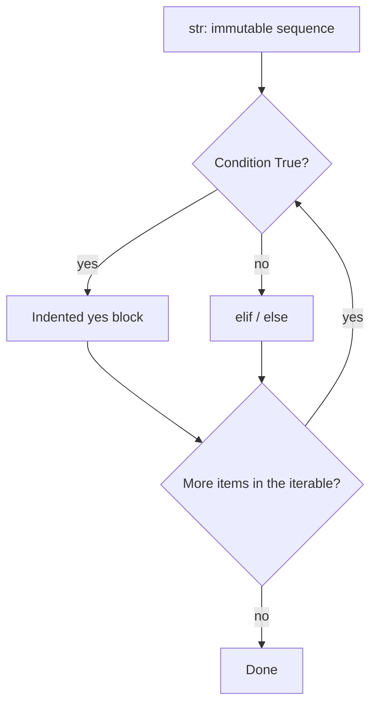

# Month 8 · Week 1 · Day 2
# Strings, Conditions, Loops, and Truthiness

**Program:** Full-Stack Mastery · 18 months  
**Phase:** 3 — Python and backend  
**Month index:** [../../README.md](../../README.md)  
**Week 1:** [1](day-01.md) · Day 2 (today) · [3](day-03.md) · [4](day-04.md) · [5](day-05.md) · [6](day-06.md) · [7](day-07.md)  
**Week rhythm today:** Learn + type-along  
**Student state:** Day 1 gate passed. You can run `py -3`, bind names, and explain `==` vs `is`. Today the program **chooses** and **repeats**, and you treat **strings** as immutable sequences — not as JavaScript with different quotes.  
**Study time:** 3–4 focused hours

**This week covers:** syntax, values/types, strings, conditions, loops.

Today: strings (`strip`, slice, `split`, f-strings, `in`), `if`/`elif`/`else`, `for`/`range`/`while`, truthiness, `and`/`or`/`not`. FizzBuzz and blank checks. Day 3 is from memory — do not skip the labs.

Project 5 is **not** this week. Labs: `~\fullstack-lab\month-08\`.

---

## How to use this textbook

1. Read a section. Close it. Say it in Python words (`elif`, `None`, `True`), not JS words (`else if`, `null`, `true`).
2. Type every lab. Do not paste.
3. When a traceback appears, read it **from the bottom**.
4. Optional review links are for later rechecking.

---

## How to read this chapter

A **string** is text. A **condition** is a yes/no question. A **loop** is “do this again until the question becomes no.”

JavaScript taught you braces and `===`. Python uses **indentation** and **`==`**. Translating line by line produces `else if`, `{ }`, and `true` — all **SyntaxError** or **NameError**.



The dangerous part is not the `if` keyword. It is **what Python considers true**, and the fact that `"   "` is a non-empty string until you **`strip`**.

---

## Today's contract

By the end of this day you will be able to:

1. Treat strings as **immutable**; use slice, `split`, `strip`, `in`, and f-strings.
2. Write `if` / `elif` / `else` with colons and 4-space blocks (no `{ }`).
3. Loop with `for x in`, `range`, and `while`.
4. List Python’s **falsy** values from memory.
5. Explain `and` / `or` / `not` **short-circuit** (and that they return operands, not always `True`/`False`).
6. Write FizzBuzz and `is_blank` via `strip`.

**Today's gate.** Closed-book:

> Strings do not mutate in place. Blank means `s.strip() == ""`, not `if s`. There is no `===`. `elif` is the word. `"3" + 1` is TypeError. `for x in items` is the default loop — not `for i in range(len(items))` unless you need the index.

---

## Time box

| Block | Minutes | Work |
|---|---|---|
| A | 55 | Theory |
| B | 50 | Guided: strings + predict truthiness |
| C | 70 | Independent: FizzBuzz + `is_blank` |
| D | 20 | Git |
| E | 15 | Recall |

---

# Block A — Theory

## 1. Strings are immutable sequences

A **`str`** is Unicode text. Quotes: `"hi"`, `'hi'`, or `"""multi line"""`. An f-string is `f"Hello, {name}"` — the `f` is required or you print the characters `{name}`.

**Immutable** means methods return **new** strings. The original object does not change.

```python
title = "Harbor"
title.upper()       # returns "HARBOR"
print(title)        # still "Harbor"
title = title.upper()  # rebind the name if you want the new value
```

That is the same *idea* as JavaScript strings. The habit that fails is inventing a mutating API you remember from lists: there is no `title.push`. Concatenation with `+` also builds a **new** string: `a + b`.

**Indexing** is `s[0]`. Negative indices count from the end: `s[-1]` is the last character. Out of range is **`IndexError`**.

**Slicing** is `s[start:stop]` — start inclusive, stop **exclusive**, like JS `slice`. Missing bounds: `s[:3]`, `s[3:]`. Step: `s[::-1]` reverses. A slice that “sticks out” past the end is **not** an error; you get a shorter string (or `""`).

```python
s = "harbor"
s[0:3]      # "har"
s[1:1]      # ""
s[100:200]  # ""
s[0]        # "h"
# s[100]    # IndexError — index vs slice
```

**Wrong belief:** “I’ll write `s[0] = 'H'` like a list.”  
**Correct:** `TypeError: 'str' object does not support item assignment`. Build a new string.

### `in`, `split`, `strip`, `join`

| Operation | Meaning | JS cousin |
|---|---|---|
| `"bor" in s` | substring? | `includes` |
| `s.split(",")` | break on separator → **list** of str | `split` |
| `s.split()` | split on **whitespace** (runs of space/tab/newline) | not quite `split(" ")` |
| `s.strip()` | remove leading/trailing whitespace | `trim` |
| `s.lstrip()` / `s.rstrip()` | one side | `trimStart` / `trimEnd` |
| `",".join(parts)` | opposite of split | `join` — **order reversed** vs JS |

JavaScript: `parts.join(",")`. Python: `",".join(parts)`. Mixing them is a TypeError or a wrong API you will stare at.

`split` with no argument treats any whitespace run as one break. `"a   b".split()` is `["a", "b"]`. `"a   b".split(" ")` keeps empty pieces. For “is this query blank?” you want **`strip`**, not split.

**`in` on a string is substring search**, not “whole word.” `"cat" in "category"` is `True`. If you need tokens, `split` first.

### f-strings

```python
n = 3
print(f"Week {n}")
print(f"{3.14159:.2f}")  # 3.14 — format spec; optional today, useful later
```

Expressions inside `{ }` run at runtime. Prefer f-strings over `%s` and `.format` in this course.

**Wrong belief:** “I’ll write `` `Hello, ${name}` ``.”  
**Correct:** that is JS. Python is `f"Hello, {name}"`. Backticks are not template strings here (they are a rarely used alias for `repr`).

---

## 2. `if` / `elif` / `else` — no braces, no `===`

```python
status = 404

if status == 200:
    print("ok")
elif status == 404:
    print("missing")
else:
    print("other")
```

The colon starts a block. **Indented** lines are the block. The word is **`elif`**, not `else if`. There is no `===`. Equality is **`==`**. Identity (especially `None`) is **`is`**.

Ternary (conditional expression): `label = "ok" if status == 200 else "fail"` — only for **simple values**. Nested ternaries are unreadable. Use `if`.

Python 3.10+ has `match` / `case`. This week you use `if`/`elif`. You do not need `match` to pass Month 8.

**Wrong belief:** “I’ll skip indentation on a one-line `if` to look like JS without braces.”  
**Correct:** you may write `if x: print(x)` on one line, and then you will add a second statement and attach it to the wrong block. This course: **indented block under the colon**, four spaces, always.

---

## 3. Loops — `for x in`, `range`, `while`

Python’s default loop is **iterate the items**:

```python
names = ["Ada", "Grace"]
for name in names:
    print(name)
```

That is JS `for...of`, not `for (let i = 0; ...)`. **Do not** write `for i in range(len(names))` unless you **need** the index. Week 2 adds `enumerate` when you need both.

**`range(stop)`** produces `0 .. stop-1`. `range(1, 21)` is 1 through 20. `range(0, 10, 2)` steps by 2. In Python 3, `range` is **lazy** — not a list. `list(range(3))` is `[0, 1, 2]` if you need a list. `for n in range(1, 21):` is the FizzBuzz loop.

```python
for n in range(3):
    print(n)  # 0, 1, 2
```

**`while`** repeats until the condition is false:

```python
n = 3
while n > 0:
    n -= 1
```

`break` exits the loop. `continue` skips to the next iteration.

Infinite `while True` without `break`, or a `while` whose condition never becomes false, **spins the CPU** (Month 1). Kill with **Ctrl+C** in PowerShell.

You can iterate a string: `for ch in "hi":` yields `"h"` then `"i"`.

### `for` / `else` (rare — know it exists)

Python allows `else` on a `for` or `while`. The `else` block runs **if the loop did not `break`**.

```python
for n in range(3):
    if n == 99:
        break
else:
    print("never found 99")  # runs — loop finished without break
```

That surprises everyone who thinks `else` pairs only with `if`. **This course almost never uses `for`/`else`.** Prefer a flag, a function that `return`s, or `any()`. Read it if you see it in someone else’s code. Do not show off with it in Project 5.

**Wrong belief:** “Loops need an index because that’s how `for` works.”  
**Correct:** `for x in xs` is the Python loop. Index soup is a JS translation.

---

## 4. Truthiness — what `if x:` actually tests

When Python needs a boolean, it asks “is this object truthy?” **Falsy** values (remember these):

`False`, `None`, `0`, `0.0`, `""` (empty string), `[]`, `{}`, `set()`, and other empty containers.

Everything else is **truthy**, including `"0"`, `"False"`, `" "` (a space), `"   "`, and non-empty lists.

```python
query = ""
if query:
    pass  # skipped — empty string is falsy

q2 = "  "
if q2:
    pass  # RUNS — whitespace is truthy
```

Search boxes and titles: **blank means strip, then compare to `""`**. Not `if query`. Not `if not query`.

```python
def is_blank(s: str) -> bool:
    return s.strip() == ""
```

Type hints are a preview (Week 4). Today you may write `def is_blank(s):` without hints. The **behavior** is the lesson: `strip`, then `== ""`.

Worked example you must be able to teach:

| Value | `if value:` | `is_blank(value)` if it is a str |
|---|---|---|
| `""` | skip | `True` |
| `"  "` | run | `True` |
| `"0"` | run | `False` |
| `0` | skip | not a string — do not call `strip` on an int |
| `None` | skip | not a string |

Three questions: truthiness, blank text, numeric zero. Do not mix them. `0` as a **score** is a real number (Day 3). `None` is “no object.” `"0"` is text.

**Wrong belief:** “`if s` means the user typed something useful.”  
**Correct:** spaces pass `if s`. Use `is_blank`.

JavaScript’s falsy list included `undefined` and `NaN`. Python has **`None`** instead of `null`/`undefined`, and **`float("nan")` is truthy** (a nasty corner: `bool(float("nan"))` is `True`). Do not use NaN as a sentinel. Use `None`.

---

## 5. `and` / `or` / `not` — short-circuit, operand results

| Operator | Meaning |
|---|---|
| `and` | if left is falsy, result is left; else result is right |
| `or` | if left is truthy, result is left; else result is right |
| `not` | boolean negation (`True`/`False`) |

They **short-circuit**. `True or do_work()` never calls `do_work`. `False and do_work()` never calls `do_work`. Feature (cheap checks) and bug (you thought the function ran).

**Python does not always return a boolean** from `and`/`or`. It returns one of the **operands**:

```python
"" or "harbor"     # "harbor"
"harbor" or "x"    # "harbor"
None or 0 or "z"   # "z"
"hi" and 3         # 3
```

JS `&&` / `||` also return operands. The trap here is using `or` as a default for numbers: `count or 10` turns **`0` into 10**. If `0` is allowed, check `is None`, not truthiness.

```python
count = 0
count or 10      # 10 — probably wrong
count if count is not None else 10  # 0 — honest if 0 is valid
```

There is no `??` in older Python. 3.10+ has `x if x is not None else y`. Week 4: `Optional`. Today: **be explicit about `None`**.

**Wrong belief:** “I’ll write `if (q && q.trim())` with JS punctuation.”  
**Correct:** `if not is_blank(q):`. Parentheses around the whole `if` test are optional; `&&` does not exist — use `and`.

---

## 6. Strong typing still applies in loops

`"3" + 1` is **TypeError**. `"3" * 2` is `"33"` (repeat), not `6`. `"3" * 2` in JS is `6` (coercion) if you use `*`. Different languages.

Convert on purpose: `int("3")`, `str(3)`. `int("  3  ")` works (strip-like). `int("3.5")` raises `ValueError`. `int("ada")` raises `ValueError`. Catching that is Week 3. Today: do not convert garbage; keep scores as `int` literals in drills.

## 7. Worked FizzBuzz (teach this table)

For `n` from 1 to 20, the first lines are: `1`, `2`, `Fizz`, `4`, `Buzz`, `Fizz`, `7`, `8`, `Fizz`, `Buzz`, `11`, `Fizz`, `13`, `14`, `FizzBuzz`, … 

If 15 prints `Fizz` then `Buzz` on two lines, you used two separate `if`s without `elif`, or you checked 3 before 15. **elif chain**, 15 first.

JS students write `n % 15 === 0`. Here `n % 15 == 0`. `%` is the same idea. `===` is SyntaxError or a mess — actually `===` is invalid syntax in Python (`SyntaxError: invalid syntax`).

## 8. `in` on lists vs strings (preview)

`"Ada" in names` if `names` is a list tests **exact membership**. `"Ada" in "Ada Lovelace"` tests **substring**. Same word `in`, two types, two meanings. Today your FizzBuzz does not need `in`. Your `"Clinic" in "Harbor Clinic"` lab does.

## 9. `break` vs `return` (functions are later)

Inside a loop, `break` leaves the loop, not the file. Week 3 `return` leaves the function. Do not `break` expecting to skip the rest of the script after a `for` unless that is what you want — code after the loop still runs.

**Wrong belief:** “I’ll write `forEach`.”  
**Correct:** `for x in xs:`.

---

# Block B — Type-along

```powershell
mkdir ~\fullstack-lab\month-08\week-01\day-02 -Force
cd ~\fullstack-lab\month-08\week-01\day-02
```

### B1 — Strings

Create `strings.py`. Print labeled results:

1. A name `raw = "  Harbor Clinic  "` — print `raw`, `raw.strip()`, then `raw` again (prove immutability).
2. Slice ` "fizzbuzz"[:4] ` and `[4:]`.
3. `"Clinic" in "Harbor Clinic"` and `"cat" in "category"`.
4. `",".join(["a", "b"])` vs a comment that JS would have been `["a","b"].join(",")`.
5. An f-string with two interpolations.

Run `py -3 strings.py`.

### B2 — Predict truthiness

Create `truthy.py` that prints `bool(x)` for: `""`, `"  "`, `"0"`, `0`, `None`, `[]`, `"False"`.

**Before** running, write `PREDICT.txt` with True/False for each. Then run. Write `ACTUAL.txt`. Science, not hope.

### B3 — Short-circuit

In the REPL (`py -3`), think: does `print("ran")` run in `False and print("ran")`? In `True or print("ran")`? Confirm. Write one sentence in `SHORT.txt`.

---

# Block C — Independent

### C1 — FizzBuzz

`fizzbuzz.py`: for `n` in `range(1, 21)`, print:

- `"FizzBuzz"` if `n % 15 == 0`
- `"Fizz"` if `n % 3 == 0`
- `"Buzz"` if `n % 5 == 0`
- else the number

Use `==`, `elif`, no `{ }`, no `===`. Multiples of 15 must hit **FizzBuzz**, not Fizz then Buzz on two lines — **order the conditions** so 15 is checked first (or use `if % 15` then `elif % 3` then `elif % 5`).

### C2 — Blank

`blank.py`: given `samples = ["", "  ", "hello", "0"]`, print each value and whether `is_blank` is true. Implement `is_blank` with `strip`.

### C3 — Status loop

`status.py`: `for code in [200, 404, 500]:` print a short label with `if`/`elif`/`else` and `==`.

`TRAPS.txt` (paragraphs, not bullets): why a search box must not use `if query` alone; why `"0"` is a real query; why there is no `===`; why `"3" + 1` throwing is a gift compared to JS `"31"`.

```powershell
cd ~\fullstack-lab
git add month-08
git commit -m "Month 8 Day 2: strings, conditions, loops, is_blank."
```

---

# Block E — Recall

Close the file.

1. How do you reverse a string with a slice?
2. `split` vs `strip` for blank input.
3. The falsy list (Python).
4. What does `for`/`else` mean, and should you use it this month?
5. Why `count or 10` is dangerous when `count` is `0`.
6. `elif` vs JS `else if`.

---

## Definition of done

- [ ] PREDICT written before ACTUAL
- [ ] I can list Python falsy values without looking
- [ ] FizzBuzz uses `==` and `elif`; 15 prints `FizzBuzz`
- [ ] `is_blank` uses `strip`
- [ ] TRAPS.txt explains JS translations I will not do
- [ ] Commit exists

---

## Optional review links

Strings, `if`/`elif`, loops, and truthiness are explained in this chapter. These pages are for later checking, not for first learning.

- [Python tutorial: Strings](https://docs.python.org/3/tutorial/introduction.html#strings)
- [Python tutorial: More control flow](https://docs.python.org/3/tutorial/controlflow.html)
- [Built-in `str` methods](https://docs.python.org/3/library/stdtypes.html#string-methods)

---

## Tomorrow

From memory: grade a list of scores and classify blank queries — the Month 3 `grade.js` idea, in Python. Days 1–2 closed during the drills. Repair from **those files in this book**.
