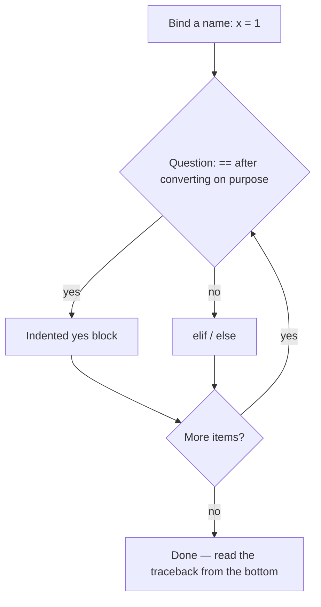
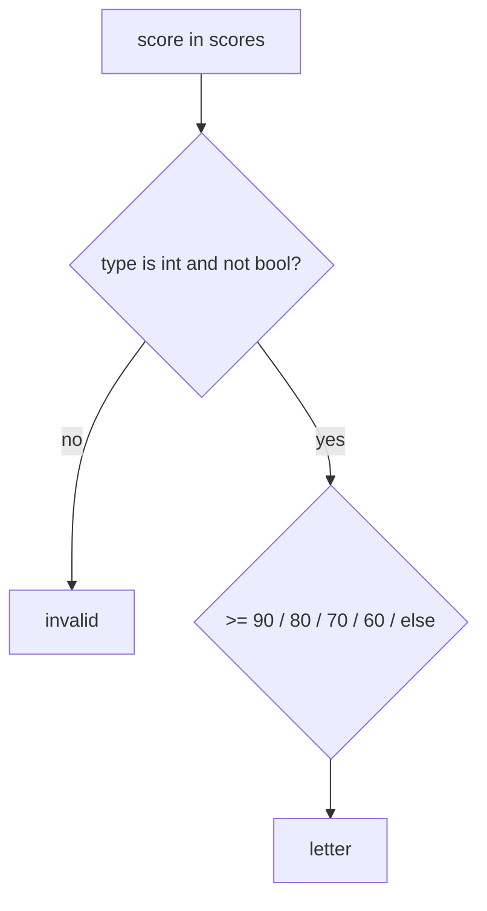

# Month 8 · Week 1 · Day 3
# From Memory: Names, Strings, and Control Flow

**Program:** Full-Stack Mastery · 18 months  
**Phase:** 3 — Python and backend  
**Month index:** [../../README.md](../../README.md)  
**Week 1:** [1](day-01.md) · [2](day-02.md) · Day 3 (today) · [4](day-04.md) · [5](day-05.md) · [6](day-06.md) · [7](day-07.md)  
**Week rhythm today:** Implement from memory  
**Study time:** 3–4 focused hours  
**Student state:** You named values on Day 1 and made the program choose and repeat on Day 2. Today those ideas must live in your fingers.  
**Days 1–2 of this week:** closed during the drills. Repair from **those day files in this textbook**, not from a blog.

---

## How to read this chapter

Day 1 and Day 2 had type-along scripts. During the drills they stay **closed**. This file contains a recap so you are not sent to another site to learn.

A Python program is **names bound to objects**, **yes/no questions**, and **repeats**. Today you rebuild that from this page — including the Month 3 grade-scores script, now in Python.



Allowed:

- The complete explanation in this file
- Your own notes in `fullstack-lab`
- The error in front of you (`TypeError`, `IndentationError`, `NameError`)

Not allowed:

- Pasting a finished `grade.py` from AI
- Copying Day 1–2 lab files
- Browsing a tutorial as the teacher
- Writing `===`, `{ }` blocks, `true`/`null`, or `else if`

If you are stuck **more than 25 minutes** on one task, open **only** the matching Day 1 or Day 2 section **in this textbook**, read it, close it, continue from memory. Record what you had to look up in `lookups.txt`.

There is **no complete solution** in this file. The scripts are specified. You write them.

---

## Complete explanation (names + strings + control flow)

This section **is** the lesson. Read a paragraph. Close it. Say it in one honest sentence. Then type the spec.

### Where Python runs

**Python** computes. You run it with **`py -3`** (Windows) or `python`. There is no browser `#root` this month. The REPL is `py -3` with `>>>`. A script is `py -3 file.py`. `uv` is the project tool you will standardize on in Week 4; today a working 3.12+ interpreter is enough.

**Wrong belief:** “Python is JavaScript in the terminal.”  
**Correct:** different runtime, different syntax, **strong** typing (`"3" + 1` is TypeError, not `"31"`).

### Names and objects

`title = "Harbor"` creates a string object and attaches the name `title`. Rebinding `title = "Vet"` is allowed — there is no `const`. Discipline is yours. Convention: `UPPER` for constants by culture.

Several names can point at the **same** object:

```python
a = []
b = a
b.append(1)  # a is [1] too
```

**`==`** asks: same **value**?  
**`is`** asks: same **object**? Use `is` / `is not` for `None`. There is no `===`.

### Types you must name

`int`, `float`, `str`, `bool` (`True` / `False` — capital), `None`. `type(x)`, `isinstance(x, int)`.

`"3" + 1` → **TypeError**. Convert on purpose: `int("3")`, `str(3)`. `int("ada")` → `ValueError` (Week 3 will catch; today keep scores as ints).

### Strings

Immutable. Index `s[0]` (`IndexError` if out of range). Slice `s[start:stop]` (safe if past the end). `s.strip()` for edges. `s.split()` on whitespace. `"," .join(parts)` — **join lives on the separator**, opposite of JS `parts.join(",")`. `"bor" in s` is substring. f-string: `f"Hello, {name}"`.

`s[0] = "H"` → TypeError. Rebind or build a new string.

### Equality and truthiness

| Idea | Python | JavaScript (this course) |
|---|---|---|
| Value equality | `==` | `===` |
| Identity | `is` (use with `None`) | rarely needed |
| Missing object | `None` | `null` / `undefined` |
| Booleans | `True` / `False` | `true` / `false` |
| Blocks | indentation | `{ }` |

**Falsy:** `False`, `None`, `0`, `0.0`, `""`, `[]`, `{}`, `set()`. **Truthy:** everything else, including `"0"` and `"   "`.

Blank text: `s.strip() == ""`. Not `if s`. `"0"` is not blank.

`and` / `or` **short-circuit** and return **operands**. `count or 10` is wrong if `0` is a valid count. `not` flips truthiness.

### Conditions and loops

```python
if status == 200:
    print("ok")
elif status == 404:
    print("missing")
else:
    print("other")
```

**`elif`**, not `else if`. Colon, then indent.

- `for x in items:` — default. Values, not indices.
- `range(1, 21)` — 1 through 20, lazy.
- `while` — until false. Ctrl+C if it never ends.
- `break` / `continue`.
- `for`/`else` runs `else` if **no** `break` — **rare**; do not use it in labs this week.

**Wrong belief:** “I need `for i in range(len(scores))` because that’s a for-loop.”  
**Correct:** `for score in scores:`. Index later (`enumerate`, Week 2) if you need it.

### Indentation

Mix tabs and spaces → `TabError`. This course: **4 spaces**. `IndentationError` means the block structure is wrong. Read the traceback from the **bottom**.

---

## Today's contract

Rebuild Week 1 skills as if this were a lab exam.

**Today's gate**

> `py -3 grade.py` runs a script you wrote without looking at Day 1–2, using assignment, `==`, `elif`, a `for` loop, and `strip` for blank. Zero is an `F`, not invalid.

If you cannot, stay here. Day 4 will not hide a mushy `if score:` that skips `0`.

---

## Time box

| Block | Minutes | Work |
|---|---|---|
| A | 25 | Closed-book oral review (no typing yet) |
| B | 40 | Memory drills: types, falsy, strings |
| C | 80 | Spec: `grade.py` + `blank.py` + `NOTES.txt` |
| D | 30 | Traceback reading (on purpose) |
| E | 20 | Git + lookups |

---

# Block A — Speak first

Out loud, no notes, no editor:

1. What does indentation mean in Python?
2. `==` vs `is`.
3. The Python falsy list.
4. Why `"0"` is a real query and why `if query` is the wrong blank test.
5. Why `"3" + 1` throws (and why that is better than JS `"31"`).
6. `elif` vs `else if`; why there is no `===`.
7. What you do when a loop never ends in PowerShell.

If any answer is mush, re-read that subsection above. Do not start the spec yet.

---

# Block B — Memory drills

Create `~\fullstack-lab\month-08\week-01\day-03\warm.py`. From this recap only, print:

1. `type(None)`, `type(True)`, `type(42)`, `type("8")`.
2. Whether each of `""`, `"  "`, `"0"` is blank after `strip`.
3. `bool(0)`, `bool("0")`, `bool([])`.
4. A one-line comment on why `"3" + 1` is a TypeError.

Write `PREDICT.txt` **before** you run. Then `py -3 warm.py`. Write `ACTUAL.txt`.

---

# Spec: `grade.py`

Arguments: none. Hard-code a list of scores `[95, 70, 49, 100, 0]`.

For each score:

- If not an `int` (use `isinstance(score, int)`), print `invalid`
- Else if `>= 90` print `A`, `>= 80` `B`, `>= 70` `C`, `>= 60` `D`, else `F`
- Use `==` / `>=`, no `===`, no `if score:` as the validity test

Then print how many passing scores (`>= 60`) using a counter you rebind (`passed = passed + 1` or `passed += 1`).

Worked example (you type the loop; this table is the answer key for the hard-coded list):

| Score | Branch | Letter | Passing? |
|---|---|---|---|
| 95 | ≥ 90 | A | yes |
| 70 | ≥ 70 | C | yes |
| 49 | else | F | no |
| 100 | ≥ 90 | A | yes |
| 0 | else | F | no |

Passing count is **3**. If you print 4, you treated `0` as passing. If you print `invalid` for `0`, you used `if score` instead of `isinstance`. **Zero is a real number** — the same trap as Month 3 `grade.js`.

Do **not** convert strings. If you later add `"90"` to the list, it should print `invalid`, not `A`. That is the JS lesson (`"90"` vs `90`) without `===`: `isinstance` is the type question.

```powershell
cd ~\fullstack-lab\month-08\week-01\day-03
py -3 grade.py
```

---

# Spec: `blank.py`

List of sample queries `["", "  ", "ada", "0"]`. For each, print the value and whether blank means `strip() == ""`.

Explain in `NOTES.txt` why `"0"` is not blank (non-empty string; truthy; not the integer `0`). Paragraphs. This is the search-box lecture in Python words: `strip`, `==`, no `if query`.

Contrast one paragraph with Month 3: JS used `===` and `.trim()`; Python uses `==` and `.strip()`. Same *question*, different *words*.

---

## Memory recap — names, objects, and the grade script

Month 3 `grade.js` walked a list of scores and printed letters. Today `grade.py` does the same **question** with Python words.

**Zero is a real score.** In JavaScript, `if (score)` skipped `0` (falsy) and you printed `invalid` or skipped `F`. In Python, `if score:` does the same damage. `isinstance(score, int)` (reject `bool`) then `>=` bands. `0` → `F`. Passing means `>= 60`. The hard-coded list `[95, 70, 49, 100, 0]` yields letters A, C, F, A, F and **3** passing.

**Strings are not scores.** `"90"` is `invalid` if you keep the list mixed later. Do not `int(score)` inside the loop “to be helpful.” Conversion is an edge. This recap’s core stays strict — same as `sum_positive` on Day 7.

**Blank queries** are a different program (`blank.py`). `"0"` is not blank. `"  "` is blank after `strip`. `if query:` is the wrong test in both languages.

Draw (in NOTES or in your head):



If you use `elif score:` as a band, `0` never reaches `F`. If you write `===`, the file does not run.

### Warm-up predictions (do not skip)

`bool(0)` is False. `bool("0")` is True. `"".strip() == ""` True. `"  ".strip() == ""` True. `"3"+1` TypeError. Write PREDICT before ACTUAL. Science, not hope.

### Traceback from the bottom

`boom.py` with `"3" + 1` ends in `TypeError: can only concatenate str (not "int") to str` (wording may vary). File, line, type. That is the freeze-frame. You do not need a browser debugger.

If you opened Day 1–2, `lookups.txt` is tomorrow’s repair list. Honesty is the recap.

```powershell
git add month-08/week-01/day-03
git commit -m "Month 8 Day 3: grade.py and blank.py from memory."
```

---

# Traceback on purpose

Create `boom.py` that does `"3" + 1`. Run `py -3 boom.py`. Copy the **last** line of the traceback into `TRACE.txt` and write two sentences: which file, which line, which exception type. That is how you will read errors all month.

Optional: a second file `indent_boom.py` with a `def` and a mis-indented `print`. Read `IndentationError` the same way.

There is no browser `debugger;` today. The traceback **is** the freeze-frame. Week 4 may mention `pdb`; you do not need it to pass Day 3.

```powershell
git add month-08/week-01/day-03
git commit -m "Month 8 Day 3: grade.py and blank.py from memory."
```

---

# Block E — Recall and lookups

Close the files. Answer:

1. The Python falsy list.
2. Why `0` must get an `F`, not `invalid`, in `grade.py`.
3. How to read a traceback.
4. `and`/`or` returning operands vs always booleans.

If you opened Day 1 or Day 2, `lookups.txt` lists the section titles. Tomorrow you repair those, not a random blog.

---

## Definition of done

- [ ] `grade.py` and `blank.py` run with `py -3`
- [ ] Passing count is 3; `0` is `F`
- [ ] NOTES.txt explains `"0"` and `strip`
- [ ] TRACE.txt names TypeError from the bottom of the traceback
- [ ] PREDICT written before ACTUAL on the warm-up
- [ ] Commit exists

---

## Optional review links

Names, strings, `elif`, loops, and falsy values are explained in this chapter. These pages are for later checking, not for first learning.

- [Python tutorial: Informal intro](https://docs.python.org/3/tutorial/introduction.html)
- [Python tutorial: Control flow](https://docs.python.org/3/tutorial/controlflow.html)

---

## Tomorrow

A script that **processes a list of strings** — no network, no Project 5 CLI. Days 1–3 stay available as repair, not as paste.
