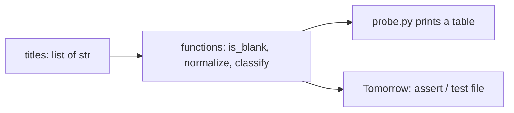
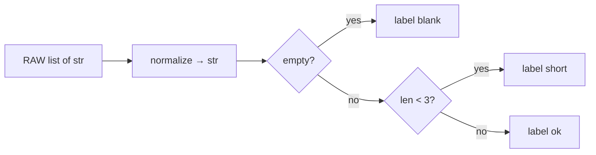

# Month 8 · Week 1 · Day 4
# Lab: Process a List of Strings (No Network)

**Program:** Full-Stack Mastery · 18 months  
**Phase:** 3 — Python and backend  
**Month index:** [../../README.md](../../README.md)  
**Week 1:** [1](day-01.md) · [2](day-02.md) · [3](day-03.md) · Day 4 (today) · [5](day-05.md) · [6](day-06.md) · [7](day-07.md)  
**Week rhythm today:** Add a real lab feature  
**Study time:** 3–4 focused hours  
**Prereq:** Day 3 gate. You can write `grade.py`, `is_blank` via `strip`, and `elif` from this week’s recap.

This is **not** Project 5. You will not get a CLI from this textbook. `argparse` and `uv` wait. Today you process **in-memory strings** the way a later CLI will process titles — without `input()` as the only design, and without HTTP.

---

## How to read this chapter

Until today, scripts printed a hard-coded walk. Real programs **name the question** (blank? too short? shout?) and **walk a list**. The list is data. The functions are the product. `print` is a probe.

Picture two rooms:

- **Logic room:** “Is this title blank after strip?” “What label does this message get?” No network. `py -3` can run this.
- **Edge room:** later a CLI (`argparse`), later FastAPI. Not this week.

Today you build the logic room, then a **probe** that prints a report. Tomorrow **`assert`** will check the same functions.



Read Block A until you can say, without looking, why the lab **does not** call `input()` in a loop as the only API, and why it **does not** fetch a URL. Then type the spec. Do not paste.

---

## Today's contract

By the end of this day you will be able to:

1. Explain a **pure-enough function** as “output from inputs, no network, no files yet.”
2. Walk a list of strings with `for title in titles`.
3. Normalize text: `strip`, collapse inner whitespace with `split` + `join`.
4. Classify each string into a **label** (`blank`, `short`, `ok`) using `elif`.
5. Print a **text menu** as documentation of later CLI commands — without implementing those commands.

**Today's gate**

> A script you wrote processes a list of strings and prints a report. No `urllib`, no `requests`, no sockets. Blank uses `strip`.

If `probe.py` only `print`s the raw list, you have not classified. Stay here.

---

## Time box

| Block | Minutes | Work |
|---|---|---|
| A | 50 | Theory: purity, normalize, menu vs logic |
| B | 40 | Type-along: smallest function + loop |
| C | 80 | Feature spec: `titles.py` + `probe.py` + README |
| D | 25 | Git |
| E | 15 | Recall |

---

# Block A — Theory

## 1. Why the list is in the file

A **CLI** reads `sys.argv` or a prompt. That is Week 4 / Project 5. If you start there, you cannot test without typing. A **list in the module** is the same idea as Month 3’s hard-coded scores: the **algorithm** is what you are learning.

```python
RAW = [
    "  Harbor clinic  ",
    "",
    "   ",
    "ok",
    "0",
    "WAIT THIS IS LOUD",
]
```

Tomorrow you will `assert` against `normalize` and `classify`. Those functions take a `str` (or a list) and **return** a value. They do not `print` as their only result. Printing in `probe.py` is the edge.

**Wrong belief:** “A Python program is a conversation with `input()`.”  
**Correct:** `input()` is one edge. Logic that needs a human every run is untestable. Project 5 will parse **commands**, then call functions. Today you skip the parser.

## 2. Normalize — strip is not enough for titles

`strip` removes **edges**. Inner double spaces remain:

```python
"Harbor   clinic".strip()  # still "Harbor   clinic"
```

Collapsing inner whitespace:

```python
def normalize(s):
    return " ".join(s.split())
```

`split()` with no argument splits on **any whitespace run** and drops empties. `join` with a single space rebuilds. `normalize("  a\t b  ")` is `"a b"`. `normalize("   ")` is `""` — then `is_blank` is true.

JS: `s.trim().split(/\s+/).join(" ")` — same idea, uglier regex. Python’s `split()` already does the whitespace run.

**Wrong belief:** “`strip` means ‘clean the title.’”  
**Correct:** `strip` is edges. Titles you store later should usually be **normalized**, then rejected if blank.

## 3. Classify — one string, one label

```python
def classify(s):
    text = normalize(s)
    if text == "":
        return "blank"
    if len(text) < 3:
        return "short"
    return "ok"
```

Use **`==`**, not `is`, for string labels (`"blank"` is interned *sometimes*; `==` is the right tool). Do not use `if s:` — `normalize` already turned whitespace into `""`.

`"0"` has length 1 → `"short"` if your threshold is 3. That is **correct** for a title policy. It is **not** blank. Document the rule. A search query `"0"` yesterday was a real query; a **title** of one character can still be rejected as short. Two different products, two policies — say so in the README.

Optional extra label: `shout` if `text.isupper()` and `text.isalpha()` is too strict (`"WAIT THIS IS LOUD"` has spaces). `text.isupper()` is true if all cased characters are upper. Use it only if you document it. Not required.

## 4. The “menu” that is not a CLI

Print a **text menu** so you remember Project 5 will have commands. You are **not** implementing them:

```text
Harbor title lab (not a CLI)
  1. report  — classify RAW titles (this script does this)
  2. create  — later (Project 5)
  3. quit    — later
```

Then run the report. Do **not** `while True: choice = input(...)` unless it is a five-minute extra **after** the functions work. `input()` blocks tests. This week’s definition of done does **not** include an interactive loop.

`argparse` peek (read only — do not require it):

```python
# Week 4 / Project 5 shape — not today's lab
# parser.add_argument("command")
```

Knowing the name `argparse` is enough. You will not `import argparse` today.

## 5. No network

Do not `import urllib.request`. Do not `pip install requests`. Do not open sockets. A list of strings is the data source. Persistence is Week 4 JSON. HTTP is Month 9.

**Wrong belief:** “Python’s first program should scrape the web.”  
**Correct:** the first honest program **transforms data you already have**.

## 6. JS contrast for this lab

| Job | JavaScript (Month 3) | Python (today) |
|---|---|---|
| Walk titles | `for (const t of titles)` | `for t in titles:` |
| Trim | `trim()` | `strip()` |
| Blank | `trim() === ""` | `strip() == ""` or normalize then `== ""` |
| Module | `export function` | same file or `import` tomorrow |
| Equality | `===` | `==` |

If you write `titles.forEach` or `.map`, stop. Those names are JS. Python lists have methods (Week 2). Today: `for` and functions you wrote.

---

# Block B — Type-along

```powershell
mkdir ~\fullstack-lab\month-08\week-01\day-04 -Force
cd ~\fullstack-lab\month-08\week-01\day-04
```

`tiny.py`:

```python
def is_blank(s):
    return s.strip() == ""

print(is_blank("  "))
print(is_blank("0"))
```

Run `py -3 tiny.py`. Confirm `True` then `False`.

Then add `normalize` as in section 2. Print `normalize("  a   b  ")`. Expect `a b`.

---

# Block C — Independent spec

Folder: `~\fullstack-lab\month-08\week-01\day-04\`.

### `titles.py`

Export (by existing as functions in the file; Week 3 will teach packages):

| Function | Input | Output |
|---|---|---|
| `is_blank(s)` | str | bool — `strip() == ""` **or** `normalize(s) == ""` (document which) |
| `normalize(s)` | str | str — collapsed whitespace |
| `classify(s)` | str | `"blank"` / `"short"` / `"ok"` |
| `report(items)` | list of str | list of `(original, label)` tuples — or a list of strings you format. **Return** the data; do not only print. |

Rules:

- `short` means normalized length **strictly less than 3**, and not blank.
- `"0"` is not blank; it is short.
- `"  hi  "` normalizes to `"hi"` → short.
- `"Harbor"` → ok.
- Empty list → empty report (loop zero times; do not crash).

Do not use a dict as the main model yet (Week 2). Tuples are allowed: `(raw, label)`. If you have not met tuples, return a list of formatted strings from `report` **and** keep `classify` returning a str — still testable.

### `probe.py`

- Prints the text menu (section 4).
- Sets `RAW` (at least the six examples in section 1, plus one title you invent).
- Calls `report` / `classify`.
- Prints one line per item: original (maybe `repr` so spaces show) and label.

Run: `py -3 probe.py`.

### `README.md` (short)

What the labels mean. Why there is no `input()`. Why `"0"` is short not blank. One sentence: Project 5 will parse commands; this file will not.

### `HABITS.txt`

Three JS habits you refused today (`forEach`, `===`, `trim` without knowing `strip`).

### Worked classify table (answer key)

| Raw | Normalized | Label |
|---|---|---|
| `"  Harbor clinic  "` | `Harbor clinic` | ok |
| `""` | `""` | blank |
| `"   "` | `""` | blank |
| `"ok"` | `ok` | short (len 2) |
| `"0"` | `0` | short |
| `"WAIT THIS IS LOUD"` | same enough | ok (unless you added shout) |

If `ok` is classified `ok` despite length 2, your threshold is not `< 3` or you used `<=`. If `"0"` is blank, you used `if not s` or confused with integer `0`.

### Why `report` returns data

`probe.py` formats. `report` returns tuples so Day 5 can `assert report(["  "])[0][1] == "blank"` without scraping print output. If `report` only prints, it is not a function you can test.

**Wrong belief:** “A menu with `input()` is more real.”  
**Correct:** untestable. Project 5 parses argv once, then calls functions. Today you skip argv.

```powershell
cd ~\fullstack-lab
git add month-08
git commit -m "Month 8 Day 4: title classify lab, no network."
```

---

# Block E — Recall

1. Why `normalize` uses `split` + `join`, not only `strip`.
2. Why the lab avoids `input()`.
3. Why `"0"` can be short and still not blank.
4. Where `print` belongs vs where `return` belongs.

### JS contrast you must say aloud

`trim` vs `strip`. `split(/\s+/).join(" ")` vs `" ".join(s.split())`. `forEach` vs `for x in`. A JS module `export function classify` vs a Python `def classify` imported tomorrow. `===` vs `==`. The menu you printed is documentation of a CLI you will not fake with `input()` this week — argv is data, like a list of strings.

If `report` only prints, Day 5 cannot assert. Return first. Print at the edge. That sentence is Project 5.

---

## Worked walk-through (type this picture, then the code)

Imagine six sticky notes on a table. Each note is a **string**. You do not ask the internet what they say. You do not `input()` a seventh note. You walk the six.



**Step 1.** `normalize("  Harbor clinic  ")` → `"Harbor clinic"`. Edges gone, inner double spaces gone. The original string object is unchanged (immutable). If you print `RAW[0]` after calling `normalize(RAW[0])` without rebinding, you still see the padded original. That is not a bug in `normalize`. That is strings.

**Step 2.** `classify` asks **one** question at a time with `elif` (or nested `if` after a `return`). Blank is not “falsy.” Blank is normalized empty. `"0"` has length 1 after normalize → `short`. A JS student writes `if (!s)` and ships `"0"` as empty in one language and as a title in another. Python `if s:` would keep `"0"` (truthy) **and** keep `"  "` (also truthy). Both languages lie if you skip `strip`/`trim`.

**Step 3.** `report` returns data: `[("  Harbor clinic  ", "ok"), ("", "blank"), ...]`. `probe.py` formats with `repr` so spaces are visible. `print` is not the return value.

**Wrong belief:** “I’ll `return print(label)` because I want to see it.”  
**Correct:** `print` returns `None`. Then Day 5 asserts `None == "blank"` and you will “fix” the test instead of the function. Return the label. Print in `probe.py`.

### `split` without an argument vs `split(" ")`

```python
"a   b".split()      # ["a", "b"]
"a   b".split(" ")   # ["a", "", "", "b"]
```

`normalize` must use **`split()` with no argument** (or an explicit algorithm you can teach). If you `split(" ")` then `join`, you can leave holes. Tests tomorrow should include `"a\\tb"` (tab) if you claim “any whitespace.”

### Why a text menu is not `input()`

A menu printed as **documentation** is a comment the operator can read. `while True: choice = input(">")` is a **process that waits**. pytest (Week 4) and today’s `assert` (tomorrow) cannot type. Project 5 will read **argv** once — a list of strings, like `RAW`. Today `RAW` *is* the argv stand-in.

`argparse` exists in the standard library. You may read its docs. You may not spend today wiring `ArgumentParser` so the lab “looks like a product.” Products without tests are demos.

### TypeError still applies

`classify(0)` if you forget to pass a str: `0.strip` is **AttributeError** (int has no `strip`). `normalize` is not a place to `int()`. Titles are text. Scores were ints on Day 3. Do not mash the two labs into one `if isinstance` soup unless you are defending a function that accepts both — you are not.

### Security (one sentence, then stop)

Do not `eval(title)`. A title is a string, not Python source. JSON later is also data. The web is Month 9.

### Stretch (only if the spec is green)

Add `classify` label `shout` when `text.isupper()` and `len(text) >= 3`. Document it. Tests tomorrow must include `"WAIT THIS IS LOUD"` if you add it. Stretch is optional; `is_blank` / `normalize` / `classify` / `report` are not.

`HABITS.txt` should mention: no `===`, no `{ }`, no `true`, no `.trim()`, no `.forEach`, no `input()` as the API, no network.

---

## Definition of done

- [ ] `normalize`, `classify`, `is_blank` return values
- [ ] `probe.py` prints a menu **and** a report
- [ ] No network imports
- [ ] `"0"` is not classified blank
- [ ] README documents short vs blank
- [ ] Commit exists

---

## Optional review links

String processing and `for` loops are explained in this chapter. These pages are for later checking, not for first learning.

- [str.split](https://docs.python.org/3/library/stdtypes.html#str.split)
- [str.join](https://docs.python.org/3/library/stdtypes.html#str.join)
- [argparse (peek only)](https://docs.python.org/3/library/argparse.html)

---

## Tomorrow

`assert` scripts (and traceback reading when they fail). Same functions, claims the machine can check.
