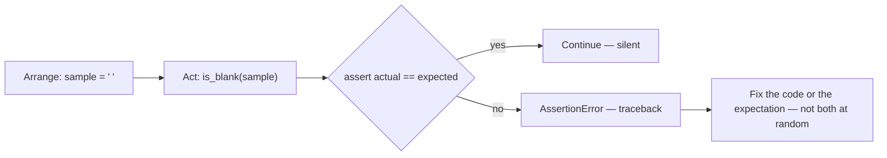
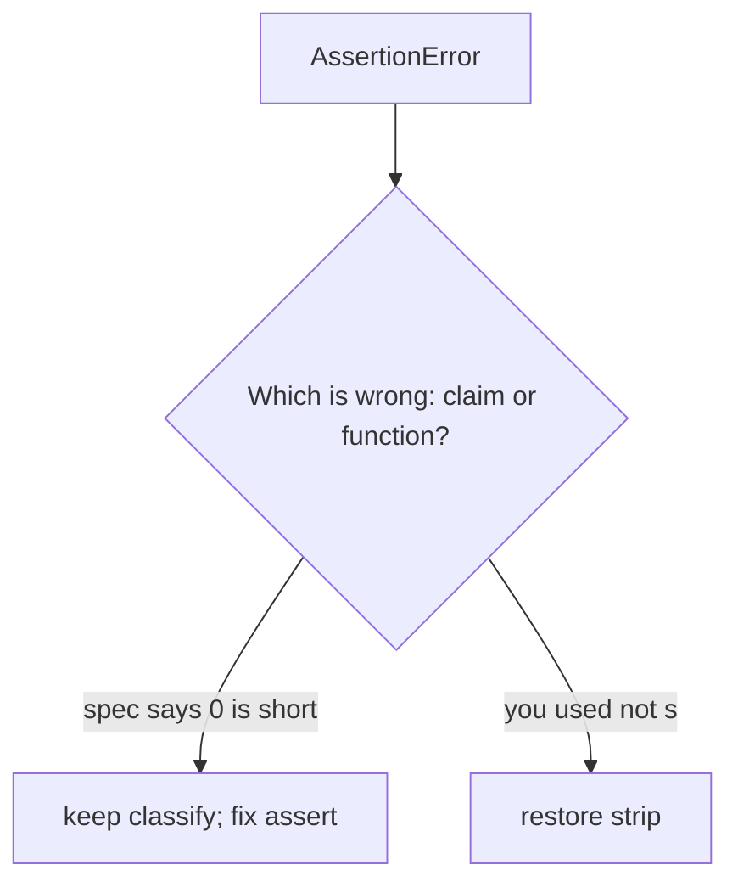

# Month 8 · Week 1 · Day 5
# Tests Begin: `assert` and Reading Tracebacks

**Program:** Full-Stack Mastery · 18 months  
**Phase:** 3 — Python and backend  
**Month index:** [../../README.md](../../README.md)  
**Week 1:** [1](day-01.md) · [2](day-02.md) · [3](day-03.md) · [4](day-04.md) · Day 5 (today) · [6](day-06.md) · [7](day-07.md)  
**Week rhythm today:** Tests + refactor + documentation  
**Study time:** 3–4 focused hours  
**Student state:** You have `titles.py` (or you will recreate the three functions). Today you stop hoping `probe.py` still prints the right thing and start **claiming** it.

pytest and `uv` are **Week 4**. Today the machine checks claims with **`assert`**. That is enough to learn arrange / act / assert. The traceback is the teacher when an assert fails.

---

## How to read this chapter

Month 3 used `node --test`. Python’s smallest equivalent is a file of **`assert`** statements. When a claim is false, Python raises **`AssertionError`** and prints a traceback. You read it **from the bottom**.

A test is not a vibe and not “I remember writing `is_blank`.” It is a tiny program that **throws** if yesterday’s helper changed meaning.



Read Block A until you can explain arrange / act / assert and “bottom of the traceback” in your own sentences. Then write tests from the **spec**, not from a happy memory of `probe.py`.

If you finish early, do not add `input()`. Add boundary cases. Break a function on purpose and watch the test go red.

---

## Today's contract

By the end of this day you will be able to:

1. Write `assert` claims that fail with a useful `AssertionError`.
2. Import functions from a neighboring `.py` file in the same folder.
3. Read a traceback: **file, line, exception type** from the last lines.
4. Name `NameError`, `TypeError`, `IndentationError`, `AssertionError`, `IndexError`.
5. Explain why pytest exists (Week 4) without needing it today.

**Today's gate**

> `py -3 test_titles.py` exits 0 when claims hold, and I can make it fail on purpose and read the AssertionError.

If you only re-ran `probe.py`, you have not tested. Stay here.

---

## Time box

| Block | Minutes | Work |
|---|---|---|
| A | 50 | Theory: assert, imports, traceback anatomy |
| B | 40 | Type-along: fail on purpose, then fix |
| C | 70 | Independent: full `test_titles.py` |
| D | 20 | Git |
| E | 15 | Recall |

---

# Block A — Theory

## 1. What a test is

**Not a test:**

- “I ran `py -3 probe.py` and it looked right.”
- “I remember `"0"` not being blank.”
- “The README says it works.”

**A test:**

- `assert is_blank("  ") is True` — or `assert is_blank("  ")` (truthiness of the result).
- `assert classify("0") == "short"`
- `assert normalize("  a   b  ") == "a b"`

If someone later “simplifies” `is_blank` to `return not s`, the test **must** go red on `"  "`. That is the point.

### Anatomy

1. **Arrange** — set up data (`sample = "  "`).
2. **Act** — call the function (`got = is_blank(sample)`).
3. **Assert** — `assert got == True` (or `assert got`).

```python
from titles import is_blank, normalize, classify

assert is_blank("  ") == True
assert is_blank("0") == False
assert normalize("  a   b  ") == "a b"
assert classify("") == "blank"
```

Run:

```powershell
cd ~\fullstack-lab\month-08\week-01\day-04
py -3 ..\day-05\test_titles.py
```

Better: **copy or share** `titles.py` next to the test so imports are obvious. Recommended folder: `~\fullstack-lab\month-08\week-01\day-05\` with `titles.py` (retype or copy **your** Day 4 file — do not paste from this textbook; this textbook does not contain your functions) and `test_titles.py`.

```powershell
cd ~\fullstack-lab\month-08\week-01\day-05
py -3 test_titles.py
```

Silence and exit code **0** means all asserts passed. That is the green bar. No output is OK. You may `print("ok")` at the end if you want a heartbeat — optional.

## 2. `assert` is a statement, not a function

```python
assert 1 == 1
assert 1 == 2, "1 should not equal 2"  # optional message
```

`assert(1 == 1)` happens to work because `(1 == 1)` is the expression — extra parentheses, not a function call. Write **`assert expr`**.

When the expression is falsy, Python raises **`AssertionError`**. With `-O` (optimize), asserts can be **stripped**. This course: never use `-O` for tests. Week 4 pytest does not rely on that flag.

**Wrong belief:** “`assert` is for production user errors.”  
**Correct:** user mistakes (empty title on a CLI) are **exceptions you design** (Week 3) or result values. `assert` is for **programmer claims** in tests and internal invariants. Do not `assert` that the user’s file exists as your only error handling.

## 3. Importing from the same folder

When you run `py -3 test_titles.py`, Python puts **that file’s directory** on `sys.path`. `from titles import classify` loads `titles.py` in the same folder.

```python
from titles import classify, is_blank, normalize
```

There is no `export` keyword. Public names are just names in the module. Week 3: packages, `__init__.py`, `import titles as t`. Today: **same folder**, `from titles import ...`.

If you see `ModuleNotFoundError: No module named 'titles'`, you ran from the wrong directory. `cd` to the folder that **contains** both files.

**Wrong belief:** “I’ll write `require('./titles')`.”  
**Correct:** `from titles import classify`. No `require`. No `import { classify } from "./titles.js"`.

Do not `from titles import *`. Name what you use.

## 4. Reading a traceback from the bottom

Example (shape, not something you memorize character for character):

```text
Traceback (most recent call last):
  File "C:\Users\...\test_titles.py", line 6, in <module>
    assert classify("0") == "blank"
AssertionError
```

Read:

1. **Exception type** — last line: `AssertionError`.
2. **Where** — the `File ... line N` **closest to the bottom** is what you wrote that failed. Frames above it are callers (here, maybe none).
3. **What you claimed** — the `assert` line.

`most recent call last` means the **innermost** frame is at the **bottom**. Beginners read from the top and drown in library frames. This course: **bottom first**.

| Exception | Typical cause |
|---|---|
| `AssertionError` | your `assert` was false |
| `TypeError` | `"3" + 1`, calling a non-callable, wrong operand types |
| `NameError` | typo, or `true` instead of `True`, or `null` instead of `None` |
| `IndentationError` / `TabError` | blocks |
| `IndexError` | `s[100]` on a short string |
| `ModuleNotFoundError` | wrong `cd` or wrong module name |
| `ImportError` | module found, name inside it missing |
| `ValueError` | `int("ada")` |

`true` is a **NameError** (JS boolean). `undefined` is a NameError. Those errors are a gift: you translated.

## 5. pytest in one paragraph (so Week 4 is not a surprise)

**pytest** collects files named `test_*.py`, runs functions named `test_*`, and rewrites `assert` to show left vs right values. **Fixtures** share setup. Project 5 requires pytest. Today you are learning the **claim**. You may `pip`/`uv` install pytest **early** if you already have `uv` — optional. The definition of done is **`py -3 test_titles.py`** with asserts, not `pytest`.

If you do run pytest today, it will collect `test_titles.py` and treat top-level asserts as **not** tests unless they live in `def test_...`. So: either stay with a script of asserts run by `py -3`, **or** wrap each claim:

```python
def test_whitespace_is_blank():
    assert is_blank("  ") is True
```

Then `py -3 -m pytest test_titles.py` if pytest is installed. **Not required today.** If you wrap functions, `py -3 test_titles.py` will **define** tests and exit 0 **without running them** unless you call them. Pick **one** style and document it in `TEST.md`:

- Style A: top-level `assert`; run `py -3 test_titles.py`.
- Style B: `def test_*`; run pytest.

This course recommends **Style A this week**, Style B in Week 4.

---

# Block B — Type-along

```powershell
mkdir ~\fullstack-lab\month-08\week-01\day-05 -Force
cd ~\fullstack-lab\month-08\week-01\day-05
```

Put `titles.py` here (your functions from Day 4). Create `fail_demo.py`:

```python
assert 1 == 2, "demo: this should explode"
```

Run `py -3 fail_demo.py`. Copy the traceback into `TRACE_ASSERT.txt`. Mark the bottom line.

Then write `test_smoke.py`:

```python
from titles import is_blank

assert is_blank("  ") == True
assert is_blank("0") == False
print("smoke ok")
```

Run it. If import fails, fix `cd` and filenames (`titles.py`, not `title.py`).

Break `is_blank` temporarily to `return not s`. Re-run. Confirm `"  "` fails. **Restore** the real function. That red bar is the product.

---

# Block C — Independent

`test_titles.py` — at least these claims:

1. `is_blank("")`, `is_blank("  ")` true; `is_blank("0")`, `is_blank("ada")` false.
2. `normalize("  a   b  ") == "a b"`; `normalize("   ") == ""`.
3. `classify("")` and `classify("  ")` → `"blank"`.
4. `classify("0")` and `classify("hi")` → `"short"` (if Day 4 used length &lt; 3).
5. `classify("Harbor")` → `"ok"`.
6. `classify` never returns JS strings like `"undefined"`.

`TEST.md`: how to run the file; Style A vs B; what a bottom-of-traceback read looks like (three sentences).

`TRACE_CATALOG.txt`: one line each for how you would **cause** TypeError (`"3"+1`), NameError (`true`), IndexError (`"ab"[5]`). You may actually run tiny snippets. No exploits — these are language errors.

### AssertionError vs the bug

If `classify("0") == "blank"` fails, the **test** might be wrong or the **function** might be wrong. `"0"` is not blank. The case that catches `is_blank` written as `return not s` is **`"  "`** (truthy, but blank after strip). That whitespace test is not optional.

### Import error catalog

| Error | Typical cause |
|---|---|
| `ModuleNotFoundError: titles` | wrong `cd` or file named `title.py` |
| `ImportError: cannot import name 'classify'` | function not defined or typo |
| `IndentationError` on import | `titles.py` itself is invalid |

Fix the module before “fixing” the test. Silence + exit 0 is a pass. Do not `print` instead of `assert`.

Refactor: if `classify` duplicates `normalize` poorly, tidy **without** changing test meaning. Tests stay green.

```powershell
cd ~\fullstack-lab
git add month-08
git commit -m "Month 8 Day 5: assert tests for title helpers."
```

---

# Block E — Recall

1. Arrange, act, assert in one sentence each.
2. Why silence can mean pass.
3. Bottom of the traceback: what three facts?
4. Why `from titles import *` is banned.
5. Why `-O` is hostile to `assert`.

### JS contrast you must say aloud

`node --test` + `assert.equal` vs `assert` + `py -3 test_*.py`. `import { test } from "node:test"` vs a script of claims. Tracebacks: Node and Python both print stacks; this course still reads **bottom first**. `true` in a Python test file is NameError — the test file never ran the asserts below the error. Fix the NameError. Do not “skip” it.

pytest Week 4 will still use `assert`. Today you are learning the claim, not the collector.

---

## Traceback lab (read this, then do it)

Python prints **most recent call last**. The useful three facts are almost always on the **last two lines**: exception type, then the `File "...", line N` of *your* code.

Worked story:

1. `assert classify("0") == "blank"` is **false** (classify returns `"short"`). Bottom: `AssertionError`. The line above names `test_titles.py`.
2. You “fix” classify to treat `"0"` as blank because the test said so. Now the **spec** is wrong. The test should have expected `"short"`. Changing production to match a bad assert is how CLIs reject the title `"0"` forever.
3. The whitespace test `is_blank("  ")` is the one that catches `return not s`. If you only test `""` and `"hello"`, `not s` still looks green.



**Wrong belief:** “Red means the function is wrong.”  
**Correct:** red means **claim and world disagree**. Read the spec (Day 4 table) before editing.

### `assert` messages

```python
got = classify("0")
assert got == "short", f"classify('0') was {got!r}"
```

The message appears in the traceback. Use it when the values are not obvious. Do not write novels in assert messages.

### Import is execution

`from titles import classify` **runs** `titles.py` from top to bottom. If `titles.py` has `print(report(RAW))` at module level, every test run prints the probe. Move side effects to `probe.py`. Functions only in `titles.py`. That is a module, even before Week 3 uses the word.

JS: `import` of a module with top-level `console.log` has the same trap. Python is not special here. You are.

### Exception catalog you must recognize by the last line

| Last line starts with | You probably |
|---|---|
| `AssertionError` | a test claim is false |
| `TypeError: can only concatenate str` | `"3" + 1` |
| `NameError: name 'true'` | JS boolean |
| `NameError: name 'null'` | JS null |
| `SyntaxError: invalid syntax` and you typed `===` | there is no `===` |
| `IndentationError` | block structure |
| `ModuleNotFoundError` | wrong directory or filename |
| `AttributeError: 'NoneType'` | you assigned `append`’s return, or a function forgot `return` |

Copy one real traceback into `TRACE_ASSERT.txt` with three labels: **type**, **file**, **line**. That file is the definition of “I can read a traceback.”

### What pytest will add (do not install for the gate)

Collection of `test_*` functions. Better assertion diffs (`assert a == b` shows both sides). Fixtures. `tmp_path`. You will still write `assert`. Today’s skill transfers.

If you already ran `uv run pytest` by accident and it collected nothing (top-level asserts are not functions), that is a lesson: **Style A is a script**. Document Style A in `TEST.md`.

---

## Definition of done

- [ ] `py -3 test_titles.py` exits 0
- [ ] I failed an assert on purpose and read it from the bottom
- [ ] `"0"` is not blank in tests
- [ ] TEST.md names the run command
- [ ] Commit exists

---

## Optional review links

`assert` and tracebacks are explained in this chapter. These pages are for later checking, not for first learning.

- [Python: `assert`](https://docs.python.org/3/reference/simple_stmts.html#the-assert-statement)
- [Python tutorial: Errors and exceptions (preview)](https://docs.python.org/3/tutorial/errors.html)
- [pytest (Week 4)](https://docs.pytest.org/en/stable/)

---

## Tomorrow

Independent: Python vs JavaScript teach-back, plus small functions from this recap — Days 1–5 closed during the challenges.
