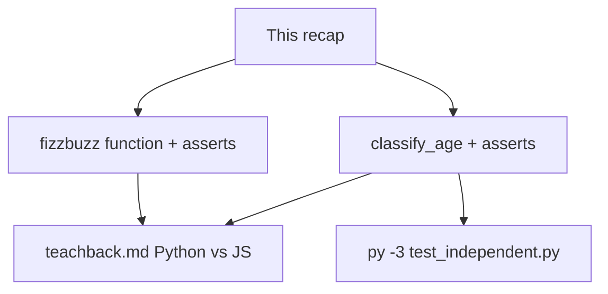
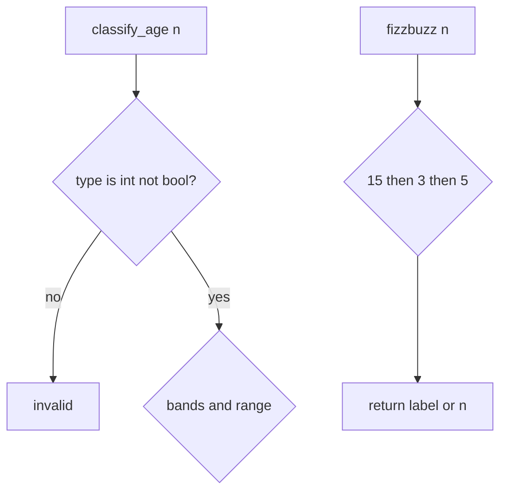

# Month 8 · Week 1 · Day 6
# Independent: Python vs JavaScript

**Program:** Full-Stack Mastery · 18 months  
**Phase:** 3 — Python and backend  
**Month index:** [../../README.md](../../README.md)  
**Week 1:** [1](day-01.md) · [2](day-02.md) · [3](day-03.md) · [4](day-04.md) · [5](day-05.md) · Day 6 (today) · [7](day-07.md)  
**Week rhythm today:** Independent project work  
**Study time:** 3–4 focused hours  
**Days 1–5 textbook files:** closed for the *challenges*. Repair from **Week 1 Days 1–2 in this book**.

---

## How to read this chapter

Today you prove Week 1 without a type-along. The complete explanation below **is** the lesson. Read a section. Close it. Say it in Python words. Then write the functions **before** the asserts, or the asserts **before** the functions — either order is honest if you do not paste.

If you catch yourself copying `titles.py` line for line into `classify_age.py`, stop. An age band is a different question. Same *rules* (`==`, `elif`, `isinstance`), new *branches*.



Allowed during challenges: this file, your notes, the error in the terminal.  
Not allowed: Day 1–5 files as a paste source, a tutorial as the teacher, AI writing the functions.

If you are stuck more than 25 minutes, open **only** Day 1 or Day 2 **in this textbook**, read one section, close it, continue. Record the lookup.

---

## Complete explanation (this book is the lesson)

You already practiced these ideas. Here they are again in full, so a later review never requires another page.

### Runtime and files

Python runs on your machine via `py -3`. Scripts are `.py`. The REPL is `>>>`. There is no `node file.js` and no `type="module"` JSON. Same-folder import: `from classify_age import classify_age` when you run a test script from that folder.

A **script** is a file you run. A **module** is a file you import. Today `classify_age.py` is a module; `test_independent.py` is the script that imports it. If you put `print("loaded")` at the top of `classify_age.py`, every import prints. Keep modules quiet. Put probes in the test file or a throwaway `probe.py`.

**Wrong belief:** “I’ll `console.log`.”  
**Correct:** `print`. Parentheses required. `print` is a function. It returns `None`. Do not write `x = print(n)` and then use `x`.

### Names, types, equality

Assignment binds a name to an object. No `let` / `const` / `var`. `None` is the empty object; check with `is None`. `True` / `False` are capitalized. `==` compares values; `is` compares identity. **No `===`.**

`"3" + 1` is **TypeError**. JS `"3" + 1 === "31"` hides bugs. Convert with `int` / `str` on purpose.

Python is **strongly** typed at runtime: mixing `str` and `int` with `+` fails now, not later as a weird string. Python is **dynamically** typed: a name can later point at a different type unless you refuse that with `isinstance`. Those two facts live together. TypeScript erased types in the browser; Python still will not concatenate `"3"` and `1`.

`NameError` means you typed a name that does not exist (`true`, `null`, `undefined`, a misspelled function). `SyntaxError` means the file is not Python (`===`, `{` as a block, `else if`). Read the **last** line of the traceback first: type, then message, then file and line above it.

### Strings

Immutable. `strip`, slice, `split`, `in`, f-strings. `" ".join(s.split())` collapses whitespace. `s[0] = "X"` is TypeError.

`strip` removes **edges**. Inner spaces stay unless you `split` and `join`. Blank **text** is `s.strip() == ""`. A search box full of spaces is blank. The string `"0"` is not blank: after strip it is still `"0"`. Integer `0` is a different object and a different question (scores, ages, counts).

Join lives on the **separator**: `",".join(parts)`. JavaScript put `join` on the array. If you write `parts.join(",")` in Python you get AttributeError on a list.

### Truthiness and blank

Falsy: `False`, `None`, `0`, `0.0`, `""`, `[]`, `{}`, `set()`. `"0"` and `"  "` are truthy. Blank **text** is `s.strip() == ""`. Do not use `if s` for search boxes or titles.

`and` / `or` short-circuit and return operands. `0 or 10` is `10`. That is useful for defaults **only** when `0` is not a valid value. An age of `0` is a child. A score of `0` is `F`. Do not write `n or 18` as a default age.

### Control flow

`if` / `elif` / `else` with colons and 4-space blocks. **No `{ }`.** `for x in xs:`. `range(start, stop)`. `while`. `for`/`else` is rare — skip it in your code.

FizzBuzz: `%` and `==`; check 15 before 3 and 5. If you test 3 first, 15 becomes `"Fizz"` and never reaches `"FizzBuzz"`. That is not a Python quirk. It is order. The same bug exists in JavaScript. The Python words are `%` and `elif`.

`range(1, 21)` is 1 through 20. The stop is exclusive, like a slice. `range(21)` is 0 through 20. If your test loops `range(1, 21)` and indexes a collected list, off-by-one is your problem, not `range`’s.

### Tests

`assert` in a script. Read **AssertionError** from the bottom. pytest waits until Week 4. An assert that cannot fail is not a test. `assert True` proves nothing. `assert classify_age(True) == "invalid"` can fail, so it is a test.

Run from the folder that contains the modules:

```powershell
cd ~\fullstack-lab\month-08\week-01\independent
py -3 test_independent.py
```

`ModuleNotFoundError` is almost always the wrong `cd`, not a missing language feature.

### Teach-back (the point of today)

You will write **prose**, not a table dump. A TA should believe you could teach a JS-fluent classmate **without** saying “it’s the same.” Include:

1. Indentation vs braces.
2. `None` / `True` vs `null` / `true`.
3. `==` vs `===`, and `is` for `None`.
4. `"3" + 1` TypeError vs JS concatenation.
5. `elif`, `strip` vs `trim`, `for x in` vs `for...of`.
6. One sentence on `and`/`or` returning operands.

If you write bullets only, rewrite as paragraphs. 400–700 words is the target — enough to teach, not a novel.

**Wrong belief:** “Python is JS with indentation.”  
**Correct:** that belief is the Month 8 failure mode. Your teach-back must contradict it with examples you ran.

**Wrong belief:** “`isinstance(True, int)` means I should accept booleans as ages.”  
**Correct:** it is a language quirk. Ages are not booleans. Reject them.

---

## Today's contract

**Today's gate**

> Asserts cover `classify_age` and `fizzbuzz`. Teach-back is prose that a JS engineer could learn Python Week 1 from. I did not paste Day 4.

---

## Time box

| Block | Minutes | Work |
|---|---|---|
| A | 20 | Speak this recap |
| B | 90 | `classify_age.py` + `fizzbuzz.py` + asserts |
| C | 50 | Teach-back |
| D | 20 | Git |

---

# Specs (you write the code)

Folder: `~\fullstack-lab\month-08\week-01\independent\`.

## `classify_age.py`

Function `classify_age(n)`:

- If `n` is not an `int`, return `"invalid"` (`isinstance(n, int)`). `True` is a subclass of `int` in Python — **reject bools**: `if type(n) is not int` or `isinstance(n, bool)` first. Document the choice. `True` must not become a toddler.
- If `n < 0` or `n > 130`, return `"invalid"`.
- Elif `n < 13` return `"child"`.
- Elif `n < 20` return `"teen"`.
- Elif `n < 65` return `"adult"`.
- Else `"senior"`.

Worked key:

| n | Result |
|---|---|
| 12 | child |
| 13 | teen |
| 19 | teen |
| 20 | adult |
| 64 | adult |
| 65 | senior |
| 0 | child |
| -1 | invalid |
| `"12"` | invalid |
| `True` | invalid |

Walk the table in your head before you type. `12` is still a child; `13` is the first teen. Boundaries are the whole function. If you write `<= 13` for child, `13` becomes a child and the table fails. That is not Python being picky. That is the spec.

`0` as age is a child, not invalid. Negative is invalid. `130` senior; `131` invalid if you used `> 130`. Do not convert `"12"` with `int` inside this function. Conversion belongs at a later CLI edge when an operator types digits. The core stays strict.

## `fizzbuzz.py`

Function `fizzbuzz(n)` returning a **string or int**: `"FizzBuzz"` / `"Fizz"` / `"Buzz"` / `n` for one number. Not a print loop — **return**. The test file may loop `range(1, 21)` and collect results.

Same 15 / 3 / 5 order as Day 2.

### Worked FizzBuzz returns (not prints)

`fizzbuzz(1)` is `1` (int) or `"1"` — **pick one and test it**. Mixing int and str in a list is fine in Python; tests must use `==` with the type you chose. `fizzbuzz(15)` is the string `FizzBuzz`. If you `print` inside `fizzbuzz`, the function still needs a `return` or tests see `None`.

Pick **one**:

- `fizzbuzz(1)` returns the **int** `1`, and `fizzbuzz(3)` returns the **str** `"Fizz"`. Tests use `==` and do not stringify everything; **or**
- `fizzbuzz` always returns **str** (`"1"`, `"Fizz"`, …).

Mixing without documenting will make `assert fizzbuzz(1) == "1"` fail. Document in a one-line docstring.

### FizzBuzz 1..20 smoke

If you implement `fizzbuzz` per n, a loop in the test file can build a list of 20 results and `assert` index 14 (the 15th item if you use 1-based n as the argument) is `"FizzBuzz"`. Off-by-one: `fizzbuzz(15)` is clearer than indexing a collected list. Prefer calling `fizzbuzz(15)` directly.

## `test_independent.py`

Style A: top-level asserts; `py -3 test_independent.py`. Cover the table above and FizzBuzz for 1, 3, 5, 15, 16.

## `teachback.md`

Prose. Title it as a letter to your Month 3 self. Must include the six teach-back items. One worked `"3" + 1` story. One worked blank/`strip` story. Do not paste this recap.

### `classify_age` bool trap again

`isinstance(True, int)` is True in Python. `classify_age(True)` must not return `"child"` (because `True == 1` and `1 < 13`). Use `type(n) is int` or reject `bool` first. Write that in the teach-back; it is a Python-specific footgun JS does not have the same way (`typeof true === "boolean"`).

### Teach-back anti-patterns

- A two-column markdown table of keywords and nothing else.
- “Python is similar to JS.” as the thesis.
- Pasting this recap with names changed.

Include one traceback story: you typed `true`, saw `NameError`, and knew it was JS.

```powershell
cd ~\fullstack-lab
git add month-08/week-01/independent
git commit -m "Month 8 Day 6: classify_age, fizzbuzz, Python vs JS teach-back."
```

---

## Teach-back must answer these JS translations

Write **paragraphs**. A table of keywords is a cheat sheet, not teaching.

**Indentation.** In JavaScript, `{ }` owns the block; whitespace is taste. In Python, the indented suite **is** the block. A `print` lined up with `if` instead of under it runs unconditionally. `IndentationError` and “it ran when I did not expect” are both indentation bugs.

**None vs null/undefined.** JavaScript gives you two empty-ish values and a third (`NaN`) that poisons math. Python gives you **`None`**. Check with `is None`. There is no `undefined` unless you create a name error by typing it.

**Equality.** This course’s JavaScript used `===` so `"90"` would not equal `90`. Python uses `==` for values and **does not coerce** `"90" == 90` to true — it is False (different types). `"3" + 1` is TypeError, not `"31"`. You convert on purpose with `int` / `str`, or you reject with `isinstance`.

**Booleans.** `true` is a NameError. `True` is the object. `True` is a subclass of `int`, which is why `classify_age(True)` must not become `"child"`. JavaScript `typeof true === "boolean"` saved you; Python `isinstance(True, int)` is True — a footgun you now know.

**Loops.** `for (const x of xs)` ≈ `for x in xs`. Indexed `for (let i = 0; i < xs.length; i++)` is the habit to drop. `range(1, 21)` is 1 through 20, stop exclusive — like `slice`.

**Strings.** `trim` → `strip`. Template literals → f-strings. `parts.join(",")` → `",".join(parts)`.

**Blank.** `if (query)` in JS treats `"  "` as a search. Same in Python. Both need trim/strip then compare to empty.

If your letter to Month-3-you never mentions TypeError on `"3" + 1`, rewrite it. That story is the strongest proof you stopped translating.

### Folder layout

`~\fullstack-lab\month-08\week-01\independent\` contains `classify_age.py`, `fizzbuzz.py`, `test_independent.py`, `teachback.md`. Run `py -3 test_independent.py` from that folder. No network. No `input()`. Do not `eval` anything. There is no user input today; if you add `input()`, you have changed the assignment into a prompt loop, which is not the test.

Do not start Project 5. Do not write a CLI. These two functions plus prose are the day.

---

# Lecture: what “independent” means today

Independent is not “invent a new language.” It is **new branches, same rules**. `classify_age` is not FizzBuzz. FizzBuzz is not titles. Both still use `elif`, `==`, and `isinstance`. If your `classify_age` contains `"Fizz"`, you pasted the wrong function.

A **function** answers one question. `classify_age` answers “what band is this number?” `fizzbuzz` answers “what label is this number?” Mixing them is how tests become a soup of `assert` that you cannot read.

**Security.** There is no `eval` today. There is no `input()`. If you add either, you have changed the assignment into a prompt that cannot be asserted without typing. Keep the core pure: arguments in, string (or int) out.

**Tracebacks you should still recognize.** `true` → `NameError`. `===` → `SyntaxError`. `"3" + 1` → `TypeError`. `s[0] = "X"` → `TypeError`. `if` without a colon → `SyntaxError`. A `print` lined up with `if` instead of under it is not a traceback; it is a logic bug. Both are indentation stories.

**How to run.** `cd` to `independent`. `py -3 test_independent.py`. If the process prints nothing and exits 0, asserts passed. If you see `AssertionError`, the last line of the traceback names the failing claim. Read that line. Do not start rewriting both functions at once.

Worked `classify_age(65)`: not teen, not adult — `elif n < 65` already failed, so `else` is senior. Worked `classify_age(64)`: adult. Those two numbers are the whole adult/senior boundary. If both are senior, your adult test was `<= 64` written as `< 64`.

Worked `fizzbuzz(30)`: 30 is divisible by 15, so `"FizzBuzz"` even if you never listed 30 in the table. The rule is `%`, not a lookup of 1..20.

If the teach-back mentions “Python is easier” without a TypeError story, it is a mood, not a lesson. Rewrite the letter until Month-3-you would stop typing `===`.

---

## Definition of done

- [ ] `classify_age` rejects strings and `True`
- [ ] `0` is `"child"`, not invalid
- [ ] FizzBuzz 15 is `"FizzBuzz"`
- [ ] Asserts exit 0
- [ ] Teach-back is paragraphs, not a cheat sheet of keywords
- [ ] Commit exists

---

# Worked session — type this thinking, not a paste

Sit with `classify_age` closed. Say the bands: child under 13, teen under 20, adult under 65, else senior, with invalid for non-int, bool, negative, and over 130. Then type. Then assert the table. Then `fizzbuzz`. Then the letter.

If `classify_age(13)` is `"child"`, your child test used `<= 13` or `< 14`. The spec is `< 13`. Boundaries are the function. The middle of a band (`40` → adult) is the easy row. Tests that only use 40 do not prove the function.

If `fizzbuzz(15)` is `"Fizz"`, you tested `% 3` first. Order is 15, then 3, then 5, then the number. That order is the algorithm. Printing 1..20 in a loop is a demo; returning one `n` is the testable unit. `print` inside `fizzbuzz` without `return` makes every assert see `None`.

Teach-back structure that works: one paragraph on indentation with a story of a `print` that ran unconditionally; one on `None`/`True` and the NameError for `true`; one on `"3" + 1`; one on `strip` and `"0"`; one on `elif` and `for x in`; one on `and`/`or` returning `10` from `0 or 10`. Then one paragraph on `True` as an int subclass. That is already enough words if the stories are real.

Do not `eval`. Do not `input()`. Do not start `~/task-cli/`. `py -3` from the independent folder. Exit 0.



---

## Optional review links

Week 1 Python vs JS is explained in this chapter. These pages are for later checking, not for first learning.

- [Python tutorial: Control flow](https://docs.python.org/3/tutorial/controlflow.html)
- [Built-in types](https://docs.python.org/3/library/stdtypes.html)

---

## Tomorrow

Week review: speak the synthesis, mini-build, debug four Python-vs-JS defects. Repair the weakest topic today if the teach-back already wobbled.

### Common mistakes today

| Mistake | Fix |
|---|---|
| `classify_age(True)` → child | reject `bool` |
| `fizzbuzz` prints, returns `None` | `return` the label |
| teach-back is a keyword table | paragraphs with examples you ran |
| `===` in Python | SyntaxError; use `==` |
| `0` as age invalid | `0` is child |

Teach-back must contradict “Python is JS with indentation” with a TypeError story and a `strip` story. If both stories are missing, rewrite before tomorrow’s review.
