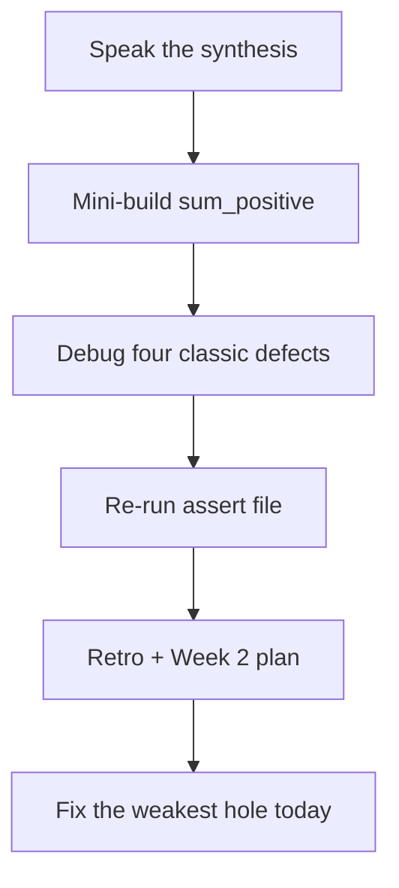
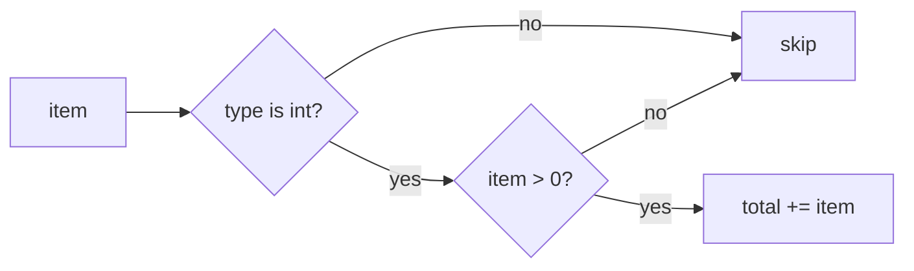

# Month 8 · Week 1 · Day 7
# Week Review — Python Syntax and Control Flow

**Program:** Full-Stack Mastery · 18 months  
**Phase:** 3 — Python and backend  
**Month index:** [../../README.md](../../README.md)  
**Week 1:** [1](day-01.md) · [2](day-02.md) · [3](day-03.md) · [4](day-04.md) · [5](day-05.md) · [6](day-06.md) · Day 7 (today)  
**Week rhythm today:** Review, repair, plan Week 2  
**Study time:** 3–4 focused hours  
**Student state:** You have named objects, branched with `elif`, looped with `for x in`, stripped strings, and watched `assert` go red on purpose. Today those ideas must still live in your head — from **this file**.

Do not start Week 2 because the calendar moved. Start Week 2 because this file’s gate is true.

---

## How to read this chapter

This is a **closed-book teaching day**. The synthesis below is the lesson, written so you can re-learn Week 1 from this page alone if the week is foggy.

1. Read a section. Close it. Say the idea in one honest sentence.
2. Then do the review blocks in order. During the mini-build, Days 1–6 stay closed. If you go blank, re-read **this synthesis**, not a random article.
3. Repair the weakest topic **today**. Week 2 (lists, dicts, comprehensions) assumes `==`, `elif`, and `strip` are automatic.



---

## Week synthesis (the lesson, in this book)

Python **computes** in a process you start (`py -3`). Not the browser.

**Names:** bind with `=`. No `const`. `None`, `True`, `False`. `==` values; `is` identity (`None`). No `===`. `"3" + 1` TypeError.

**Strings:** immutable. Slice; `strip` / `split` / `join`; `in`; f-strings. Blank = `strip() == ""`.

**Truthy/falsy:** `False`, `None`, `0`, `0.0`, `""`, empty containers. `"0"` and `"  "` are truthy.

**if / elif / else:** colons and indent. **`for x in`**, `range`, `while`. `for`/`else` rare.

**and / or / not:** short-circuit; `and`/`or` return operands. `0 or 10` trap.

**Tests:** `assert`; traceback from the **bottom**. pytest later.

The rest of this file unpacks each sentence so a student who only has **today’s file** can still teach the week.

---

## Today's contract

By the end of this day you will be able to:

1. Teach Week 1 aloud from the synthesis, without opening Days 1–6.
2. Write `sum_positive` from the spec, with asserts, without converting strings by accident.
3. Diagnose four classic defects (`===` / `true`, `if s`, `"3"+1` surprise, `if score` skipping `0`).
4. Re-run an assert file from this week.
5. Write a retro and a Week 2 plan, then repair the weakest language topic today.

**Today's gate.** Closed-book:

> I can explain indentation, `None`, `==` vs `is`, the falsy list, why search uses `strip`, and I have a green `py -3` assert file this week.

If you cannot, stay on Week 1. Lists on a mushy equality story become two problems.

---

## Time box

| Block | Minutes | Work |
|---|---|---|
| 1 | 40 | Closed-book: speak the synthesis |
| 2 | 50 | Mini-build: `review/sum_positive.py` + asserts |
| 3 | 30 | Debug four defects on paper |
| 4 | 25 | Review independent code — one fix |
| 5 | 20 | Re-run asserts |
| 6 | 20 | Design: when not to convert |
| 7 | 25 | Retro + Week 2 plan + repair |

---

# Complete explanation — language you must still own

## 1. One language, a terminal

Python is a program. `py -3 --version` should be 3.12+. REPL for probes; scripts for work. `uv` in Week 4. Do not `pip install` globally as a habit.

The traceback is the freeze-frame. There is no browser `debugger;` this month. File, line, exception type — last line first. `TypeError`, `NameError`, `SyntaxError`, `IndentationError`, and `AssertionError` are the Week 1 vocabulary. You will meet `KeyError` next week. You do not need `pdb` to pass this review.

## 2. Names and objects

`title = "Harbor"` attaches a name. Two names can share a list: `b = a; b.append(1)` changes `a`. Primitives (ints, strings) feel like copies because you **rebind** (`n = n + 1` names a new int). Strings cannot be mutated in place.

`==` vs `is`. `x is None`. Linters hate `== None`.

**Wrong belief:** “`is` is Python’s `===`.”  
**Correct:** `===` was value equality without coercion in this course’s JavaScript. `is` is identity. `==` is value equality. Use `is` for `None`. Use `==` for numbers and strings.

## 3. Types

`int`, `float`, `str`, `bool`, `NoneType`. Strong typing. Convert at the edge: `int("42")`. `isinstance(n, int)` is the type question. `True` is an `int` subclass — do not accept it as an age (Day 6) or as a positive addend in today’s mini-build.

`int("ada")` is `ValueError`. You are not catching it this week unless a lab said so. Keep scores and ages as ints in the core. The edge that reads a string comes later (CLI argv, JSON, FastAPI).

## 4. Strings and blank

`strip` edges; `split()` + `join` collapse inner space. `in` is substring. Join: `",".join(parts)` not `parts.join`.

| Value | `if value:` | Blank after strip? |
|---|---|---|
| `""` | skip | yes |
| `"  "` | run | yes |
| `"0"` | run | no |
| `0` | skip | not a str |

Blank is a **text** question. Falsy is a **truthiness** question. Mixing them is how `0` never gets `F` and how a space-only search still runs.

## 5. Control flow

`elif`. `for score in scores`. `range(1, 21)`. Ctrl+C on infinite loops. No `for i in range(len(xs))` without a reason.

A reason appears next week when the index **is** the algorithm. Printing titles is not that reason. Pairing two lists is `zip`, also next week. Today: walk values.

## 6. Logic operators

`and` / `or` / `not`. Short-circuit. Operand results. No `&&` / `||` / `!` (wait: `not` is the word; `!` is not Python’s not).

`0 or 10` is `10`. `"" or "guest"` is `"guest"`. `0 and 10` is `0`. If you needed a boolean, write `bool(...)` or a comparison. Most of the time you wanted `if n is None` or `if n < 0`, not `if not n`.

## 7. Tests

Arrange, act, `assert`. `AssertionError` at the bottom. Same-folder `from module import fn`.

**Wrong belief:** “If it printed in probe.py, it is tested.”  
**Correct:** a claim that cannot fail is not a test.

---

Closed-book: speak the synthesis.

---

# Mini-build: `review/sum_positive.py`

Function `sum_positive(items)` summing **ints** `> 0`. Skip everything else (including `"1"`, `True`, `0`, negatives, `None`). Do **not** convert strings. Tests.

Worked example: `sum_positive([1, -2, 3, "4", 0, True, None])` is **`4`** (1 + 3). Zero is not `> 0`. The string `"4"` is skipped. `True` is skipped even though `True == 1` — use `type(x) is int` or `isinstance(x, int) and not isinstance(x, bool)`.

That bool trap is the Week 1 encore. If you add `True`, your sum becomes 5 and you failed the spec.

Implementation sketch you may retype from **this** review (Days 1–6 stay closed):

```python
def sum_positive(items):
    total = 0
    for item in items:
        if type(item) is int and item > 0:
            total += item
    return total
```

`type(item) is int` rejects `True`. `isinstance(item, int) and not isinstance(item, bool)` also works. `if item:` would skip nothing useful here except `0` which you already exclude with `> 0` — but `"4"` is truthy and must **not** be added; `type` saves you.

Tests: empty list `0`; `[-1, 2]` is `2`; `[True]` is `0`; `["1"]` is `0`.

Folder: `~\fullstack-lab\month-08\week-01\review\`. `test_sum.py` with asserts. `py -3 test_sum.py`.

If `sum_positive` used `if item:` it would skip `0` (already skipped by `> 0`) but would still try to add `"4"` if you only checked truthiness — `"4"` is truthy. `type is int` is the gate.

---

# Debug (write the cause, from this week)

Write `DEBUG.txt` — cause in full sentences.

- Writing `===` or `true` / `null` / `else if`
- `if q:` vs `strip`
- Expecting `"3" + 1` to be `"31"`
- `if score:` so `0` never gets `F`

For each: what the program does, why a JS-fluent beginner believes the wrong thing, what to write instead.

---

# Review and tests

Open **one** independent or Day 4 file. One strength, one defect, one committed fix (a name, a missing assert, a `if s`). Re-run `py -3 test_titles.py` or `test_independent.py`. Record PASS in `review/TESTS.md`.

---

# Design

When should a helper convert, and when should it reject? Write a paragraph: titles are strings (`strip` / `normalize`); scores in `grade.py` are ints (`isinstance`); `sum_positive` skips strings. The **edge** (later: CLI argv, JSON, FastAPI) converts. The **core** stays strict.

---

# Retro

What was foggy: `is` vs `==`, falsy vs blank, asserts, bool-as-int? Repair **one** hole with a ten-line script in `review/repair.py`. **Week 2:** lists, tuples, dicts, sets, slicing, comprehensions, iterators, `enumerate`, `zip` — explained in Week 2 day files.

### Design paragraph (when not to convert)

`sum_positive` skips `"1"`. `classify_age` rejects `"12"`. `int("12")` belongs at a later CLI edge when the operator types digits. Core functions stay strict. NOTES in `review/CONVERT.txt`: three sentences.

```powershell
git add month-08/week-01/review
git commit -m "Record Month 8 Week 1 Python review."
```

---

# Debug defects — what “full sentences” means

For each bullet in DEBUG.txt, write **what the operator sees**, **why a JS-fluent beginner believes the wrong thing**, and **the Python that is honest**.

**`===` / `true` / `null` / `else if`.** The program does not start, or a name is missing. JavaScript’s course dialect used those tokens. Python’s words are `==`, `True`, `None`, `elif`. The traceback’s last line is `SyntaxError` or `NameError`. You do not “polyfill” `===`. You stop typing it.

**`if q:` vs `strip`.** A search box full of spaces still runs the search (or classifies as not blank). In both languages whitespace is truthy. Blank **text** is `q.strip() == ""`. Integer `0` as a **score** is a real number — do not reuse the search-box test on grades.

**`"3" + 1` expected `"31"`.** JavaScript `+` concatenates if either side is a string. Python `+` on str and int is TypeError. That is a gift. Convert at the edge or reject.

**`if score:` so `0` never gets `F`.** Falsy zero skips the grading chain. `isinstance(score, int)` (and reject `bool`) then compare with `>=`. Zero is `F`. Passing count on the Day 3 list is 3, not 4, and `0` is not `invalid`.

**Wrong belief:** “I’ll `int(item)` so `"4"` counts.”  
**Correct:** conversion belongs at a later CLI/JSON edge. This review locks the **core** as strict.

### Week 2 preview (so the plan is not a slogan)

You will learn **list** methods and slicing, **tuple** unpack, **dict** `get` vs `[]` and **KeyError**, **set** uniqueness, **comprehensions**, **iterable vs iterator**, **`enumerate`**, **`zip`**. You will stop writing `for i in range(len(a))` unless the index **is** the algorithm. If `==` and `strip` are still mushy, Week 2 dicts will feel like two languages at once. Repair today.

### `sum_positive` vs `grade.py`

`grade.py` **classifies** ints (including 0 → F). `sum_positive` **skips** non-positive ints and all other types. Different questions. Do not copy `elif` bands into `sum_positive`. A `for item in items` plus `type(item) is int and item > 0` is the whole function.

If `sum_positive([True])` is `1`, you used `isinstance(x, int)` without excluding `bool`. Repair before you commit.

Do not start Project 5. Do not write a task CLI. The review folder is `sum_positive`, DEBUG, CONVERT, and a small repair script.

---

# Lecture: speak these six before the mini-build

**Indentation.** The suite under `if` is the block. Four spaces. Mix tabs and spaces → `TabError`. A line that lines up with `if` runs every time. That is not “Python being weird.” That is the syntax you asked for when you left JavaScript braces behind.

**None.** One empty object. `x is None`. `x == None` works and linters hate it. There is no `undefined`. Typing `null` is `NameError`.

**Equality.** `==` is values. `is` is identity. `===` is not a token. `"90" == 90` is False. Convert or reject; do not hope.

**Falsy vs blank.** Falsy is a short list. Blank **text** is `strip() == ""`. `"0"` is not blank. Integer `0` is falsy and a real score. Search boxes and grade lists are different programs.

**Loops.** `for x in xs`. `range(1, 21)` is 1..20. Ctrl+C stops `while True`. You do not need `range(len)` to print numbers.

**Tests.** `assert` can fail. `print` cannot. Same-folder import. Traceback from the bottom.

If `sum_positive([1, "1", True])` is 3, you converted or you trusted `isinstance(..., int)` without excluding `bool`. The spec said skip. Skipping is the lesson: the core does not guess.

Write `review/SPEAK.txt` with six sentences, one per heading above, in your words. Then mini-build. If SPEAK is a paste of this file, it is not speaking.

Do not start Week 2 with a mushy `if query:` . Lists of dicts will hide that bug inside `row["title"]` until a space-only search returns everything.

---

## Week 1 definition of done

- [ ] Indentation, `None`, `==`/`is`, falsy explained from this book
- [ ] A loop and `strip` written without a tutorial
- [ ] At least one `py -3` assert file green this week
- [ ] `sum_positive` skips `"1"`, `0`, and `True`
- [ ] DEBUG.txt has four causes
- [ ] Retro names the Week 2 plan honestly

---

# Worked session — sum_positive without converting

The mini-build is one loop. Initialize `total = 0`. For each item, if `type(item) is int` and `item > 0`, add it. Return `total`. Empty list returns 0 because you never added. That is not a special case. Do not write `if not items: return 0` unless you like noise.

`True` is skipped. `"1"` is skipped. `0` is skipped. `-2` is skipped. `3.5` is skipped if you only accept `int` — document that floats are out of spec. `None` is skipped. The worked list `[1, -2, 3, "4", 0, True, None]` is **4**.

DEBUG.txt is four stories, not four labels. “I wrote `===`” is a label. “PowerShell showed `SyntaxError` on `===`; a JS-fluent student types it because this course used `===` for numbers vs strings; Python’s word is `==`” is a story.

CONVERT.txt: titles strip; scores stay ints; `sum_positive` skips strings; `int(...)` lives at a later CLI/JSON edge. Three sentences is enough if they are true.

Repair the weakest hole in `review/repair.py` today. Week 2 dicts will not teach `strip` for you. Do not start Project 5. `py -3 test_sum.py` from `review`.



---

## Optional review links

Week 1 language is explained in this chapter. These pages are for later checking, not for first learning.

- [Python tutorial: Using the interpreter](https://docs.python.org/3/tutorial/interpreter.html)
- [Python tutorial: Control flow](https://docs.python.org/3/tutorial/controlflow.html)
- [Built-in types](https://docs.python.org/3/library/stdtypes.html)

---

# Closing lecture — Week 1 must stay automatic

Week 2 adds collections. It does not replace Week 1.
`==` is still value equality. `is` is still identity.
`None` is still the empty object. `True` is still capitalized.
`"3" + 1` is still TypeError. `strip` is still the blank test.

If those sentences wobble, a list of dicts is two problems.
You will debug KeyError *and* `===` in the same hour.
Stay on this review until SPEAK.txt is six original sentences.

`sum_positive` skips strings, zero, bools, and negatives.
The worked list sums to 4. If you got 5, you added `True`.
If you got 8, you converted `"4"`. Conversion is a later edge.

| Claim | True if |
|---|---|
| `0` in grade.py | letter `F`, not invalid |
| `0` in sum_positive | skipped (not `> 0`) |
| `"0"` as a query | not blank after strip |
| `True` as an age | invalid (Day 6) |
| `True` as an addend | skipped today |

DEBUG.txt is four stories: tokens, blank vs falsy, plus TypeError, zero-as-F.
CONVERT.txt is three sentences: titles strip, scores stay ints, edges convert.
`py -3 test_sum.py` from `review`. Commit. No Project 5. No pytest-from-global.

Week 2 plan in the retro: lists, tuples, dicts, sets, comprehensions, zip.
If you still write `for i in range(len(xs))` to print values, repair that now.
