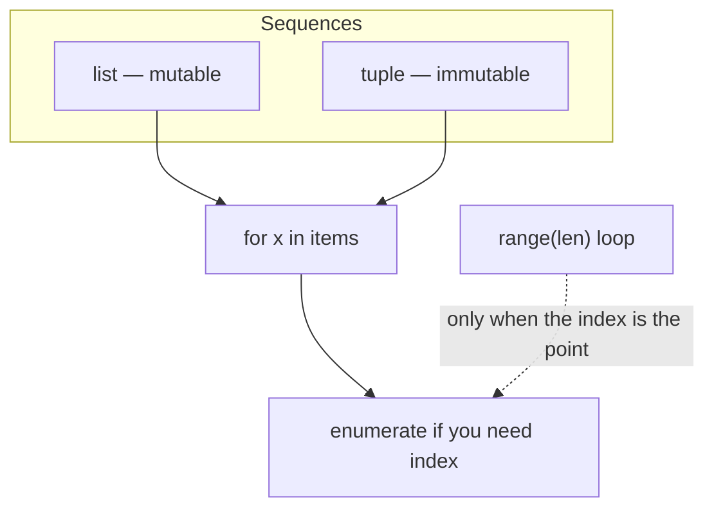
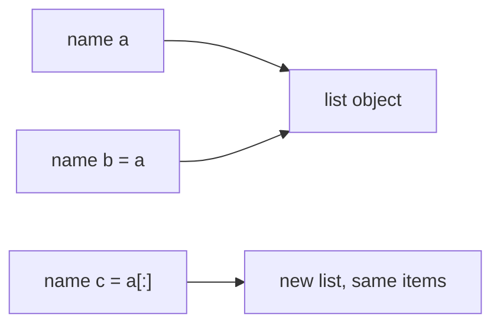

# Month 8 · Week 2 · Day 1
# Lists, Slicing, Tuples, and Walking Collections

**Program:** Full-Stack Mastery · 18 months  
**Phase:** 3 — Python and backend  
**Month index:** [../../README.md](../../README.md)  
**Week 2:** Day 1 (today) · [2](day-02.md) · [3](day-03.md) · [4](day-04.md) · [5](day-05.md) · [6](day-06.md) · [7](day-07.md)  
**Week rhythm today:** Learn + type-along  
**Student state:** Week 1 gate passed. You can branch with `elif`, loop `for x in`, and `assert`. Today the **collection** is the subject — not `range(len(...))` because that is how `for` worked in C and in your JS index loops.  
**Study time:** 3–4 focused hours

**This week covers:** lists, tuples, dicts, sets, comprehensions, iterators.

Today: lists (methods, slicing, mutation vs copy), tuples and unpacking, `enumerate` when you need an index, why `for i in range(len(a))` is a smell. Dicts, sets, and comprehensions are **Day 2**. Do not skip them.

Labs: `~\fullstack-lab\month-08\`. Project 5 is not this week.

---

## How to use this textbook

1. Read a section. Close it. Draw the sticky-note picture (two names, one list).
2. Type every lab. Do not paste.
3. Tracebacks from the bottom.
4. Optional review links are for later.

---

## How to read this chapter

A **list** is an ordered, mutable sequence. A **tuple** is an ordered, **immutable** sequence. Both are **iterables**: `for x in xs` walks values.

JavaScript has arrays for almost everything. Python splits “can change” (list) from “fixed record” (tuple) and later “unique pile” (set) and “keyed map” (dict). Translating `const arr = []` into Python without choosing the type is how you get a list of lists where a dict wanted keys.



Week 1 already showed `b = a; b.append(1)` aliases the same list. That bug is the week’s core. Copy when you mean copy.

---

## Today's contract

By the end of this day you will be able to:

1. Build lists; `append`, `extend`, `insert`, `pop`, `remove`, `in`, `len`.
2. Slice lists (`xs[start:stop:step]`) and explain slice **copies** (shallow).
3. Unpack tuples and list rows: `x, y = pair`.
4. Use `enumerate(xs, start=1)` instead of `range(len(xs))` when you need an index.
5. Explain alias vs shallow copy (`xs[:]` / `list(xs)`).

**Today's gate**

> Two names can point at the same list. `for item in items` is the default loop. `range(len)` is a last resort. Tuples unpack. Slicing a list gives a new list of the same top-level objects.

---

## Time box

| Block | Minutes | Work |
|---|---|---|
| A | 55 | Theory |
| B | 50 | Type-along: alias, slice, unpack, enumerate |
| C | 70 | Independent: `library.py` + asserts |
| D | 20 | Git |
| E | 15 | Recall |

---

# Block A — Theory

## 1. Lists — ordered, mutable

```python
titles = ["Harbor", "Northline"]
titles.append("Yard")       # mutate in place; returns None
titles[0]                   # "Harbor"
titles[-1]                  # last
len(titles)
"Harbor" in titles          # membership — True/False, not index
```

**`append` returns `None`.** `titles = titles.append("x")` destroys the list name. That is the JS `array.push` translation bug: `push` returns a length; Python `append` returns `None`. Always `titles.append("x")` as a **statement**.

| Method | Job | Trap |
|---|---|---|
| `append(x)` | add one item at end | returns `None` |
| `extend(iterable)` | add many | `append(list)` nests a list |
| `insert(i, x)` | put at index | O(n) shift |
| `pop()` / `pop(i)` | remove and **return** | `IndexError` if empty |
| `remove(x)` | remove first equal value | `ValueError` if missing |
| `clear()` | empty in place | aliases see empty too |
| `index(x)` | first index | `ValueError` if missing |
| `count(x)` | how many | |
| `sort()` | in-place sort | returns `None`; mutates |
| `reverse()` | in-place reverse | returns `None` |
| `copy()` | shallow copy | same as `xs[:]` |

**`sort` mutates.** `sorted(xs)` returns a **new** list and leaves `xs` alone. JS `sort` also mutates — you already learned to copy first. Same rule: `[...list].sort` in JS; in Python prefer `sorted(xs)` or `ys = xs.copy(); ys.sort()`.

`sorted` and `sort` compare items. Mixing `int` and `str` is **TypeError** in Python 3 (JS would coerce). Homogeneous lists.

**Wrong belief:** “`titles.append("x")` is an expression I assign.”  
**Correct:** it is a mutation. The list is named `titles` before and after.

### Index vs value loops

```python
# default — Python
for title in titles:
    print(title)

# you need the index — enumerate
for i, title in enumerate(titles):
    print(i, title)

for i, title in enumerate(titles, start=1):
    print(i, title)  # 1-based for human reports
```

```python
# smell — JS translation
for i in range(len(titles)):
    title = titles[i]
```

Use `range(len)` when the **index arithmetic** is the algorithm (swap `i` and `j`, sliding windows). Not when you only want values. Project 5 list/filter code that is `range(len)` everywhere will fail the Month 8 gate’s “stopped translating JS” item.

`enumerate` returns pairs `(index, item)`. You **unpack** in the `for` header. That is tuple unpack (section 3) in a loop.

## 2. Slicing — new list, same inner objects

```python
xs = ["a", "b", "c", "d"]
xs[1:3]     # ["b", "c"]  stop exclusive
xs[:2]      # ["a", "b"]
xs[2:]      # ["c", "d"]
xs[::-1]    # reversed copy
xs[:]       # shallow copy of the list
```

Assignment into a slice can change length: `xs[1:3] = ["X"]`. Know it exists; do not need it today.

**Shallow:** `ys = xs[:]` is a new list. `ys.append("z")` does not change `xs`. If the items are **dicts** (Day 2), both lists still share those dict objects. For a list of strings, shallow is enough (strings immutable).

```python
a = [1, 2]
b = a
c = a[:]
b.append(3)  # a is [1,2,3]
c.append(9)  # c is [1,2,9]; a unchanged by c
```

**Wrong belief:** “`b = a` copies the list.”  
**Correct:** it copies the **arrow**. Same as JS `const b = a`.

Negative step and omitted bounds follow the same rules as strings. Index `xs[100]` is `IndexError`; slice `xs[100:200]` is `[]`.

## 3. Tuples — immutable sequences

```python
pair = ("ok", 200)
status, code = pair      # unpack
x, y = y, x              # swap — no temp name
```

Parentheses are often optional: `pair = "ok", 200`. A one-item tuple needs a comma: `(1,)` not `(1)` (that is just grouped `1`).

Tuples can be **dict keys** later (if all items are hashable). Lists cannot. Records you will not mutate — `(id, title)` — may be tuples. Rows you will `append` to stay lists.

Unpacking must match length or **`ValueError: too many values to unpack`** / `not enough`. Star unpack (optional): `head, *rest = xs`.

**Wrong belief:** “Tuple means I cannot nest mutables.”  
**Correct:** the tuple’s **slots** cannot be rebound (`pair[0] = "x"` is TypeError), but `t = ([],)` then `t[0].append(1)` mutates the inner list. Immutability is one layer.

JS has no everyday tuple. Destructuring `const [a, b] = pair` is the cousin of unpack. Python unpack also works on lists: `first, second = titles[:2]`.

## 4. `in`, `len`, emptiness

`if titles:` is true if the list is non-empty. `if not titles:` empty. That is OK for “are there rows?” It is **not** OK for “is this string blank?” (Week 1). Different types, different questions.

`x in titles` scans — O(n). Fine for small lists. Membership in a **set** (Day 2) is the tool for large unique tests.

## 5. List vs JS array — honest table

| Idea | JavaScript | Python |
|---|---|---|
| Literal | `[]` | `[]` |
| Add one | `push` returns length | `append` returns `None` |
| Copy | `[...xs]` / `slice()` | `xs[:]` / `list(xs)` / `xs.copy()` |
| Walk values | `for...of` | `for x in xs` |
| Walk index | `for (let i = 0; i < n; i++)` | `enumerate` or `range` if needed |
| Immutable seq | no first-class tuple | `tuple` |
| `map`/`filter` | methods | functions + **comprehensions** (Day 2) |

There is no `===`. List equality `==` compares **values** elementwise: `[1,2] == [1,2]` is True; `[1,2] is [1,2]` is False.

---

# Block B — Type-along

```powershell
mkdir ~\fullstack-lab\month-08\week-02\day-01 -Force
cd ~\fullstack-lab\month-08\week-02\day-01
```

### B1 — Alias vs copy

`alias.py`: create `a = ["ada"]`, `b = a`, `c = a[:]`. Append different strings to `b` and `c`. Print all three. Write `PICTURE.txt`: which names share an object.

### B2 — append None

`none_append.py`: `titles = []` then `titles = titles.append("x")` then print `titles`. Read the output. Fix in a comment: the correct two lines.

### B3 — enumerate

`enum.py`: list of three clinic names; print `1. Name` using `enumerate(..., start=1)`. No `range(len)`.

### B4 — unpack

`pair.py`: `row = ("Harbor", "open")`; unpack to `name, state`; print f-string.

---

# Block C — Independent

`library.py`:

1. `add_title(shelf, title)` — return a **new** list `[ * wait Python is` — use `shelf + [title]` or `[*shelf, title]` (star in list display, 3.5+) or `copy` then `append` on the copy. **Must not mutate** the input. Document.

   Simplest honest copy-append:

   ```python
   def add_title(shelf, title):
       out = shelf.copy()
       out.append(title)
       return out
   ```

2. `remove_title(shelf, title)` — new list without the **first** matching title; if missing, return a copy unchanged (or the same list — document). Do not crash with `ValueError` unless you document that you used `remove` on a copy after an `in` check.

3. `first_n(shelf, n)` — slice `shelf[:n]` (a copy of the prefix).

4. `labels(shelf)` — `enumerate(shelf, start=1)` → list of strings `f"{i}. {title}"`.

`test_library.py` asserts: add does not mutate input; `first_n` slice independence for append on the result vs original; labels start at 1.

`RANGE.txt` (paragraph): when `range(len)` is justified (one example) and why your `labels` used `enumerate`.

### Worked `add_title` purity

`shelf = ["Harbor"]`. `out = add_title(shelf, "Yard")`. `shelf` is still `["Harbor"]`. `out` is `["Harbor", "Yard"]`. If `add_title` does `shelf.append` and returns `shelf`, both names show two titles — **fail**.

`first_n(shelf, 1)` then `result.append("x")` must not change `shelf` if slice copied. `xs[:]` copies the list; the **strings** inside are shared (immutable, so you will not notice). If the shelf held dicts, mutating `result[0]["title"]` would show the shallow trap — Week 2 Day 2.

### When `range(len)` is honest

Swapping two indices: `xs[i], xs[j] = xs[j], xs[i]`. You need `i` and `j`. A report `1. title` does **not** need that — `enumerate`. Pairing two lists does **not** — `zip`.

### `sort` None trap (encore)

`titles = titles.sort()` sets `titles` to `None`. Same family as `append`. Use `titles.sort()` or `titles = sorted(titles)`.

**Wrong belief:** “Slicing is slow so I’ll always mutate.”  
**Correct:** clinic lists are tiny. Copy until a profiler (much later) says otherwise. Project 5 n is small.

```powershell
cd ~\fullstack-lab
git add month-08
git commit -m "Month 8 Week 2 Day 1: lists, tuples, enumerate."
```

---

# Block E — Recall

1. What does `append` return?
2. `b = a` vs `b = a[:]`.
3. Why `(1)` is not a tuple.
4. `sort` vs `sorted`.
5. Why `for i in range(len(a))` is a smell.

### JS contrast you must say aloud

JS `push` returns a number; you can write `if (arr.push(x) > 3)`. Python `append` returns `None`; that `if` is a bug. JS `[...a]` copies; Python `a[:]` copies the list (shallow). JS has no tuple in daily use; unpacking `const [x, y] = pair` is the cousin. JS `for (let i = 0; i < a.length; i++)` is the habit this day exists to break.

A list of dicts tomorrow is still a list today: you walk it with `for row in rows`, not `range(len(rows))`.

### Common tracebacks today

| Exception | You probably |
|---|---|
| `AttributeError: 'NoneType' ... append` | assigned `append`’s return |
| `IndexError` | `xs[i]` out of range |
| `ValueError: too many values to unpack` | tuple length mismatch |
| `TypeError: 'tuple' ... item assignment` | tried to mutate a tuple slot |

Read the last line, then the file/line above it. Same skill as Week 1.

Slicing `xs[1:1]` is `[]`, not an error. `xs[1]` on a one-item list is IndexError. Index vs slice — same as strings in Week 1. `labels` with `enumerate(start=1)` never needs `i + 1` if you set start. Off-by-one reports (`0. Harbor`) mean you used default start 0.

`extend([1,2])` adds two items; `append([1,2])` adds one nested list. JS `push(1,2)` adds two; Python `append` takes **one** object. That mismatch is a whole afternoon of bugs. Use `extend` or `+` for many.

---

## Memory picture (draw this in PICTURE.txt)

Two sticky notes can point at **one** paper list:

```text
a ──► [ "ada" ]
b ──► (same box)
c ──► [ "ada" ]   # after c = a[:]
```

`b.append("grace")` writes on the shared paper. `c.append("zoe")` writes on the copy. If you cannot draw this without looking, you will fail `add_title` purity tests and later Project 5 “update returned a list that was also the store.”

Slicing is a **new list object** whose **slots** still point at the same items. Strings are immutable, so you will not notice sharing. Dicts (tomorrow) will.



### `pop` vs `remove` vs `del`

| Tool | You know | Failure |
|---|---|---|
| `xs.pop()` | last item, **returns** it | `IndexError` if empty |
| `xs.pop(i)` | item at i, returns it | `IndexError` |
| `xs.remove(value)` | first equal value, returns **None** | `ValueError` if missing |
| `del xs[i]` | delete slot | `IndexError` |

`remove` is by **value**, `pop`/`del` by **index**. JS `splice` mixes jobs. Pick the Python word that matches the question.

### Unpacking in the `for` header

```python
for i, title in enumerate(titles, start=1):
    ...
for name, state in rows:  # each row is a pair
    ...
```

That is the same unpack as `i, title = (0, "Harbor")`. Length mismatch is ValueError. Nested: `for (i, (name, state)) in enumerate(pairs):` — legal, ugly. Prefer readable loops.

**Wrong belief:** “Tuple means JSON.”  
**Correct:** JSON has arrays and objects, not a tuple type. Tuples are a **Python** in-memory idea. When you dump JSON next week, tuples become lists.

### `+` vs `append` vs `+=`

`xs + [y]` builds a **new** list (like `add_title`’s purity). `xs.append(y)` mutates. `xs += [y]` mutates in place (it is closer to `extend`). For a function that must not touch the caller’s list, use `+` or `copy` then `append` on the copy — not `+=` on the parameter.

---

## Definition of done

- [ ] Alias picture written
- [ ] I can unpack a pair
- [ ] `add_title` does not mutate (assert)
- [ ] `labels` uses `enumerate`, not `range(len)`
- [ ] Commit exists

---

## Optional review links

Lists, slices, and tuples are explained in this chapter. These pages are for later checking, not for first learning.

- [Python tutorial: Lists](https://docs.python.org/3/tutorial/introduction.html#lists)
- [Python tutorial: Tuples and sequences](https://docs.python.org/3/tutorial/datastructures.html#tuples-and-sequences)
- [enumerate](https://docs.python.org/3/library/functions.html#enumerate)

---

## Tomorrow

Dicts (`get` vs `[]`, `KeyError`), sets, comprehensions, iterators vs iterables, `zip`.

### One more picture

A tuple `(id, title)` is a row you will not append to. A list of those tuples is a table you will append to. Do not mutate a tuple’s slots. Do not use a tuple when the operator will add a third task — that is a list. Mixing: `rows.append(("n3", "Yard"))` is a list of tuples. Fine. `rows.append(["n3", "Yard"])` is a list of lists you can accidentally `rows[0][0] = ...` if you used lists inside. Prefer tuples for fixed pairs; lists for growing shelves.
