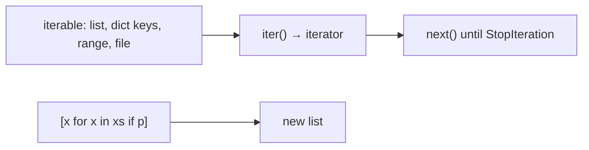

# Month 8 · Week 2 · Day 2
# Dicts, Sets, Comprehensions, and Iterators

**Program:** Full-Stack Mastery · 18 months  
**Phase:** 3 — Python and backend  
**Month index:** [../../README.md](../../README.md)  
**Week 2:** [1](day-01.md) · Day 2 (today) · [3](day-03.md) · [4](day-04.md) · [5](day-05.md) · [6](day-06.md) · [7](day-07.md)  
**Week rhythm today:** Learn + type-along  
**Student state:** You can copy lists, unpack tuples, and `enumerate`. Today you get **maps**, **unique piles**, and the Python loop that looks like math: **comprehensions**.  
**Study time:** 3–4 focused hours

**This week covers:** lists, tuples, dicts, sets, comprehensions, iterators.

Today is the rest of that list. Day 3 is from memory — do not skip the labs.

---

## How to read this chapter

A **dict** maps keys to values. A **set** stores unique hashable values. A **comprehension** builds a collection from an iterable in one expression. An **iterable** can produce an **iterator** that yields items until empty.

JavaScript objects are string-keyed maps (plus prototype traps). `Map` and `Set` exist but students still use `{}` for everything. Python: **`dict`** for records and indexes, **`set`** for uniqueness and membership, **list** for order. Using a list to check `if id in huge_list` in a hot loop is the wrong tool.



`for x in xs` calls `iter(xs)` for you. You rarely call `iter`/`next` by hand. You **must** know the words so generators (Week 4) are not magic.

---

## Today's contract

By the end of this day you will be able to:

1. Read/write dicts; contrast `d[k]` (`KeyError`) with `d.get(k)` / `d.get(k, default)`.
2. Use sets for unique values and `in` tests.
3. Write list comprehensions `[x for x in xs if ...]` and a dict/set comprehension.
4. Explain **iterable** vs **iterator**.
5. Use `zip` to walk two lists in parallel.

**Today's gate**

> `[]` on a missing dict key raises. `get` returns `None` or a default. Comprehensions replace many `map`/`filter` one-liners. I will not write `for i in range(len(a))` to pair two lists — I will `zip`.

---

## Time box

| Block | Minutes | Work |
|---|---|---|
| A | 60 | Theory |
| B | 45 | Guided: KeyError, get, comprehensions, zip |
| C | 70 | Independent: records + asserts |
| D | 20 | Git |
| E | 15 | Recall |

---

# Block A — Theory

## 1. Dicts — keyed records

```python
book = {"id": "b1", "title": "Harbor", "status": "open"}
book["title"]           # "Harbor"
book["missing"]         # KeyError
book.get("missing")     # None
book.get("missing", "") # ""
"title" in book         # True — keys, not values
```

**`d[k]`** means “this key must exist.” Missing → **`KeyError`**. That is not a JS `undefined`. Accessing a missing JS property is `undefined` and the bug shows up later. Python **fails now**. That is a gift if you catch it; a crash if you assumed JS.

**`d.get(k)`** means “maybe missing.” Default `None`. `d.get(k, default)` for a stated fallback.

When to use which:

| Situation | Tool |
|---|---|
| Schema field you require (`id`) | `d["id"]` — KeyError is correct |
| Optional field (`due`) | `.get("due")` |
| Counting / grouping | `.get(k, 0) + 1` or `setdefault` / `Counter` later |

`d["title"] = "Yard"` inserts or overwrites. `del d["title"]` removes (`KeyError` if missing). `d.keys()`, `.values()`, `.items()` — in `for k, v in d.items():`.

Dict keys must be **hashable** (str, int, tuple of hashables — not lists). Insertion order is preserved (Python 3.7+ language guarantee). Do not rely on order as your only model if the data is logically a bag — but printing `items()` follows insert order.

**Wrong belief:** “I’ll write `book.title` like JS objects.”  
**Correct:** that is **attribute** access. Dicts use `book["title"]`. `book.title` is `AttributeError` unless you built a class or a namespace. Week 3 classes; Week 4 dataclasses. Today: **brackets**.

JS `obj.id` vs `obj["id"]` both work for string keys. Python splits dict vs object. Translating every JS object into a dict is OK this week. Translating into a class “because OOP” is not required.

Equality: `{"a": 1} == {"a": 1}` True. `is` False (two dicts).

## 2. Sets — unique, unordered (hash table)

```python
tags = {"ops", "clinic"}
tags.add("ops")         # still one "ops"
"ops" in tags           # fast membership
list(set(["a", "a", "b"]))  # unique, order not a contract of set itself
```

Empty set is **`set()`**, not `{}` — `{}` is an empty **dict**.

Set items must be hashable. `{"a", [1]}` is TypeError.

Operations: `|` union, `&` intersection, `-` difference. Methods: `add`, `discard` (no error if missing), `remove` (KeyError if missing).

Use sets for: unique tags, “have I seen this id?”, duplicate detection. **Do not** use a set when **order** is the product (a task list). Convert: `seen = set(); out = []` then `for x in xs: if x not in seen: seen.add(x); out.append(x)` to unique **preserving order**.

**Wrong belief:** “A set is a list without duplicates and I can `set[0]`.”  
**Correct:** no indexing. Iterate, or convert to `sorted(the_set)` if you need a stable report.

JS `new Set(arr)` is the cousin. Python’s set is not an array.

## 3. Comprehensions — the Python `map`/`filter`

```python
xs = [1, 2, 3, 4]
squares = [x * x for x in xs]
evens = [x for x in xs if x % 2 == 0]
pairs = [(x, x * x) for x in xs if x > 1]
```

Read: “a new list of *expression* for each `x` in `xs` if *condition*.”

Dict comprehension:

```python
titles = ["Harbor", "Yard"]
index = {t: i for i, t in enumerate(titles)}
```

Set comprehension:

```python
letters = {ch.lower() for ch in "Harbor" if ch.isalpha()}
```

There is no tuple comprehension with `(x for x in xs)` — that is a **generator expression** (Week 4 `yield` cousin). A tuple from a comprehension is `tuple(x for x in xs)` or `tuple([x for x in xs])`.

**When not to comprehension:** nested side effects, 4-level nests, mutation inside. A `for` loop that `append`s is honest. Comprehensions that call functions with side effects are cute and untestable.

**Wrong belief:** “I’ll write `.map(x => x * x).filter(...)`.”  
**Correct:** you *can* `map`/`filter` as builtins (`list(map(fn, xs))`) — this course prefers **comprehensions** for simple transforms. `lambda` exists; do not build a Lisp.

JS:

```js
xs.filter((x) => x % 2 === 0).map((x) => x * x);
```

Python:

```python
[x * x for x in xs if x % 2 == 0]
```

No `===`. No arrows. Filter condition is `if` at the end.

## 4. Iterable vs iterator

An **iterable** implements “give me an iterator” (`__iter__`). Lists, tuples, dicts, sets, strings, `range`, files are iterable.

An **iterator** implements `next` (`__next__`) and raises **`StopIteration`** when done. `iter(xs)` returns an iterator. `for` uses it.

```python
it = iter([10, 20])
next(it)  # 10
next(it)  # 20
# next(it)  # StopIteration
```

A list is iterable **many times** (`for` twice works). A one-shot iterator (a generator, a file) is exhausted after one pass. `range` is iterable, not a list.

**Wrong belief:** “Iterable means list.”  
**Correct:** list is one iterable. `zip` and `enumerate` return **iterators** (lazy). `list(zip(a, b))` materializes.

You do not need to implement `__iter__` this month. You need to not be shocked when `zip` is not a list in the REPL (`<zip object>`).

## 5. `zip` — parallel walk

```python
ids = ["a", "b"]
titles = ["Harbor", "Yard"]
for i, t in zip(ids, titles):
    print(i, t)
```

Stops at the **shorter** input. `zip(ids, titles, strict=True)` (3.10+) raises if lengths differ — useful when mismatch is a bug.

Pair into dict: `dict(zip(ids, titles))`.

This replaces:

```python
for i in range(len(ids)):  # smell, and crashes if titles is shorter
    ...
```

**Wrong belief:** “I need the index to walk two arrays.”  
**Correct:** `zip`. Index if you need the number itself (`enumerate`).

## 6. `KeyError` vs JS undefined — worked story

JS: `user.email` missing → `undefined` → later `undefined` in a template. Python: `user["email"]` → **KeyError** traceback, line of the lookup. Fix: required field (let it raise) or `.get` and a branch.

Do not write empty `except KeyError: pass` everywhere (Week 3: no bare except, no silent swallow). Prefer `if "email" in user` or `.get`.

---

# Block B — Type-along

```powershell
mkdir ~\fullstack-lab\month-08\week-02\day-02 -Force
cd ~\fullstack-lab\month-08\week-02\day-02
```

### B1 — KeyError

`keys.py`: dict with `title` only. Print `d.get("status", "unknown")`. Then a line that uses `d["status"]` inside a comment you will uncomment once to **see** KeyError. Copy traceback bottom to `KEYERROR.txt`. Comment it out again so the file runs.

### B2 — Set unique

`unique.py`: from `["ops", "ops", "lab"]` build a set; print `len`. Then order-preserving unique with a loop + set of seen. Print the list.

### B3 — Comprehension + zip

`comp.py`: list of ints 1–10; comprehension of squares of evens. `zip(["id1","id2"], ["A","B"])` printed as pairs. `dict(zip(...))` printed.

Write `PREDICT.txt` for `bool({})`, `bool(set())`, `{} == set()` — then run a tiny `bools.py`. `{}` is dict, `set()` is set, they are not equal.

---

# Block C — Independent

`records.py` — functions on a **list of dicts**:

```python
ROWS = [
    {"id": "t1", "title": "Harbor", "status": "open", "priority": 2},
    {"id": "t2", "title": "  ", "status": "open", "priority": 1},
    {"id": "t3", "title": "Yard", "status": "done", "priority": 2},
]
```

| Function | Behavior |
|---|---|
| `titles_of(rows)` | comprehension: `title` field of each row (`row["title"]`) |
| `open_rows(rows)` | comprehension: status `== "open"` |
| `index_by_id(rows)` | dict comprehension `{row["id"]: row for row in rows}` |
| `unique_statuses(rows)` | set comprehension of statuses |
| `safe_priority(row)` | `row.get("priority", 0)` — never KeyError if missing |
| `paired(ids, titles)` | `list(zip(ids, titles))` |

`test_records.py` asserts: `open_rows` length 2 on `ROWS`; blank title still counts as a row (filter is status, not blank — document); `index_by_id(ROWS)["t3"]["title"] == "Yard"`; `safe_priority({}) == 0`; `safe_priority` does not use `[]` for priority.

`COMP.txt`: rewrite `titles_of` as a `for` loop in prose (or a commented function) and say when you would pick the loop (side effects, complexity).

### Worked `index_by_id` last-wins

Two rows both `"t1"` with titles Harbor then Yard. `{row["id"]: row for row in rows}` keeps **Yard**. Document. `dict(zip(ids, titles))` last-wins the same way for duplicate keys.

### Worked KeyError vs get

`safe_priority({"title": "x"})` is `0`. `{"title": "x"}["priority"]` is KeyError. Required `id` should still use `[]` so a fixture without `id` fails the test, not silently becomes `None`.

### Iterator exhaustion demo (optional in REPL)

```python
z = zip([1, 2], ["a", "b"])
print(list(z))
print(list(z))  # []
```

Second `list` is empty. `zip` is one-shot. A list comprehension over `rows` can be run twice because `rows` is a list.

**Wrong belief:** “`<zip object>` means it failed.”  
**Correct:** it is lazy. `list(...)` or `for` consumes it.

```powershell
cd ~\fullstack-lab
git add month-08
git commit -m "Month 8 Week 2 Day 2: dicts, sets, comprehensions, zip."
```

---

# Block E — Recall

1. `d[k]` vs `d.get(k)`.
2. Why `{}` is not an empty set.
3. Iterable vs iterator in one sentence each.
4. How to unique-preserving-order.
5. `zip` vs `range(len)`.

### JS contrast you must say aloud

Missing `user.email` in JS is `undefined` and the template shows nothing useful later. Missing `user["email"]` in Python is **KeyError now**. `Map`/`Set` in JS are cousins of `dict`/`set`. `.map().filter()` becomes one comprehension with `if`. `zip` has no famous one-word JS equivalent you used in Month 3 — you indexed. Stop indexing.

`bool({})` is True (non-empty? wait — empty dict is **falsy**). `bool({})` is False. Empty set is falsy. Empty JS `{}` is **truthy**. That difference will bite `if (obj)` translations. Use `if d:` only when “non-empty dict” is the question; use `if key in d` for membership.

---

## Definition of done

- [ ] KeyError traceback saved
- [ ] One list, one dict, one set comprehension
- [ ] `get` used for optional field
- [ ] `zip` used without `range(len)`
- [ ] Commit exists

---

## Optional review links

Dicts, sets, and comprehensions are explained in this chapter. These pages are for later checking, not for first learning.

- [Python tutorial: Dictionaries](https://docs.python.org/3/tutorial/datastructures.html#dictionaries)
- [Python tutorial: Sets](https://docs.python.org/3/tutorial/datastructures.html#sets)
- [Python tutorial: List comprehensions](https://docs.python.org/3/tutorial/datastructures.html#list-comprehensions)

---

## Tomorrow

From memory: transform a small table of records. Days 1–2 closed during the drills. Repair from **those files in this book**.

### One more picture

`for k, v in d.items()` unpacks pairs. `for k in d:` walks **keys**, not values (unlike `for x in list`). `for v in d.values():` walks values. JS `for...in` on objects is keys and is easy to get wrong; Python `for k in d` is at least honest about keys. Prefer `.items()` when you need both. Never `for i in range(len(d))` — dicts are not indexed by position in this course.

### Common tracebacks today

| Exception | You probably |
|---|---|
| `KeyError` | `d[k]` missing; use `get` if optional |
| `TypeError: unhashable type: 'list'` | list as set item or dict key |
| `StopIteration` | `next` on exhausted iterator (rare in `for`) |
| `NameError: set` if you wrote `{}` thinking set | `{}` is dict; `set()` is set |

`bool({})` is False. `bool({"a": 1})` is True. Do not use `if d` to mean `if "id" in d`.

`zip([1,2], ["a"], strict=True)` raises if you enable strict and lengths differ — 3.10+. Without strict, you silently drop. Tests should document which. Project 5 pairing of ids and titles from two sources is a smell; store records as dicts instead.

---

## Dict methods you will actually use

| Method | Job | Trap |
|---|---|---|
| `d[k]` / `d[k] = v` | require / set | KeyError on read if missing |
| `d.get(k, default)` | optional read | default is `None` if omitted |
| `d.setdefault(k, [])` | get-or-insert | **mutates**; the default is inserted |
| `d.pop(k)` | remove and return | KeyError if missing |
| `d.pop(k, default)` | remove or default | |
| `d.items()` | `(k, v)` pairs | `for k in d` is keys only |
| `d.update(other)` | merge | last-wins |

`setdefault` with a list is handy for grouping and is easy to overuse. A comprehension that builds the dict in one pass is often clearer.

### Hashable — why a list cannot be a key

Dict keys and set items need a stable hash. `str`, `int`, `tuple` of immutables: yes. `list`, `dict`, `set`: no (`TypeError: unhashable type`). JS objects coerce keys to strings (`obj[1]` and `obj["1"]` can collapse). Python `d[1]` and `d["1"]` are **different keys**. JSON object keys are always strings after `json.load` — convert at the edge. Project 5: **str** ids.

**Wrong belief:** “I’ll use the row number as a dict key because JSON ids are numbers.”  
**Correct:** pick one id type and convert at the JSON edge.

### `in` on a dict vs list vs str

| Haystack | `x in haystack` means |
|---|---|
| `list` / `tuple` | equality to an **item** (scan) |
| `str` | **substring** |
| `dict` / `set` | **key** / membership (hash) |

`"a" in {"a": 1}` is True. `"a" in {"b": "a"}` is False. `"id" in row` asks whether the record has an id key. Do not `if row.get("id"):` — missing and `id=""` differ, and `"0"` is truthy.

### Comprehension scope

The loop name in `[x for x in xs]` does **not** leak into the surrounding function (Python 3). Nested: `[tag for row in rows for tag in row.get("tags", [])]` is two `for`s. Three is a loop.
