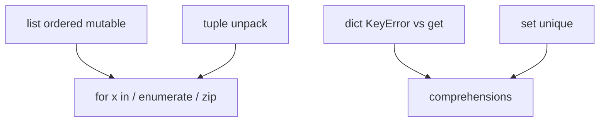

# Month 8 · Week 2 · Day 3
# From Memory: Collections and Comprehensions

**Program:** Full-Stack Mastery · 18 months  
**Phase:** 3 — Python and backend  
**Month index:** [../../README.md](../../README.md)  
**Week 2:** [1](day-01.md) · [2](day-02.md) · Day 3 (today) · [4](day-04.md) · [5](day-05.md) · [6](day-06.md) · [7](day-07.md)  
**Week rhythm today:** Implement from memory  
**Study time:** 3–4 focused hours  
**Student state:** You mutated lists on Day 1 and keyed dicts on Day 2. Today those ideas must live in your fingers.  
**Days 1–2 of this week:** closed during the drills. Repair from **those day files in this textbook**.

---

## How to read this chapter

Type-along files stay **closed**. This recap **is** the lesson. Rebuild collections as if this were a lab exam.



Allowed: this file, your notes, the traceback.  
Not allowed: pasting Day 1–2 labs, AI writing `records.py`, JS `.map` / `.push` as Python.

Stuck more than 25 minutes: open **only** Day 1 or Day 2 in this textbook, read one section, close it. Record `lookups.txt`.

---

## Complete explanation (collections)

### Lists

Ordered, mutable. `append` returns **`None`**. `b = a` aliases; `a[:]` / `a.copy()` shallow-copies the list. `sorted(xs)` new list; `xs.sort()` mutates. `for x in xs`. `enumerate(xs, start=1)` when you need a human index. `range(len(xs))` only when the index **is** the algorithm.

Slice `xs[start:stop]` — stop exclusive; out-of-range slice is empty, not IndexError. Index `xs[i]` can IndexError.

JS: `push` returns length; Python `append` returns None. JS `[...xs]`; Python `xs[:]`.

A **shallow** copy is a new list that still holds the **same** inner objects. If those objects are dicts, mutating `copy[0]["title"]` changes the original row. Today you will write `copy_shelf` that is shallow on purpose, and you will write that fact in NOTES. A deep copy is `copy.deepcopy` — not required today. Pretending a shallow copy is deep is how tests flake next week.

### Tuples

Immutable slots. Unpack `status, code = pair`. One-element `(1,)`. Inner mutables can still mutate.

Tuples are for fixed records and for dict keys when every element is hashable. They are not “frozen lists you should use everywhere.” A shelf of records that you add to is a **list**.

### Dicts

`d["k"]` → value or **KeyError**. `d.get("k")` → `None` or default. `"k" in d` tests **keys**. `.items()` for `for k, v in`. Keys hashable. `{}` is empty dict. Attribute `d.k` is wrong unless a class.

JS missing property is `undefined`. Python missing key is an exception. Prefer fail-fast for required fields.

Required `id` and `title` should use brackets so a bad fixture fails the test **now**. Optional `tags` should use `get`. Sprinkling `.get` on every key hides missing fixtures until production.

### Sets

`set()` empty. `{}` is **not** a set. Unique, no index. `in` is the point. Order-preserving unique: loop + `seen` set.

You cannot `tags[0]` on a set. You cannot slice a set. If you need first-seen order, keep a list and a seen set together. `list(set(...))` is unique and **not** a first-seen contract.

### Comprehensions

`[expr for x in xs if cond]`  
`{k: v for ...}`  
`{x for x in xs}`

Generator expressions `(expr for x in xs)` are lazy — Week 4. Do not nest three comprehensions to look smart.

A comprehension is an **expression**. It should not call `append` on some outer list as a side effect. If the algorithm needs `continue` twice, write a loop. Today `titles` and `with_tag` are comprehensions. `add_row` is a function that returns a new list.

### Iterators

Iterable → `iter()` → iterator → `next` until `StopIteration`. `for` hides that. `zip` and `enumerate` are lazy. `list(zip(a,b))` if you need a list. `zip` stops at shorter; `strict=True` if mismatch is a bug.

A list can be walked twice. A `zip` object cannot. If you write `z = zip(a, b)` and then `list(z)` twice, the second is empty. Materialize when you need two passes.

### Equality

`[1] == [1]` True; `is` False. Same for dicts. No `===`.

### Week 1 still true

`None`, `True`, `strip`, `"3"+1` TypeError, `elif`, no braces.

**Wrong belief:** “I’ll filter with `rows.map`.”  
**Correct:** comprehension or a `for` that builds a new list.

**Wrong belief:** “`copy_shelf` deep-copies because I called it copy.”  
**Correct:** new list, same dict objects. NOTES.txt must say that.

**Wrong belief:** “I’ll `SAMPLE.append` in the function because it’s a lab.”  
**Correct:** tomorrow’s tests and Project 5 will assume purity. Practice it now.

---

## Today's contract

**Today's gate**

> I wrote functions that copy lists, `get` optional keys, and filter with a comprehension — without `range(len)` — and asserts pass.

---

## Time box

| Block | Minutes | Work |
|---|---|---|
| A | 25 | Speak first |
| B | 40 | Warm-up predicts |
| C | 90 | Spec: `shelf.py` + asserts |
| D | 20 | Git + lookups |

---

# Block A — Speak first

Out loud:

1. `append`’s return value.
2. `d[k]` vs `get`.
3. Empty set vs `{}`.
4. Iterable vs iterator.
5. When `zip` beats `range(len)`.
6. Alias vs `xs[:]`.

Mushy answers: re-read that subsection. Do not start the spec yet.

---

# Block B — Warm-up

`~\fullstack-lab\month-08\week-02\day-03\warm.py`

Print:

1. Result of assigning `x = [].append(1)` (then print `x`).
2. `{"a": 1}.get("b", 0)`.
3. `[n * n for n in range(5) if n % 2 == 0]`.
4. `list(zip([1, 2], ["a"]))` — length?

`PREDICT.txt` before `py -3 warm.py`. `ACTUAL.txt` after.

If you predicted `x` is `[1]`, you translated JavaScript `push` (which still does not return the array — it returns length). Python mutation methods that return `None` (`append`, `sort`, `extend`, `remove`) are **statements**. Call them; do not assign them.

---

# Spec: `shelf.py`

A **shelf** is a list of dicts: `{"id": str, "title": str, "tags": list of str}`.

Hard-code `SAMPLE` with three rows. One title is `"  Harbor  "`. One id duplicated in a fourth row you will **not** include if you write `add` with uniqueness — see below.

Functions:

| Name | Spec |
|---|---|
| `normalize_title(s)` | `" ".join(s.split())` — Week 1 |
| `copy_shelf(rows)` | new list, **same dict objects** (shallow) — document the shallow trap |
| `titles(rows)` | list comprehension of `normalize_title(row["title"])` |
| `with_tag(rows, tag)` | comprehension: `tag in row.get("tags", [])` |
| `by_id(rows)` | `{row["id"]: row for row in rows}` — last duplicate id wins; document |
| `unique_tags(rows)` | set union of all tags |
| `add_row(rows, row)` | if `row["id"]` already in an index of ids, return `rows` unchanged (or a copy — document); else return `rows + [row]` **without** mutating input |

Asserts in `test_shelf.py`:

- `add_row` does not mutate.
- Duplicate id does not lengthen.
- `with_tag` missing `tags` key does not KeyError (`get`).
- `titles` has stripped Harbor.
- `unique_tags` is a `set`.

Do not use `for i in range(len(rows))`.

### Worked `titles` comprehension

`["Harbor", "Yard"]` after normalize if SAMPLE had `"  Harbor  "` and `"Yard"`. If you forgot `normalize_title` inside the comprehension, the test for stripped Harbor fails.

You may retype this from **this** page during the spec (Days 1–2 stay closed):

```python
def titles(rows):
    return [normalize_title(row["title"]) for row in rows]
```

That is one expression, no `range(len)`, no `.map`. If `row` lacks `title`, KeyError — good; title is required.

`by_id` last-wins: two `t1` in the list you pass in (not SAMPLE if SAMPLE ids are unique) — document which title remains.

`unique_tags`: union. `{tag for row in rows for tag in row.get("tags", [])}` is a nested comprehension. If that is unreadable, nested `for` loops that `.update` a set. Either is Python. Nested `for i` is not.

### Worked `with_tag`

Row without `tags` key: `row.get("tags", [])` then `tag in that`. `[]` is falsy but `in` still works (`"ops" in []` is False). Do not `row["tags"]`.

Row `tags=["ops","lab"]`, query `"ops"` → keep. Unknown tag → not in the result list.

`tags` value `None` is a nasty JSON cousin: `get` returns `None`, then `"ops" in None` is TypeError. Cleaner: `tags = row.get("tags") or []` if you accept that missing/`None`/`[]` are all “no tags.” Document.

### Worked `add_row` duplicate

`SAMPLE` already has `t1`. `add_row(SAMPLE, {"id": "t1", ...})` length unchanged. Input unmutated. New id length +1 and original length same.

Snapshot ids before the call. After a duplicate add, the snapshot still matches. If you `rows.append` inside `add_row`, that snapshot test fails — that is the test doing its job.

```powershell
cd ~\fullstack-lab\month-08\week-02\day-03
py -3 test_shelf.py
```

`NOTES.txt`: one paragraph on why `copy_shelf` is shallow — mutating `copy_shelf(rows)[0]["title"]` would change the original row. Today `add_row` returns a new list; it does not copy dicts. Project 5 will need to decide copy depth when updating a task. Do not paste a CLI. This lab is `shelf.py`.

### Speak-back: KeyError vs `undefined`

JavaScript `row.tags` when `tags` is missing is `undefined`; `"ops" in undefined` throws later or you wrote `row.tags || []`. Python `row["tags"]` is **KeyError now**. `row.get("tags", [])` is the optional path. Required `row["id"]` should still use brackets so a fixture without `id` fails the test.

### Speak-back: `append` returns None

`x = [].append(1)` binds `x` to `None`. The list existed for a moment and you dropped the name. Warm-up print of `x` must be `None`.

```powershell
git add month-08/week-02/day-03
git commit -m "Month 8 Day 3: shelf records from memory."
```

---

# Lecture: collections as four tools, not one “array”

JavaScript gave you arrays and objects and you used both for everything. Python names four tools because they **fail differently**.

A **list** remembers order and allows duplicates. `append` mutates and returns `None`. Aliasing is the sticky-note lecture: two names, one pile. Slice copy is a new pile of the **same** inner objects. That is why `copy_shelf` is shallow. Document it. Do not “fix” it with `copy.deepcopy` unless a later spec says so — Project 5 will decide copy depth on update, and copying blindly can hide bugs.

A **tuple** is slots. Unpack. A one-element tuple needs a comma. You will not store the shelf as a tuple.

A **dict** is lookup by key. Required keys use `[]` and **KeyError**. Optional keys use `get`. `"k" in d` tests keys, not values. `d.k` is an attribute error unless you built a class. JS `row.tags` is not Python.

A **set** is uniqueness and `in`. Empty set is `set()`. `{}` is a dict. You cannot index a set. First-seen unique is a list plus a seen set, not `list(set(...))`.

**Comprehensions** are expressions: `[normalize_title(row["title"]) for row in rows]`. They are not `.map`. They should not mutate `seen` as a side effect. `with_tag` is a comprehension with `tag in row.get("tags", [])`.

**zip** walks in parallel and stops short. `list(zip([1,2], ["a"]))` has length 1. `range(len)` plus `b[i]` is IndexError when `b` is shorter. That is why zip exists.

Warm-up science: PREDICT before ACTUAL. If you predicted `x = [].append(1)` is `[1]`, you still believe `push`. Write that surprise in NOTES. It will save a later `TypeError: 'NoneType' is not iterable`.

Do not paste Project 5. Do not write argparse. `shelf.py` is the exam.

---

## Definition of done

- [ ] PREDICT before ACTUAL
- [ ] `get` used for optional tags
- [ ] Comprehension used on purpose
- [ ] No `range(len)`
- [ ] Asserts exit 0
- [ ] Commit exists

---

# Worked session — shelf from this page only

Hard-code three rows. Title `"  Harbor  "` must become `"Harbor"` in `titles`. A fourth dict with a duplicate id is for `add_row`, not for SAMPLE if SAMPLE ids are unique — pass it in the test.

`copy_shelf`: `rows[:]` or `list(rows)`. Then mutate `copy[0]["title"]` in a throwaway probe and watch the original change. Write that in NOTES. That is the shallow trap. `add_row` returns `rows + [row]` or a copy plus append on the copy — input length unchanged.

`with_tag`: missing `tags` key must not KeyError. `row.get("tags") or []` if you also want `None` to mean no tags. Required `id` still uses `row["id"]`.

`by_id` last-wins: two rows with `id="t1"` → dict length 1, second title remains. Document it. `unique_tags` is a `set`. Nested `for i` is not Python here.

`lookups.txt` if you opened Day 1–2. PREDICT before ACTUAL on warm.py. `x = [].append(1)` prints `None`. `py -3 test_shelf.py` from `day-03`. No Project 5. No network.

If `titles` still shows spaces around Harbor, the comprehension forgot `normalize_title`. If `add_row` lengthens on a duplicate, you compared the wrong field or mutated then returned the same list without checking ids.

---

# Worked session — shelf from this page only

Hard-code three rows. Title `"  Harbor  "` must become `"Harbor"` in `titles`. A fourth dict with a duplicate id is for `add_row`, not for SAMPLE if SAMPLE ids are unique — pass it in the test.

`copy_shelf`: `rows[:]` or `list(rows)`. Then mutate `copy[0]["title"]` in a throwaway probe and watch the original change. Write that in NOTES. That is the shallow trap. `add_row` returns `rows + [row]` or a copy plus append on the copy — input length unchanged.

`with_tag`: missing `tags` key must not KeyError. `row.get("tags") or []` if you also want `None` to mean no tags. Required `id` still uses `row["id"]`.

`by_id` last-wins: two rows with `id="t1"` → dict length 1, second title remains. Document it. `unique_tags` is a `set`. Nested `for i` is not Python here.

`lookups.txt` if you opened Day 1–2. PREDICT before ACTUAL on warm.py. `x = [].append(1)` prints `None`. `py -3 test_shelf.py` from `day-03`. No Project 5. No network.

If `titles` still shows spaces around Harbor, the comprehension forgot `normalize_title`. If `add_row` lengthens on a duplicate, you compared the wrong field or mutated then returned the same list without checking ids.

---

## Optional review links

Collections are explained in this chapter. These pages are for later checking, not for first learning.

- [Data structures tutorial](https://docs.python.org/3/tutorial/datastructures.html)

---

## Tomorrow

Lab: transform a slightly larger table of records — still no network, still not Project 5.

---

# Closing lecture — purity before a bigger table

Day 4 grows the table. It will not invent `get` for you.
If `add_row` mutates SAMPLE, Day 4 tests will flake and you will blame pytest.
If `with_tag` uses `row["tags"]`, a missing key crashes a non-match row.

`range(len)` is C. `for x in` is Python. `zip` pairs sequences.
`append` returns `None`. Warm-up exists so you see it once, cheaply.
Shallow copy: new list, same dicts. NOTES must say that sentence.

| Function | Mutates input? |
|---|---|
| `copy_shelf` | no (new list; inner dicts shared) |
| `titles` | no |
| `with_tag` | no |
| `by_id` | no (new dict) |
| `add_row` | no |

PREDICT before ACTUAL. `lookups.txt` if you opened Day 1–2.
`py -3 test_shelf.py`. No network. No `~/task-cli/`.
If Harbor still has spaces, the comprehension skipped `normalize_title`.
