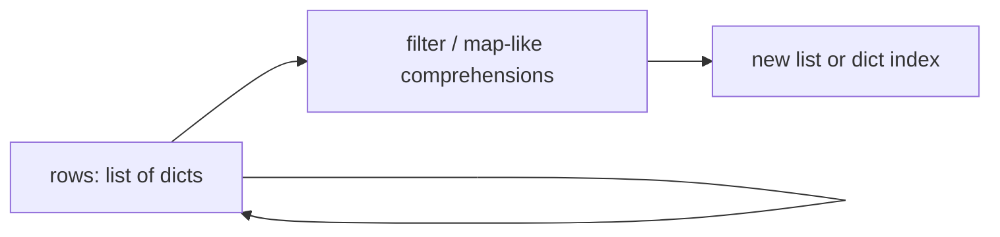

# Month 8 · Week 2 · Day 4
# Lab: Transform Records

**Program:** Full-Stack Mastery · 18 months  
**Phase:** 3 — Python and backend  
**Month index:** [../../README.md](../../README.md)  
**Week 2:** [1](day-01.md) · [2](day-02.md) · [3](day-03.md) · Day 4 (today) · [5](day-05.md) · [6](day-06.md) · [7](day-07.md)  
**Week rhythm today:** Add a real lab feature  
**Study time:** 3–4 focused hours  
**Prereq:** Day 3 gate. You can `get`, comprehend, and copy lists.

This is **not** Project 5. You will transform a **list of dicts** that looks like tasks, without `argparse`, without JSON files (Week 4), without FastAPI. The shape is practice for a repository layer: **pure functions in, new lists out**.

---

## How to read this chapter

A **record** is a dict with known keys. A **transform** is a function from `list[dict]` to `list[dict]` or a summary. Mutation of the caller’s list is a bug unless the name says `sort_in_place` (you will not write that).



The last arrow is the alias trap: if you `append` to the input, the caller’s pile changes. Return new lists.

Read Block A until you can say why `row["status"]` is correct for a required field and `row.get("priority")` is correct for optional. Then type the spec.

---

## Today's contract

By the end of this day you will be able to:

1. Filter, project, and index records with comprehensions and `get`.
2. Search titles with `normalize` + `in` (substring), blank query → `[]`.
3. Sort a **copy** by priority without mutating input (`sorted` + `key=`).
4. Detect duplicate ids with a set.

**Today's gate**

> `transform.py` functions do not mutate input lists (asserts). Search uses `strip`; blank query returns `[]`. No `range(len)`.

---

## Time box

| Block | Minutes | Work |
|---|---|---|
| A | 45 | Theory: key=, sorted, search, duplicates |
| B | 40 | Type-along: sorted key |
| C | 90 | Spec: `transform.py` + `probe.py` + README |
| D | 20 | Git |
| E | 15 | Recall |

---

# Block A — Theory

## 1. Required vs optional fields

```python
row["id"]          # must exist — KeyError is a bad fixture
row["title"]
row["status"]
row.get("priority", 0)
row.get("tags") or []   # None or missing → []
```

`or []` treats **missing, None, and `[]`** as empty tags. It also treats `0` as empty if you used `or` on a number — do not use `or []` on priority. For tags it is acceptable if tags are always a list or missing. Cleaner: `row.get("tags")` then `if tags is None: tags = []`.

**Wrong belief:** “I’ll `.get` every field so nothing raises.”  
**Correct:** hiding a missing `id` produces ghost rows. Required fields should KeyError in tests so fixtures stay honest.

## 2. `sorted` and `key`

```python
sorted(rows, key=lambda r: r.get("priority", 0))
```

`key` is a function from item → sort value. `lambda` is an anonymous `def`. You may write:

```python
def priority_of(row):
    return row.get("priority", 0)

sorted(rows, key=priority_of)
```

Named functions are easier to test. `sorted` returns a **new list**. `rows.sort(...)` mutates. This lab: **`sorted` only**.

JS: `[...rows].sort((a, b) => a.priority - b.priority)` — comparator. Python 3 prefers **key functions**, not comparators (`cmp` is gone). Mixing types in the key can TypeError.

Descending: `sorted(rows, key=priority_of, reverse=True)`.

## 3. Search

Blank query (Week 1): after strip, `""` → return `[]`, **not** the whole list. `"0"` is a real query (substring of titles). Case: decide **casefold** or `lower` on both sides and document.

```python
def search(rows, query):
    q = query.strip().casefold()
    if q == "":
        return []
    return [row for row in rows if q in normalize(row["title"]).casefold()]
```

Substring `in` on a string — Week 1. Do not split unless you want token search (not required).

## 4. Duplicate ids

```python
ids = [row["id"] for row in rows]
dup = len(ids) != len(set(ids))
```

Or a loop with `seen`. A set comprehension of ids compared to length is enough. Project 5 **create** must refuse duplicate ids — here you only **detect**.

## 5. Filter + project

```python
def titles_for_status(rows, status):
    return [row["title"] for row in rows if row["status"] == status]
```

`==` not `is` for string status (`"open"`). Status values are equal by value.

## 6. JS contrast

| Job | JS | Python |
|---|---|---|
| Filter | `rows.filter(r => r.status === "open")` | `[r for r in rows if r["status"] == "open"]` |
| Map | `rows.map(r => r.title)` | `[r["title"] for r in rows]` |
| Sort copy | `[...rows].sort(cmp)` | `sorted(rows, key=...)` |
| Optional | `r.priority ?? 0` | `r.get("priority", 0)` |
| Unique ids | `new Set(rows.map(r => r.id))` | `{r["id"] for r in rows}` |

No `===`. Brackets on dicts. Comprehension, not method chain — or a chain of functions you wrote.

---

# Block B — Type-along

```powershell
mkdir ~\fullstack-lab\month-08\week-02\day-04 -Force
cd ~\fullstack-lab\month-08\week-02\day-04
```

`sort_demo.py`: two dicts with priorities 2 and 1. Print `sorted(..., key=...)`. Then `append` to the **result** and print the original length — prove original unchanged.

---

# Block C — Spec

Folder: `~\fullstack-lab\month-08\week-02\day-04\`.

`SEED` — at least six records:

- ids `t1`… unique except you may include a **deliberate duplicate** in a second list `SEED_DUP` for the detector
- statuses `open` / `done`
- titles including `"  Harbor clinic  "` and `"0"` as a title (search test)
- some missing `priority` key
- some missing `tags` key; some `tags: ["ops","lab"]`

Functions in `transform.py`:

| Function | Spec |
|---|---|
| `normalize(s)` | collapse whitespace |
| `filter_status(rows, status)` | new list; `==` |
| `search(rows, query)` | blank → `[]`; else substring on normalized title, case-insensitive |
| `sort_by_priority(rows)` | `sorted`, missing priority as `0`, ascending |
| `index_by_id(rows)` | dict comprehension |
| `duplicate_ids(rows)` | `True` if any id repeats |
| `tag_set(rows)` | set of all tags from `get("tags") or []` |
| `count_open(rows)` | `len(filter_status(...))` or a comprehension count — `sum(1 for r in rows if ...)` is a generator expression; allowed if you understand it is lazy until `sum` |

`probe.py` prints a short report: counts, search `"harbor"`, search `"  "`, search `"0"`, duplicate flag on `SEED` vs `SEED_DUP`.

`README.md`: blank search rule; shallow copy note; this is not the CLI.

Tomorrow: asserts on every function. Today `probe` may lie — still write functions as if tests exist.

### Worked search table

| Query | Expected idea |
|---|---|
| `"  "` | `[]` |
| `"harbor"` | Harbor clinic row (casefold) |
| `"0"` | row whose title is `"0"` |
| `"nope"` | `[]` |

`sort_by_priority`: missing priority as 0, so those rows sort **before** priority 1 unless you choose otherwise — **document**. `sorted` is stable: equal keys keep original order.

`count_open`: `sum(1 for r in rows if r["status"] == "open")` is a generator expression. `len(filter_status(rows, "open"))` is clearer if you already have filter. Either is fine.

**Wrong belief:** “I’ll `rows.sort` because I own the list in probe.”  
**Correct:** `transform.py` is a library. `sorted`. Probe may print the sorted copy.

### Worked `duplicate_ids`

```python
def duplicate_ids(rows):
    ids = [row["id"] for row in rows]
    return len(ids) != len(set(ids))
```

`id` is required — `row["id"]` not `.get`. Two identical ids → `True`. Empty list → `False`. A set of ids shorter than the list means a collision.

### Worked `tag_set`

```python
def tag_set(rows):
    return {tag for row in rows for tag in (row.get("tags") or [])}
```

If that double `for` is unreadable, a loop with `.update`. Do not `row["tags"]` — missing key is optional. `or []` treats `None` as empty. Do not `or []` on priority (`0` is valid).

### Search is substring, not equality

`q in normalize(row["title"]).casefold()` finds `"harbor"` inside `"Harbor clinic"`. Exact title match would be `==`. Project 5 **search** is closer to substring; **filter** is closer to exact field match (`status == "open"`). Today you implement both: `search` vs `filter_status`.

**Wrong belief:** “Blank query should return everything like SQL `LIKE '%'`.”  
**Correct:** this course: blank search → `[]`. An explicit `list` command later shows all. Empty question → empty answer.

### `key=` is not a comparator

Python 3 dropped `cmp`. `sorted(rows, key=priority_of)` compares **numbers**. Returning a dict from `key` TypeErrors. Named `def priority_of` is testable: `assert priority_of({}) == 0`.

JS students write `(a, b) => a.p - b.p`. Translate to **key**, not to a two-argument function you cannot pass to `sorted`.

### No network, no files

`SEED` lives in the module. Week 4 is JSON. Today a list of dicts is the database. `urllib` is a fail.

```powershell
cd ~\fullstack-lab
git add month-08
git commit -m "Month 8 Week 2 Day 4: record transform lab."
```

---

# Block E — Recall

1. Why `sorted` not `sort` in a library function.
2. Blank search → `[]` not all rows.
3. `get` vs `[]` for priority vs id.
4. How duplicate detection uses a set.

### JS contrast you must say aloud

`.filter` / `.map` / `[...rows].sort((a,b) => a.p - b.p)` vs comprehensions + `sorted(..., key=)`. `??` vs `.get(k, default)`. `new Set(ids).size !== ids.length` vs `len(ids) != len(set(ids))`. Blank search was Month 3 `trim === ""`; today `strip == ""`. Same product rule.

---

## Definition of done

- [ ] `search("  ")` is `[]`
- [ ] `"0"` can match a title
- [ ] `sort_by_priority` does not mutate (you will prove tomorrow; today at least `sorted`)
- [ ] No `range(len)`
- [ ] probe runs
- [ ] Commit exists

---

## Optional review links

`sorted` and dicts are explained in this chapter.

- [Sorting HOWTO](https://docs.python.org/3/howto/sorting.html)
- [dict.get](https://docs.python.org/3/library/stdtypes.html#dict.get)

---

## Tomorrow

`assert` (or tiny pytest if you already have it) on `transform.py`. Mutation tests are the ones that catch aliases.

---

## Probe report (what to print)

`probe.py` should show enough that a TA can grade without reading every function:

1. `len(SEED)` and `count_open(SEED)`
2. `search(SEED, "harbor")` — at least one id
3. `search(SEED, "  ")` — `[]`
4. `search(SEED, "0")` — the row titled `"0"` if you included it
5. `duplicate_ids(SEED)` False; `duplicate_ids(SEED_DUP)` True
6. First id after `sort_by_priority` (lowest priority / missing-as-0 first)

Do not print the entire dict with `print(SEED)` only. Format one line per row: id, title, status, priority.

### Typed signatures (preview; Week 4 will mean them)

You may write:

```python
def search(rows, query):
    ...
```

or preview:

```python
def search(rows: list, query: str) -> list:
    ...
```

Runtime will not enforce the hints. Tests will. Do not `search(rows, None)` and hope — `None.strip` is AttributeError. TypeError/AttributeError on None query: document (raise TypeError if not str, or treat None as blank). Prefer: if not `isinstance(query, str): raise TypeError`.

### JS Month 3 parallel

You already wrote `filter` / `map` / `trim === ""` on a list of objects. Today the objects are dicts, equality is `==`, trim is `strip`, and `sort` is `sorted(..., key=)`. If you reach for `.filter`, stop. Comprehension. If you reach for `===`, SyntaxError.

**Wrong belief:** “I’ll mutate SEED in probe to sort it for the screenshot.”  
**Correct:** `print(sort_by_priority(SEED))`. Leave SEED as the fixture.

### Definition of “no network”

`import urllib`, `import requests`, `import socket`, `http.client` — none of these. A list in the file is the data source. If you `open()` a JSON file, you jumped to Week 4; delete it and use `SEED`.

---

## SEED you must type (example shape, invent titles)

```python
SEED = [
    {"id": "t1", "title": "  Harbor clinic  ", "status": "open", "priority": 2, "tags": ["ops"]},
    {"id": "t2", "title": "0", "status": "open"},
    {"id": "t3", "title": "Yard", "status": "done", "priority": 1, "tags": ["lab", "ops"]},
    {"id": "t4", "title": "Northline", "status": "open", "priority": 0},
    {"id": "t5", "title": "  ", "status": "done"},
    {"id": "t6", "title": "Roof", "status": "open", "tags": []},
]
SEED_DUP = SEED + [{"id": "t1", "title": "ghost", "status": "open"}]
```

`t2` has no `priority` key — sort uses 0. `t5` title blank after normalize — still a **row** for `filter_status`; `search` may or may not match depending on query (blank query still `[]`). `t6` empty tags list vs missing tags — `tag_set` should not crash on either.

`count_open` on this SEED is 4 if statuses are as written (`t1,t2,t4,t6`). Count yourself. If you get 6, you ignored status.

**Wrong belief:** “I’ll use `range(len(SEED))` to print with numbers.”  
**Correct:** `enumerate(SEED, start=1)` if you want `1. t1 Harbor`. Index soup is the Week 2 fail.

README: blank search rule; missing priority as 0; this is not Project 5.
