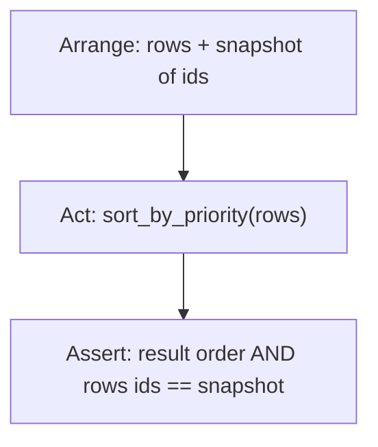

# Month 8 · Week 2 · Day 5
# Tests for Record Transforms

**Program:** Full-Stack Mastery · 18 months  
**Phase:** 3 — Python and backend  
**Month index:** [../../README.md](../../README.md)  
**Week 2:** [1](day-01.md) · [2](day-02.md) · [3](day-03.md) · [4](day-04.md) · Day 5 (today) · [6](day-06.md) · [7](day-07.md)  
**Week rhythm today:** Tests + refactor + documentation  
**Study time:** 3–4 focused hours  
**Student state:** You have `transform.py`. Today the machine proves **non-mutation**, **blank search**, and **get vs KeyError**.

pytest is still optional until Week 4. Prefer `def test_*` **functions** you call from the bottom of the file, **or** top-level asserts. If you install pytest now, use it — do not spend the day fighting `uv`. The claims matter more than the runner.

---

## How to read this chapter

A transform test that only checks `len(result) == 2` can pass while you mutated the input. **Keep a copy of ids or titles before the call** and assert the input is unchanged.



That is the Week 2 test that maps to Project 5: `update` must not scramble the caller’s in-memory list unless you intend in-place (you should not).

---

## Today's contract

1. Write tests that fail if `sort_by_priority` calls `.sort()` on the input.
2. Lock blank search and `"0"` as a query.
3. Lock missing `priority` → treated as 0.
4. Read a failing assert traceback from the bottom.
5. Refactor one name without changing behavior.

**Today's gate**

> Tests catch mutation. Search blank is `[]`. I broke a test on purpose and restored it.

---

## Time box

| Block | Minutes | Work |
|---|---|---|
| A | 40 | Theory: mutation tests, fixtures as data |
| B | 40 | Type-along: red then green |
| C | 80 | Full test file + refactor |
| D | 20 | Git |
| E | 15 | Recall |

---

# Block A — Theory

## 1. Snapshot the input

```python
def test_sort_does_not_mutate():
    rows = [
        {"id": "a", "title": "A", "status": "open", "priority": 2},
        {"id": "b", "title": "B", "status": "open", "priority": 1},
    ]
    before = [r["id"] for r in rows]
    out = sort_by_priority(rows)
    assert [r["id"] for r in rows] == before
    assert [r["id"] for r in out] == ["b", "a"]
```

If `sort_by_priority` does `rows.sort(...)` and returns `rows`, the first assert fails **or** both before and after match the sorted order — then `before` was taken after mutation if you snapshotted wrong. Snapshot **ids in a new list** immediately after arrange: `before = [r["id"] for r in rows]` copies the id strings (immutable). Good.

Shallow trap: `before = rows` is not a snapshot.

## 2. Fixtures are data, not magic

A **fixture** in pytest (Week 4) is a function that returns setup. Today: a function `sample_rows()` that returns a **new** list every call — so tests do not share one mutated global.

```python
def sample_rows():
    return [
        {"id": "t1", "title": "Harbor clinic", "status": "open", "priority": 2},
        {"id": "t2", "title": "0", "status": "open"},
        {"id": "t3", "title": "Yard", "status": "done", "priority": 1},
    ]
```

If `t2` has no `priority`, `sort_by_priority` must not KeyError. Test that.

**Wrong belief:** “A module-level `ROWS = [...]` is fine for all tests.”  
**Correct:** one test `append`s and the next test is flaky. Return fresh data.

## 3. Search cases

| Query | Expected |
|---|---|
| `""` | `[]` |
| `"   "` | `[]` |
| `"0"` | rows whose normalized title contains `0` |
| `"HARBOR"` | Harbor row if case-insensitive |
| `"nope"` | `[]` |

## 4. Duplicate ids

`duplicate_ids` True on two `t1`. False on `sample_rows()`.

## 5. `index_by_id` last-wins

Two rows same id: document and test which title remains. Last in the list is the usual comprehension behavior.

## 6. Runners

**Style A** — `test_transform.py` with top-level asserts; `py -3 test_transform.py`.

**Style B** — functions `test_*` and at the bottom:

```python
if __name__ == "__main__":
    test_sort_does_not_mutate()
    test_blank_search()
    print("ok")
```

`if __name__ == "__main__"` is true when you **run** the file, false when you **import** it. Week 3 will explain modules; today copy the pattern so pytest-style names still run with `py -3`.

**Style C** — `py -3 -m pytest test_transform.py` if installed.

Document the command in `TEST.md`.

JS contrast: `node --test` + `assert.deepEqual`. Python `assert rows == before` uses `==` on lists and dicts (**value** equality). Deep compare is built into `==` for these types. There is no `===`.

---

# Block B — Type-along

Copy `transform.py` into `~\fullstack-lab\month-08\week-02\day-05\` (or import from day-04 if you `sys.path` hack — **prefer copy** so the folder is self-contained).

Write **one** mutation test. Make `sort_by_priority` temporarily use `.sort` on the input. Run. Save traceback in `RED.txt`. Restore `sorted`. Green.

---

# Block C — Independent

Tests required:

1. Mutation: sort, filter, search, add-if-you-have-it.
2. Blank search.
3. `"0"` search.
4. Missing priority.
5. `tag_set` includes tags from rows that used `get`.
6. `duplicate_ids` true/false.
7. `filter_status` uses `==` (add a row with status `"Open"` if you want to prove case sensitivity — document).

Refactor: extract `normalize` if duplicated; extract `priority_of`. Tests stay green.

`TEST.md`: run command; why `sample_rows()` is a function.

Break `search` so blank returns all rows. Confirm test fails. Restore.

### `==` on dicts

`{"id": "a", "title": "H"} == {"title": "H", "id": "a"}` is True (order of keys does not matter). Nested lists in tags: `==` compares them too. `is` is still False for two dicts.

### Style B runner

```python
if __name__ == "__main__":
    test_sort_does_not_mutate()
    test_blank_search()
    print("ok")
```

If you define `test_*` and run `py -3 test_transform.py` **without** calling them, exit 0 is a lie. Either top-level asserts or the `if __name__` block or pytest.

**Wrong belief:** “I’ll snapshot `before = rows.copy()` and then mutate dicts inside.”  
**Correct:** `copy()` is shallow; mutating `rows[0]["title"]` changes `before[0]["title"]` too. Snapshot **ids** (strings) or `deepcopy` (not required). Id snapshot is enough to catch `.sort()` on the list.

### Mutation tests — four functions, one idea

For each of `sort_by_priority`, `filter_status`, `search` (and `index_by_id` for **input list** id order):

1. Arrange `rows = sample_rows()`.
2. Snapshot `ids = [r["id"] for r in rows]`.
3. Act.
4. Assert `[r["id"] for r in rows] == ids`.

Also assert identity when the API returns a new list:

```python
out = sort_by_priority(rows)
assert out is not rows
assert [r["id"] for r in rows] == ids_before
```

Length-only tests lie. `sorted` already returns a new list; `result is rows` means you cheated with in-place sort and returned the same object.

### `sample_rows()` must not share dicts across tests

If you mutate `row["title"]` in a sloppy function, a **module-level** `ROWS` flakes. Return a new list of **new** dicts each call. Do not `return ROWS`.

### AssertionError vs KeyError in tests

If `sort_by_priority` uses `row["priority"]` and a sample row omits it, the test dies with **KeyError**, not AssertionError. That is still a red bar. Read the last line. The spec said missing → 0, so `.get("priority", 0)`.

### JS `deepEqual`

`assert out[0] == {"id": "b", ...}` uses dict `==` (key order irrelevant). There is no `===`. Two dicts with the same keys/values are equal even if you insert keys in different orders.

```powershell
cd ~\fullstack-lab
git add month-08
git commit -m "Month 8 Week 2 Day 5: transform tests including mutation."
```

---

# Block E — Recall

1. Why `before = rows` is not a snapshot.
2. Why module-level mutable `ROWS` flakes.
3. `==` on two dicts.
4. `__name__ == "__main__"` in one sentence.

### JS contrast you must say aloud

`assert.deepEqual` vs Python `==` on lists/dicts. `node --test` vs `py -3` asserts or pytest. Shared `let rows = [...]` at module scope flakes in both languages. `__name__ == "__main__"` has no exact JS twin; it is “was this file executed as the program?” — `import.meta.url` tricks exist; you do not need them.

---

## Definition of done

- [ ] Mutation assert exists and was proven red then green
- [ ] Blank search locked
- [ ] Fresh `sample_rows()` per test
- [ ] TEST.md names the runner
- [ ] Commit exists

---

## Optional review links

Asserts and `==` for containers are explained in this chapter.

- [pytest: good practices (preview)](https://docs.pytest.org/en/stable/explanation/goodpractices.html)
- [Python `==` for sequences](https://docs.python.org/3/reference/expressions.html#value-comparisons)

---

## Tomorrow

Independent: a new record domain (not a rename of `status` only). Teach-back on aliasing vs comprehensions.

---

## Red/green script (do this in order)

1. Copy `transform.py` into day-05 (self-contained folder).
2. Write `test_sort_does_not_mutate` only. Green.
3. Change `sort_by_priority` to `rows.sort(...)` and `return rows`. Red. Save traceback bottom in `RED.txt`.
4. Restore `sorted`. Green.
5. Add the rest of the tests from Block C.
6. Break `search` so `"  "` returns all rows. Confirm the blank-search test is red. Restore.

If you never saw red, you do not know the test watches. The product is the red bar.

### Arrange / act / assert on search

```python
def test_blank_search():
    rows = sample_rows()
    got = search(rows, "   ")
    assert got == []
    assert [r["id"] for r in rows] == [r["id"] for r in sample_rows()]
```

Second assert needs a **fresh** `sample_rows()` for the expected ids, or a snapshot taken **before** `search`. If `sample_rows` is random, snapshot.

### `index_by_id` last-wins test

```python
rows = [
    {"id": "t1", "title": "First", "status": "open"},
    {"id": "t1", "title": "Second", "status": "open"},
]
assert index_by_id(rows)["t1"]["title"] == "Second"
```

Document last-wins in TEST.md. Project 5 **create** should refuse duplicates instead of last-wins — different function, different test.

### JS contrast

`assert.deepEqual(rows, snapshot)` vs Python `==`. Shared module-level arrays flake in both. `__name__ == "__main__"` so `py -3 test_transform.py` actually **calls** `test_*` if you used Style B. pytest Week 4 will call them for you.

---

## TEST.md contents (required)

- Exact command: `py -3 test_transform.py` or `uv run pytest` if you already live in a uv project.
- Style A vs B vs C.
- Why `sample_rows()` is a function (shared mutation).
- Why snapshot ids, not `before = rows`.
- The blank-search rule.

If TEST.md is “run the tests,” it is not done.

### Case sensitivity of status

`filter_status(rows, "open")` should not return `"Open"` if you used `==`. Add a row `"Open"` and assert it is excluded — or document casefold. Project 5 should pick one status enum and reject the rest (Week 3 raise). This week: `==` is enough if tests say so.

**Wrong belief:** “Green means I printed PASS.”  
**Correct:** exit code 0 from the test file. `print("ok")` after asserts is optional heartbeat. An assert that never ran is not green.
