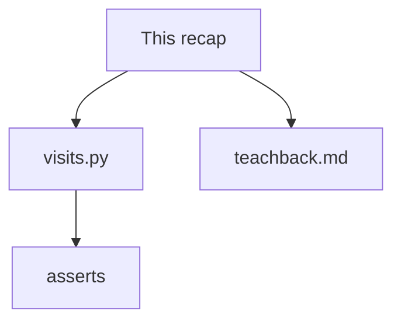
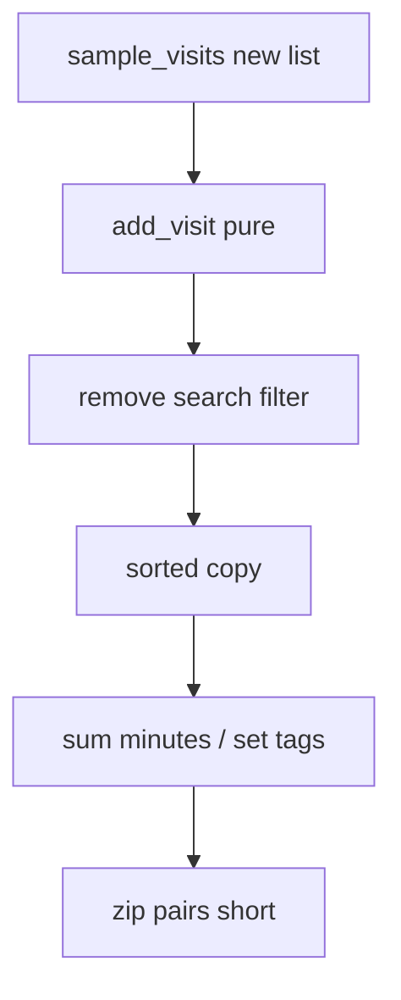

# Month 8 · Week 2 · Day 6
# Independent: A New Record Domain

**Program:** Full-Stack Mastery · 18 months  
**Phase:** 3 — Python and backend  
**Month index:** [../../README.md](../../README.md)  
**Week 2:** [1](day-01.md) · [2](day-02.md) · [3](day-03.md) · [4](day-04.md) · [5](day-05.md) · Day 6 (today) · [7](day-07.md)  
**Week rhythm today:** Independent project work  
**Study time:** 3–4 focused hours  
**Days 1–5 textbook files:** closed for the *challenges*. Repair from **Week 2 Days 1–2 in this book**.

---

## How to read this chapter

Today you prove Week 2 without renaming `status` to `genre` on yesterday’s file. A **visit log** is not a task list. Same *rules*: new lists out, `get` for optional, comprehensions on purpose, `zip`/`enumerate` when they earn it.



Stuck more than 25 minutes: Day 1 or Day 2 in this textbook only. Record lookups.

---

## Complete explanation (this book is the lesson)

**Lists** mutate; `append` returns None; alias vs `copy`/`[:]`. **`sorted`** copies; **`sort`** does not. **`enumerate`** for indices; **`zip`** for parallel; avoid `range(len)` unless the index is the math.

**Tuples** unpack. `(1,)` is one item.

**Dicts:** `[]` KeyError; `get` default. Keys hashable. No `book.title` on a dict.

**Sets:** unique, `set()`, not `{}`. Membership. Order-preserving unique needs a list + seen set.

**Comprehensions:** `[x for x in xs if p]`, `{k: v for ...}`, `{x for ...}`. Side-effect-free.

**Iterables** vs **iterators**: lists replay; `zip` objects exhaust. `list(zip(...))` materializes.

**Search:** strip; blank → `[]`; `"0"` is a query.

**Tests:** snapshot input ids; fresh sample data per test; `==` deep-compares lists/dicts.

A **pure** transform returns a new list (or a new set) and leaves the input alone. Snapshot `[r["id"] for r in rows]` before the call. After `sort_by_minutes` or `add_visit`, that snapshot must still match the original rows in the same order. If it does not, you mutated.

`sample_visits()` must return a **new** list every call. Module-level `ROWS = [...]` will flake when a buggy `add` mutates. That flake is a gift: it proves the bug. Do not “fix” it by making tests share one list and asserting loosely.

**Wrong belief:** “`for i in range(len(a))` is how you loop in any language.”  
**Correct:** it is how you loop in C. Python iterates.

**Wrong belief:** “`.get` everywhere is defensive.”  
**Correct:** required `id` should KeyError on bad fixtures.

**Wrong belief:** “I’ll copy `transform.py` and rename `status` to `reason`.”  
**Correct:** `total_minutes` and `all_tags` cannot be a rename of `count_open`. Patients, minutes, reasons. If the file still thinks in task status, rewrite.

Teach-back (5–8 **sentences**, not bullets) must include: (1) alias vs slice copy, (2) KeyError vs JS undefined, (3) why a comprehension is not `.map`. If you omit one, rewrite.

---

## Today's contract

**Today's gate**

> Tests cover add/remove/search/filter/sort/set. Sort does not mutate. Teach-back is prose.

---

## Time box

| Block | Minutes | Work |
|---|---|---|
| A | 20 | Speak this recap |
| B | 90 | `visits.py` + tests |
| C | 40 | Teach-back |
| D | 20 | Git |

---

# Spec: clinic visits

Folder: `~\fullstack-lab\month-08\week-02\independent\`.

Each visit: `id`, `patient` (str), `minutes` (int), `reason` (str), optional `tags` (list of str), optional `severity` (int).

| Function | Idea | Mutates input? |
|---|---|---|
| `add_visit(rows, visit)` | if id exists (`any` or set of ids), no duplicate; else new list | no |
| `remove_visit(rows, vid)` | comprehension exclude id | no |
| `search_patient(rows, q)` | trim; blank → `[]`; else `q` in patient name, casefold | no |
| `filter_reason(rows, reason)` | exact `==` on reason | no |
| `sort_by_minutes(rows)` | `sorted` ascending | **must not** |
| `total_minutes(rows)` | `sum(r["minutes"] for r in rows)` — generator expr OK | no |
| `all_tags(rows)` | set of tags via `get("tags") or []` | no |
| `pairs(ids, patients)` | `list(zip(ids, patients))` | n/a |

Details:

- `add_visit` duplicate: length unchanged; original unmutated.
- `filter_reason` unknown → `[]`.
- `minutes` are ints. Do not `int("3")` inside `total_minutes`.
- Empty list `total_minutes` → `0` (`sum` of empty is 0).

Worked `sort_by_minutes`: input minutes 5 then 2 → output 2 then 5; input still 5 then 2. `sorted(rows, key=lambda r: r["minutes"])` returns a new list. `rows.sort(...)` mutates. The name `sort_by_minutes` is allowed to *sound* like `sort`; the implementation must still copy.

Worked `all_tags`: two visits with overlapping tags → unique set; mutating a **list you accidentally returned** must not be the API — return a `set` or `sorted(set)`.

Tests in `test_visits.py`. Run command in `TEST.md`.

`teachback.md`: alias sticky notes; KeyError vs undefined; comprehension vs `map`; one sentence `zip`.

### Speak-back checklist (before you write prose)

- [ ] I can draw `b = a` vs `b = a[:]`
- [ ] I can say why `row["id"]` should KeyError in tests
- [ ] I can write `[v["patient"] for v in rows if v["minutes"] > 10]` from memory
- [ ] I can explain `zip` stopping short
- [ ] I can explain `append` returning `None`

If any box is empty, re-read that subsection in **this** file, then write the teach-back. Do not open Day 1 as a paste source.

### `minutes` type

`total_minutes` adding `"5"` concatenates if you start from `""` by accident, or TypeError if you start from `0`. Keep ints. Convert at the edge (later: JSON numbers are already `int` if you dumped ints). Missing `minutes` key: KeyError is correct (required field). Do not `.get("minutes", 0)` unless you document optional minutes — this spec says required.

```powershell
git add month-08/week-02/independent
git commit -m "Independent visit-log module with tests."
```

Do not copy `transform.py` and rename keys without rewriting logic. `total_minutes` and `all_tags` must be real.

### Worked `add_visit` (no duplicate, no mutation)

Input one visit `id="v1"`. Add `v1` again. Length stays 1. Snapshot `[r["id"] for r in rows]` before the call; after the call the snapshot still matches `rows`. If you `rows.append` inside `add_visit`, the snapshot test fails — that is the test doing its job.

Use a set of ids or `any(r["id"] == visit["id"] for r in rows)`. Do not `for i in range(len(rows))`.

`any` is a short-circuiting loop. `any` on an empty list is `False` — adding to empty works.

```python
def _has_id(rows, vid):
    return any(r["id"] == vid for r in rows)
```

### Worked `search_patient`

Rows: Ada, Grace, `"0"`. Query `"  "` → `[]`. Query `"ada"` → Ada if casefold. Query `"0"` → the patient named `"0"` if you put one in the fixture — or no rows. Document. Substring `in` after `casefold` on both sides.

Blank search is Week 1 again: `q.strip() == ""` then `[]`. `"0"` is a query. `if q:` is the wrong test.

### Worked `pairs` / `zip`

`pairs(["a","b"], ["Ada"])` length **1** (zip stops short). Write that test so you never assume equal lengths. `strict=True` is optional extra if you want mismatch to raise — then document.

### Tests that catch aliases

After `sort_by_minutes`, `assert [r["id"] for r in original] == ids_before`. After `add_visit` duplicate, length unchanged. After `all_tags`, if you returned a `set`, mutating a list copy of it must not change a second `all_tags(rows)` call — sets returned new each time.

### JS contrast you must write into the teach-back

| Job | JS (Month 3) | Python (today) |
|---|---|---|
| Filter | `.filter` | comprehension |
| Map titles | `.map(v => v.patient)` | `[v["patient"] for v in rows]` |
| Unique tags | `new Set(...)` | set comprehension / `|` |
| Sort copy | `[...rows].sort(cmp)` | `sorted(rows, key=...)` |
| Optional field | `v.tags ?? []` | `v.get("tags") or []` |

If your teach-back never says **KeyError**, you wrote a vocabulary list, not a lesson.

### Folder layout

`visits.py`, `test_visits.py`, `teachback.md`, `TEST.md`, `NOTES.txt` (one paragraph: why minutes are ints at the boundary). `py -3 test_visits.py` or pytest. No HTML. No network. No Project 5 CLI. No JSON files.

---

# Lecture: a visit log is not a task list

If `visits.py` still has `status` and `priority` as the main fields, you cloned tasks. Patients, minutes, reasons. `total_minutes` is the function that cannot be a rename of `count_open`. `all_tags` cannot be a rename of `open_ids`. Rewrite from this spec.

**Alias, drawn.** Box = list object. Arrow `a` and arrow `b` if `b = a`. `b.append` changes the box. Photocopy = `b = a[:]`. Append on the photocopy does not change `a`. Inner dicts are still the same paper on a shallow copy. Today `sort_by_minutes` must not even photocopy-mutate: `sorted` returns a new list of the **same** dicts, ordered differently. The input list’s order stays. Snapshot ids.

**KeyError vs undefined.** Required `id`, `patient`, `minutes`, `reason` use brackets. Optional `tags` and `severity` use `get`. A fixture missing `id` should fail the test **now**, not return a visit with `id is None`. JavaScript would have given you `undefined` and a later crash. Prefer the loud error for required fields.

**Comprehension vs map.** `[v["patient"] for v in rows if v["minutes"] > 10]` is filter and map in one expression. No `.map`. No `===`. No `const`. If you cannot write that line from memory, re-read this paragraph and write it on paper before coding `search_patient`.

**zip stops short.** `pairs(["a","b"], ["Ada"])` length 1. That test is not busywork. Parallel walks without zip are `range(len)` plus IndexError. Write the short-zip test even if it feels small.

**Blank search.** `strip == ""` → `[]`. `"0"` is a query. `if q:` is the Week 1 bug wearing a dict.

**minutes are ints.** `sum` of strings concatenates if you start from `""`. `sum` of mixed types TypeErrors if you start from `0`. Keep ints. Convert at a later JSON/CLI edge, not inside `total_minutes`. Missing `minutes` → KeyError. Do not `.get("minutes", 0)` unless you change the spec.

**Fresh fixtures.** `def sample_visits(): return [{...}, {...}]` every call. Module-level `ROWS = [...]` plus a buggy mutate makes tests depend on order. That flake is the test catching the bug. Do not “stabilize” by sharing one list.

**any for duplicate ids.** `any(r["id"] == vid for r in rows)` short-circuits. Empty rows → `False` → add works. No `range(len)`.

Teach-back must include one traceback you actually saw: KeyError, TypeError from `append` None, or unpack ValueError. Five honest sentences minimum. A keyword table is a cheat sheet.

---

## Definition of done

- [ ] Tests cover add/remove/search/filter/sort/sum/set/zip
- [ ] Sort does not mutate
- [ ] Blank search `[]`
- [ ] Teach-back is prose
- [ ] No `range(len)` except a comment saying why not
- [ ] Commit exists

---

# Worked session — visits you cannot rename from tasks

Write `sample_visits()` first. Two or three dicts. Different minutes. Overlapping tags. One patient `"0"` if you want the query-zero test. Return a **new** list every call.

`add_visit`: snapshot ids; duplicate → same length; new id → length + 1 and original snapshot intact. `remove_visit`: comprehension exclude id; missing id → same list (or document). `search_patient`: `"   "` → `[]`; `"ada"` casefold substring. `filter_reason`: exact `==`; unknown → `[]`. `sort_by_minutes`: `sorted(..., key=lambda r: r["minutes"])`; input order unchanged. `total_minutes`: generator expression; empty → 0; no `int()`. `all_tags`: set; `get("tags") or []`. `pairs`: `list(zip(...))`; unequal lengths → short.

TEST.md names the command: `py -3 test_visits.py`. Teach-back is 5–8 sentences with KeyError in it. NOTES.txt: minutes are ints at the boundary.

If `visits.py` imports `transform` or still says `status`, delete and rewrite. Independent means a new noun. No JSON. No CLI. No `~/task-cli/`.



**sorted vs sort.** `sorted` is the name that copies. `list.sort` mutates and returns `None`. If you assign `rows = rows.sort(...)`, `rows` is `None` and the next test TypeErrors. Same Week 1 `append` lesson on a new method.

**severity optional.** `row.get("severity", 0)` if you sort by it later. Missing severity must not KeyError if you documented optional. Required `minutes` must KeyError. That contrast is the dict lecture.

---

## Optional review links

Collections are explained in this chapter. These pages are for later checking, not for first learning.

- [Data structures tutorial](https://docs.python.org/3/tutorial/datastructures.html)
- [sum](https://docs.python.org/3/library/functions.html#sum)

---

## Tomorrow

Week review: speak the synthesis, mini-build, debug alias / KeyError / `range(len)` / blank search. Repair the weakest topic today if the teach-back already wobbled.

### Common mistakes today

| Mistake | Fix |
|---|---|
| copy-paste `transform.py` rename keys | rewrite `total_minutes` / `all_tags` |
| `sort` in place | `sorted` |
| blank search returns all | `strip` → `[]` |
| `row["tags"]` optional | `.get("tags") or []` |
| teach-back omits KeyError | rewrite the paragraph |

`pairs` / `zip` is a required function even if it feels small. The test that lengths differ is the point. Do not skip it to “save time.”

---

# Closing lecture — visits are a different question

Minutes sum. Statuses count. Those are not the same function with renamed keys.
If `visits.py` still says `priority`, you cloned tasks. Rewrite.

Search is Week 1 on `patient`: strip, blank → `[]`, `"0"` is a query.
Sort is `sorted`, a new list. Snapshot ids on the input after the call.
zip stops short. `pairs` with unequal lengths is a required test.
`total_minutes` uses ints. Missing `minutes` is KeyError, not 0.
`all_tags` uses `get("tags") or []` and returns a set.

| Function | Blank / missing behavior |
|---|---|
| `search_patient("  ")` | `[]` |
| `filter_reason` unknown | `[]` |
| `total_minutes([])` | `0` |
| missing `id` on a row | KeyError |
| missing `tags` | empty set contribution |

`sample_visits()` returns a new list every call.
Module-level `ROWS` plus a mutating add makes order-dependent flakes.
That flake is the test catching the bug. Do not share one list.

Teach-back: alias, KeyError vs undefined, comprehension vs `.map`, zip.
Five to eight sentences. One real traceback. No keyword-only table.
`py -3 test_visits.py`. No JSON. No CLI. No Project 5.
`any(r["id"] == vid for r in rows)` short-circuits. Empty rows → add works.
Do not `for i in range(len(rows))` to find an id. That is the C habit.
`append` still returns `None`. `rows = rows.append(v)` then TypeError later.
`sorted` copies. `sort` mutates. The function name `sort_by_minutes` must still copy.
Teach-back that omits KeyError is a vocabulary list. Rewrite until KeyError appears.
Folder layout is four files plus NOTES. Run from that folder. No network.


## Recite-back checklist (close the editor, then tick)

Write `RECITE.txt` with one honest sentence per line.
If a line is mush, re-read the matching section in **this** file only.

- [ ] `b = a` vs `b = a[:]` drawn
- [ ] KeyError vs JS undefined
- [ ] blank search → `[]`
- [ ] `sorted` does not mutate
- [ ] zip stops short
- [ ] minutes are ints; no `int()` in sum
- [ ] `sample_visits()` is a new list
- [ ] teach-back includes KeyError

If any box is empty, you are not done. The independent is a new noun.
Patients, minutes, reasons. `total_minutes` cannot be `count_open` renamed.
`py -3 test_visits.py` from `independent`. Commit when the boxes are true.

If RECITE.txt is a paste of the checklist, rewrite it as sentences you would say to a TA.
Independent day is not a race. Green asserts plus prose beat a renamed task module.
`pairs` / `zip` stays required even if it feels small. Unequal lengths are the point.
