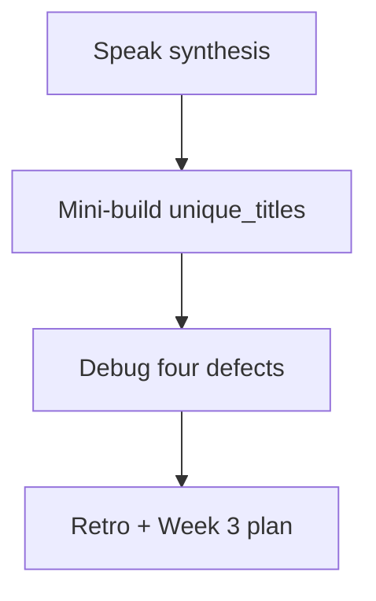
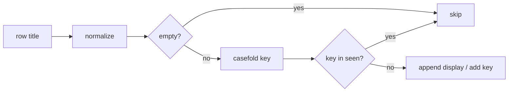

# Month 8 · Week 2 · Day 7
# Week Review — Collections

**Program:** Full-Stack Mastery · 18 months  
**Phase:** 3 — Python and backend  
**Month index:** [../../README.md](../../README.md)  
**Week 2:** [1](day-01.md) · [2](day-02.md) · [3](day-03.md) · [4](day-04.md) · [5](day-05.md) · [6](day-06.md) · Day 7 (today)  
**Week rhythm today:** Review, repair, plan Week 3  
**Study time:** 3–4 focused hours  
**Student state:** You can copy lists, `get` dicts, and write a comprehension. Today those ideas must still live in your head — from **this file**.

Do not start Week 3 because the calendar moved. Functions on a mushy alias story become two problems.

---

## How to read this chapter

Closed-book teaching day. The synthesis **is** the Week 2 lesson.



Days 1–6 closed during mini-build. Repair from **this** recap.

---

## Week synthesis (this book)

**list:** ordered, mutable; `append` → `None`; alias vs `[:]`; `sorted` vs `sort`; `for x in`; `enumerate`; slice.

**tuple:** immutable slots; unpack.

**dict:** `d[k]` KeyError; `get`; `.items()`; no attribute access.

**set:** unique; `set()`; not `{}`; membership.

**comprehensions:** list/dict/set; no side effects.

**iterators:** lazy `zip`/`enumerate`; iterable vs iterator.

**zip** pairs sequences. Avoid `range(len)` unless you need index math.

**tests:** snapshot input; fresh fixtures.

Week 1 still holds: `==`, `strip`, `None`, TypeError on `"3"+1`.

The sections below unpack that so you can mini-build without Days 1–6.

---

## Today's contract

**Today's gate.** Closed-book:

> I can explain alias vs copy, KeyError vs get, a comprehension, and zip, and I have a green assert file that proves a transform did not mutate.

---

## Time box

| Block | Minutes | Work |
|---|---|---|
| 1 | 40 | Speak the synthesis |
| 2 | 50 | Mini-build `unique_titles` |
| 3 | 30 | Debug four defects |
| 4 | 25 | Review independent — one fix |
| 5 | 20 | Re-run tests |
| 6 | 20 | Design: list vs dict vs set |
| 7 | 25 | Retro + Week 3 plan |

---

# Complete explanation — collections you must still own

## 1. Lists and aliases

`b = a` two names, one list. `b.append` changes `a`. Copy: `a[:]`, `list(a)`, `a.copy()` — **shallow**. `append`/`sort`/`reverse` return `None`. `sorted(a)` is the functional sort.

Walk **values**: `for x in a`. Need index: `enumerate`. Need two lists: `zip`. `range(len)` is C.

Draw it: a box of sticky notes is the list object. Two arrows pointing at that box are `a` and `b`. Copying the list is photocopying the pile of notes — the notes themselves (dicts) may still be the same paper. That is shallow. Today `unique_titles` must not even photocopy if the spec says leave the input list unchanged: build a **new** `out` list; do not `rows.append`.

## 2. Tuples

Unpack. Use as fixed records or dict keys (if hashable). `(1,)` comma.

## 3. Dicts

Required: `row["id"]`. Optional: `row.get("due")`. Missing `[]` is **KeyError**, not `undefined`. `in` tests keys. Dict comprehension `{r["id"]: r for r in rows}` last-wins on duplicate ids.

JavaScript’s missing property is a quiet `undefined` that blows up later. Python’s missing key is a loud KeyError **now**. That is the better default for required fields. Optional fields need `get` because loud is then the wrong default.

## 4. Sets

Uniqueness and `in`. No `set[0]`. Empty `set()`. Order-preserving unique: loop + seen.

## 5. Comprehensions and iterators

`[normalize(r["title"]) for r in rows if r["status"] == "open"]`.

`iter`/`next`/`StopIteration` is what `for` does. Exhausted iterators do not replay. Lists do.

A comprehension is one expression. The mini-build below is **not** a good comprehension, because it needs a `seen` set and two `continue`s. Use a loop. Do not write `[seen.add(x) or x for x in xs]`. That is clever and unreadable.

## 6. Search and blank

`query.strip() == ""` → `[]`. `"0"` is a query. Same as Week 1, now on a field of a dict.

## 7. Worked mini-build (in words)

`unique_titles(rows)` returns a **new list** of normalized titles in **first-seen** order, duplicates dropped. Use a `seen` set of casefolded titles. Input list unchanged. Empty title after normalize skipped (not a title).

Input titles `Harbor`, `harbor`, `  Yard  `, `""` → `["Harbor", "Yard"]` (first spelling kept; empty dropped). If you used only `set(...)`, order is not a contract — the spec wants first-seen, so **not** `list(set(...))` alone.

Shape of a loop you may retype from **this** page during the mini-build:

```python
def unique_titles(rows):
    seen = set()
    out = []
    for row in rows:
        title = " ".join(row["title"].split())
        if title == "":
            continue
        key = title.casefold()
        if key in seen:
            continue
        seen.add(key)
        out.append(title)
    return out
```

That uses a **set** for membership (O(1) feel) and a **list** for order. That pairing is the Week 2 design lesson.

`zip_ids`: `dict(zip(["a","b"], ["x"]))` has **one** key. Test it. JS `ids.map((id, i) => [id, titles[i]])` blows up or inserts `undefined` when lengths differ — Python `zip` is quieter unless `strict=True`.

**Wrong belief:** “I’ll unique with `list(set(titles))` and the test will not care about order.”  
**Correct:** this mini-build **does** care. First-seen is a product rule (keep the operator’s original capitalization).

**Wrong belief:** “I’ll filter with `.map`.”  
**Correct:** there is no `.map` on a list. Comprehension or a loop.

**Wrong belief:** “Missing `row["priority"]` is `undefined`.”  
**Correct:** it is KeyError. Optional: `.get`. Required: brackets.

## 8. Comprehension vs loop (when each wins)

Comprehension: one expression, no mutation, easy to test. Loop: skip with multiple `continue`s (the unique_titles algorithm), or `append` with a `seen` set.

## 9. JS contrast still in force

No `.map`. No `===`. No `const b = a` confusion solved by hoping Python copies — it does not. `undefined` is not what missing keys are.

---

Speak the synthesis.

---

# Mini-build

`~\fullstack-lab\month-08\week-02\review\`

`unique.py` exporting `unique_titles(rows)` where each row has `"title"`. Tests: order, casefold duplicate, skip blank, no mutation of input list (snapshot titles).

Optional: `zip_ids(ids, titles)` returning `dict(zip(ids, titles))` with a test on the shorter zip length.

`py -3 test_unique.py`.

### Mini-build tests (explicit)

| Case | Expect |
|---|---|
| `Harbor`, `harbor` | one title, first spelling `Harbor` |
| `"  Yard  "` | `Yard` in the list |
| `""` and `"   "` | skipped |
| input list after call | same length; titles on input rows unchanged |
| empty rows | `[]` |

`zip_ids(["a","b"], ["x"])` → dict length 1. Document silent truncate.

---

# Debug (write the cause, from this week)

Write `DEBUG.txt` — cause in full sentences.

- `b = a; b.append` surprises — two names, one list; print both after append. Fix: `b = a.copy()` if you needed a second pile.
- `row["priority"]` when some rows omit it — KeyError traceback, last line KeyError. Fix: `row.get("priority", 0)` for optional; keep `row["id"]` required.
- `for i in range(len(a))` crashing when a second list is shorter (vs `zip`) — IndexError on the short list. Fix: `zip`.
- `if query:` letting `"  "` search the whole catalog — whitespace is truthy. Fix: `strip == ""` then `[]`.

For each: what the operator sees, why a JS habit caused it (`undefined` vs KeyError, `.trim` vs `strip`, `for i`).

---

# Review, tests, design

One committed fix on independent or Day 4. Re-run those asserts. Design paragraph: when a **list** (order), **dict** (id lookup), **set** (tags) — Project 5 will need all three. Do not store tasks only as a dict if list order is “newest last” unless you also keep order.

If unique_titles used `list(set(...))` and tests failed on order, that is the repair. `review/repair.py` can be a five-line `seen` set loop.

Retro. **Week 3:** `def`, defaults (mutable trap), `*args`/`**kwargs`, modules, exceptions, classes, composition — explained in Week 3 day files. If you still write `for i in range(len(a))` for values-only loops, stay on this review.

```powershell
git add month-08/week-02/review
git commit -m "Record Month 8 Week 2 collections review."
```

---

## Design paragraph (list vs dict vs set)

Write 8–12 sentences in `review/DESIGN.txt`:

A **list** keeps **order** (the operator’s sequence of tasks or visits). A **dict** keyed by `id` is the lookup for `show`/`update`. A **set** is tags or “have I seen this title?” Project 5 will keep a list (or load a list from JSON) **and** sometimes build an index dict for one request — or scan the list for n=small. Do not store the only copy of tasks as a dict if `list` command must be stable insertion order unless you rely on 3.7+ dict order **and document it**. Sets are the wrong place to store tasks (no duplicates as a feature you may not want, no positional indexing).

`unique_titles` used **both** a set (membership) and a list (output order). That pairing is the week.

Do not paste a CLI. The review is `unique_titles` plus DEBUG and DESIGN.

---

# Lecture: first-seen unique is a product rule

`list(set(titles))` is unique and unordered (or ordered by a hash you must not depend on). Operators keep the **first spelling** they typed: `Harbor` then `harbor` stays `Harbor`. That is why the mini-build uses a `seen` set of casefolded keys and an `out` list of display titles. Set for membership. List for order. Both. That pairing is the week.

Empty after normalize is not a title. Skip it. Do not insert `""` into `out`. Do not insert it into `seen` unless you want a second blank to be “duplicate” of nothing — skipping is simpler.

Mutation test: snapshot `[row["title"] for row in rows]` before the call. After the call, same list of strings on the **input**. If `unique_titles` stripped titles in place on the dicts, the snapshot fails. Normalize into a local variable. Leave the row alone unless a later spec says update-in-place.

`zip_ids(["a","b"], ["x"])` silent truncate to one key. Document it. `strict=True` is the loud variant — optional extra, then tests must expect the exception.

**Week 3 warning, spoken today.** Mutable default `def f(xs=[])` will flake tests that share the default list. Bare `except` will swallow Ctrl+C. Those are next week’s gates. This week’s gate is still alias, KeyError, comprehension, zip. If `RANGE.txt` from Day 1 still defends `range(len)` for printing titles, rewrite it today.

Speak, then mini-build, then DEBUG in full sentences. “It aliases” is not a sentence. “Two names pointed at one list; append on `b` changed `a`; I needed `b = a.copy()` for a second pile” is a sentence.

Do not paste a CLI. Do not start Project 5. `review/unique.py` is the exam.

---

## Week 2 definition of done

- [ ] Alias vs copy taught from this book
- [ ] KeyError vs get in DEBUG or oral
- [ ] Comprehension used in mini-build
- [ ] Mutation test green
- [ ] Retro does not skip Week 3 mutable-default trap

---

# Worked session — unique_titles without list(set)

Type the loop from this file. `seen` is a set of casefolded keys. `out` is a list of display titles. Empty after normalize → `continue`. Duplicate key → `continue`. Otherwise `seen.add` and `out.append`. Return `out`. Snapshot input titles. Empty rows → `[]`.

`zip_ids` optional: `dict(zip(ids, titles))` length follows the shorter. Document silent truncate.

DEBUG four defects in full sentences. DESIGN.txt: list vs dict vs set, 8–12 sentences. Project 5 will need all three; do not paste a CLI. Repair `range(len)` if you still defend it for printing titles.

`py -3 test_unique.py` from `review`. Week 3 is functions and the mutable-default trap. If KeyError vs undefined is still mushy, `review/repair.py` is Day 2’s `keys.py` again.



---

## Optional review links

Week 2 is explained in this chapter. These pages are for later checking, not for first learning.

- [Data structures tutorial](https://docs.python.org/3/tutorial/datastructures.html)
- [zip](https://docs.python.org/3/library/functions.html#zip)
- [enumerate](https://docs.python.org/3/library/functions.html#enumerate)

### Common mistakes this week

| Mistake | Fix |
|---|---|
| `list(set(titles))` for first-seen unique | `seen` set + list |
| `range(len)` to pair lists | `zip` |
| `row["priority"]` optional | `.get` |
| `b = a` then append | copy if you needed two piles |

If unique_titles tests fail on order, that is not pytest being picky. That is the spec.

Week 3 will not fix a mushy `get`. If DEBUG.txt cannot explain KeyError vs `undefined`, re-do Day 2’s `keys.py` lab in `review/repair.py` today.

---

# Closing lecture — first-seen unique is a product rule

Operators keep the first spelling they typed.
`Harbor` then `harbor` stays `Harbor`.
`list(set(...))` throws that rule away.
A `seen` set holds casefolded keys. A list holds display order.
That pairing is the Week 2 design lesson.

Empty after normalize is not a title. Skip it.
Do not mutate the input dicts when normalizing.
Snapshot titles before the call; they must match after.

Week 3 is `def`, mutable defaults, modules, exceptions, classes.
It will not unteach aliasing. If `b = a` still surprises you, stay here.
Retro must name the mutable-default trap so you do not skip it.

DESIGN.txt: list for order, dict for id lookup, set for tags or seen.
Project 5 will need all three. Do not paste a CLI today.
`py -3 test_unique.py`. DEBUG four full-sentence stories.
