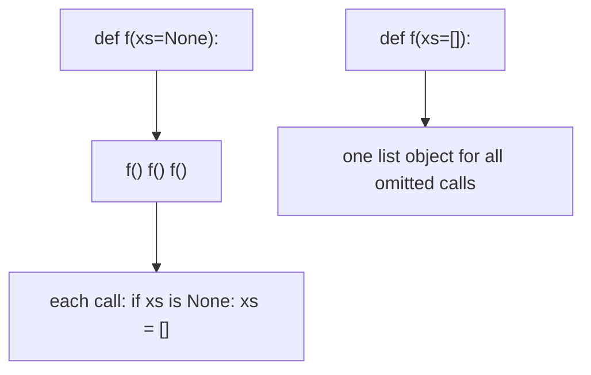
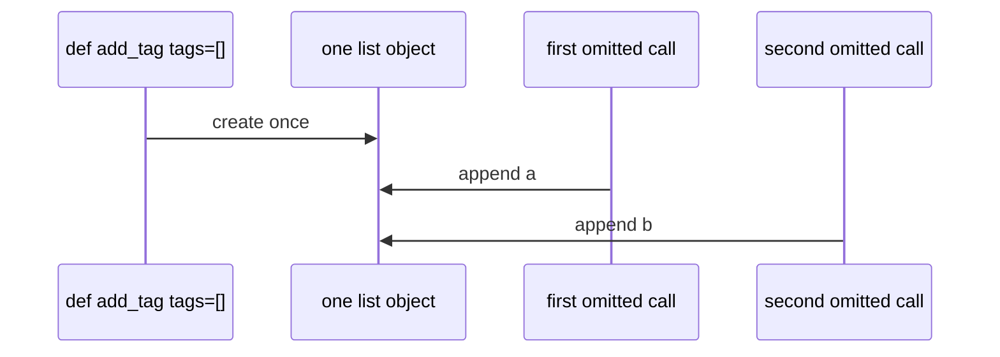

# Month 8 · Week 3 · Day 1
# Functions: Defaults, `*args`, `**kwargs`, and `return None`

**Program:** Full-Stack Mastery · 18 months  
**Phase:** 3 — Python and backend  
**Month index:** [../../README.md](../../README.md)  
**Week 3:** Day 1 (today) · [2](day-02.md) · [3](day-03.md) · [4](day-04.md) · [5](day-05.md) · [6](day-06.md) · [7](day-07.md)  
**Week rhythm today:** Learn + type-along  
**Student state:** Week 2 gate passed. You can transform lists of dicts. Today you **name recipes** properly — including the trap that has bitten every Python shop on Earth: **mutable default arguments**.  
**Study time:** 3–4 focused hours

**This week covers:** functions, modules, packages, exceptions, classes, composition.

Today: `def`, return values, `None`, defaults, the **`def f(x=[])` ban**, `*args` / `**kwargs`. Modules, exceptions, and classes are **Day 2**. Do not skip them.

Labs: `~\fullstack-lab\month-08\`. Project 5 is not this week.

---

## How to use this textbook

1. Read a section. Close it. Say it in Python words.
2. Type every lab. Do not paste.
3. Tracebacks from the bottom.
4. Optional review links later.

---

## How to read this chapter

A **function** is a named computation with parameters and an optional `return`. If you omit `return`, Python returns **`None`**. That is not JS `undefined` as a type you mention daily — it is the same *idea* (no value) with one object: `None`.

JavaScript `function f(x = [])` creates a **new** array **per call** when the argument is omitted (for that default expression, in modern JS). **Python evaluates default expressions once, at `def` time.** `def f(xs=[]):` reuses **one list** for every call that omits `xs`. That list grows forever. **NEVER** use a mutable default. This is not style. This is a language rule you must be able to teach.



---

## Today's contract

By the end of this day you will be able to:

1. Write `def` with parameters, keyword arguments, and `return`.
2. Explain that missing `return` means `None`.
3. Use `None` as a sentinel for “optional list/dict” and create a **new** mutable inside the body.
4. Use `*args` and `**kwargs` without making them your whole API.
5. Teach why `def f(x=[])` is forbidden.

**Today's gate**

> I can draw the mutable-default diagram. I never ship `[]` or `{}` as a default. Forgotten `return` is `None`, and `append` still returns `None`.

---

## Time box

| Block | Minutes | Work |
|---|---|---|
| A | 55 | Theory |
| B | 50 | Type-along: default trap + args |
| C | 70 | Independent: `textutil.py` + asserts |
| D | 20 | Git |
| E | 15 | Recall |

---

# Block A — Theory

## 1. `def` is a statement that binds a function object

```python
def greet(name):
    return f"Hello, {name}"

greet("Ada")       # "Hello, Ada"
```

The colon starts a block. Indent the body. There is no `function` keyword. There is no arrow `=>` required (Python has `lambda` for one expression — keep it tiny).

Call with **positional** args (`greet("Ada")`) or **keyword** args (`greet(name="Ada")`). You can mix: positionals first. `greet(name="Ada", "x")` is SyntaxError.

JS: `function greet(name) { return ... }` or `const greet = (name) => ...`. Python: indentation, `def`, `return`. No `{ }`. No `===` inside.

## 2. `return None` — explicit and implicit

```python
def ping():
    print("pong")
    # no return

x = ping()   # x is None
```

`print` returns `None`. `list.append` returns `None`. Chaining `xs.append(1).append(2)` is **AttributeError** (`None` has no `append`). JS `arr.push(1).toString()` is a different (also questionable) chain because `push` returns a number.

Use `return None` when you want to be obvious, or just `return`. Checking “did this fail?” with `if not result` is wrong when `result` can be `0` or `""`. Return a dedicated object, raise (Day 2), or return a tuple `(ok, value)`.

**Wrong belief:** “No return means the function didn’t run.”  
**Correct:** it ran and produced `None`.

## 3. Default arguments — evaluated once

```python
def connect(host, port=5432):
    return f"{host}:{port}"
```

`port=5432` is safe — `int` is immutable. Each omitted call uses `5432`. Fine.

```python
def add_tag(tag, tags=[]):  # NEVER
    tags.append(tag)
    return tags
```

Call `add_tag("ops")` twice. The **same** list gets two tags. Tests that call the function twice **share state**. This is the bug.

**Correct pattern:**

```python
def add_tag(tag, tags=None):
    if tags is None:
        tags = []
    tags.append(tag)
    return tags
```

Still: if the caller **passes** a list, you mutate **their** list. For a pure API, copy:

```python
def add_tag(tag, tags=None):
    base = [] if tags is None else tags.copy()
    base.append(tag)
    return base
```

`if tags is None` uses **`is`**, not `==`, and not `if not tags` (empty list is valid input).

**NEVER:** `def f(x=[])`, `def f(x={})`, `def f(x=set())`. Immutable defaults (`None`, `0`, `""`, `False`, `tuple()`) are OK.

**Wrong belief:** “I’ll use `[]` as default because JS does.”  
**Correct:** JS default `[]` is per-invocation for the default expression. Python’s is not. Different languages.

## 4. Keyword-only and positional-only (light)

```python
def clamp(n, /, low=0, high=100):
    ...
```

`/` means `n` is **positional-only** (3.8+). `*` means following args are **keyword-only**:

```python
def search(rows, *, query):
    ...
```

`search(rows, query="x")` works; `search(rows, "x")` TypeError. Use keyword-only when the boolean flag would be cryptic (`search(rows, True)`). Optional today; Project 5 may use keywords for CLI-ish functions.

## 5. `*args` and `**kwargs`

```python
def f(a, *args, **kwargs):
    ...
```

`*args` is a **tuple** of extra positional arguments. `**kwargs` is a **dict** of extra keyword arguments. Names `args`/`kwargs` are convention.

```python
def labeled(*parts, sep=" "):
    return sep.join(parts)

labeled("Harbor", "clinic")  # "Harbor clinic"
```

Forwarding:

```python
def wrapper(*args, **kwargs):
    return real(*args, **kwargs)
```

Decorators (Week 4) use this. Today: know the unpacking:

```python
xs = [1, 2, 3]
print(*xs)          # print(1, 2, 3)
d = {"name": "Ada"}
greet(**d)          # greet(name="Ada")
```

**Wrong belief:** “Every function should take `**kwargs` so it is flexible.”  
**Correct:** `**kwargs` hides typos (`titile=` swallowed). Prefer explicit parameters. Project 5 models have fields, not a junk drawer.

## 6. Scope (enough for this week)

Names assigned in a function are **local** unless you declare `global` / `nonlocal` (almost never in this course). Parameters are local. You may **read** globals (module-level `TAX = 0.1`) but rebinding them is a smell — pass arguments.

JS `let` block scope vs `var` is not Python. Python `if` bodies do **not** create a new scope for `x = 1` — `x` leaks to the function. Only functions, classes, and modules create scopes (comprehensions have their own loop scope). That surprises JS developers: `if True: y = 1` then `y` exists after the `if` in that function.

```python
def f():
    if True:
        y = 1
    return y  # OK in Python
```

**Wrong belief:** “`if` is a block scope like `let`.”  
**Correct:** function scope for assignments.

## 7. Docstrings

```python
def is_blank(s):
    """Return True if s is empty after strip."""
    return s.strip() == ""
```

First statement, string. `help(is_blank)` shows it. Project 5 public functions get one line at least.

---

# Block B — Type-along

```powershell
mkdir ~\fullstack-lab\month-08\week-03\day-01 -Force
cd ~\fullstack-lab\month-08\week-03\day-01
```

### B1 — The trap

`trap.py`:

```python
def add_bad(tag, tags=[]):
    tags.append(tag)
    return tags

print(add_bad("a"))
print(add_bad("b"))
```

Run. Write `TRAP.txt`: why the second print is not `["b"]`. Then write `add_good` with `None` sentinel. Prove two calls independent.

### B2 — forgotten return

`none_ret.py`: function that `print`s a label and does not return. Assign the call. Print `repr(x)`. Confirm `None`.

### B3 — *args

`join_parts.py`: `def join_parts(*parts, sep=", ")` returning `sep.join(parts)`. Call with three strings. Assert in comments what `parts`’s type is (tuple).

---

# Block C — Independent

`textutil.py`:

| Function | Spec |
|---|---|
| `is_blank(s)` | strip == `""` |
| `normalize(s)` | split/join |
| `add_item(item, items=None)` | **pure**: copy, append, never mutable default |
| `clamp(n, low=0, high=100)` | return n limited to [low, high]; keyword-capable |
| `format_line(*parts, sep=" \| ")` | join stringified parts |

`test_textutil.py`: two `add_item` calls without passing `items` must not share a list; `clamp(150)` is 100; `format_line("a", "b")` uses default sep; `is_blank("  ")`.

`SCOPE.txt`: one paragraph on `if` not creating a scope.

### Worked `clamp`

`clamp(150)` → 100. `clamp(-1)` → 0. `clamp(50)` → 50. `clamp(50, high=40)` → 40. Keyword `high=` must work. If `low > high`, you may raise `ValueError` or swap — **document**. Course preference: raise (invalid bounds are a programmer error).

### Worked `format_line`

`format_line("a", "b")` → `"a | b"` if sep default is `" | "`. `format_line("a", "b", sep="-")` → `"a-b"`. `parts` is a tuple. `sep.join(str(p) for p in parts)` if you allow ints — or require str. Document.

### The two-call test you must not skip

```python
x = add_item("a")
y = add_item("b")
assert x == ["a"]
assert y == ["b"]
assert x is not y
```

If this is missing, you did not test the trap.

**Wrong belief:** “I’ll use `xs or []` instead of `is None`.”  
**Correct:** empty list is valid input; `or []` replaces it with a new empty list (might be OK) but also treats it as missing. `is None` is the sentinel. Be precise.

```powershell
cd ~\fullstack-lab
git add month-08
git commit -m "Month 8 Week 3 Day 1: functions, None default sentinel."
```

---

# Block E — Recall

1. When are default expressions evaluated?
2. Why `if tags is None` not `if not tags`?
3. What does a function return if it ends without `return`?
4. Type of `args` in `*args`.
5. Why not `**kwargs` on every public function?

### JS contrast you must say aloud

`function f(xs = [])` in modern JS does **not** share one array across calls. Python `def f(xs=[]):` **does**. This is the most expensive translation of the month. `undefined` vs omitted arg in JS defaults; Python uses `None` as the explicit sentinel. `arguments` object vs `*args`. `this` is not today’s function model — no methods yet except you saw `append` as a method on lists.

`if` in JS with `let` is block-scoped. Python `if` does not create a function-local-only-if-you-assigned-inside-if... actually assignment in `if` is visible in the rest of the function. `SCOPE.txt` is not optional.

---

## Definition of done

- [ ] TRAP.txt explains the shared list
- [ ] `add_item` uses `None`, not `[]`
- [ ] Asserts prove two default calls are independent
- [ ] I can say `return None` vs forgotten return
- [ ] Commit exists

---

## Optional review links

Functions and defaults are explained in this chapter.

- [Python tutorial: Defining functions](https://docs.python.org/3/tutorial/controlflow.html#defining-functions)
- [Python FAQ: mutable defaults](https://docs.python.org/3/faq/programming.html#why-are-default-values-shared-between-objects)

---

## Tomorrow

Modules (`import`, `from x import y`), packages light, exceptions (`raise`/`except`/`else`/`finally`), custom exceptions, **no bare `except`**, classes (`self`, `__init__`), composition, when a class earns it.

### One more picture

`def f(a, b=1, *args, **kwargs)` — `a` required positional-or-keyword, `b` default, extra positionals in `args`, extra keywords in `kwargs`. If you also have a keyword-only after `*`: `def search(rows, *, query):`. Call `search(rows, query="x")`. That is how you stop `search(rows, True)` from meaning something mysterious. Project 5 public functions should be explicit more often than `**kwargs`.

`lambda` exists: `sorted(rows, key=lambda r: r["title"])`. Keep it one expression. A named `def title_of(row): return row["title"]` is easier to test. Do not nest lambdas. `print` is a function; `lambda` cannot contain statements. Week 2 `key=` is the honest use.

---

## Evaluation model (why the trap exists)

When Python executes `def add_tag(tag, tags=[]):`, it:

1. Evaluates `[]` **once**, creating one list object.
2. Stores that object on the function (`add_tag.__defaults__`).
3. On each call that **omits** `tags`, binds the parameter to that same object.

Calls that **pass** a list use the caller’s object. The trap is only the omitted path — which is exactly how tests call `add_tag("x")` twice.

JS `function add(tag, tags = [])` evaluates `[]` when the argument is **missing**, per call. Translating “defaults work like JS” is the bug.



Inspect in the REPL: after defining the bad function, `add_tag.__defaults__` shows the growing list. That is not a debugger trick. That is the language.

### `if tags is None` vs `if not tags`

| `tags` | `is None` | `not tags` |
|---|---|---|
| omitted → you set None then `[]` | True then new list | — |
| `[]` passed by caller | False — keep it | True — you would **replace** the caller’s empty list with a new one |
| `["ops"]` | False | False |

If the API is “omit means start fresh; pass means use/copy this list,” **`is None`** is the question. Truthiness mixes “missing” with “empty.” Week 1 `0 or 10` is the same family of bug.

### Forgotten return vs `return None`

```python
def label(n):
    if n % 15 == 0:
        return "FizzBuzz"
    if n % 3 == 0:
        return "Fizz"
    if n % 5 == 0:
        return "Buzz"
    # forgot return n
```

`label(1)` is `None`. Tests that `assert label(1) == 1` fail with AssertionError, not NameError. The function ran. It produced the empty object. Same as `print` and `append`.

**Wrong belief:** “I’ll write `function` and `=>`.”  
**Correct:** `def` and `return`. `lambda` only for a tiny `key=`.

### Keyword arguments and `clamp`

`clamp(50, high=40)` must work. `clamp(high=40, n=50)` works if `n` is not positional-only. Today you do not need `/`. You need to **call** with keywords in a test so you never think `clamp(50, 40)` means `high=40` without reading the signature (`50` is `n`, `40` is `low` — a bug). Prefer `clamp(50, high=40)` in tests.
