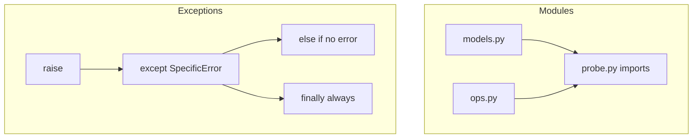

# Month 8 · Week 3 · Day 2
# Modules, Exceptions, and Classes (When They Earn It)

**Program:** Full-Stack Mastery · 18 months  
**Phase:** 3 — Python and backend  
**Month index:** [../../README.md](../../README.md)  
**Week 3:** [1](day-01.md) · Day 2 (today) · [3](day-03.md) · [4](day-04.md) · [5](day-05.md) · [6](day-06.md) · [7](day-07.md)  
**Week rhythm today:** Learn + type-along  
**Student state:** You can write `def` and you fear `def f(x=[])`. Today the program **splits files**, **fails on purpose**, and you learn **`self`** without turning every noun into a class.  
**Study time:** 3–4 focused hours

**This week covers:** functions, modules, packages, exceptions, classes, composition.

Today is the rest. Dataclasses get a **preview**; Week 4 implements them properly with hints.

---

## How to read this chapter

Three tools, one engineering idea: **put behavior in the right place, fail loudly when the program is wrong, fail clearly when the user is wrong.**

JavaScript: `export`/`import`, `throw`/`try/catch`, `class` with a weird `this`. Python: **modules are files**, `raise`/`except`, **`self` is explicit**. Bare `except:` swallows `KeyboardInterrupt` and bugs — **forbidden**.



---

## Today's contract

By the end of this day you will be able to:

1. `import x` and `from x import y` without `import *`.
2. Explain `__init__.py` as “this directory is a package” (light).
3. `raise` a specific exception; `except` it; use `else`/`finally`; **never** `except:`.
4. Write a small class with `__init__` and `self` **or** explain why a dict + functions was enough.
5. Prefer **composition** (object holds another object) over deep inheritance.

**Today's gate**

> I import from another file. I catch `ValueError`, not everything. I can explain `self`. I do not write a class for `is_blank`.

---

## Time box

| Block | Minutes | Work |
|---|---|---|
| A | 60 | Theory |
| B | 45 | Type-along: import, raise, tiny class |
| C | 70 | Independent: two modules + asserts |
| D | 20 | Git |
| E | 15 | Recall |

---

# Block A — Theory

## 1. Modules — a file is a namespace

`normalize.py` on `sys.path` (the script’s folder when you `py -3 probe.py`) is importable as `normalize`.

```python
import normalize
normalize.collapse("  a  b ")

from normalize import collapse
collapse("  a  b ")

import normalize as n
n.collapse("  a  b ")
```

**`import x`** binds the module object. **`from x import y`** binds `y` in your namespace. The second makes it less obvious where `y` came from if you overuse it. This course: `from models import Task` for types; `import json` for stdlib.

**Never `from module import *`.** It dumps names, breaks tooling, and hides origin.

`if __name__ == "__main__":` — `__name__` is `"__main__"` when the file is **run**, and the module’s name (`"normalize"`) when **imported**. Put scripts at the bottom; keep functions importable without running the probe.

Circular imports (`a` imports `b` imports `a`) are a design smell. Split a third module or use functions after both loaded. Day 4 will keep `models.py` free of CLI imports.

JS: `export function` / `import { collapse } from "./normalize.js"` — explicit paths and extensions. Python: **no path in the import name** for same-folder modules; the filesystem + `sys.path` is the map. Package layout later uses `src/`.

## 2. Packages — `__init__.py` light touch

A **package** is a directory of modules. An `__init__.py` file (even empty) marks it as a package in the traditional model. Namespace packages without it exist; this course: **put `__init__.py`** in `src/taskcli/` when you start Project 5 so the layout is obvious.

You do **not** need a package today. Two files in one folder is a module pair. Do not create six empty `__init__.py` files for a lab.

**Wrong belief:** “`__init__.py` is where all code goes.”  
**Correct:** it can re-export, or stay empty. Real code lives in named modules.

## 3. Exceptions — control flow for errors

**Raise** when this call cannot honor its contract:

```python
def letter(score):
    if not isinstance(score, int) or isinstance(score, bool):
        raise TypeError("score must be int")
    if score < 0 or score > 100:
        raise ValueError("score out of range")
    ...
```

`TypeError` — wrong type. `ValueError` — right type, bad value. `KeyError` — missing key. `FileNotFoundError` — missing file (Week 4). You may `raise ValueError("empty title")` with a message.

**Catch** what you can handle:

```python
try:
    n = int(raw)
except ValueError:
    n = None
else:
    # ran only if no exception in try
    pass
finally:
    # always — cleanup
    pass
```

`else` on `try` is “success path” — rare but readable. `finally` runs on success, failure, and `return` from `try`. Week 4 `with` often replaces `finally` for files.

**Catch specific types.** Multiple:

```python
except (TypeError, ValueError) as exc:
    raise  # or log and re-raise
```

`as exc` binds the instance. `raise` with no args **re-raises** the current exception (keeps traceback). `raise NewError from exc` chains (optional, good in libraries).

### Forbidden: bare `except`

```python
except:  # NEVER
    pass
```

Catches `SystemExit`, `KeyboardInterrupt`, memory errors, your bugs. Ctrl+C stops working. **`except Exception:`** is still broad — only at a CLI **edge** that logs and exits, not around every line. Prefer the type you expect.

**Wrong belief:** “I’ll wrap the whole program in try/except so it never crashes.”  
**Correct:** crashes with a traceback are how you find bugs. User-facing commands catch **validation** errors and print a sentence. Programmer errors (wrong types in your own code) should stay loud in tests.

JS: `throw new Error`, `catch (e)` catches everything. Python can do that with `except Exception` — still too wide in helpers.

### Custom exceptions

```python
class EmptyTitleError(ValueError):
    pass
```

Subclass a builtin (`ValueError`, `Exception`). Catch `EmptyTitleError` in the CLI layer; let it propagate in tests if you assert `pytest.raises` (Week 4) or `try`/`except` today.

Empty class with `pass` is enough until you need extra fields (`self.field = ...` in `__init__`).

## 4. Classes — `self` and `__init__`

A **class** is a type you define. An **instance** is one object of that type.

```python
class Counter:
    def __init__(self, start=0):
        self.value = start

    def inc(self):
        self.value += 1
```

**`self`** is the instance. You write it in the `def`; Python passes it when you call `c.inc()`. There is no magically bound `this` that changes with how you call (JS’s classic trap). `c.inc` is a bound method; `Counter.inc(c)` is the same.

`__init__` is **not** the constructor’s return — it **initializes** the already-created instance. Do not `return` a value from `__init__` (except `None`).

`@staticmethod` — a function on the class that **does not** take `self`. Rare. If you do not use `self`, it might belong as a **module function**. `@classmethod` takes `cls` — factories; optional this month.

**Wrong belief:** “Python is an OOP language so everything is a class.”  
**Correct:** Python is multi-paradigm. `is_blank` is a function. A `Task` with invariants might be a class or a **dataclass** (preview). A dict is enough for a throwaway record in a 20-line script.

### When a class earns it

| Situation | Tool |
|---|---|
| One function, no state | **function** |
| A bag of fields, little behavior | **dict** now, **dataclass** Week 4 |
| Invariants + methods that belong together (`Repository.save`) | **class** |
| “I might need inheritance later” | still **no** — YAGNI |
| `is_blank` | **function** |

## 5. Composition over inheritance

**Inheritance:** `class AdminTask(Task):` — “is-a.” Deep trees are JS/Java habits that hurt. **Composition:** `class Service: def __init__(self, repo): self._repo = repo` — “has-a.” Project 5: a CLI **has** a service; a service **has** a repository. Not `class CLI(Service, JSONFile, Logger)`.

One level of inheritance for **exceptions** (`EmptyTitleError(ValueError)`) is the usual exception.

## 6. Dataclass preview

```python
from dataclasses import dataclass

@dataclass
class Task:
    id: str
    title: str
    status: str = "open"
```

Week 4: you will mean this. Today: know it **generates** `__init__` and `__repr__` from fields, with **type hints**. Do not write a 40-line handwritten class that only stores fields if a dataclass would do. You may still use dicts this week.

## 7. JS `this` vs `self`

JS: `this` depends on call site unless you use arrows or bind. Python: `self` is a parameter. Methods listed in the class always receive the instance as the first argument. That explicitness is the point.

---

# Block B — Type-along

```powershell
mkdir ~\fullstack-lab\month-08\week-03\day-02 -Force
cd ~\fullstack-lab\month-08\week-03\day-02
```

### B1 — two files

`greet.py`: `def hello(name): return f"Hello, {name}"`  
`probe.py`: `from greet import hello` then print `hello("Ada")`.  
Run `py -3 probe.py` from **that folder**.

### B2 — raise/catch

`letter.py`: `letter(score)` raises `ValueError` if not 0–100, `TypeError` if not int (reject bool). `probe_letter.py` catches `ValueError` and prints `"bad"`. Do not `except:`.

### B3 — class vs function

`counter.py`: the `Counter` class above. `probe_counter.py`: two counters, `inc` one, prove independence.

Write `WHY_CLASS.txt`: why `Counter` earned a class (state that changes) and why `hello` did not.

---

# Block C — Independent

`validate.py` — functions: `require_title(s)` raises `ValueError` if blank after normalize; returns normalized title otherwise.

`models.py` — either a `Task` class with `__init__(self, id, title, status="open")` storing `self.id` etc., **or** a `make_task(...)` function returning a dict. Pick one and defend in `DESIGN.txt` (when the class would earn it — e.g. a method `is_open(self)`).

`test_day02.py` — `require_title("  ")` raises (use `try/except` and `assert False` if no raise, or a small helper). Import from the two modules.

No `except:`. No mutable defaults. No `import *`.

### Worked `require_title` raise test

```python
def test_blank_raises():
    raised = False
    try:
        require_title("  ")
    except ValueError:
        raised = True
    assert raised
```

If you `except Exception`, a bug inside `require_title` (NameError) still passes. Catch `ValueError`.

### `hello` vs `Counter` (the DESIGN.txt argument)

`hello` is a function: input name, output string, no memory between calls. `Counter` has `self.value` that **changes**. A dict `{"value": 0}` plus `def inc(c): c["value"] += 1` also works — then say why you still wrote a class (bound methods, future invariant) or why you would not.

### `try/else/finally` micro-lab (optional extra)

```python
try:
    n = int("3")
except ValueError:
    print("bad")
else:
    print("ok", n)
finally:
    print("always")
```

`else` runs because parse succeeded. `finally` always. If you `return` from `try`, `finally` still runs. Files: prefer `with` next week.

**Wrong belief:** “Custom exceptions are advanced.”  
**Correct:** `class EmptyTitleError(ValueError): pass` is six tokens of honesty for the CLI layer later.

```powershell
cd ~\fullstack-lab
git add month-08
git commit -m "Month 8 Week 3 Day 2: modules, exceptions, class vs function."
```

---

# Block E — Recall

1. `import x` vs `from x import y`.
2. Why bare `except` is banned.
3. `try`/`except`/`else`/`finally` roles.
4. What `self` is.
5. Composition in one sentence.
6. When `__init__.py` shows up.

### JS contrast you must say aloud

`export`/`import { f } from "./m.js"` vs `from m import f` (no `./`, no `.py` in the name for same-folder). `throw new Error` vs `raise ValueError("msg")`. `catch (e)` vs `except ValueError as e`. JS classes: `this.` everywhere; forget `this` and you hit globals. Python: forget `self` in `__init__` and you create a **local** that vanishes. `extends` vs composition — this course prefers has-a.

Bare `except` is worse than a wide JS `catch` because it includes `KeyboardInterrupt`. `except Exception` is closer to JS `catch` and still too wide inside helpers.

---

## Definition of done

- [ ] Cross-file import works
- [ ] Specific `except`, not bare
- [ ] DESIGN.txt defends class vs dict
- [ ] Custom or builtin raise for empty title
- [ ] Commit exists

---

## Optional review links

Modules, exceptions, and classes are explained in this chapter.

- [Python tutorial: Modules](https://docs.python.org/3/tutorial/modules.html)
- [Python tutorial: Errors](https://docs.python.org/3/tutorial/errors.html)
- [Python tutorial: Classes](https://docs.python.org/3/tutorial/classes.html)

---

## Tomorrow

From memory: functions + a raise + an import. Days 1–2 closed during drills. Repair from **those files in this book**.

### One more picture

`raise ValueError("empty title")` from `require_title`. CLI later: `except ValueError as e: print(e); sys.exit(1)`. Tests: expect `ValueError`, not `sys.exit`. If you `sys.exit` inside `require_title`, tests become process-killers. Exit at the edge only. That is composition of **layers**, not of classes.

---

## Exception hierarchy (enough to ban bare except)

```text
BaseException
  ├── SystemExit          (sys.exit)
  ├── KeyboardInterrupt   (Ctrl+C)
  └── Exception
        ├── ValueError
        ├── TypeError
        ├── KeyError
        └── ... your subclasses
```

**`except:`** (bare) catches **BaseException** — including Ctrl+C and `sys.exit`. The program becomes hard to stop. **`except Exception:`** catches bugs and ValueError together — still too wide in helpers. **`except ValueError:`** is the usual validation catch.

JS `catch (e)` is closer to `except Exception`. Python lets you be precise. Use that.

### `else` on `try` (rare, know it)

```python
try:
    n = int(raw)
except ValueError:
    print("not a number")
else:
    print("got", n)
```

`else` runs when **no** exception happened in `try`. It avoids catching errors from the success path if that path were inside `try`. Prefer a small `try` that only wraps `int(raw)`.

`for`/`else` from Week 1 is a different `else`. Do not mix the stories.

### `self` forgotten in `__init__`

```python
def __init__(self, id, title):
    id = id          # local, thrown away
    self.title = title
```

`Note("n1", "Harbor").id` is AttributeError. JS `this.id = id` forgotten binds a global or throws in strict mode. Python: you created a local. Tests: `assert note.id == "n1"`.

### Import execution

Importing `models.py` runs it once (cached in `sys.modules`). Top-level `print("loading")` will spam tests. Keep module level for imports, class/function defs, and constants — not probes.

**Wrong belief:** “`from models import Note` copies the class into ops, then models can import ops.”  
**Correct:** both modules still execute; a cycle at import time is a design smell. Models do not import ops.

### `@staticmethod` in one paragraph

A method that does not use `self` or `cls` is a function wearing a costume. Put it at module level. `@classmethod` factories (`Note.from_dict`) can wait until Week 4 `item_from_dict` as a **function**. You may write `from_dict` as a function today.
