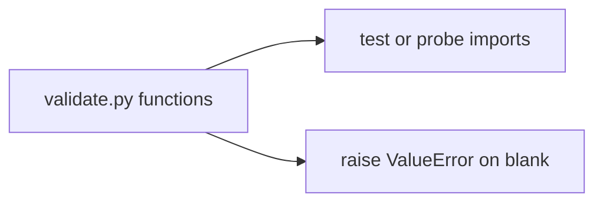

# Month 8 · Week 3 · Day 3
# From Memory: Functions, Imports, and Errors

**Program:** Full-Stack Mastery · 18 months  
**Phase:** 3 — Python and backend  
**Month index:** [../../README.md](../../README.md)  
**Week 3:** [1](day-01.md) · [2](day-02.md) · Day 3 (today) · [4](day-04.md) · [5](day-05.md) · [6](day-06.md) · [7](day-07.md)  
**Week rhythm today:** Implement from memory  
**Study time:** 3–4 focused hours  
**Days 1–2 of this week:** closed during the drills. Repair from **those day files in this textbook**.

---

## How to read this chapter

This recap **is** the lesson. Rebuild a tiny two-file program with a **raise** and a **None default sentinel**.



Allowed: this file, notes, traceback.  
Not allowed: paste Day 1–2, `except:`, `def f(xs=[])`, `import *`.

Stuck 25 minutes: open Day 1 or Day 2 **section**, close it, continue. `lookups.txt`.

---

## Complete explanation (functions + modules + errors)

### Functions

`def name(params):` indented body. Missing `return` → `None`. `append`/`sort`/`print` return `None`.

Defaults evaluated **once** at `def` time. **Never** `[]` / `{}` / `set()` as defaults. Use `None` and `if xs is None: xs = []`. Use `is None`, not `if not xs`. Copy if the API must not mutate the caller.

That sentence is the whole trap. Python executes the `def` line **once** when the module loads. The object that is `[]` is created then. Every later call that omits the argument receives **that** object. JavaScript evaluates `function f(xs = [])` **per omitted call**. Translating JS into Python here is a production bug. Today’s warm-up exists so you see it, not so you can claim you “know about it.”

`*args` tuple, `**kwargs` dict. Do not hide a real API behind kwargs.

Assignments in `if` are still function-scoped (no `let` block).

### Modules

Same folder: `from validate import require_title`. `import validate` then `validate.require_title`. `if __name__ == "__main__":` for probes. No `import *`. Packages: directory + `__init__.py` later; not required for two files.

Import **executes** the module once. Prints at module level run on import. Keep `validate.py` as functions only. Put prints in `probe.py`. `ModuleNotFoundError` is a `cd` problem until it is a filename typo. Run tests from the folder that contains `validate.py`.

### Exceptions

`raise ValueError("msg")`. `try` / `except ValueError:` / `else` / `finally`. Catch **specific** types. Bare `except` banned. `except Exception` only at a true edge. Custom: `class EmptyTitleError(ValueError): pass`.

User mistakes (empty title) → your `ValueError`. Programmer mistakes (passing a list as title) → `TypeError` or let it fail.

Bare `except` catches `KeyboardInterrupt`. Ctrl+C then looks like a hang or a swallowed error. That is why it is banned even in a probe. Probe may `except ValueError`. TypeError on `require_title(1)` should crash probe or be a separate `except TypeError` — do not swallow it as `"caught"` if you only meant blank titles.

### Classes

`self`, `__init__`. Methods need `self`. A class **earns** it when there is state + invariants. `is_blank` stays a function. Composition: hold a repo object; do not inherit JSONFile.

Dataclass preview: generated `__init__` from fields — Week 4.

`@staticmethod` rare; prefer module functions.

### Week 2 still true

Dict `get` vs `[]`, comprehensions, no `range(len)` without cause.

### Week 1 still true

`==`, `strip`, `elif`, TypeError `"3"+1`.

**Wrong belief:** “I’ll catch Exception around every function.”  
**Correct:** tests should see ValueError. Catch at the printer, not in the core.

**Wrong belief:** “I’ll `return None` for blank title so I don’t have to learn raise.”  
**Correct:** Day 4’s missing id will raise. Practice raise today. `None` as “missing title” collides with forgotten `return`.

**Wrong belief:** “I’ll `except Exception` in probe so it never crashes.”  
**Correct:** probe may catch `ValueError` only. Let TypeError crash probe — that is a programmer error.

---

## Today's contract

**Today's gate**

> Two files, an import, `require_title` raises on blank, `add_item` has no mutable default, asserts pass.

---

## Time box

| Block | Minutes | Work |
|---|---|---|
| A | 25 | Speak first |
| B | 35 | Warm-up: predict the trap |
| C | 90 | Spec: `validate.py` + `probe.py` + tests |
| D | 20 | Git + lookups |

---

# Block A — Speak first

1. When are defaults evaluated?
2. Bare `except` — what does it catch that you hate?
3. `import m` vs `from m import f`.
4. Why `is_blank` is not a class.
5. `self` in one sentence.
6. Forgotten `return`.

If (1) is “every call,” you still believe JavaScript. Re-read the defaults paragraph. Do not start the spec yet.

---

# Block B — Warm-up

`warm.py`: write `add_bad` with `tags=[]` (on purpose). Call twice. Print both results. Then write `add_ok` with `None`. `PREDICT.txt` / `ACTUAL.txt` for the bad version.

First omitted call should print one tag. Second omitted call on the **bad** version prints both tags. `a is b` may be True. That shared object is `__defaults__`. The good version prints independent lists.

---

# Spec

`~\fullstack-lab\month-08\week-03\day-03\`

**`validate.py`**

- `normalize(s)` 
- `require_title(s)` — if not `str`, `TypeError`; if blank after normalize, `ValueError`; else return normalized
- `add_tag(tag, tags=None)` — pure copy-append, `None` sentinel

**`probe.py`**

- imports `require_title`
- prints a good title
- `try/except ValueError` around a blank title; prints `"caught"`

**`test_validate.py`**

- good title
- blank raises (try/except pattern: set `raised = False`, except set True, assert raised)
- `"  hi  "` returns `"hi"`
- two `add_tag("x")` default calls: results independent (`["x"]` each, not `["x","x"]`)
- `require_title(1)` TypeError

No classes required today unless you want a custom `EmptyTitleError` — then catch that.

### Worked `require_title`

| Input | Result |
|---|---|
| `"Harbor"` | `"Harbor"` |
| `"  Harbor  "` | `"Harbor"` after normalize |
| `"   "` | `ValueError` |
| `""` | `ValueError` |
| `1` | `TypeError` |
| `None` | `TypeError` (not a str; do not call `.strip` on None — that is AttributeError if you forget the type check) |

Check **type first**, then normalize, then blank. If you `s.strip()` on `None`, the traceback says AttributeError, not TypeError. Tests should expect TypeError for `None` if that is your contract — then you must check type first.

You may retype this from **this** page (Days 1–2 stay closed):

```python
def require_title(s):
    if not isinstance(s, str) or isinstance(s, bool):
        raise TypeError("title must be str")
    text = " ".join(s.split())
    if text == "":
        raise ValueError("blank title")
    return text
```

`bool` is not a `str`, so the bool check is extra caution. `True` as title must not become `"True"` via `str(True)` either — do not stringify to “fix” types.

### Worked `add_tag` independence

```python
a = add_tag("ops")
b = add_tag("lab")
assert a == ["ops"]
assert b == ["lab"]
```

If you used `tags=[]`, `b` is `["ops", "lab"]` and `a is b` may be True. Assert `a is not b` as well as value equality.

Copy-append: `base = [] if tags is None else tags.copy()` then `base.append(tag)`. If the caller passes a list, **their** list stays unchanged (pure). Test that: `src = ["x"]; add_tag("y", src); assert src == ["x"]`.

### Probe vs tests

`probe.py` catching ValueError and printing `"caught"` is a demo. `test_validate.py` is the claim. If probe looks right and tests are missing the two-call default case, you have not finished Day 3.

`lookups.txt` if you opened Day 1–2. Tomorrow’s lab uses two modules; a mushy default trap will poison `add(rows=None)` if you write it.

### `if __name__` not required on validate.py

If you put `print(require_title("x"))` at module level, importing for tests will print. Keep side effects in `probe.py`. Functions only in `validate.py`.

JS: `export` does not run extra prints unless you wrote them at top level too — same trap. Python import executes the module once.

```powershell
py -3 test_validate.py
git add month-08/week-03/day-03
git commit -m "Month 8 Day 3: validate module from memory."
```

Do not start Project 5. Do not write a CLI. Two modules and a raise are the day.

---

# Lecture: type first, then normalize, then blank

`require_title(None)` must be TypeError. If you call `.split()` first, you get AttributeError and the test that expected TypeError fails for the wrong reason. Programmer mistakes are types. User mistakes are blank strings. Those are different exceptions on purpose.

`require_title` returns the normalized string. It does not print. It does not return `""` as a cute error code. Empty string is a value; tests would confuse it with success. Raise.

`add_tag` is the default trap in a costume. Omitted `tags` → new list per call (`None` sentinel, `is None`, then `[]`). Passed list → **copy** then append, so the caller’s list stays. Tests: two default calls independent (`a is not b`), and `src` unchanged. A test that only uses the default path misses mutation of a passed list.

`probe.py` may catch `ValueError` and print `caught`. That is a demo. `test_validate.py` is the claim. Probe must not `except:`. Probe must not catch TypeError as `"caught"` if you only meant blank titles.

Import executes the module. Prints in `validate.py` run when tests import. Keep functions quiet. `from validate import require_title`. Run from the folder. `ModuleNotFoundError` → `cd`.

`is_blank` is a function. A class with one method is a costume. `self` is the first parameter; forget it and you assign locals. You do not need a class today unless you want `EmptyTitleError`.

Defaults are **once**. If you still say “every call,” you are teaching JavaScript. Stay on the warm-up until ACTUAL shows the shared list.

Do not start Project 5. Two files and a raise are the day.

---

## Definition of done

- [ ] Import across files
- [ ] ValueError on blank
- [ ] Mutable default not used in `add_tag`
- [ ] Asserts exit 0
- [ ] Commit exists

---

# Worked session — two files, one raise, no shared list

Type `require_title` with type check first. Type `add_tag` with `tags=None`, `is None`, copy. Type tests: good title, blank raises, `"  hi  "` → `"hi"`, two default `add_tag` calls independent, passed list unchanged, `require_title(1)` TypeError.

Warm-up `add_bad` with `tags=[]` is on purpose. PREDICT the shared list. ACTUAL must match. Then `add_ok`. If both versions behave the same, you did not actually use `[]` as the default on the bad one.

`probe.py` imports and prints `"caught"` on ValueError only. `validate.py` stays quiet. `py -3 test_validate.py` from `day-03`. `lookups.txt` if you peeked. No CLI. No Project 5.

If `require_title(None)` is AttributeError, you stripped first. If `a is b` after two default `add_tag` calls, you used `[]`. If tests print titles, you left a `print` at module level.

---

## Optional review links

Functions, imports, and errors are explained in this chapter. These pages are for later checking, not for first learning.

- [Defining functions](https://docs.python.org/3/tutorial/controlflow.html#defining-functions)
- [Modules](https://docs.python.org/3/tutorial/modules.html)
- [Errors](https://docs.python.org/3/tutorial/errors.html)

---

## Tomorrow

Multi-file lab: `models.py` + functions (and maybe a tiny `ops.py`). Still not Project 5.

### Common mistakes today

| Mistake | Fix |
|---|---|
| `def add_tag(tag, tags=[])` | `None` sentinel + copy |
| `except:` in probe | `except ValueError` |
| `require_title(None)` calling `.strip` | type check first |
| prints inside `validate.py` | return; probe prints |
| two default calls sharing a list | assert `x is not y` |

`require_title` must not `print`. `add_tag` must not use `[]` as a default. Probe may print. Tests import functions. That three-file split is Day 4’s rehearsal.

`add_tag("x", tags=["keep"])` must not mutate `["keep"]` if you copied. A test that only uses the default path can miss mutation of a passed list. Cover both: omitted `tags`, and passed list unchanged.

---

# Closing lecture — raise, sentinel, quiet module

`require_title` raises. It does not return `None` or `""` as an error code.
Type first, then normalize, then blank. `None` must be TypeError, not AttributeError.

`add_tag` uses `tags=None`. `is None`. New list or copy.
Two default calls are independent. A passed list stays unchanged.
Warm-up `add_bad` with `tags=[]` must show the shared list.
If bad and good behave the same, you did not actually use `[]`.

`validate.py` is quiet. `probe.py` prints. Tests import functions.
Bare `except` is banned in probe. Catch `ValueError` only.
`py -3 test_validate.py` from `day-03`. `cd` or `ModuleNotFoundError`.

No `import *`. No class for `is_blank`. No Project 5.
Tomorrow’s two-module lab assumes this split is in your fingers.
`require_title` must not `print`. Probe may print. Tests assert.
`add_tag("x", tags=["keep"])` must not mutate `["keep"]`.
Cover both paths: omitted tags, and passed list unchanged.
If `a is b` after two default calls, you still have the shared list.


## Recite-back checklist (close the editor, then tick)

Write `RECITE.txt` with one honest sentence per line.
If a line is mush, re-read the matching section in **this** file only.

- [ ] defaults evaluated once, at `def`
- [ ] `None` sentinel + `is None`
- [ ] type check before `.split`
- [ ] ValueError blank; TypeError non-str
- [ ] two default `add_tag` calls independent
- [ ] passed list not mutated
- [ ] probe catches ValueError only
- [ ] `validate.py` has no module-level prints

`py -3 test_validate.py`. Warm-up ACTUAL shows the shared list on `add_bad`.
No Project 5. Two files and a raise are the exam.
