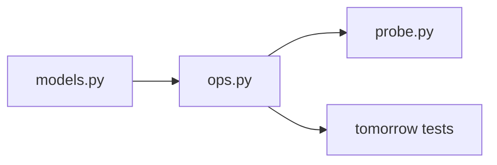

# Month 8 · Week 3 · Day 4
# Lab: `models.py` + Functions (Multi-File)

**Program:** Full-Stack Mastery · 18 months  
**Phase:** 3 — Python and backend  
**Month index:** [../../README.md](../../README.md)  
**Week 3:** [1](day-01.md) · [2](day-02.md) · [3](day-03.md) · Day 4 (today) · [5](day-05.md) · [6](day-06.md) · [7](day-07.md)  
**Week rhythm today:** Add a real lab feature  
**Study time:** 3–4 focused hours  
**Prereq:** Day 3 gate. You can import, raise `ValueError`, and avoid mutable defaults.

This is **not** Project 5. The folder is a **sketch** of `models` + operations. You will not implement argparse, JSON persistence, or a complete CLI. You **will** split types from functions the way the Project 5 spec’s example tree suggests (`models.py` next to operations) — **ideas**, not source to copy from a product.

---

## How to read this chapter

One file that both defines a Task and prints a menu will become untestable. Today:

- **`models.py`** — what a record is (class **or** dataclass preview **or** constructor function).
- **`ops.py`** — add / get / list as **functions** that take a list (or a small `Store` class if you can defend it).
- **`probe.py`** — prints; imports; no business logic beyond glue.



Composition: if you write `class Store:`, it **has** a list (`self._rows`), it **is not** a subclass of `list`.

---

## Today's contract

1. At least **two** importable modules plus a probe.
2. Invalid title **raises** (specific type). Missing id **raises** (`KeyError` or custom `NotFoundError`).
3. No mutable defaults. No `except:`. No `import *`.
4. `ops` functions do not `print` as their only interface — they **return**.

**Today's gate**

> `py -3 probe.py` shows a list after add. `require`/`add` is testable without the probe. I can point at which file owns the record shape.

---

## Time box

| Block | Minutes | Work |
|---|---|---|
| A | 45 | Theory: layering, NotFound, Store vs list |
| B | 40 | Type-along: three files hello |
| C | 90 | Spec: clinic notes mini-store |
| D | 20 | Git |
| E | 15 | Recall |

---

# Block A — Theory

## 1. What `models.py` is for

A **model** is the shape of data plus cheap invariants (id is str, title non-blank). It is not the CLI. It is not JSON.

**Option A — functions + dict** (honest for small labs):

```python
def make_note(id, title, status="open"):
    title = require_title(title)
    return {"id": id, "title": title, "status": status}
```

**Option B — class:**

```python
class Note:
    def __init__(self, id, title, status="open"):
        self.id = id
        self.title = require_title(title)
        self.status = status
```

**Option C — dataclass preview:**

```python
from dataclasses import dataclass

@dataclass
class Note:
    id: str
    title: str
    status: str = "open"
```

Then **still** validate title in a factory `note_from_input(...)` because dataclass will happily store `"  "`. Invariants belong in a function or `__post_init__` (Week 4). If you use Option C today, add `__post_init__` that raises on blank **or** keep validation in `ops.add`.

Pick **one**. Write `DESIGN.txt` why. “I wanted to practice class” is valid if `Note` has at least one method (`is_open`) — otherwise you practiced typing `self` for no gain.

## 2. What `ops.py` is for

```python
def add(rows, note):
    if any(r["id"] == note["id"] for r in rows):  # or r.id
        raise ValueError("duplicate id")
    return rows + [note]
```

If `Note` is a class, use attributes. Do not mix `note["id"]` and `note.id` without a rule.

`get(rows, id)` — find or raise `KeyError(id)` / `NotFoundError`. Do not return `None` **and** raise in different functions without documenting. This lab: **raise** on missing (matches “missing record” later in Project 5 tests).

`list_open(rows)` — comprehension.

Pass `rows` in. A `Store` class is composition:

```python
class Store:
    def __init__(self):
        self._rows = []

    def add(self, note):
        self._rows = add(self._rows, note)  # reuse function
```

That is optional. Functions + a list in `probe` are enough. If you write `Store`, tests can still call **functions** with a list — easier.

## 3. Custom exceptions module? Optional

`class NotFoundError(LookupError): pass` in `models.py` or `errors.py`. Catch in probe: print `"not found"`. Tests: expect raise.

## 4. JS contrast

JS modules: `export` at the bottom, `import` with `./file.js`. Python: file name is the module. JS `throw` / `catch (e)`. Python named types in `except`. JS classes: `this`. Python: `self`. JS often uses plain objects; so should you until a class earns it.

---

# Block B — Type-along

Three files `a.py` (`def f(): return 1`), `b.py` (`from a import f` plus `def g(): return f() + 1`), `c.py` prints `g()`. Run `c.py`. Confirm import chain.

---

# Block C — Spec

`~\fullstack-lab\month-08\week-03\day-04\`

Clinic **notes** (not the full task CLI):

| Field | Rule |
|---|---|
| id | str, non-blank |
| title | normalize; blank → `ValueError` |
| status | `"open"` or `"done"`; else `ValueError` |

Operations:

| Function | Behavior |
|---|---|
| `add(rows, note)` | duplicate id → `ValueError`; return new list |
| `get(rows, id)` | missing → `NotFoundError` or `KeyError` |
| `complete(rows, id)` | return new list with that note done; missing raises |
| `search(rows, q)` | Week 2 rules; blank → `[]` |

`probe.py`: build `rows = []`, add two notes, print titles, `try` get missing, print caught. Optional text menu as **comments** listing future CLI verbs (`create`, `show`, `complete`) — do not parse argv.

`README.md`: how to run probe; which option A/B/C; that JSON/CLI wait.

`HABITS.txt`: no mutable default on `add`’s list — the list is passed in, not defaulted. If you write `def add(rows=None)`, use the sentinel correctly **and** prefer requiring `rows`.

### Worked `get` missing

Empty `rows`, `get(rows, "nope")` raises. Probe catches and prints `"not found"`. Tests do not use probe; they expect the exception.

### Status validation

`status="Open"` is invalid if you only allow `"open"`/`"done"` (`==`, case-sensitive). Document. Convert at the CLI later, not silently in `make_note` unless you say so.

### Import direction

`ops.py` may import `models`. `models.py` must **not** import `ops` or `probe`. `probe` imports both. A cycle means you stuffed CLI into models.

**Wrong belief:** “One class `App` with everything.”  
**Correct:** two files is the lab. Project 5 will grow files, not a god class.

### Worked `add` duplicate and purity

`rows = [make_note("n1", "Harbor")]`. `add(rows, make_note("n1", "Yard"))` raises ValueError. `rows` still length 1. `add(rows, make_note("n2", "Yard"))` returns length 2; `rows` still length 1.

If `Note` is a class, compare `note.id` (attribute). If dict, `note["id"]`. Mixing both in `ops.py` is how you get TypeError on one path and KeyError on the other.

### Worked `complete`

Find the note, build a **new** note/dict with `status="done"`, return a new list: other notes the same objects or copies — **document**. Mutating `note.status` in place means `rows` already shows done. Then purity tests fail (or you silently changed the spec). Prefer `{**note, "status": "done"}` for dicts (3.5+ unpack; 3.9+ `note | {"status": "done"}`).

### Custom `NotFoundError`

```python
class NotFoundError(LookupError):
    pass
```

`LookupError` is the builtin family that includes `KeyError` and `IndexError`. Catch `NotFoundError` in probe. Tests catch the same type. Do not catch `Exception`.

### Text menu as comments

```text
# later CLI verbs (not implemented):
# create, show, complete, search
```

Printing a numbered menu and `input()` is still untestable. Skip it. Probe calls functions with literals.

### Import graph (draw in README)

```text
probe.py → ops.py → models.py
test_*.py → ops.py → models.py
```

`models.py` has zero imports from ops/probe. Cycle = you put CLI in the model.

**Wrong belief:** “I’ll `class Store(list):` so I get append for free.”  
**Correct:** you inherit a pile of methods you do not want (`sort` in place, `+` concatenation surprises). Composition: `self._rows = []`.

```powershell
git add month-08
git commit -m "Month 8 Week 3 Day 4: models.py plus ops functions."
```

---

# Block E — Recall

1. Why models should not import probe.
2. Raise vs return `None` for missing id (this lab’s choice).
3. Composition vs inheriting `list`.
4. Where validation lives if you use a dataclass.

### JS contrast you must say aloud

`export` in `models.js` vs a file named `models.py`. `throw` vs `raise`. A JS class `extends Array` is the same smell as `class Store(list)`. Plain objects vs dicts vs dataclasses — pick one per module and stick to it in the lab. Tomorrow tests import `ops`, not `probe`.

---

## Definition of done

- [ ] `models.py` and `ops.py` exist
- [ ] probe imports them
- [ ] duplicate id and blank title raise
- [ ] missing get raises
- [ ] DESIGN.txt or README names option A/B/C
- [ ] Commit exists

---

## Optional review links

- [Modules](https://docs.python.org/3/tutorial/modules.html)
- [dataclasses (preview)](https://docs.python.org/3/library/dataclasses.html)

---

## Tomorrow

Tests for raise/not-found/duplicate, plus a mutation/purity check on `add`.

---

## Layering picture you must draw in README

```text
probe.py     prints, catches ValueError/NotFoundError at the edge
   │
ops.py       add / get / complete / search  — return or raise
   │
models.py    make_note / Note / require_title — shape + cheap invariants
```

Arrows go **down**. `models.py` does not import `probe`. That is the Project 5 sketch (`cli` → `services` → `models`/`repository`) without JSON and without argparse.

### Status values

Only `"open"` and `"done"` (`==`). `"Open"` is invalid. Convert at a later CLI edge if operators type capitals — not silently in `make_note` unless DESIGN.txt says you casefold. Tests should include `"Open"` → ValueError if you stay case-sensitive.

### Id non-blank

`id=""` or `id="  "` should ValueError if you normalize ids. Document. `"0"` is a valid id string (not integer 0). Do not `if not id:` without strip — wait, empty is falsy; `"0"` is truthy. Still prefer `require_title`-style normalize for ids or a `require_id`.

### What not to build

- `argparse`
- JSON files
- `input()` menu loop
- `class App(Store, Note)`
- `except:`

Two modules + probe is the lab. A third `errors.py` for `NotFoundError` is optional and honest.

**Wrong belief:** “I’ll return None from get so probe can if-not.”  
**Correct:** this lab raises on missing. `None` collides with forgotten return. Tests expect an exception type.

---

## `make_note` worked table

| Call | Result |
|---|---|
| `make_note("n1", "Harbor")` | note/dict id n1, title Harbor, status open |
| `make_note("n1", "  Harbor  ")` | title normalized |
| `make_note("n1", "  ")` | ValueError |
| `make_note("n1", "Harbor", status="done")` | done |
| `make_note("n1", "Harbor", status="Open")` | ValueError if case-sensitive |
| `make_note("", "Harbor")` | ValueError if you require id |

Probe: add n1 Harbor, add n2 Yard, print titles via a function that **returns** titles (comprehension), try `get(rows, "nope")`, print `"not found"`. Duplicate add n1 → caught ValueError.

`HABITS.txt`: no mutable default on `def add(rows=None)` — pass `rows` in. No `import *`. No `except:`. No `===`. No `this`. `self` only if you chose a class.

If `ops.py` `print`s inside `add`, tests become string scraping. Return the list. Probe prints.

---

## Composition vs inheritance (write in DESIGN.txt)

`Store` **has** `self._rows: list`. Methods call module functions or inline the same logic. `class Store(list)` would make `store.sort()` in-place a public accident. Project 5 `JsonStore` **has** a `Path`, not a list subclass.

If you chose Option A (dict + `make_note`), DESIGN.txt says when you would upgrade to a dataclass (Week 4: generated `__init__`/`__eq__`, `default_factory` for tags). If you chose a class with only stored fields and no methods, admit it was practice — `is_open(self)` would have earned the class.

Tomorrow tests import `ops`, not `probe`. If probe is the only way you know it works, you are not done.

---

## Typed lab reminder (Windows)

```powershell
cd ~\fullstack-lab\month-08\week-03\day-04
py -3 probe.py
```

No `uv` required this week. No `pip install`. Stdlib only. If `from ops import add` fails, you are in the wrong directory or the file is named `op.py`.

`True` as a title or status must not sneak through `isinstance(..., str)` — bool is not str. `qty=True` is next week’s independent; today titles are strings.

Git: commit `models.py`, `ops.py`, `probe.py`, README, DESIGN.txt, HABITS.txt. Do not commit `__pycache__`.

Relative nav: [Day 3](day-03.md) · [Day 5](day-05.md) · [Week 3](day-01.md) · [Month 8](../../README.md).
