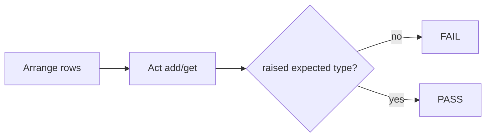

# Month 8 · Week 3 · Day 5
# Tests for Raises, Imports, and Purity

**Program:** Full-Stack Mastery · 18 months  
**Phase:** 3 — Python and backend  
**Month index:** [../../README.md](../../README.md)  
**Week 3:** [1](day-01.md) · [2](day-02.md) · [3](day-03.md) · [4](day-04.md) · Day 5 (today) · [6](day-06.md) · [7](day-07.md)  
**Week rhythm today:** Tests + refactor + documentation  
**Study time:** 3–4 focused hours  
**Student state:** You have `models.py` + `ops.py`. Today you **claim** raises and non-mutation. pytest.raises is Week 4; you can still test exceptions honestly.

---

## How to read this chapter

A test for `raise` that never runs the `except` can pass by accident. Use a **flag** or `pytest.raises` if available. A test that only runs `probe.py` is not a test.



---

## Today's contract

1. Assert blank title raises `ValueError` (or your custom subclass).
2. Assert missing id raises.
3. Assert duplicate id raises.
4. Assert `add` does not mutate the input list.
5. Refactor one name; tests stay green.

**Today's gate**

> I can make a raise-test fail by changing `ops.py`, see the traceback from the bottom, and restore.

---

## Time box

| Block | Minutes | Work |
|---|---|---|
| A | 40 | Theory: testing exceptions |
| B | 40 | Red/green on one raise |
| C | 80 | Full tests + refactor |
| D | 20 | Git |
| E | 15 | Recall |

---

# Block A — Theory

## 1. Testing that something raises (no pytest yet)

```python
def test_blank_title_raises():
    raised = False
    try:
        require_title("  ")
    except ValueError:
        raised = True
    assert raised is True
```

If `require_title` **returns** instead of raising, `raised` stays False, assert fails. Good.

Tighter: `except ValueError as exc: assert "title" in str(exc).lower()` — optional message contract.

If the wrong type raises (`TypeError` instead of `ValueError`), this test fails (flag False) — also good if you expected ValueError. Add a second test for TypeError on `require_title(1)`.

**Do not** `except Exception: raised = True` — that accepts KeyboardInterrupt in theory and hides bugs.

## 2. `pytest.raises` preview

```python
import pytest

def test_blank():
    with pytest.raises(ValueError):
        require_title("  ")
```

`with` is a **context manager** (Week 4). If you have pytest, you may use this. If not, use the flag pattern. Document in `TEST.md`.

## 3. Import the code under test

`from ops import add, get`  
`from models import make_note` (or `Note`)

Run from the folder that contains the modules. `ModuleNotFoundError` → `cd`.

## 4. Purity

```python
rows = [make_note("1", "Harbor")]
before = list(rows)  # new list, same note objects
out = add(rows, make_note("2", "Yard"))
assert rows == before
assert len(out) == 2
```

`list(rows)` is a shallow copy of the list. Enough to detect `append` on `rows`.

## 5. `complete` returns new rows

Snapshot statuses; act; input unchanged; output has `done`.

## 6. JS contrast

`assert.throws(() => letter("90"))` in Node. Python: try/except flag or `pytest.raises`. Same idea: the **claim** is the exception type.

---

# Block B — Type-along

Copy day-04 modules into `~\fullstack-lab\month-08\week-03\day-05\` (self-contained).

Write `test_blank.py` with one raise test. Temporarily make `require_title` return `""` on blank. Run. Save `RED.txt`. Restore. Green.

---

# Block C — Independent

`test_ops.py` required cases:

| Test | Claim |
|---|---|
| add success | length +1, input unmutated |
| duplicate | ValueError |
| get missing | NotFoundError or KeyError |
| get hit | title matches |
| blank title | ValueError |
| bad status | ValueError |
| search blank | `[]` |
| complete missing | raises |

`TEST.md` run command.

Refactor: if `add` and `complete` both scan for id, extract `_index(rows, id)` that raises NotFound — **or** leave two loops if extraction makes you nervous. Tests protect you.

### How a flag test lies if you catch too wide

```python
try:
    get(rows, "missing")
except Exception:
    raised = True
```

`get` has a `NameError` typo? Test still passes. Catch `KeyError` or `NotFoundError` only.

### complete purity

`rows` two notes, second id `n2` open. `out = complete(rows, "n2")`. `rows` still open for `n2`. `out` has `n2` done. If `Note` is a class and you mutate `note.status` on the **same object** living in both lists, snapshot of status on `rows` will already be `done`. Then you need to copy the note on write — or accept in-place mutation and **change the spec**. This lab asked new lists; copies of notes are the honest way if notes are mutable objects. Dicts: `{**note, "status": "done"}` shallow copy one row.

### search blank vs no matches

`search(rows, "  ")` → `[]` because blank. `search(rows, "zzzz")` → `[]` because no hit. Same output, different reasons — two tests, two names.

`RED.txt` from Block B is evidence you know the test watches. If you never went red, you do not know.

**Wrong belief:** “Importing probe and checking printed strings is testing.”  
**Correct:** import `ops` and `models`. Assert values and exception types.

### `pytest.raises` vs flag — pick one and stay

If pytest is installed:

```python
import pytest

def test_duplicate():
    rows = [make_note("1", "Harbor")]
    with pytest.raises(ValueError):
        add(rows, make_note("1", "Yard"))
```

If not, the flag pattern. Mixing both in one file is fine if `TEST.md` says how to run (`py -3 test_ops.py` must **call** the `test_*` functions, or use pytest).

A `with pytest.raises(ValueError):` block that **does not raise** fails the test. That is the point. A flag that you forget to `assert raised` is a silent pass — always assert the flag.

### Copy-on-write for class instances

If `complete` does `note.status = "done"` and `note` lives in `rows`, both the input and output show done. Snapshot:

```python
before = rows[0].status  # or rows[0]["status"]
out = complete(rows, rows[0].id)
assert rows[0].status == before
```

If that fails, you mutated. Fix: new `Note(...)` or new dict.

### Duplicate vs missing vs blank — three types

| Event | Type |
|---|---|
| blank title | `ValueError` (or `EmptyTitleError`) |
| duplicate id | `ValueError` |
| missing id | `NotFoundError` or `KeyError` |

If all three are `ValueError` with different messages, tests can `match=` later; today assert type **and** optionally `"not found" in str(exc).lower()`. Do not make missing id a `ValueError` if you already defined `NotFoundError`.

```powershell
git add month-08
git commit -m "Month 8 Week 3 Day 5: ops tests for raises and purity."
```

---

# Block E — Recall

1. Why `except Exception` is too wide in a raise-test.
2. How a flag test fails if nothing raises.
3. Why `list(rows)` snapshot is shallow.
4. pytest.raises in one sentence (even if unused).

### JS contrast you must say aloud

`assert.throws` vs flag/`pytest.raises`. Spreading `{...note, status: "done"}` vs `{**note, "status": "done"}` (dict merge 3.9+ `|` also exists). Shallow copies bite both languages. Catching `Error` in JS is still wide; catching `Exception` in Python is wide; catching `ValueError` is the test.

---

## Definition of done

- [ ] Raise tests for blank, duplicate, missing
- [ ] Purity test on add
- [ ] Red/green recorded
- [ ] No bare except in tests
- [ ] Commit exists

---

## Optional review links

- [doctest / unittest (optional)](https://docs.python.org/3/library/unittest.html)
- [pytest.raises (Week 4)](https://docs.pytest.org/en/stable/reference/reference.html#pytest-raises)

---

## Tomorrow

Independent: a different domain (inventory, tickets — not a copy-paste of notes). Teach-back: when a class earns it; mutable defaults; bare except.

---

## Raise-test catalog (copy into TEST.md as a checklist)

| Claim | How you prove it |
|---|---|
| blank title raises ValueError | flag or `pytest.raises` |
| non-str title raises TypeError | same |
| duplicate id raises ValueError | add twice |
| get missing raises NotFound/KeyError | empty rows |
| get hit returns title | add then get |
| add purity | snapshot length and ids |
| complete purity | status on input unchanged |
| search blank → `[]` | not raise (unless you designed raise — don’t) |
| bad status raises | `"Open"` or `"nope"` |

If pytest collects zero tests, you used Style A asserts without running the file, or Style B functions without `if __name__` and without pytest. Fix the runner, not the claims.

### Message contracts (optional)

`assert "blank" in str(exc).lower()` after catching ValueError. Do not snapshot the full traceback. Messages are for humans at the CLI later.

### Refactor that tests allow

Extract `_find(rows, id)` that raises NotFound. `get` and `complete` both call it. If tests stay green, the extract is real. If you change error type, tests go red — then you broke the contract.

**Wrong belief:** “I’ll test by running probe and eyeballing.”  
**Correct:** probe is a demo. `test_ops.py` is the claim. Day 6 independent will not have your probe.

---

## Copy vs import from day-04

Prefer **copy** `models.py` and `ops.py` into day-05 so the folder runs alone. `sys.path` hacks are how imports rot. If you import from `..\day-04`, a Day 4 edit breaks Day 5 tests silently until you notice.

### `complete` copy-on-write snippet (dicts)

```python
def complete(rows, id):
    found = get(rows, id)  # raises if missing
    updated = {**found, "status": "done"}
    return [updated if r["id"] == id else r for r in rows]
```

If `found` is a class instance, build a new instance instead of `{**found}`. Tests: input status still open.

If this comprehension is too much, a loop that appends to a new list. No `range(len)`.

**Wrong belief:** “I’ll `except Exception` so all raise tests pass.”  
**Correct:** then NameError passes too. Catch the specific type.
