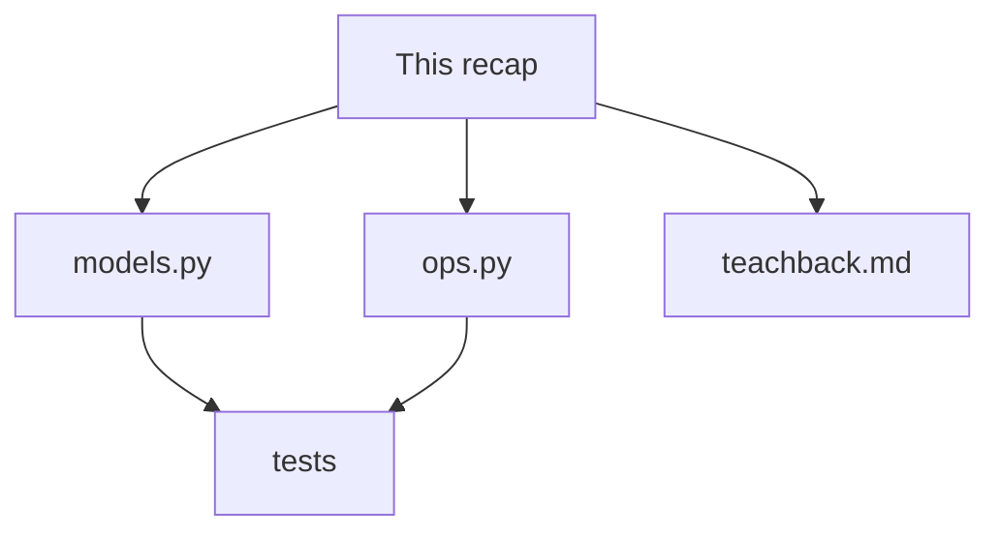
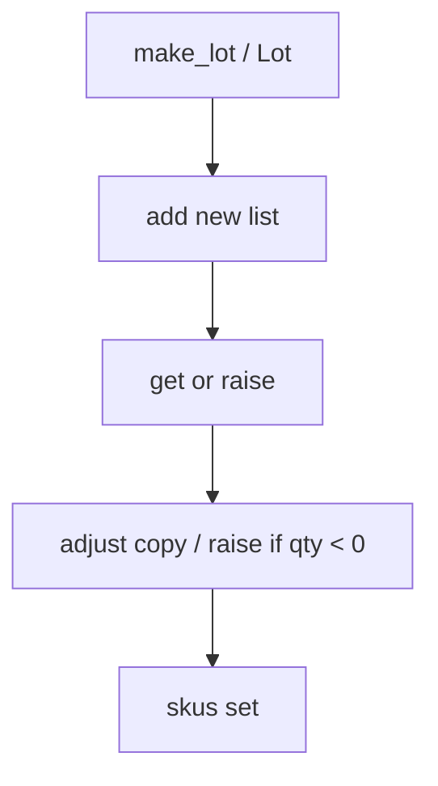

# Month 8 · Week 3 · Day 6
# Independent: A Small Multi-Module Domain

**Program:** Full-Stack Mastery · 18 months  
**Phase:** 3 — Python and backend  
**Month index:** [../../README.md](../../README.md)  
**Week 3:** [1](day-01.md) · [2](day-02.md) · [3](day-03.md) · [4](day-04.md) · [5](day-05.md) · Day 6 (today) · [7](day-07.md)  
**Week rhythm today:** Independent project work  
**Study time:** 3–4 focused hours  
**Days 1–5 textbook files:** closed for the *challenges*. Repair from **Week 3 Days 1–2 in this book**.

---

## How to read this chapter

Today you prove Week 3 without cloning `Note`. An **inventory lot** is a different noun. Same *rules*: `None` sentinel, specific raises, functions first, class only if it earns it.



Stuck 25 minutes: Day 1 or Day 2 textbook only.

---

## Complete explanation (this book is the lesson)

**Functions:** `def`, `return` or `None`, keyword args. Defaults once at definition. **Never mutable defaults.** `if x is None`. `*args`/`**kwargs` for forwarding, not junk drawers.

**Modules:** files as namespaces. `import` / `from`. No `*`. `__name__ == "__main__"`. `__init__.py` marks packages later.

**Exceptions:** `raise` contract breaks. `except SpecificError`. `else`/`finally`. Custom subclass. No bare `except`. Catch at the edge; tests want the exception.

**Classes:** `self`, `__init__`. `@staticmethod` rare. Composition (`Store` has rows) over inheriting `list`. Dataclass preview for field bags.

**When a class earns it:** state + invariants + methods that belong on the object. `normalize` is a function. A `Repository` that will grow `save`/`load` might be a class in Project 5 — or functions plus a path argument. You must **say** why. “Practice class” is an honest sentence. “Because Python is OOP” is not.

A class that only stores `id`, `sku`, and `qty` with no invariant methods is a dict with extra syntax. A class whose `adjust` refuses negative qty is earning the object: the invariant lives next to the field. Either choice is allowed today. DESIGN.txt must name the choice.

**Week 2:** new lists out; `get` optional; comprehensions.

**Wrong belief:** “OOP means a class per file.”  
**Correct:** a module per concern. Some modules are only functions.

**Wrong belief:** “I’ll wrap every line in `try`.”  
**Correct:** tests should see `ValueError`. Catch at a printer or CLI later, not inside `adjust`.

**Wrong belief:** “`qty=True` is fine because `True == 1`.”  
**Correct:** reject `bool` the way Week 1 rejected age `True`. Hints next week will not catch this at runtime.

Teach-back (paragraphs, ~400 words) must include: (1) mutable default story with two calls, (2) bare except and Ctrl+C, (3) class vs `make_lot` dict, (4) `self` vs JS `this` in one honest sentence.

---

## Today's contract

**Today's gate**

> Two modules, tests for raise + purity, teach-back prose, no mutable default, no bare except.

---

## Time box

| Block | Minutes | Work |
|---|---|---|
| A | 20 | Speak recap |
| B | 90 | inventory modules + tests |
| C | 45 | Teach-back |
| D | 20 | Git |

---

# Spec: inventory lots

Folder: `~\fullstack-lab\month-08\week-03\independent\`.

A lot: `id` (str), `sku` (str, non-blank normalized), `qty` (int, `>= 0`), optional `bin` (str).

`models.py`: `make_lot(...)` **or** class `Lot`. `qty` not bool. Reject negative with `ValueError`.

`ops.py`:

| Function | Spec |
|---|---|
| `add(rows, lot)` | duplicate id → ValueError; new list |
| `get(rows, id)` | missing raises |
| `adjust(rows, id, delta)` | new list; qty + delta; if result `< 0`, ValueError; missing raises |
| `skus(rows)` | set of sku strings |

Tests: add purity; duplicate; get missing; adjust below zero; `make_lot(..., qty=True)` TypeError or ValueError (document); two `add_tag`-style default tests if you have any function with optional list — **or** prove `add` requires rows (no default list).

### Worked `adjust`

Start qty 5. `adjust(rows, id, -2)` → qty 3; **input list** still 5 if you return a new list of new lot objects (or copies). If you mutate `lot.qty` in place, the input’s object changes — then your purity test on the list length can still pass while the qty alias bites. Snapshot `get(rows, id)` qty **before** if lots are mutable objects; or return new `Lot` instances.

`adjust(..., -10)` from 5 → would be -5 → `ValueError`. Missing id → same raise as `get`.

`delta` of `True` is `1` if you add it as int (bool subclass). Reject `bool` on `delta` and `qty` the way Day 6 Week 1 rejected age `True`.

Load-or-find the lot (same missing error as `get`). Compute `new_qty = lot.qty + delta` (or dict). If `new_qty < 0`, ValueError — do not clamp unless you change the spec. Return a new list: replaced lot is a **new** object/dict; others unchanged.

### Worked `make_lot` vs class

If `Lot` is a class with `self.qty += delta` methods, `adjust` might be a method. That **earns** a class if `Lot.adjust` maintains the invariant qty ≥ 0. If `adjust` is a module function that copies a dict, a class is optional. DESIGN.txt: one paragraph.

`sku` blank after normalize → `ValueError`. `"  AB  "` → `"AB"` or `"ab"` — document case.

### How to test a raise (flag pattern)

```python
def test_adjust_negative():
    rows = [make_lot("1", "SKU", 2)]
    raised = False
    try:
        adjust(rows, "1", -5)
    except ValueError:
        raised = True
    assert raised is True
```

If you have pytest: `with pytest.raises(ValueError):`. Do not `except Exception`. pytest is optional until Week 4; `py -3 test_inventory.py` with the flag pattern is enough.

### Teach-back structure (use headings, still prose under them)

1. **The shared list** — `add_bad("a")` then `add_bad("b")` printed `[a,b]` the second time. JS default `[]` is per call. Python is not.
2. **Bare except** — `except:` around `int(x)` also catches `KeyboardInterrupt`. The program ignores Ctrl+C. `except ValueError`.
3. **Class vs dict** — `Lot` with `qty` invariant vs `make_lot` returning a dict. You chose X because Y.
4. **self vs this** — `self` is a parameter. JS `this` depends on the call unless arrows.

400 words. If you only write the table of keywords, rewrite.

### Folder

`models.py`, `ops.py`, `test_inventory.py`, `teachback.md`, `DESIGN.txt`, `TEST.md`. No `cli.py`. No JSON. No `import *`. No Project 5.

Do not implement a CLI. Do not write JSON files.

### Worked `skus`

Two lots with sku `AAA` and one with `BBB`. `skus(rows)` is a `set` of size 2. Order is not a contract. If you return a list from a set, document sort (`sorted`) for stable tests.

### `get` then `adjust` composition

`adjust` should not reimplement scan-for-id with a different error type than `get`. Same `NotFoundError` / `KeyError`. Tests: missing id on both functions.

### Import graph

```text
test_inventory.py → ops.py → models.py
probe.py (optional) → ops.py
```

`models.py` imports nothing from ops. If `make_lot` needs `normalize`, put `normalize` in `models.py` or `text.py`, not in tests.

### JS contrast for the teach-back

| Idea | JS | Python |
|---|---|---|
| Default `[]` | per call | once at `def` |
| `throw` / `catch` | catches almost all | named `except ValueError` |
| `this` | call-site | `self` parameter |
| `export` | explicit | the file is the module |
| `class` for a helper | sometimes fashionable | functions first |

Write the table **and** a story. The story is the assignment.

### Definition of “independent”

You may look at **this** file. You may not paste Day 4 `Note`. Lot qty is not note status. If `adjust` is a rename of `complete`, you missed the invariant (qty ≥ 0).

```powershell
git add month-08/week-03/independent
git commit -m "Independent inventory modules with raise tests."
```

---

# Lecture: four stories the teach-back must actually tell

**Mutable default.** You wrote `add_bad` (or you remember Day 1’s trap). First omitted call `["a"]`. Second omitted call `["a","b"]`. `__defaults__` held one list. JS would have given you `["b"]` the second time. Python does not. Sentinel `None`. `is None`. New list inside the body. Copy if the caller passed a list and the API is pure. `add` on inventory should **require** `rows` with no default list so you cannot even make the trap.

**Bare except.** `except:` around `int(x)` catches `ValueError` (intended) and `KeyboardInterrupt` (disaster). The program ignores Ctrl+C. `except Exception` misses KeyboardInterrupt (good) but still hides NameError in the helper. `except ValueError` is the adult. Tests catch `ValueError`, not `Exception`.

**Class vs dict.** If `Lot` only stores fields and `adjust` lives in `ops.py`, a dict + `make_lot` was enough. If `lot.qty` cannot go negative and that rule lives on the object, a class earned it. Write which you chose and why. “Practice class” is honest. “Because Python is OOP” is not.

**self vs this.** `self` is the first parameter. Forget it in `__init__` and you assign locals that vanish. JS `this` depends on the call site unless you used arrows. Python’s explicitness is the feature.

**adjust algorithm.** Find the lot with the same missing error as `get`. Reject `bool` on `delta`. Compute `new_qty`. If `< 0`, ValueError — do not clamp. Return a **new** list with a **new** lot object/dict. Snapshot qty on the input before the call if objects are mutable.

**Import graph.** Tests → ops → models. Models do not import ops. `normalize` lives next to `make_lot`. Circular import means you inverted that.

Inventory is not notes. SKU and qty are not title and status. If you pasted Day 4 and renamed, rewrite `adjust` from this spec. No CLI. No JSON. No Project 5.

---

## Definition of done

- [ ] `models.py` + `ops.py`
- [ ] Tests cover add/get/adjust/raises
- [ ] Teach-back includes mutable default + bare except + class vs function
- [ ] No `except:`
- [ ] Commit exists

---

# Worked session — lots, not notes

`make_lot` (or `Lot`) rejects blank sku, negative qty, and `qty=True`. `add` duplicate id → ValueError, new list otherwise. `get` missing → raise. `adjust` missing → same raise; below zero → ValueError; success → new list, new lot object, input qty unchanged. `skus` → set.

Test raises with the flag pattern or `pytest.raises`. Do not `except Exception`. `add` has no default `rows=[]`. DESIGN.txt names class vs dict. Teach-back four stories in paragraphs, ~400 words. TEST.md names `py -3 test_inventory.py`.

No `cli.py`. No JSON. No `import *`. No `~/task-cli/`. If `adjust` is `complete` renamed, rewrite. If `qty=True` becomes 1, reject bool.

Import graph: tests → ops → models. Models do not import ops. `cd` to `independent` or `ModuleNotFoundError`.



---

## Optional review links

Week 3 modules and exceptions are explained in this chapter. These pages are for later checking, not for first learning.

- [Classes tutorial](https://docs.python.org/3/tutorial/classes.html)
- [Errors tutorial](https://docs.python.org/3/tutorial/errors.html)

---

## Tomorrow

Week review: synthesis, mini-build, debug mutable default / bare except / forgotten return / class-for-is_blank. Plan Week 4 tooling.

### Common mistakes today

| Mistake | Fix |
|---|---|
| `qty=True` accepted | reject `bool` |
| `except Exception` in tests | catch `ValueError` |
| `adjust` mutates the input lot | copy or new instance |
| teach-back skips mutable default | write the two-call story |
| JSON/CLI sneak-in | delete it; this independent is in-memory |

`skus` returns a set. Tests: `assert "AAA" in skus(rows)`. Do not assert list order on a set. `adjust` below zero is ValueError, not a silent clamp to 0, unless you document clamp — this spec said raise.

`make_lot` rejecting `qty=True` is the same bool trap as `classify_age`. If you skip that test, Week 4 type hints will not save you (`qty: int` still accepts `True` at runtime).

---

# Closing lecture — qty cannot go negative

`adjust` computes a new qty. If that number is `< 0`, raise `ValueError`.
Do not clamp to zero unless you change the spec. This spec said raise.
Missing id uses the same error as `get`. Duplicate id on `add` raises.
`qty=True` and `delta=True` are bool traps. Reject them.

Purity: new list, new lot object or dict. Snapshot qty on the input.
A length-only test can pass while `lot.qty` aliases. Take the snapshot.

`skus` returns a set. Do not assert list order on a set.
`models.py` does not import `ops.py`. Tests import ops.

Teach-back four stories as paragraphs, about 400 words:
shared default list; bare except and Ctrl+C; class vs `make_lot`; `self` vs `this`.
A keyword table without those stories is not done.

No `cli.py`. No JSON files. No `~/task-cli/`. No `import *`.
If you pasted Day 4 `Note`, rewrite `adjust` from this spec.
`py -3 test_inventory.py`. DESIGN.txt names class vs dict and why.
Composition: `ops` uses `make_lot` or `Lot`. It does not inherit `list`.
`self` is a parameter. Forget it and `__init__` assigns locals that vanish.
Bare `except` around `int` also catches KeyboardInterrupt. Named `ValueError` only.
Defaults evaluate once. `add(rows=[])` will flake later pytest. Require `rows`.
Independent means a new noun. SKU and qty are not title and status.
Do not `eval`. Do not persist JSON. In-memory lists are the day.

| Call | Result |
|---|---|
| `adjust` qty 5, delta -2 | qty 3, input still 5 |
| `adjust` qty 5, delta -10 | ValueError |
| `add` duplicate id | ValueError |
| `make_lot(..., qty=True)` | TypeError or ValueError |
| `get` missing id | raise (same family as adjust missing) |

Week 4 type hints will not reject `True` at runtime. The test must.
`except Exception` in tests hides the wrong raise type. Catch `ValueError`.
400 words of teach-back. Headings plus prose, not headings plus bullets only.
If `skus` returns a list from a set, document `sorted` for stable tests.
Import graph: test → ops → models. Cycle means you inverted it.
Tomorrow’s review mini-build is `clamp`, not this inventory. Finish tests today.


## Recite-back checklist (close the editor, then tick)

Write `RECITE.txt` with one honest sentence per line.
If a line is mush, re-read the matching section in **this** file only.

- [ ] `qty >= 0` invariant; below zero raises
- [ ] `qty=True` rejected
- [ ] `add` duplicate raises; new list otherwise
- [ ] `get` / `adjust` missing use the same error family
- [ ] purity: new list, new lot
- [ ] `skus` is a set
- [ ] no `except:` / no `import *`
- [ ] teach-back four stories as paragraphs

DESIGN.txt names class vs dict. No CLI. No JSON. No `~/task-cli/`.
`py -3 test_inventory.py`. If you pasted notes, rewrite `adjust`.

If RECITE.txt is ticks without sentences, rewrite each tick as a spoken sentence.
Inventory lots are not notes. `adjust` by delta is not `complete`. Finish tests today.
`qty: int` next week still accepts `True` at runtime. The reject-bool test stays.
