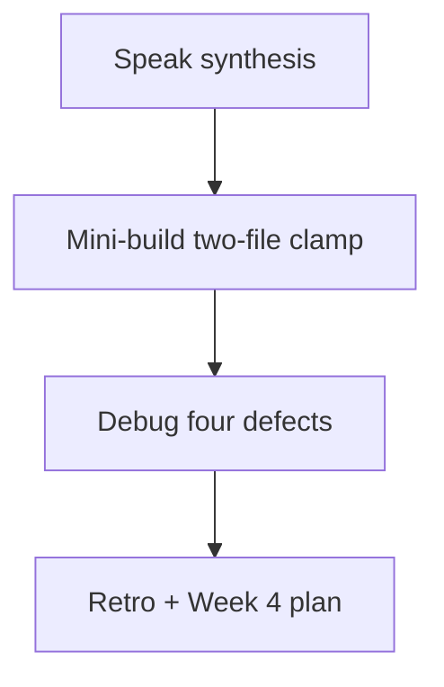
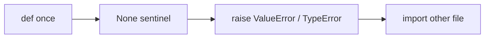

# Month 8 · Week 3 · Day 7
# Week Review — Functions, Modules, Exceptions, Classes

**Program:** Full-Stack Mastery · 18 months  
**Phase:** 3 — Python and backend  
**Month index:** [../../README.md](../../README.md)  
**Week 3:** [1](day-01.md) · [2](day-02.md) · [3](day-03.md) · [4](day-04.md) · [5](day-05.md) · [6](day-06.md) · Day 7 (today)  
**Week rhythm today:** Review, repair, plan Week 4  
**Study time:** 3–4 focused hours

Do not start Week 4 because the calendar moved. `uv` on a mushy `except:` habit still ships silent failures.

---

## How to read this chapter

Closed-book teaching day. The synthesis **is** the Week 3 lesson.



Days 1–6 closed during mini-build. Repair from **this** recap.

---

## Week synthesis (this book)

**def:** parameters, `return`/`None`, keyword args. Defaults **once**. **Never `def f(x=[])`.** Sentinel `None` + `is None`. `*args` tuple, `**kwargs` dict — explicit APIs preferred.

**Modules:** file = module. `import` / `from`. No `import *`. `__name__ == "__main__"`. Packages: folder + `__init__.py` (light).

**Exceptions:** `raise` specific. `try/except/else/finally`. Custom subclass of `ValueError`/`Exception`. **No bare `except`.** Catch at the edge.

**Classes:** `self`, `__init__`. Earn it (state + invariants). Else function + dict. Composition over inheritance. `@staticmethod` rare. Dataclass preview.

Weeks 1–2 still hold (strip, `get`, comprehensions, no index soup).

The rest of this file unpacks those sentences so you can mini-build without Days 1–6.

---

## Today's contract

**Today's gate**

> I can teach the mutable-default trap and bare except, import a function from another file, and I have a green test that a blank string raises.

---

## Time box

| Block | Minutes | Work |
|---|---|---|
| 1 | 40 | Speak the synthesis |
| 2 | 50 | Mini-build `clamp` + `require_positive` two files |
| 3 | 30 | Debug four defects |
| 4 | 25 | Review independent — one fix |
| 5 | 20 | Re-run tests |
| 6 | 20 | Design: class vs function for Project 5 |
| 7 | 25 | Retro + Week 4 plan |

---

# Complete explanation — you must still own

## 1. Return values

Forgotten `return` → `None`. Do not chain `append`. `if result` is wrong for `0`.

`print` returns `None`. A function whose last line is `print(x)` returns `None`. Tests that `assert f() == 5` then fail with `None`. The traceback says AssertionError, not “you printed instead of returned.” You must connect those.

## 2. Mutable defaults

`def f(xs=[]):` one list for all omitted calls. `def f(xs=None):` then new list. `is None` not truthiness.

Python evaluates the default **when it executes `def`**, once per process (per import). JavaScript evaluates a default **per omitted call**. If your spoken answer to “when is `tags=[]` created?” is “every call,” re-read this paragraph until it is “once.”

## 3. Imports

Same directory, `py -3` from that directory. Circular imports: split.

`from mathish import clamp` needs `mathish.py` on `sys.path`, which for a same-folder run means you `cd`’d to `review`. `ModuleNotFoundError` is not “Python cannot import.” It is “you ran from the wrong folder.”

## 4. Exceptions

`ValueError` bad value, `TypeError` bad type, `KeyError` missing key. Messages for humans at the CLI later. Tests assert type.

Bare `except` swallows Ctrl+C. Forbidden.

`except Exception` does **not** catch `KeyboardInterrupt` or `SystemExit` (those subclass `BaseException`). Bare `except` does. That is the difference you must teach. `except Exception` is still too wide for `int(user_text)` — use `except ValueError`.

## 5. Classes vs functions

`require_title` function. `Note` class optional. Project 5: likely dataclass + repository **object or module**. Inheritance trees are not a deliverable.

`class IsBlank:` with one method is a function wearing a costume. You then write `IsBlank().check(s)` for no invariant. `def is_blank(s):` is the adult.

## 6. Worked mini-build

`mathish.py`: `clamp(n, low=0, high=100)` — if `low > high`, raise `ValueError`; if `n` is bool, `TypeError`; return limited int.

`probe` or tests in another file import `clamp`. `require_positive(n)` raises if `n <= 0`. Tests: `clamp(150)==100`, `clamp(-1)==0`, bool raises, `low=5, high=1` raises.

Worked table:

| Call | Result |
|---|---|
| `clamp(50)` | `50` |
| `clamp(150)` | `100` |
| `clamp(-3)` | `0` |
| `clamp(True)` | `TypeError` |
| `clamp(5, low=10, high=3)` | `ValueError` |
| `require_positive(0)` | `ValueError` |
| `require_positive(1)` | `1` (or `None` if you only check — **return** the number) |

`clamp` must use `isinstance(n, bool)` **before** `isinstance(n, int)` or `type(n) is int`. Keyword args `low=` `high=` should work. No default `[]`.

Two files: `from mathish import clamp, require_positive` in the test file. If `ModuleNotFoundError`, you ran from the wrong folder.

## 7. Mutable default — the picture you speak

`def f(xs=[]):` creates **one** list object when Python **executes** the `def`. Every `f()` that omits `xs` receives that object. `f().append` is visible to the next `f()`. `def f(xs=None):` then `xs = []` inside builds a **new** list per call.

## 8. `append` returns None — still this week

`xs = xs.append(1)` binds `xs` to `None`. Then `for x in xs` is `TypeError: 'NoneType' is not iterable`. The traceback bottom says TypeError, not “I forgot append’s return.” You must connect those.

## 9. Composition sketch for Project 5 (design block preview)

A `JsonStore` **has** `path: Path` and methods `load`/`save`. A `Service` **has** a store. `cli.py` **has** a service (or calls functions). Nobody inherits `list`. Dataclass `Task` is a bag of fields with `__post_init__` validation later. `normalize_title` stays a function.

**Wrong belief:** “I’ll make `class CLI(Store, Task)`.”  
**Correct:** that is not composition and not a CLI.

**Wrong belief:** “Week 4 tooling will hide a mushy `except:`.”  
**Correct:** Ruff may not catch bare except unless you enable the rule; pytest will not catch swallowed Ctrl+C. You have to know.

**Wrong belief:** “I’ll `return None` for a bad clamp instead of raise.”  
**Correct:** `None` collides with forgotten `return`. Raise `ValueError` / `TypeError`. Tests assert the type.

---

Speak the synthesis.

---

# Mini-build

`~\fullstack-lab\month-08\week-03\review\`  
`mathish.py` + `test_mathish.py` as above. No mutable defaults. No bare except.

Do not put this mini-build inside `~/task-cli/`. Do not write argparse. Two files, two functions, asserts.

---

# Debug (DEBUG.txt)

Write **full sentences** for each: what you observe, why a JS-fluent student does it, what to write instead.

- `def add(item, items=[])` sharing state across tests — second test’s list already has the first test’s item if they share the default object. Fix: `items=None` then new list, **or** require `items` with no default. Tests must pass independent lists.
- `except:` around `int(user_text)` — catches `ValueError` (good intent) **and** `KeyboardInterrupt`, `SystemExit`, `MemoryError`. Ctrl+C appears to “hang” or get swallowed. Fix: `except ValueError`.
- `titles = titles.append(x)` then using titles — `titles` is `None`; next loop TypeError. Fix: `titles.append(x)` as a statement, or `titles = titles + [x]` for a new list.
- `class IsBlank:` with one method that could be a function — you now need `IsBlank().check(s)` for no benefit. Fix: `def is_blank(s):`.

Optional fifth: `from ops import *` then a name clash. Fix: explicit imports.

---

# Review, design, retro

Fix one independent defect. Re-run tests. Design: for Project 5, which parts are functions, which might be a class (`JsonStore` with a path), which is a dataclass (`Task`). Week 4: hints, dataclass, decorator idea, `yield`, `with`, Path, JSON, **uv**, Ruff, pytest fixtures, async peek, then **start** Project 5.

### Design paragraph prompt

Write 8–12 sentences: `normalize_title` is a function. `Task` is a dataclass (Week 4) or a dict this week. `JsonStore` **has** a path. `cli` **calls** services and **prints**. Inheritance from `list` is wrong. Mutable defaults will flake pytest. Bare except will hide KeyboardInterrupt. Forgotten `return` after `append` is `None`.

If the independent `adjust` mutated lots in place, that is today’s repair in `review/repair.py` — a ten-line copy-on-write `adjust`.

```powershell
git add month-08/week-03/review
git commit -m "Record Month 8 Week 3 functions review."
```

---

## Speak the synthesis (closed-book prompts)

Answer in full sentences, then mini-build:

1. When does Python evaluate `tags=[]`?
2. What does bare `except` catch that `except Exception` does not?
3. What does a function return when the last line is `print(x)`?
4. Why is `IsBlank` a bad class?
5. Where does `sys.exit` belong (and where does it not)?
6. What is composition in the Store-has-a-list sense?

If (1) is “every call,” you still believe JS. Re-read section 7 in this file.

Write in `review/PROJECT5.txt` (8 sentences): `normalize_title` function. `Task` dataclass next week. `JsonStore` has a Path. `services.create` raises ValueError. `cli.py` catches, prints, exits. Tests import services with `tmp_path`. No `class CLI(Store)`. No mutable default on `create(tags=[])`. Do not paste a CLI.

---

# Lecture: Week 4 will not hide these habits

Ruff formats. pytest runs. `uv` isolates the interpreter. None of that fixes `except:` swallowing Ctrl+C. None of that fixes `def create(tags=[])` sharing a list across tests. None of that fixes `titles = titles.append(x)` binding `None`. You have to know. That is why this review exists before tooling.

**clamp** is not `require_title`. It limits an int. Bool is not an int for this spec even though `True == 1`. Reject bool first. `low > high` is ValueError (bad configuration). Out-of-range `n` is not an error; it is clamped. Those are different questions. Do not raise when `n` is 150; return 100.

**require_positive** raises on `<= 0` and **returns** the number otherwise. Forgotten return is `None`. Tests then fail with AssertionError, not a nice message about return.

**Composition for Project 5, in sentences you write.** `normalize_title` function. `Task` dataclass next week. `JsonStore` has a Path. `services.create` raises ValueError. `cli.py` catches, prints, exits. Tests import services. No `class CLI(Store)`. No mutable default on `create(tags=[])`. Write that in `review/PROJECT5.txt`. Do not paste a CLI. Do not implement argparse today.

**sys.exit** belongs at the CLI edge later, not inside `clamp`. Helpers raise. The process exits when the CLI decides. Tests import helpers; they should not kill pytest.

Two files. `cd` to `review`. `py -3 test_mathish.py`. If import fails, you ran from the wrong directory — same as every import day this month.

If `clamp(True)` returns `1`, you failed Week 1 Day 6 again. Repair before you celebrate green tests.

---

## Week 3 definition of done

- [ ] Mutable default taught from this book
- [ ] Bare except banned in DEBUG or oral
- [ ] Two-file import mini-build green
- [ ] Raise test exists this week
- [ ] Retro names Week 4 uv/pytest honestly

---

# Worked session — clamp in two files

`mathish.py` exports `clamp` and `require_positive`. Tests import them. `clamp(50)` is 50, `clamp(150)` is 100, `clamp(-3)` is 0, `clamp(True)` TypeError, `low=10, high=3` ValueError. `require_positive(0)` ValueError, `require_positive(1)` returns 1.

DEBUG four defects in full sentences. PROJECT5.txt eight sentences — functions vs dataclass vs store vs CLI — no pasted argparse. If independent `adjust` mutated, `review/repair.py` is copy-on-write.

`cd` to `review`. `py -3 test_mathish.py`. Week 4 is `uv`, Ruff, pytest, JSON, then Project 5 **start** on Day 6. Tooling will not hide `except:`.

If `clamp(True)` is 1, reject bool first. If the test file cannot import, you ran from the wrong folder.

---

## Optional review links

Week 3 is explained in this chapter. These pages are for later checking, not for first learning.

- [Defining functions](https://docs.python.org/3/tutorial/controlflow.html#defining-functions)
- [Modules](https://docs.python.org/3/tutorial/modules.html)
- [Errors](https://docs.python.org/3/tutorial/errors.html)
- [Classes](https://docs.python.org/3/tutorial/classes.html)

### Common mistakes this week

| Mistake | Fix |
|---|---|
| `def f(xs=[])` | `None` sentinel |
| `except:` | named type |
| `titles = titles.append(x)` | statement, or `+ [x]` |
| `class IsBlank` | `def is_blank` |
| `sys.exit` in a helper | raise; exit in CLI later |

`clamp(True)` TypeError is the bool-as-int encore. If your mini-build accepts `True` as 1, you failed Week 1 Day 6 again. Repair today before Week 4 hints make it look typed.

The mini-build is two files. If `test_mathish.py` cannot import, you ran from the wrong directory. `cd` to `review`. Same as every import day this month.

---

# Closing lecture — Week 4 tools do not rewrite habits

`uv` isolates the interpreter. Ruff formats and lints.
pytest runs claims. None of that turns `except:` into `except ValueError`.
None of that stops `def create(tags=[])` unless you enable a rule *and* understand it.

`clamp` limits an int. `low > high` is ValueError. Bool is TypeError.
Out-of-range `n` returns the bound; it does not raise.
`require_positive` raises on `<= 0` and returns the number otherwise.
Forgotten `return` is `None`. Tests then fail with AssertionError.

Two files. `from mathish import clamp, require_positive`.
`cd` to `review` or the import dies. Same as every import day.

PROJECT5.txt: `normalize_title` function, `Task` dataclass next,
`JsonStore` has a Path, CLI catches and prints, tests import services.
No `class CLI(Store)`. No pasted argparse. Implementation starts Day 6.
Today is clamp, DEBUG, and an honest retro that names uv and pytest.
Speak prompts: when is `tags=[]` created? Once, at `def`, not every call.
What does bare except catch that `except Exception` does not? KeyboardInterrupt.
What does a function return when the last line is `print(x)`? `None`.
Why is `IsBlank` a bad class? One method, no invariant, extra syntax.
`sys.exit` belongs in a CLI later, not inside `clamp`. Helpers raise.
If `clamp(True)` returns 1, you used `isinstance(n, int)` without excluding bool.


## Recite-back checklist (close the editor, then tick)

Write `RECITE.txt` with one honest sentence per line.
If a line is mush, re-read the matching section in **this** file only.

- [ ] `tags=[]` created once, not per call
- [ ] bare except vs `except Exception` vs `except ValueError`
- [ ] forgotten return is `None`
- [ ] `IsBlank` is a bad class
- [ ] `clamp(True)` TypeError
- [ ] two-file import from `review`
- [ ] PROJECT5.txt has no pasted CLI
- [ ] retro names uv / pytest / Ruff

Week 4 tools do not hide these. Green `test_mathish.py`. Then stop.

If the speak prompt "when is tags=[] created?" is still "every call," re-read section 7.
Ruff will not save a swallowed KeyboardInterrupt. Know it before uv feels like progress.
`clamp(True)` TypeError is Week 1 Day 6 again. Repair it before you celebrate green.



