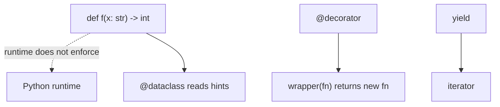

# Month 8 · Week 4 · Day 1
# Type Hints, Dataclasses, Decorators, and Generators

**Program:** Full-Stack Mastery · 18 months  
**Phase:** 3 — Python and backend  
**Month index:** [../../README.md](../../README.md)  
**Week 4:** Day 1 (today) · [2](day-02.md) · [3](day-03.md) · [4](day-04.md) · [5](day-05.md) · [6](day-06.md) · [7](day-07.md)  
**Week rhythm today:** Learn + type-along  
**Student state:** Week 3 gate passed. You can import, raise, and refuse mutable defaults. Today you **document types**, generate `__init__` with a **dataclass**, see why `@something` is a function, and write a **`yield`**. Files, JSON, `uv`, Ruff, pytest fixtures, and async are **Day 2**.  
**Study time:** 3–4 focused hours

**This week covers:** hints, dataclasses, decorators, generators, context managers, files, JSON, venv, uv, pyproject.toml, Ruff, pytest, async fundamentals — plus Project 5 start and the Month 8 exam.

Labs: `~\fullstack-lab\month-08\`. Project 5’s **own** repo is Day 6 (`~/task-cli/` or similar). Do not paste a CLI from anywhere.

---

## How to use this textbook

1. Read a section. Close it. Say it without JS types-as-erasure *only* — Python hints are similar (erased at runtime unless a checker runs) **and** dataclasses use them at class-build time.
2. Type labs. Do not paste.
3. Tracebacks from the bottom.

---

## How to read this chapter

A **type hint** is a note the runtime **ignores** by default. `def f(x: str) -> int` can still be passed an `int` unless you run a checker (mypy/pyright) or Ruff’s type-aware rules. This is the same *erasure* story as TypeScript **except** tools and dataclasses hook the annotations.

A **decorator** `@f` means “replace the following function with `f(function)`.” FastAPI’s `@app.get("/items")` (Month 9) is that idea: `app.get` returns a decorator that registers your function as a route. Today you write a tiny decorator so Month 9 is not magic.

A **generator** function `yield`s values lazily. `for x in gen():` pulls them. Project 5 might `yield` rows from a filter — optional, one sensible use.



---

## Today's contract

By the end of this day you will be able to:

1. Write `def f(x: str) -> int` and `str | None` / `Optional[str]`.
2. Define a `@dataclass` with fields and a default, plus why it is not a Java Bean ceremony.
3. Explain `@decorator` as `f = decorator(f)`.
4. Write a generator that `yield`s and contrast it with `return [..]`.
5. State that hints are not runtime checks unless you add a checker.

**Today's gate**

> A dataclass models a record. A decorator is a function that takes a function. `yield` produces an iterator. `X | None` means optional. I will not claim Python “has types now” the way a compiled language does.

---

## Time box

| Block | Minutes | Work |
|---|---|---|
| A | 55 | Theory |
| B | 50 | Type-along: hints, dataclass, decorator, yield |
| C | 70 | Independent: `tasks.py` + asserts |
| D | 20 | Git |
| E | 15 | Recall |

---

# Block A — Theory

## 1. Type hints — notes for humans and tools

```python
def strlen(s: str) -> int:
    return len(s)
```

`s: str` is the **parameter** annotation. `-> int` is the **return** annotation. At runtime `strlen(10)` may still run (`len` works on many types) or fail inside `len` — the hint did not throw `TypeError` by itself.

**Optional / union:**

```python
def find_title(rows: list[dict], id: str) -> str | None:
    ...
```

`str | None` (Python 3.10+) means “a string or `None`.” Older style: `from typing import Optional` then `Optional[str]` which **is** `str | None`. This course prefers **`X | None`** on 3.10+.

`list[dict]` is parameterized (3.9+). `list[dict[str, str]]` if you want stricter dicts. For a dataclass `list[Task]`.

`from typing import Any` is the escape hatch — **avoid** in Project 5 public functions. Same energy as `any` in TypeScript.

**Wrong belief:** “I annotated it, so Python will convert or reject.”  
**Correct:** you still validate at the edge (`require_title`). Hints document. Checkers optionally nag. Pydantic (Month 9) **will** validate — different layer.

JS/TS: types erase at compile. Python: annotations live in `__annotations__` (and `typing.get_type_hints`) but the VM does not enforce them on call.

## 2. Dataclasses — field bags with generated methods

```python
from dataclasses import dataclass, field

@dataclass
class Task:
    id: str
    title: str
    status: str = "open"
    tags: list[str] = field(default_factory=list)
```

`@dataclass` is a **decorator** (section 3) that reads hints and writes `__init__`, `__repr__`, `__eq__` (value equality — `==` compares fields).

**`field(default_factory=list)`** — **not** `tags: list[str] = []`. That would be the **mutable default trap** again, at class level. `default_factory=list` calls `list()` **per instance**.

`__post_init__(self)` runs after generated `__init__` — put `require_title` there if you want invariants on construction.

When to dataclass vs dict vs handwritten class:

| Need | Tool |
|---|---|
| Ad-hoc JSON blob | dict + `get` |
| Known fields, equality, repr | **dataclass** |
| Heavy invariants, many methods | class (maybe still dataclass underneath) |

**Wrong belief:** “Dataclass is ORM.”  
**Correct:** it is a class generator. No database. Month 11+ is SQLAlchemy.

JS: a `type Task = { id: string; ... }` plus objects. Python dataclass is both the type and the constructor.

Frozen: `@dataclass(frozen=True)` makes instances immutable-ish (raises on field assign). Optional; nice for values. Lists inside are still mutable unless you are careful.

## 3. Decorators — functions that return functions

```python
def twice(fn):
    def wrapper(*args, **kwargs):
        return fn(*args, **kwargs) * 2
    return wrapper

@twice
def inc(n: int) -> int:
    return n + 1

# equivalent: inc = twice(inc)
inc(3)  # (3+1)*2 == 8
```

`@twice` on the line above `def inc` means `inc = twice(inc)` after `def` runs. `twice` received the original function and returned `wrapper`. Calls to `inc` hit `wrapper`.

**Stacked:** `@a` `@b` `def f` means `f = a(b(f))` — bottom decorator applied first.

**With arguments:** `@app.get("/items")` is **not** `app.get` as the decorator. `app.get("/items")` **returns** a decorator, which then takes `f`. Two-layer factory. You will write:

```python
def greet_prefix(prefix: str):
    def decorator(fn):
        def wrapper(*args, **kwargs):
            return f"{prefix}{fn(*args, **kwargs)}"
        return wrapper
    return decorator

@greet_prefix("Hi, ")
def name() -> str:
    return "Ada"
```

Month 9: `@app.get("/health")` registers `health` on the app. The function still exists; the decorator **also** stored a reference. You do not need FastAPI today. You need “@ is not magic syntax; it is a call.”

`functools.wraps(fn)` copies `__name__` onto `wrapper` so tracebacks and pytest look like `inc` not `wrapper`. Use it in real decorators. Today: mention it; use it if you can import `functools`.

**Wrong belief:** “Decorators are OOP.”  
**Correct:** they are higher-order functions. JS: `function twice(fn) { return (...args) => fn(...args)*2 }` then `const inc = twice(function...)`. No `@` sugar in JS (proposals aside). Python’s `@` is the sugar.

## 4. Generators — `yield`

```python
def count_to(n: int):
    i = 0
    while i < n:
        yield i
        i += 1
```

Calling `count_to(3)` does **not** run the body. It returns a **generator iterator**. `for x in count_to(3):` runs until each `yield`. `list(count_to(3))` is `[0,1,2]`.

`return` in a generator stops iteration (StopIteration). You cannot `yield` and also `return [1,2,3]` as the useful payload — pick iterator vs list.

**Why:** large streams, infinite sequences (with a break), pipeline `for row in iter_rows():` without loading all rows. Project 5 JSON files are small — a list is fine. One generator in a search helper is enough to **demonstrate** the construct if it stays readable.

Generator **expression:** `(x * x for x in xs)` — lazy. List comprehension `[...]` is eager.

**Wrong belief:** “`yield` is async.”  
**Correct:** async is `async def` / `await` (Day 2 peek). `yield` is sync lazy iteration. `yield from` delegates (optional).

## 5. JS contrast table

| Idea | TypeScript / JS | Python |
|---|---|---|
| Annotate function | `: string` / `: number` | `: str` / `: int` |
| Optional | `string \| null` | `str \| None` |
| Runtime enforce | no (TS) | no (hints) |
| Record type | `type` / `interface` | dataclass / TypedDict |
| Decorator | experimental / wrappers | `@` syntax, real |
| Lazy sequence | generators `function*` | `yield` |

---

# Block B — Type-along

```powershell
mkdir ~\fullstack-lab\month-08\week-04\day-01 -Force
cd ~\fullstack-lab\month-08\week-04\day-01
```

### B1 — hints do not enforce

`hints.py`: `def add(a: int, b: int) -> int: return a + b` then `print(add("3", "1"))` — `"31"` **string concat** if you pass strs! Wait: `"3"+"1"` is `"31"`. If you pass ints, `4`. Call `add("3", "1")` and write `HINTS.txt`: the annotations did not save you. (If you call `add("3", 1)` you get TypeError — the **operator**, not the hint.)

### B2 — dataclass

`task_model.py`: `Task` with `id`, `title`, `status="open"`, `tags` with `default_factory=list`. Construct two tasks. Append a tag to one; prove the other tags list is independent (factory). Then temporarily use `= []` on a class field if you want to **see** the shared-list bug — fix back to `default_factory`.

### B3 — decorator

`deco.py`: `@twice` on a function that returns 5; print 10. Comment the equivalent assignment.

### B4 — yield

`gen.py`: generator yielding 1, 2, 3. `list(...)` print. Print the type of `gen()` (generator).

---

# Block C — Independent

`records.py`:

- dataclass `Item` with `id: str`, `title: str`, `priority: int = 0`, `due: str | None = None`
- `def parse_priority(raw: str) -> int` — `int(raw)` inside try; on `ValueError` raise `ValueError("priority")` (or return a result — pick raise)
- `def titles(items: list[Item]) -> list[str]`
- `def open_ids(items: list[Item])` **generator** yielding ids where you add a field `status: str = "open"` **or** yield all ids — document. Prefer: `def iter_open(items: list[Item])` yields `Item` with status open if you add `status`.

Keep it small. `test_records.py` asserts equality of two `Item`s with same fields (`==`), `due is None`, generator `list(iter_open(...))`.

`DECO.txt`: how `@app.get` will be a decorator factory (five sentences). No FastAPI code required.

### Worked decorator factory (read, then try)

`@greet_prefix("Hi, ")` calls `greet_prefix("Hi, ")` **first**, which returns `decorator`, which then receives `name`. Two calls. `@app.get("/health")` is the same shape: path in the outer call, function in the inner. Month 9 will register the function on a route table. You still write an ordinary `def health():`.

### Worked generator vs list

```python
def only_open(items):
    for it in items:
        if it.status == "open":
            yield it
```

`list(only_open(items))` materializes. A `for` over the generator does not build the full list first. For ten tasks it does not matter. You write it once so `yield` is not a rumor.

### `Item == Item`

Dataclass `__eq__` compares fields, not identity. Two `Item`s with the same id/title are `==` True and `is` False. Tests should use `==` for values. Same as dict `==`.

**Wrong belief:** “I’ll put `tags: list[str] = []` on the dataclass because the default is empty.”  
**Correct:** that is the mutable default trap at class scope. `default_factory=list`.

```powershell
cd ~\fullstack-lab
git add month-08
git commit -m "Month 8 Week 4 Day 1: hints, dataclass, decorator, yield."
```

---

# Block E — Recall

1. Does `x: int` reject strings at runtime?
2. Why `default_factory=list` not `= []`?
3. `@f` means what assignment?
4. What does calling a generator function return?
5. `str | None` vs `Optional[str]`.

### JS / TS contrast you must say aloud

TypeScript types erase at compile. Python hints erase at runtime unless a checker or Pydantic (Month 9) runs. `interface Task` vs `@dataclass class Task`. Decorators: JS uses wrapper functions without `@` in this course’s JS months; Python `@` is the sugar FastAPI will use. `function*` generators vs `yield`. `null` vs `None` in `str | None`.

`Item == Item` with the same fields is True for dataclasses (generated `__eq__`). Two object literals in JS are never `===`. Python `==` is the value question; `is` is identity. Same as Week 1, now on records.

---

## Definition of done

- [ ] HINTS.txt records non-enforcement
- [ ] Dataclass tags lists are independent
- [ ] A decorator ran
- [ ] A generator was listed
- [ ] Commit exists

---

## Optional review links

- [typing](https://docs.python.org/3/library/typing.html)
- [dataclasses](https://docs.python.org/3/library/dataclasses.html)
- [decorators HOWTO](https://docs.python.org/3/howto/function.html#defining-functions)
- [yield expressions](https://docs.python.org/3/reference/simple_stmts.html#the-yield-statement)

---

## Tomorrow

`with open`, `pathlib.Path`, JSON load/dump and malformed files, **`uv`**, `pyproject.toml`, Ruff, pytest fixtures, `async def` + `asyncio.sleep` peek.

### One more picture

`@twice` then `@greet_prefix("Hi, ")` stacked — bottom applied first. Read the traceback: if `wrapper` shows instead of your function name, you forgot `functools.wraps`. pytest will name tests after `__name__`. Wrap real decorators. Lab decorator may skip wraps if you document the name change.

Calling `count_to(3)` twice gives **two** independent generators. Each starts at 0. Lists replay; each generator object is one-shot. That is iterable-vs-iterator from Week 2, now with `yield`.

### Common mistakes today

| Mistake | Fix |
|---|---|
| `tags: list[str] = []` on dataclass | `field(default_factory=list)` |
| expecting hints to TypeError on `"3"` | validate yourself |
| `@app.get` as if `get` were the decorator | factory returns decorator |
| `return` a list from a generator you wanted lazy | `yield` items; `list()` at the edge |

`Optional[str]` and `str | None` are the same idea. Prefer `|` on 3.10+.

`list[Item]` as a hint does not make `load` return Items if you forgot to map dicts. You still write the loop or comprehension. The checker (optional) nags; pytest proves it. Project 5 public functions get hints even if you skip a checker this month.

`__post_init__` on a dataclass is where blank titles raise if you want construction to enforce invariants. Factory functions (`item_from_dict`) are the other place. Pick one so JSON cannot inject `"  "`. Tests cover whichever you picked.

---

## Hints vs TypeScript — the honest overlap

TypeScript’s compiler refuses `add("3", 1)` if types say number. Python’s VM will run `add("3", "1")` and concatenate if you wrote `+`. A checker (mypy, pyright) is an **optional extra process**, like `tsc --noEmit`. This course: hints on **public** functions; pytest for truth; Ruff for hygiene. Do not skip tests because you annotated.

`list[Item]` does not convert dicts into Items. `load` still maps. The hint is a comment the tools can read.

`from __future__ import annotations` (optional) makes hints strings at runtime (PEP 563/649 era — 3.12+ stores them differently). You do not need that today. Write `list[Item]` and `str | None`.

### Decorator factory — two calls

```python
def app_get(path: str):
    def decorator(fn):
        # Month 9: register (path, fn) on a table
        return fn
    return decorator

@app_get("/health")
def health() -> str:
    return "ok"
```

Python does: `health = app_get("/health")(health)`. Outer call gets the path; inner call gets the function. If you write `@app_get` without `()`, you pass the function to `app_get` as `path` — a confusing TypeError later. FastAPI’s `@app.get("/items")` **has** the parentheses.

### Generator mental model

`g = count_to(3)` allocates a generator object. The body is frozen at the start. Each `next(g)` (or each `for` step) runs to the next `yield`. After the last yield, `StopIteration`. A second `for x in g` yields nothing. `for x in count_to(3)` twice works because you **called** twice — two objects.

**Wrong belief:** “Generators are faster so I will yield everything.”  
**Correct:** they are lazy. For ten tasks, `return [row for row in rows if ...]` is clearer. Use `yield` when you can teach why.

### `Optional` import

```python
from typing import Optional
def f(x: Optional[str]) -> int: ...
```

Same as `str | None`. Prefer `|` on 3.12. `Optional` does **not** mean “the argument may be omitted.” It means the **value** may be `None`. Omitted args are default values (`x: str | None = None`).
