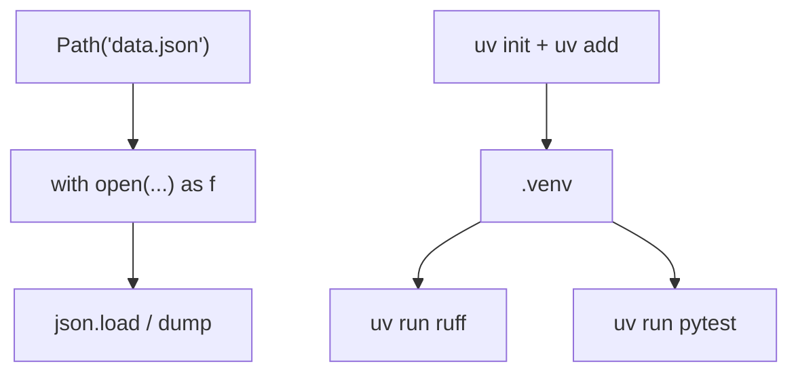

# Month 8 · Week 4 · Day 2
# Files, JSON, `uv`, Ruff, pytest Fixtures, and an Async Peek

**Program:** Full-Stack Mastery · 18 months  
**Phase:** 3 — Python and backend  
**Month index:** [../../README.md](../../README.md)  
**Week 4:** [1](day-01.md) · Day 2 (today) · [3](day-03.md) · [4](day-04.md) · [5](day-05.md) · [6](day-06.md) · [7](day-07.md)  
**Week rhythm today:** Learn + type-along  
**Student state:** You can hint, dataclass, and `yield`. Today the **engineering environment** catches up: files, JSON (Month 3 `localStorage` lesson, now disk), **`uv`**, Ruff, pytest fixtures. Async is a **peek**, not a web server.  
**Study time:** 3–4 focused hours

Project 5 starts Day 6 in **`~/task-cli/`**, not in fullstack-lab. Today you may `uv init` a **lab** project under `~\fullstack-lab\month-08\week-04\`.

---

## How to read this chapter

A **context manager** (`with`) is “acquire, then **always** release.” A **JSON file** is bytes of text, not a Python dict, until `json.load`. **`uv`** creates a virtual environment and installs from `pyproject.toml`. **Ruff** lints and formats. **pytest** collects `test_*`. **`async def`** is a coroutine — `asyncio.sleep` yields the event loop; you will **not** build FastAPI today.



Month 3: `JSON.parse` throws; missing `localStorage` key is `null`; bad shape → `[]`. Today: missing **file** is `FileNotFoundError`; empty/malformed file is `json.JSONDecodeError`; bad shape is **your** check (`isinstance(data, list)`). Same discipline, new exceptions.

---

## Today's contract

1. Read/write UTF-8 text with `with` and `Path`.
2. `json.load` / `json.dump`; handle missing and malformed files.
3. `uv init`, add pytest and ruff, run them via `uv run`.
4. Write one pytest **fixture**.
5. Run `async def` + `await asyncio.sleep(0.01)` so the words are not foreign.

**Today's gate**

> I can explain `with` as cleanup. Malformed JSON does not crash the *idea* of my loader — I catch `JSONDecodeError` and return a default **or** raise a domain error I chose. `uv run pytest` uses the project environment, not a mystery global Python.

---

## Time box

| Block | Minutes | Work |
|---|---|---|
| A | 60 | Theory |
| B | 55 | Type-along: uv project + JSON + fixture |
| C | 50 | Independent: loader + tests |
| D | 15 | Git |
| E | 15 | Recall |

---

# Block A — Theory

## 1. `with` and files

```python
from pathlib import Path

path = Path("data.txt")
with path.open("r", encoding="utf-8") as f:
    text = f.read()
```

`with` calls `__enter__` / `__exit__` on the context manager. The file **closes** even if you `raise` inside the block. That is `try/finally` with manners.

**Wrong belief:** “I’ll `f = open(...); ...; f.close()`.”  
**Correct:** an exception before `close` leaks a handle. Always `with` for files in this course.

`Path` is object-oriented paths: `path.parent`, `path.exists()`, `path.read_text(encoding="utf-8")`, `path.write_text(...)`. `read_text` still should be used with care for huge files; labs are small. `Path("a") / "b" / "c.json"` joins independently of `\\` vs `/` — prefer `Path` over string `+ "\\"`.

JS: `fs.readFileSync` without try, or `fs.promises`. No `with`. Python’s `with` is the default.

Binary vs text: JSON is text UTF-8. Open `"r"` / `"w"` with `encoding="utf-8"`. Do not rely on Windows default CP1252.

## 2. JSON load/dump

```python
import json

def load_rows(path: Path) -> list:
    try:
        raw = path.read_text(encoding="utf-8")
    except FileNotFoundError:
        return []
    if raw.strip() == "":
        return []
    try:
        data = json.loads(raw)
    except json.JSONDecodeError as exc:
        raise ValueError("malformed JSON") from exc
    if not isinstance(data, list):
        raise ValueError("expected a list")
    return data
```

`json.loads` string → object. `json.load(f)` from a file object. `json.dumps` / `json.dump` the other way. `indent=2` for human files. `ensure_ascii=False` if you want real Unicode in the file.

**Malformed:** `{` not closed, `NOT JSON`, trailing junk → `JSONDecodeError`. Catch at the **loader**. Do not wrap every line in the app.

**Missing file:** `FileNotFoundError`. First-run CLI: treat as `[]`. Document.

**Empty file:** `loads("")` is JSONDecodeError. Treat empty as `[]` **before** parse, or catch.

**Dump:** write to a temp file then replace (safe write) — Project 5 “where practical.” Today: `path.write_text(json.dumps(rows, indent=2), encoding="utf-8")` is acceptable for the lab; mention atomic replace as a later improvement (`os.replace`).

**Security:** JSON is **data**. Do not `eval` the file. Do not `pickle` user files. Month 3 XSS was HTML; here the failure mode is **crash or code execution via pickle**, not `@app.get`. Stay on `json`.

JS: `JSON.parse` / `stringify`. `undefined` dropped in stringify; Python `None` becomes `null`. `True`/`False` become `true`/`false` in JSON. Keys in JSON objects are strings.

## 3. Virtual environments and `uv`

A **venv** is a directory of a Python interpreter + installed packages so Project 5 does not share flask versions with a random tutorial.

**`uv`** (Astral) is the roadmap tool: install Python, create venv, lock dependencies, run commands.

```powershell
cd ~\fullstack-lab\month-08\week-04\uv-lab
uv init
uv add pytest ruff
uv run pytest
uv run ruff check .
uv run ruff format .
```

`uv init` writes `pyproject.toml` and a `.venv`. **`uv run`** executes inside that environment. Do not `pip install` into global Python as a habit. Windows: still `py -3` for ad-hoc Week 1 scripts; **this week** prefer `uv run` in the project.

If `uv` is missing, install from [https://docs.astral.sh/uv/](https://docs.astral.sh/uv/) (official installer). Record `uv --version` in `VERSION.txt`.

**Wrong belief:** “`pip install pytest` in any terminal is fine.”  
**Correct:** that may hit a different Python than `py -3`. `uv run` pins the project.

## 4. `pyproject.toml`

Modern Python project metadata lives here (not only `setup.py`). Sections you will see:

- `[project]` — name, version, dependencies
- `[tool.ruff]` — lint config
- `[tool.pytest.ini_options]` — test paths
- `[dependency-groups]` or `[project.optional-dependencies]` — dev tools (pytest, ruff)

You do not memorize TOML. You **read** the file you generated and add Ruff/pytest if `uv add` did not. Project 5 README will document `uv run pytest` and `uv run ruff check`.

## 5. Ruff

**Ruff** is a fast linter + formatter (replaces a pile of flake8/isort/black for this course). `ruff check` finds issues; `ruff format` rewrites. Config in `pyproject.toml`. Enable enough to catch `F401` unused imports and obvious bugs. Do not fight the formatter for six hours — run format and commit.

JS: ESLint + Prettier. Same split: check vs format. Ruff can do both.

## 6. pytest fixtures

```python
import pytest

@pytest.fixture
def sample_rows():
    return [{"id": "1", "title": "Harbor"}]

def test_len(sample_rows):
    assert len(sample_rows) == 1
```

pytest **injects** fixtures by **parameter name**. Each test gets a **new** return value if the fixture returns a new list each call (it should). Scope `function` is default (per test). `tmp_path` is a **builtin** fixture: a temporary `Path` for JSON files — use it so tests do not write into the repo.

```python
def test_missing_file(tmp_path):
    p = tmp_path / "nope.json"
    assert load_rows(p) == []
```

**Wrong belief:** “Fixture means a JSON file in `fixtures/` only.”  
**Correct:** that is one kind. pytest fixtures are **setup functions**.

`conftest.py` shares fixtures across files — optional today.

## 7. `async def` peek (not a web app)

```python
import asyncio

async def pause():
    await asyncio.sleep(0.05)
    return "ok"

def test_pause():
    assert asyncio.run(pause()) == "ok"
```

`async def` defines a **coroutine function**. Calling `pause()` without `await`/`run` returns a coroutine object, not `"ok"`. `await` is only legal inside `async def`. `asyncio.run` is the bridge from sync tests.

**Why peek:** FastAPI route handlers can be `async def`. You must not think `async` means “faster automatically.” It means “this function can yield the loop while waiting.” `asyncio.sleep` is a fake wait. **Do not** `time.sleep` in async code (blocks the loop). **Do not** build HTTP today.

JS: `async`/`await` + Promise. Same *shape*. Different event loop (`asyncio`). No `fetch` in this peek.

---

# Block B — Type-along

```powershell
mkdir ~\fullstack-lab\month-08\week-04\uv-lab -Force
cd ~\fullstack-lab\month-08\week-04\uv-lab
uv --version
uv init
uv add pytest ruff
```

If `uv init` created `main.py`, you may delete its body later. Add `loader.py` with `load_rows` / `save_rows` as in section 2 (adapt to dump a list).

`test_loader.py`: use `tmp_path`; missing file `[]`; write JSON, load back; write `NOT JSON`, expect `ValueError` or `JSONDecodeError` — **match your loader’s contract**.

```powershell
uv run pytest
uv run ruff check .
```

Record commands in `RUN.txt`.

`async_peek.py`: `asyncio.run` the sleep function; print result. Optional test.

---

# Block C — Independent

Harden `loader.py`:

- missing → `[]`
- empty file → `[]`
- malformed → domain `ValueError` (`from` chained)
- non-list JSON (`{}` or `null`) → `ValueError`
- `save_rows` round-trip

Fixture `tmp_json` that returns a `Path` in `tmp_path`. Tests only through that.

`NOTES.txt`: compare to Month 3 `parse` guards (three sentences). `ASYNC.txt`: what `await` does not do (it does not make CPU work parallel by itself).

### Worked JSON vs Month 3

| Situation | Month 3 `localStorage` | Today file |
|---|---|---|
| Missing | `getItem` → `null` | `FileNotFoundError` |
| Garbage | `JSON.parse` throws | `JSONDecodeError` |
| Wrong shape | not an array | `isinstance` fails |
| Default | `[]` | `[]` |

Same discipline. New exception names. `null` in JSON becomes Python `None`. `true` becomes `True`. If you dump Python `True` you get JSON `true` — good. If you `eval` the file because it “looks like a dict,” you execute code. **Never.**

### `uv run` vs `pytest` on PATH

If you `pip install pytest` globally years ago, `pytest` in PowerShell might not be the uv project’s pytest. Always `uv run pytest` in Project 5. Record `uv run python -c "import sys; print(sys.executable)"` once so you see the `.venv` path.

### Async: what you will not do

No `aiohttp`. No FastAPI. No `async for` over sockets. `asyncio.sleep` is enough to feel `await`. If `test_pause` hangs, you used `time.sleep` in async or forgot `asyncio.run`.

```powershell
cd ~\fullstack-lab
git add month-08
git commit -m "Month 8 Week 4 Day 2: uv, JSON loader, pytest fixture."
```

Do not commit secrets. `.venv` should be gitignored (`uv init` usually adds this).

---

# Block E — Recall

1. Why `with` for files.
2. Three JSON failure modes (missing, malformed, wrong shape).
3. Why `uv run pytest` not global `pytest` if both exist.
4. How a fixture gets into a test.
5. What you get if you call `async def` without `asyncio.run`/`await`.

### JS contrast you must say aloud

`JSON.parse` / `stringify` vs `json.loads` / `dumps`. `localStorage` missing key vs `FileNotFoundError`. `fs.readFileSync` without try vs `with` + encoding. `npm test` vs `uv run pytest`. ESLint/Prettier vs Ruff. `async`/`await` + Promise vs `async def` + `asyncio`. Vite was a JS bundler; `uv` is not a bundler — it is env + installer. Do not look for `node_modules` in a Python project; look for `.venv` and `uv.lock` (or equivalent).

Month 3 taught you: parse throws; default to `[]`. That sentence is still the whole persistence lesson. New nouns only.

---

## Definition of done

- [ ] `uv run pytest` green in uv-lab
- [ ] Ruff check run (warnings documented if any)
- [ ] `tmp_path` used
- [ ] Malformed JSON handled
- [ ] Async peek ran once
- [ ] Commit exists (no `.venv`)

---

## Optional review links

- [pathlib](https://docs.python.org/3/library/pathlib.html)
- [json](https://docs.python.org/3/library/json.html)
- [uv](https://docs.astral.sh/uv/)
- [Ruff](https://docs.astral.sh/ruff/)
- [pytest fixtures](https://docs.pytest.org/en/stable/explanation/fixtures.html)
- [asyncio](https://docs.python.org/3/library/asyncio.html)

---

## Tomorrow

From memory: a tiny loader + dataclass + test with `tmp_path`. Repair from Days 1–2 in this book.

### One more picture

`tmp_path` is a fresh directory per test. Two tests can both use `tmp_path / "db.json"` without colliding. A fixture `store_path(tmp_path)` returns that Path. `Store(store_path)` composes. If you hard-code `Path("tasks.json")` in the library, tests will write into the repo and flake. Inject the path. Project 5: CLI default path, tests pass `tmp_path`.

`asyncio.run(pause())` from a sync test is allowed for the peek. Nested `asyncio.run` errors — do not call `run` from inside `async def`. You will not nest today.

### Common mistakes today

| Mistake | Fix |
|---|---|
| `json.loads` on missing file | catch `FileNotFoundError` first |
| `loads("")` | treat empty as `[]` before parse |
| global `pytest` | `uv run pytest` |
| fixture returns a shared list | return a new list each call |
| `await` in a sync `def` | SyntaxError — peek stays in `async def` + `asyncio.run` |

JSON is data. `eval` is code. Pickle is not JSON. Month 3 `parse` guards are still the whole idea.

`path.write_text` vs `json.dump` to an open file: both work inside `with`. Dump needs `ensure_ascii=False` for readable Unicode. Indent 2 for files humans read. Minified JSON is valid; your loader must not require indent. Tests can write one-line JSON.

`uv lock` (or the lockfile `uv` writes) is how a teammate gets the same pytest version. Commit the lockfile when it exists. Do not commit `.venv`. README says `uv sync` then `uv run pytest`. That paragraph is Day 6’s README seed.

---

## JSON failure modes (teach the table)

| Situation | Exception or branch | Typical product behavior |
|---|---|---|
| File missing | `FileNotFoundError` | first run: empty list |
| File empty / whitespace | `JSONDecodeError` if you `loads` anyway | treat as empty **before** parse |
| `{` truncated | `JSONDecodeError` | domain `ValueError` chained `from` |
| JSON `null` | `None` | `isinstance` fails → ValueError |
| JSON `{}` | dict | expected list (or expected envelope) |
| JSON `true` | `True` | shape error |
| Valid list of objects | `list[dict]` | map through `item_from_dict` |

`from` chaining: `raise ValueError("malformed JSON") from exc` keeps the JSONDecodeError as `__cause__`. Tracebacks show both. Tests can still expect ValueError.

**Wrong belief:** “I’ll `except Exception` around the whole load.”  
**Correct:** `FileNotFoundError` vs `JSONDecodeError` vs `ValueError` from shape are different stories. Catch the ones you mean.

### `with` is not only files

`pytest.raises` is a context manager. Week 3 `try/finally` for cleanup is the ugly cousin. `with path.open(...) as f` is the file form. Implementing `__enter__`/`__exit__` is optional this month; using `with` is not.

### `tmp_path` vs the repo

Tests that write `Path("tasks.json")` relative to cwd will create a file wherever you ran pytest — often the repo. Then the next test sees leftover data. `tmp_path` is a fresh directory **per test**. Inject `path: Path` into `load`/`Store`. Project 5 CLI may default to `./tasks.json` or `~/.task-cli/tasks.json`; tests still pass `tmp_path / "db.json"`.

### Async peek — one paragraph you will reuse in Month 9

`async def` functions return coroutine objects. The event loop runs them. `await asyncio.sleep(0.01)` yields control; it does not use extra CPUs. FastAPI can `await` a database driver. **`time.sleep` inside `async def` blocks the loop** — do not. Today: `asyncio.run(pause())` from a sync test. No HTTP.

JS `await fetch` is I/O. Python `await asyncio.sleep` is fake I/O. Same keyword energy, different runtime.

### Ruff vs pytest

Ruff is style and some bugs (unused imports, probably-undefined names). pytest is behavior. Gate 8 needs both. `ruff format` may rewrite your file — that is not a behavior change. Commit format separately if you like; do not fight spaces.
