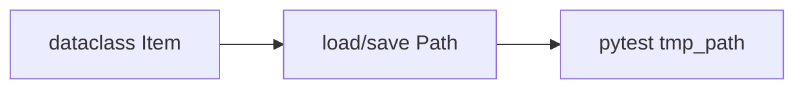
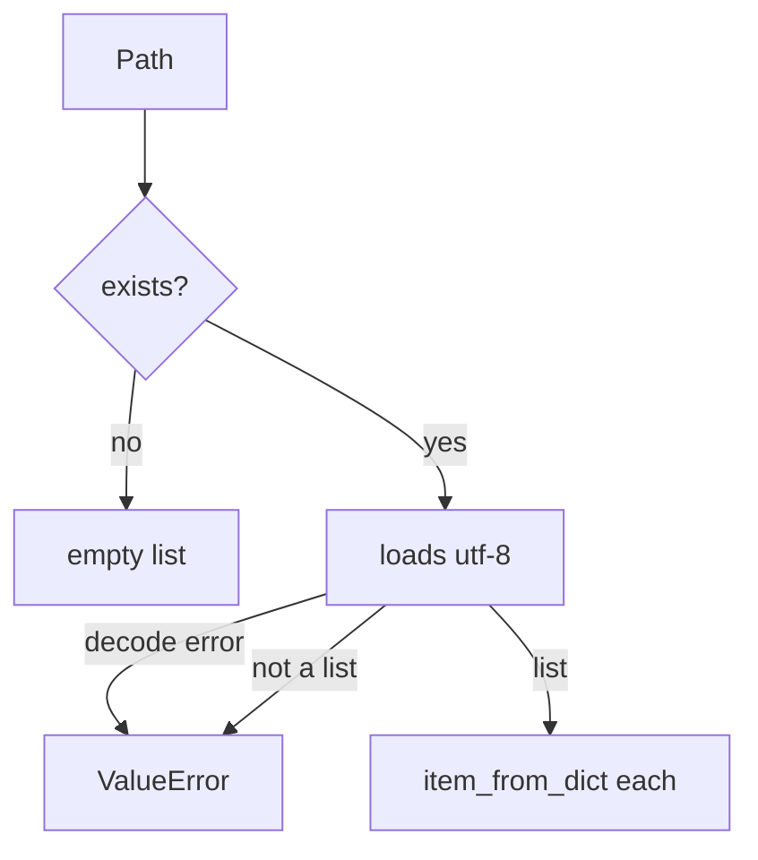

# Month 8 · Week 4 · Day 3
# From Memory: Hints, Files, and pytest

**Program:** Full-Stack Mastery · 18 months  
**Phase:** 3 — Python and backend  
**Month index:** [../../README.md](../../README.md)  
**Week 4:** [1](day-01.md) · [2](day-02.md) · Day 3 (today) · [4](day-04.md) · [5](day-05.md) · [6](day-06.md) · [7](day-07.md)  
**Week rhythm today:** Implement from memory  
**Study time:** 3–4 focused hours  
**Days 1–2 of this week:** closed during the drills. Repair from **those day files in this textbook**.

---

## How to read this chapter

This recap **is** the lesson. Rebuild a dataclass, a JSON loader, and a pytest file. Prefer `uv run` if yesterday’s lab still exists; otherwise `py -3` + a copied loader is allowed **if** you document that Project 5 will still use `uv`.



Not allowed: pasting Day 1–2, AI loader, `except:`, `eval`, pickle, FastAPI. Not allowed: pasting a Project 5 CLI. This lab is `itemmod.py`.

---

## Complete explanation (Week 4 so far)

### Hints

`def f(x: str) -> int`. `str | None`. Not enforced at runtime. Checkers optional. `Any` avoided.

A hint is a note. `item_from_dict(d: dict)` will still accept a list at runtime until you `isinstance(d, dict)` yourself. TypeScript erased types in the browser. Python erases hints unless a checker or a dataclass (or Pydantic, Month 9) reads them. Do not claim “it is typed so it cannot be wrong.”

### Dataclass

`@dataclass` generates `__init__`/`__repr__`/`__eq__`. `field(default_factory=list)` not `= []`. `__post_init__` for invariants.

`tags: list[str] = []` on a dataclass is the Week 3 mutable-default trap at **class** scope. One list shared by every Item that omitted tags. `field(default_factory=list)` builds a new list per instance. If today’s Item has no tags field, still say that sentence aloud so Day 6 does not ship it.

Equality on a dataclass is field equality. After save/load, `loaded[0] == original` should be True even if `loaded[0] is not original`.

### Decorators

`@g` means `f = g(f)`. Factory: `@app.get("/x")` is `get` returning a decorator. `*args` `**kwargs` on wrappers. `functools.wraps`.

`@dataclass` is already a decorator. You do not need a second custom decorator in the spec. If you finish early, a tiny `@dataclass` is the example.

### Generators

`yield` → iterator. Call does not run until iterate. Not async.

`def two(): yield 1; yield 2` then `list(two())` is `[1, 2]`. `two()` alone is a generator object. Printing it is not `[1, 2]`. Warm-up exists so you see that.

### `with` and Path

Files close on error. `Path`, `encoding="utf-8"`. `/` joins.

`Path.write_text(s)` without encoding may use the locale. Always `encoding="utf-8"` for JSON. A title `"café"` is a good extra test on Windows.

### JSON

`loads`/`dumps`. Missing file. Empty. `JSONDecodeError`. Shape `isinstance`. `None`↔`null`. No `eval`.

Missing path → `[]` (first run of a store). Empty or whitespace file → `[]`. Garbage text → `ValueError` (chain from `JSONDecodeError` if you can). `{}` is a dict, not a list of items — `ValueError`. `null` is `None` after parse — `ValueError`. Do not `eval` the file. JSON is data.

### uv / pyproject / Ruff

Project env. `uv add` / `uv run`. Ruff check/format. Do not depend on global pytest.

Day 6 Project 5 must use `uv`. If today you only have `py -3`, write `LOOKUPS.txt`. Do not pretend `pip install --user pytest` is the course tool.

### pytest fixtures

Parameter names. `tmp_path`. Fresh data per test.

`tmp_path` is a `Path` to a unique directory per test. Write `tmp_path / "items.json"`. Do not write `./data.json` in the repo. Tests that share a file in the lab folder flake and pollute git.

### Async peek

`async def`, `await asyncio.sleep`, `asyncio.run`. Calling without run returns coroutine. Not FastAPI.

### Weeks 1–3 still true

`==`, `is None`, no mutable def defaults, no bare except, comprehensions, KeyError vs get.

**Wrong belief:** “json.load cannot fail if the file exists.”  
**Correct:** content can be garbage.

**Wrong belief:** “I’ll `Item(**json.loads(text))` on the whole file.”  
**Correct:** the file is a **list** (or an envelope). Each element is a dict. Map with `item_from_dict`. Extra keys, missing keys, blank titles — your factory’s job.

**Wrong belief:** “Hints enforce types, so I can skip `isinstance`.”  
**Correct:** hints are notes. `item_from_dict` still checks or lets `d["id"]` fail.

---

## Today's contract

**Today's gate**

> Dataclass + loader + a pytest (or assert) test using a temp path: missing file default, malformed rejected, round-trip list of dicts or dataclasses.

---

## Time box

| Block | Minutes | Work |
|---|---|---|
| A | 25 | Speak first |
| B | 35 | Warm-up hints + yield |
| C | 100 | Spec: `itemmod.py` + `test_itemmod.py` |
| D | 20 | Git + lookups |

---

# Block A — Speak first

1. Runtime vs hints.
2. `default_factory`.
3. `@deco` assignment.
4. Missing vs malformed JSON.
5. Why `uv run`.
6. What `tmp_path` is.

If (1) is “Python checks types now,” re-read the hints subsection. Do not start the spec yet.

---

# Block B — Warm-up

`warm.py`: annotate `def ident(x: int) -> int: return x`; call with `"hi"`; write what happened. Generator `def two(): yield 1; yield 2`; print `list(two())`.

`PREDICT.txt` / `ACTUAL.txt`.

The ident call **runs**. You get `"hi"` back. That is the erasure lesson. The generator list is `[1, 2]`.

---

# Spec

`~\fullstack-lab\month-08\week-04\day-03\`

`itemmod.py`:

- `@dataclass class Item` with `id: str`, `title: str`, `status: str = "open"`
- `def item_from_dict(d: dict) -> Item` — KeyError if missing id/title; validate title not blank
- `def load_items(path: Path) -> list[Item]` — missing/empty `[]`; malformed ValueError; list of dicts mapped through `item_from_dict`
- `def save_items(path: Path, items: list[Item]) -> None` — dump list of dicts (`dataclasses.asdict`)

Tests: `tmp_path` if pytest; else write to a file under the folder and delete in `finally` (weaker — prefer pytest).

Cases: missing file; `NOT JSON`; `{}` shape; round-trip one Item; blank title in dict raises.

### Worked load table

| File situation | `load_items` |
|---|---|
| path does not exist | `[]` |
| file exists, zero bytes or only whitespace | `[]` |
| `NOT JSON` | `ValueError` (chain `from JSONDecodeError` if you can) |
| `{}` | `ValueError` expected a list |
| `null` (`None` after parse) | `ValueError` |
| `[{"id":"1","title":"Harbor"}]` | one `Item` |
| `[{"id":"1","title":"  "}]` | `ValueError` blank title |

`save_items` then `load_items` on the same `tmp_path / "x.json"` must equal the original Item (`==` because dataclass compares fields).

### Hints still do not save you

`item_from_dict` annotated `d: dict` will still accept a list at runtime until you `isinstance(d, dict)` yourself. Put that check in or let `d["id"]` TypeError. Document.

### Decorator / yield not required in the spec

If you finish early: a tiny `@dataclass` is already a decorator. A generator `def iter_open(items): ... yield item` is extra credit with one test.

### `uv` reminder

```powershell
uv run pytest
# or py -3 -m pytest if you are inside uv-lab with these files copied
```

If pytest is painful, `py -3 test_itemmod.py` with a try/finally temp file **and** `LOOKUPS.txt` saying you still owe `uv` on Day 6.

### Worked `item_from_dict`

Missing `id` → KeyError (required). Blank title after strip → ValueError. Extra keys in the dict: ignore or reject — document. `status` default `"open"` if missing (`d.get("status", "open")`).

Round-trip: `Item(id="1", title="Harbor")` save load `==` original. Dataclass equality is field equality.

`Path` in the signature: `from pathlib import Path`. Tests pass `tmp_path / "n.json"`. Catch `FileNotFoundError` for missing. Catch `JSONDecodeError` and raise `ValueError`. Do not `except:`.

**Wrong belief:** “I’ll open with `'w'` and forget encoding.”  
**Correct:** `encoding="utf-8"` on Windows especially.

```powershell
git add month-08/week-04/day-03
git commit -m "Month 8 Day 3: dataclass JSON loader from memory."
```

---

# Lecture: four JSON situations, four answers

**Missing file.** First run of a store. Return `[]`. Catch `FileNotFoundError`. Do not create the file on load unless a later spec says save-on-read — creating on load hides “I never saved.”

**Empty file.** Zero bytes or whitespace. Treat as `[]`. `json.loads("")` is `JSONDecodeError`. Strip first; if empty, return `[]` before parse.

**Malformed.** `NOT JSON`. Catch `JSONDecodeError`, raise `ValueError` (chain with `from` if you can). Tests look for ValueError. Bare `except` is still banned.

**Wrong shape.** `{}` or `null` or a list of strings. After parse, `isinstance(data, list)` or ValueError. Then each element through `item_from_dict`. Missing `id` → KeyError. Blank title → ValueError. Extra keys: ignore or reject — document.

**Round-trip.** `save_items` uses `asdict` (or explicit fields). `load_items` maps dicts to Item. `loaded[0] == original` because dataclass `__eq__` compares fields. `is not` is fine. If equality fails, you dropped a field.

**tmp_path.** Per-test directory. `tmp_path / "x.json"`. Do not write `data.json` in the lab folder. Do not commit fixtures that tests mutate.

**uv run pytest** is the project interpreter. Global pytest is a different world of packages. Day 6 Project 5 will not accept “I used whatever Python had pytest.” If you cannot `uv run` today, LOOKUPS.txt owes it.

**Hints.** `ident("hi")` still returns `"hi"`. Warm-up exists so you stop believing annotations enforce. `item_from_dict` still checks or lets KeyError speak.

**Windows encoding.** `encoding="utf-8"` on read and write. `"café"` as an extra title is a good test.

Do not paste a CLI. Do not `eval`. Do not pickle. `itemmod.py` is the exam.

---

## Definition of done

- [ ] Dataclass exists
- [ ] Malformed JSON handled
- [ ] Round-trip test
- [ ] No `except:`
- [ ] Commit exists

---

# Worked session — load table you can reciting

Missing path → `[]`. Empty file → `[]`. `NOT JSON` → ValueError. `{}` → ValueError. `null` → ValueError. List of one good dict → one Item. Blank title in dict → ValueError. Save then load on `tmp_path / "x.json"` → `==` original Item.

Warm-up: `ident("hi")` still returns `"hi"` (hints do not enforce). `list(two())` is `[1, 2]`. PREDICT before ACTUAL.

Prefer `uv run pytest`. Else `py -3` plus LOOKUPS.txt that you still owe `uv` on Day 6. `encoding="utf-8"`. No `except:`. No `eval`. No pickle. No FastAPI. No Project 5 CLI. `item_from_dict` is the edge; `asdict` is the other edge.

If tests write `./data.json` in the repo, switch to `tmp_path`. If round-trip fails equality, you dropped a field. If `Item(**d)` TypeErrors on extra keys, map explicitly.



---

## Optional review links

Hints, dataclasses, JSON, and pytest paths are explained in this chapter. These pages are for later checking, not for first learning.

- [dataclasses](https://docs.python.org/3/library/dataclasses.html)
- [json](https://docs.python.org/3/library/json.html)
- [pytest tmp_path](https://docs.pytest.org/en/stable/how-to/tmp_path.html)

---

## Tomorrow

Lab: a slightly larger store module (still not Project 5 CLI) with fixture-backed tests.

### Common mistakes today

| Mistake | Fix |
|---|---|
| hints believed to enforce | `isinstance` / raise |
| `json.loads` without empty-file guard | strip empty → `[]` |
| tests writing `./data.json` in the repo | `tmp_path` |
| `except:` around load | `FileNotFoundError` and `JSONDecodeError` / `ValueError` |
| dataclass `tags=[]` | `default_factory` — if you added tags |

`item_from_dict` is the edge: JSON dict → Item. `asdict` is the other edge. Tests prove both. If you `Note(**d)` and JSON has extra keys, TypeError — explicit fields are kinder.

If pytest is not in this folder, copy the idea into yesterday’s `uv-lab` **or** `py -3 -m pytest` after `uv add` here. Document. Day 6 Project 5 will not accept “I used global pytest.”

---

# Closing lecture — four JSON answers and a temp path

Missing file → `[]`. Empty or whitespace → `[]`.
Malformed → ValueError (from `JSONDecodeError`).
Wrong shape (`{}`, `null`, not a list) → ValueError.
Good list → `item_from_dict` each row. Blank title → ValueError.
Missing `id` → KeyError. Round-trip dataclass `==` on fields.

`tmp_path / "x.json"` per test. Do not write `data.json` in the repo.
`encoding="utf-8"` on Windows. No `eval`. No pickle. No `except:`.

Hints do not enforce. Warm-up `ident("hi")` returns `"hi"`.
`@dataclass` is already a decorator. `yield` is an iterator, not async.
`uv run pytest` is the course tool. Global pytest is a different world.
LOOKUPS.txt if you still owe `uv` on Day 6. Do not paste Project 5.

If equality fails after save/load, a field was dropped in `asdict` or the factory.
If tests pass on a garbage file, you did not catch decode errors.
`Path` in the signature. Tests pass `tmp_path / "n.json"`.
Catch `FileNotFoundError` separately from `JSONDecodeError`.
Dataclass equality is field equality. `is not` after load is expected.
A title `"café"` is a good extra encoding test on Windows.
Day 6 Project 5 uses `uv` in `~/task-cli/`. Today is `itemmod.py` only.


## Recite-back checklist (close the editor, then tick)

Write `RECITE.txt` with one honest sentence per line.
If a line is mush, re-read the matching section in **this** file only.

- [ ] hints do not enforce at runtime
- [ ] missing JSON → `[]`; malformed → ValueError
- [ ] `tmp_path` not `./data.json`
- [ ] `encoding="utf-8"`
- [ ] dataclass round-trip `==`
- [ ] no `except:` / no `eval`
- [ ] `uv run pytest` or LOOKUPS.txt owes uv
- [ ] not Project 5

Four JSON situations, four answers. Recite them. Then commit `itemmod.py`.
