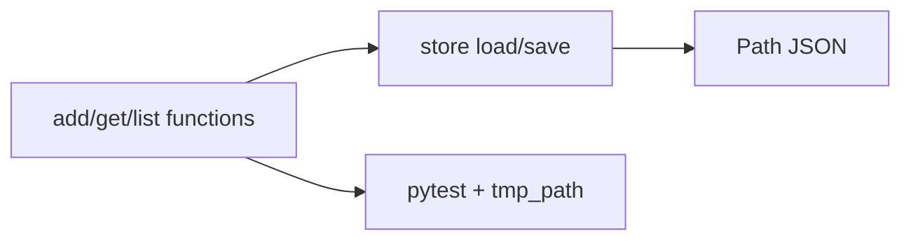

# Month 8 · Week 4 · Day 4
# Lab: A Tiny JSON Store (Still Not the CLI)

**Program:** Full-Stack Mastery · 18 months  
**Phase:** 3 — Python and backend  
**Month index:** [../../README.md](../../README.md)  
**Week 4:** [1](day-01.md) · [2](day-02.md) · [3](day-03.md) · Day 4 (today) · [5](day-05.md) · [6](day-06.md) · [7](day-07.md)  
**Week rhythm today:** Add a real lab feature  
**Study time:** 3–4 focused hours

This is **not** Project 5. No `argparse` command tree. No complete issue tracker. You build a **store module** that load/save/add/get — the persistence *idea* behind a CLI — with pytest and `Path`.

---

## How to read this chapter

The CLI layer prints. The store **returns**. Tests never need `print`. JSON on disk is the persistence. Malformed files are a **branch**, not a prayer.



---

## Today's contract

1. Dataclass record + `Store` **or** module functions with an explicit `path: Path`.
2. Load/save with missing / empty / malformed / bad shape handling.
3. `add` duplicate id raises; `get` missing raises.
4. pytest fixtures: `tmp_path` and one custom fixture of sample items.
5. Type hints on public functions.

**Today's gate**

> `uv run pytest` (or documented runner) is green. Tests do not use a JSON file in the repo as the only store — they use temp paths.

---

## Time box

| Block | Minutes | Work |
|---|---|---|
| A | 40 | Theory: Store composition, dump format |
| B | 40 | Type-along: fixture + tmp json |
| C | 90 | Spec: `store.py` + `models.py` + tests |
| D | 20 | Git |
| E | 15 | Recall |

---

# Block A — Theory

## 1. Composition: Store has a Path

```python
class Store:
    def __init__(self, path: Path):
        self._path = path

    def load(self) -> list[Item]:
        ...
```

The store **has** a path. It is not a subclass of `list`. Functions `load(path)`, `save(path, items)` are equally honest. Pick one.

## 2. On-disk shape

Recommend:

```json
{
  "version": 1,
  "items": [
    {"id": "t1", "title": "Harbor", "status": "open"}
  ]
}
```

Version tag is the Month 3 habit. Loader: if missing file → `{version: 1, items: []}` equivalent. If `items` missing or not a list → `ValueError`. Unknown version: document (reject or accept 1 only).

You may store a bare list for simplicity. Then document that Project 5 should still consider a version field. **Do not** implement the full CLI schema from the requirements file as a paste of product code — invent **three fields**.

## 3. Safe write (practical)

Write to `path.with_suffix(".json.tmp")` then `os.replace(tmp, path)`. Windows `replace` overwrites. If this fights you, `write_text` is acceptable **today** with a comment that Project 5 should try atomic replace.

## 4. Logging peek

`import logging` — `logging.info("store loaded %s", path)`. Do not log item titles if you consider them sensitive (they are not passwords; still no secrets). Project 5 asks start/storage failures/unexpected. Today: one `logging.warning` on malformed optional, or skip if noisy. Do not `print` from `store.py`.

## 5. Decorator not required in the store

Do not `@` everything. One optional `@dataclass`. Save decorator practice for a `trace` wrapper if extra credit.

## 6. JS contrast

This is `localStorage` + `JSON.parse` with **filesystem** exceptions. `tmp_path` is a test-only disk, like an isolated origin.

---

# Block B — Type-along

In `~\fullstack-lab\month-08\week-04\day-04\` (uv init if this folder is new, or reuse uv-lab by placing packages — **simpler: uv init here**).

```powershell
cd ~\fullstack-lab\month-08\week-04\day-04
uv init
uv add pytest ruff
```

Fixture:

```python
@pytest.fixture
def store_path(tmp_path):
    return tmp_path / "items.json"
```

One test: load missing → empty items.

---

# Block C — Spec

`models.py` — `Item` dataclass (`id`, `title`, `status`, optional `priority: int = 0`).

`store.py` — load/save/add/get (add/get may live in `ops.py` importing store — two modules minimum).

Rules: blank title ValueError; duplicate ValueError; missing get LookupError/KeyError/custom.

`test_store.py` — fixtures; malformed file (`write_text("NOT JSON")`); round-trip; duplicate; missing get.

`README.md` — run commands: `uv run pytest`, `uv run ruff check .`. Not a CLI.

Generator extra: `iter_open(items)` yields open items. One test `list(iter_open(...))`.

### On-disk example (you type; this is a shape)

```json
{
  "version": 1,
  "items": [
    {"id": "n1", "title": "Harbor", "status": "open", "priority": 0}
  ]
}
```

Loader algorithm in words: if not `path.exists()` return empty store; read UTF-8; if strip empty return empty; `json.loads`; if not dict or version not 1 or items not list → ValueError; map each dict through `item_from_dict`.

### Fixture pattern (type this idea)

```python
@pytest.fixture
def store_path(tmp_path):
    return tmp_path / "items.json"

@pytest.fixture
def sample_item():
    return Item(id="n1", title="Harbor", status="open")
```

`test_round_trip(store_path, sample_item)` saves `[sample_item]`, loads, asserts title.

### Logging

If you log, use `logger = logging.getLogger(__name__)`. Do not log the whole file contents in tests (noise). One warning on malformed is enough.

### Ruff

`uv run ruff check .` then fix F401. `uv run ruff format .` so the exam day is not your first format.

**Wrong belief:** “I’ll save JSON next to the test file in git as `seed.json` and tests will use it.”  
**Correct:** `tmp_path`. Seed files in git get edited and flake CI later. Project 5 tests must not require your home directory’s real task file.

### Envelope vs bare list

A versioned envelope `{ "version": 1, "items": [ ... ] }` lets you migrate later (Month 11 habits). A bare list is simpler and is what the exam mini will use. Pick **one** for this lab and test the failure when the other shape appears (`{}` without `items`, or a list when you expected a dict).

Loader sketch (envelope):

1. Missing / empty → empty items (version 1).
2. `json.loads`.
3. If not `dict` → ValueError.
4. If `data.get("version") != 1` → ValueError (or document accept).
5. `items = data.get("items")` — if not a list, ValueError.
6. Map each with `item_from_dict`.

### Store composition vs functions

`class Store:` with `self._path` is has-a Path. Functions `load(path)` / `save(path, items)` are also composition (the path is an argument). Either is honest. `class Store(list)` is not. `class Store(dict)` is not.

`add`/`get` can live on `Store` **or** in `ops.py` that calls `store.load()`, mutates a list in memory, `store.save()`. Tests can use a `Store(tmp_path / "x.json")` fixture.

### Atomic replace (practical)

```python
tmp = path.with_name(path.name + ".tmp")
tmp.write_text(text, encoding="utf-8")
tmp.replace(path)  # pathlib; similar to os.replace
```

If replace fails mid-way you can still have a `.tmp` leftover — tests using `tmp_path` will not care. Comment in README that Project 5 should try this.

### Logging vs print

`store.py` must not `print`. `logging.getLogger(__name__).warning("malformed %s", path)` is enough. Tests should not depend on log text unless you like caplog (optional pytest fixture — extra).

### Generator extra

```python
def iter_open(items: list[Item]):
    for it in items:
        if it.status == "open":
            yield it
```

One test: `list(iter_open(items))` length. This is the “one sensible generator” the Project 5 spec asks you to demonstrate *somewhere*.

```powershell
git add month-08/week-04/day-04
git commit -m "Month 8 Week 4 Day 4: JSON store lab with pytest."
```

Ignore `.venv`.

---

# Block E — Recall

1. Why tests use `tmp_path`.
2. Version wrapper vs bare list.
3. Store has-a Path.
4. Atomic replace idea.

### JS contrast you must say aloud

`localStorage` key vs a `Path`. Isolated origin vs `tmp_path` (tests must not use the operator’s real file). `JSON.stringify({version:1, items})` was Month 3; today the same envelope on disk. Atomic replace is `os.replace`; browsers do not give you that for `localStorage`. Logging vs `console.log` — use `logging` in libraries, not print.

---

## Definition of done

- [ ] Two modules
- [ ] pytest green via uv if possible
- [ ] Malformed JSON test
- [ ] Hints on public functions
- [ ] Commit without `.venv`

---

## Optional review links

- [pathlib](https://docs.python.org/3/library/pathlib.html)
- [pytest fixtures](https://docs.pytest.org/en/stable/explanation/fixtures.html)

---

## Tomorrow

More pytest: `pytest.raises`, fixture factory of Items, one regression test after a bug you cause.

---

## Store lab — operator story (still not a CLI)

An operator will later type `task-cli add --title Harbor`. Today you simulate that with:

```python
items = store.load()
items = add(items, Item(id="n1", title="Harbor", status="open"))
store.save(items)
```

`add` is testable without disk. `load`/`save` are testable with `tmp_path`. `cli.py` does not exist. If you wrote argparse, delete it. The Project 5 spec is not today’s paste target.

### Malformed file test (type this idea)

```python
def test_malformed(store_path):
    store_path.write_text("NOT JSON", encoding="utf-8")
    with pytest.raises(ValueError):
        load_items(store_path)  # or Store(store_path).load()
```

Missing file is **not** malformed. Separate test: path that does not exist → empty items.

### Round-trip

Save `[Item(id="n1", title="café", status="open")]`. Load. `==` original. UTF-8. Windows locale is not UTF-8 by default — `encoding="utf-8"` is the test.

### Ruff on the lab

`uv run ruff check .` then `uv run ruff format .`. Unused `json` import is F401. Fix. Gate 8 starts as a habit today, not on exam afternoon.

**Wrong belief:** “I’ll hard-code `Path.home() / 'items.json'` so it feels real.”  
**Correct:** tests would write into your home directory. Inject Path. CLI default path is Day 6’s decision, not this lab’s global.

---

## Files in the lab folder

```text
~\fullstack-lab\month-08\week-04\day-04\
  pyproject.toml     # uv init
  models.py          # Item dataclass
  store.py           # load/save (and maybe add/get)
  ops.py             # add/get if not on Store — optional split
  test_store.py
  conftest.py        # optional fixtures
  README.md
  .venv/             # gitignored
```

`uv run pytest` from this folder. If collection is 0, rename to `test_*.py` and put `def test_...`.

Public functions: type hints (`path: Path`, `-> list[Item]`). Runtime still will not reject a str path if you pass one — `Path` constructor may coerce; tests pass `tmp_path / "x.json"`.

Logging: `logger = logging.getLogger(__name__)`. No passwords. No `print` in store.

Generator: `iter_open` extra with one test. Dataclass `default_factory` if you add tags.

This is still not `~/task-cli/`. Do not copy this lab wholesale into Project 5 without understanding each line. Ideas transfer; paste fails the course.

---

## Safe write comment (required in README even if you skip the code)

Project 5 asks safe write where practical. Today you may `path.write_text`. README one sentence: “Week 4 lab writes directly; Project 5 should write a temp file then `Path.replace`.” If you implement replace today, test that the final path exists and the `.tmp` is gone (or acceptable leftover in `tmp_path`).

Empty file vs missing file: both → empty items. Malformed vs `{}` wrong shape: both → ValueError, **different** tests. `null` JSON → ValueError. Do not `eval`. Do not pickle.

`uv run pytest` green is the gate, not `py -3 probe.py` (you should not need a probe if tests speak). A tiny `probe.py` that loads missing and prints `0 items` is optional glue.

---

## Hints on `Store` / `load`

```python
def load_items(path: Path) -> list[Item]:
    ...

def save_items(path: Path, items: list[Item]) -> None:
    ...
```

`None` return on save is implicit. Do not `return items` from save unless you document it — tests should not need the return to prove disk. Load after save.

Decorator: `@dataclass` is the one `@` this lab needs. Do not wrap `load` in a custom decorator for style points.

Async: do not `async def load`. Peek was Day 2. Persistence is sync. Month 9 can await a database; JSON files here are `read_text`.
