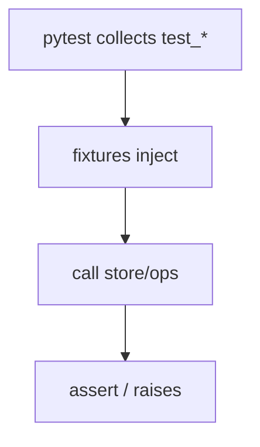

# Month 8 · Week 4 · Day 5
# pytest in Earnest: `raises`, Fixtures, Regression

**Program:** Full-Stack Mastery · 18 months  
**Phase:** 3 — Python and backend  
**Month index:** [../../README.md](../../README.md)  
**Week 4:** [1](day-01.md) · [2](day-02.md) · [3](day-03.md) · [4](day-04.md) · Day 5 (today) · [6](day-06.md) · [7](day-07.md)  
**Week rhythm today:** Tests + refactor + documentation  
**Study time:** 3–4 focused hours  
**Student state:** You have a JSON store lab. Today pytest becomes the **default** runner for that lab (and the muscle memory for Project 5).

---

## How to read this chapter

Arrange / act / assert still holds. pytest adds **collection**, **fixtures**, **`raises`**, and assertion introspection (you see left vs right). Ruff stays green if you format.



---

## Today's contract

1. Use `pytest.raises` for blank, duplicate, missing, malformed JSON.
2. A fixture that returns a **new** `list[Item]` every test.
3. A fixture that returns a `Store` pointed at `tmp_path`.
4. One **regression** test: you introduce a bug, write a test that fails, fix the bug, test stays.
5. `uv run pytest` and `uv run ruff check` documented.

**Today's gate**

> I broke production code, watched a new test fail, restored the code, and kept the test.

---

## Time box

| Block | Minutes | Work |
|---|---|---|
| A | 40 | Theory: raises, conftest, parametrize peek |
| B | 40 | Regression drill |
| C | 80 | Expand tests + ruff |
| D | 20 | Git |
| E | 15 | Recall |

---

# Block A — Theory

## 1. `pytest.raises`

```python
from pytest import raises

def test_blank():
    with raises(ValueError):
        item_from_dict({"id": "1", "title": "  "})
```

The `with` block **must** raise or the test fails. You can `with raises(ValueError, match="title"):` to regex the message — optional.

JS: `assert.throws`. Same claim.

## 2. Fixture that builds a store

```python
@pytest.fixture
def store(tmp_path):
    return Store(tmp_path / "db.json")
```

Tests take `store` as a parameter. Do not share one Store at module level.

## 3. `conftest.py`

Optional file pytest loads for fixtures. If `test_store.py` and `test_ops.py` both need `sample_items`, put the fixture in `conftest.py` next to them.

## 4. Parametrize peek

```python
@pytest.mark.parametrize("raw", ["", "  ", "\n"])
def test_blank_title(raw):
    with raises(ValueError):
        ...
```

One test, many blanks. Optional; at least one parametrize **or** three explicit tests.

## 5. Regression

A **regression test** locks a bug that escaped. Procedure today:

1. Change `search` so blank query returns all rows (bug).
2. Write `test_blank_search_returns_empty` — it **fails**.
3. Restore `search`. Test **passes**.
4. Keep the test forever.

Project 5 requires at least one regression test after a **real** bug. Practice the loop now.

## 6. What not to test

Do not assert Ruff’s formatting. Do not snapshot entire tracebacks. Do not hit the real home directory. `tmp_path` only.

## 7. Coverage? Optional

`pytest --cov` is extra. Not required this month. Correctness first.

---

# Block B — Type-along

On the Day 4 lab (or a copy in day-05): run the regression drill on **blank search** or **empty JSON file**. Write `REGRESSION.md`: bug, test name, commit-worthy one sentence.

---

# Block C — Independent

Minimum tests (names yours):

| Area | Tests |
|---|---|
| create/add | success, duplicate, blank title |
| get | hit, missing |
| search/filter | blank, `"0"`, status |
| persistence | round-trip, missing file, malformed, wrong shape |
| mutation | in-memory list unchanged if API says so |

`uv run ruff check .` — fix unused imports.

`TEST.md`: commands for run, lint. Note `uv run python -m ...` if you have a module later.

### Regression write-up template

`REGRESSION.md`:

1. What you changed to create the bug (blank search returns all rows).
2. Test name that failed.
3. Traceback last line (AssertionError / unexpected list length).
4. The fix (restore strip-empty → `[]`).
5. Why the test stays: someone will “simplify” search again.

### `conftest.py` optional

If two test files need `sample_items`, move the fixture. Do not move production code into `conftest.py`.

### Parametrize blanks

```python
@pytest.mark.parametrize("q", ["", "  ", "\t"])
def test_search_blank(store, q):
    with pytest.raises(ValueError):
        ...  # or assert search(..., q) == []
```

Search blank is `[]` not raise — unless you designed raise. This lab’s Week 2 rule was `[]`. Stay consistent with your store API. Parametrize the **queries**, not random unrelated cases in one test.

### What green means

All collected tests pass. A skipped test is not a pass you earned. `pytest -k dup` to run a subset while debugging — then run the full file before commit.

**Wrong belief:** “Ruff failing is optional if pytest is green.”  
**Correct:** Month 8 gate item 8 is Ruff **and** tests. Fix both.

### `pytest.raises` failure modes

- Body does **not** raise → test fails (`DID NOT RAISE`).
- Body raises **wrong** type (`KeyError` vs `ValueError`) → test fails.
- Body raises expected type → pass.

`match=` is a regex on `str(exc)`. Keep it loose (`"blank"` or `"title"`) so you can reword messages.

### Fixture factories

```python
@pytest.fixture
def item_factory():
    def _make(**overrides):
        base = {"id": "n1", "title": "Harbor", "status": "open"}
        base.update(overrides)
        return item_from_dict(base)
    return _make
```

Tests: `item_factory(title="Yard")`. Each call is a new Item. This is how you avoid a shared mutable sample.

### Regression is a loop, not a souvenir

If you skip step 2 (test that fails on the bug), you do not have a regression test. You have a comment. The test must have been **red** on the buggy code.

### What pytest collects

Files `test_*.py` or `*_test.py`. Functions `test_*`. Classes `Test*` with `test_*` methods — optional, no `self` needed if you use functions. A `test_store.py` that only defines helpers and never `test_` functions collects **zero** tests and exits 0 — a lie. `uv run pytest -q` should show a number greater than 0.

### Isolation

Do not read `~\task-cli\tasks.json` from this lab. Do not skip tests with `@pytest.mark.skip` to go green. `tmp_path` only.

```powershell
git add month-08
git commit -m "Month 8 Week 4 Day 5: pytest.raises, fixtures, regression."
```

---

# Block E — Recall

1. `raises` fails when?
2. Why module-level Store is like module-level `ROWS`.
3. What a regression test protects.
4. `match=` on raises.

### JS contrast you must say aloud

A regression test is the same idea as Month 3: someone “simplifies” `isBlank` to `!s` and tests go red. Parametrize is like a loop of `test()` calls. `conftest.py` is shared setup — not a dumping ground for production. Ruff is ESLint+Prettier energy in one tool. Gate 8 needs both pytest and Ruff.

---

## Definition of done

- [ ] `pytest.raises` used
- [ ] Custom fixture + `tmp_path`
- [ ] Regression.md recorded
- [ ] Ruff check run
- [ ] Commit exists

---

## Optional review links

- [pytest.raises](https://docs.pytest.org/en/stable/how-to/assert.html#assertions-about-expected-exceptions)
- [parametrize](https://docs.pytest.org/en/stable/how-to/parametrize.html)

---

## Tomorrow

**Start Project 5** in a **new git repo**. Plan commands in README. You will **not** finish the CLI in one day. This textbook still will not contain the product source.

---

## pytest command cheatsheet (Windows)

```powershell
cd ~\fullstack-lab\month-08\week-04\day-04
uv run pytest
uv run pytest -q
uv run pytest test_store.py::test_malformed -vv
uv run ruff check .
uv run ruff format .
```

If `uv` is missing, install it (Day 2). Do not fall back to a global pytest and call the gate done.

### Fixture injection is not magic

```python
def test_round_trip(store, sample_item):
    ...
```

pytest sees the parameter names, finds fixtures with those names, calls them, passes the results. A typo `sampel_item` is `fixture not found`. Read the error. There is no `===`. There is no `inject()` you write yourself.

### Regression example you may use

Bug: `load` treats malformed JSON as `[]` (too kind — you hide corruption). Test: write `NOT JSON`, expect ValueError. If load swallows JSONDecodeError and returns `[]`, the test is red. Restore raise. Keep the test. Project 5 persistence tests include malformed — this is that muscle.

**Wrong belief:** “Regression means I remember the bug.”  
**Correct:** a test that failed on the bug and still exists.

### What not to assert

- exact Ruff version
- full traceback strings
- timestamps that change every run (if you added created_at today, freeze time or do not assert the clock yet — Project 5 will need a strategy; today three fields are enough)

---

## Regression.md is evidence

A TA should believe you:

1. Introduced a real bug (not a comment that says you did).
2. Wrote a test that failed.
3. Restored production code.
4. Kept the test.

Paste the **test name** and the **last line** of the failing traceback. Do not paste Project 5. Do not paste a complete store.

`uv run pytest` after restore: all green. `uv run ruff check .`: clean or documented.

Tomorrow you start `~/task-cli/` — **new git repo**, not a copy of this lab as the product. This lab taught JSON + fixtures. Project 5 is eight commands and a README you write.
