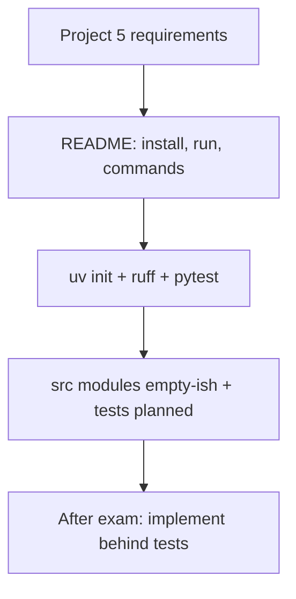

# Month 8 · Week 4 · Day 6
# Start Project 5 — Repo, `uv`, Commands on Paper

**Program:** Full-Stack Mastery · 18 months  
**Phase:** 3 — Python and backend  
**Month index:** [../../README.md](../../README.md)  
**Week 4:** [1](day-01.md) · [2](day-02.md) · [3](day-03.md) · [4](day-04.md) · [5](day-05.md) · Day 6 (today) · [7](day-07.md)  
**Week rhythm today:** Independent project work — **start**, do not finish  
**Study time:** 3–4 focused hours  
**Student state:** You can hint, dataclass, JSON-load, pytest, Ruff, `uv`. Today those skills move into **their own repository**.

**Spec (read as requirements, not as source):** `full_stack_project_requirements_2026/project_05_tested_python_cli.md`  
**This textbook will not give you the CLI.** If a website offers a “complete task CLI,” that is a different assignment — fail this one.

**Repo:** `~/task-cli/` (or `~\task-cli\` on Windows). **Not** inside `fullstack-lab`. Git from commit one.

Days 1–5 of this week stay available as *language* repair, not as files to copy-paste into the product until you understand each line you type.

---

## How to read this chapter

Project 5 is a **personal task / issue tracker CLI**: create, list, show, update, delete, search, filter, complete — persisted in JSON — tested with pytest — typed — modular. Today you **scaffold and plan**. A finished CLI on Day 6 is a red flag (you pasted). A README with commands, a `pyproject.toml`, failing or empty tests, and **one** working function (`normalize_title`) is a green flag.



Allowed: the requirements file, this chapter, your Week 4 JSON-store *ideas*, Python docs.  
Not allowed: pasting a full argparse app from AI or GitHub; putting business logic only in `print`.

---

## Complete explanation (what you are starting)

### Product

A command-line program an operator runs in PowerShell:

```powershell
uv run task-cli create --title "Harbor leak"
uv run task-cli list
uv run task-cli show <id>
```

Exact command names are yours (`task`, `issues`, `todo`). The **verbs** must exist: create, list, show, update, delete, search, filter, complete/close.

Each item: id, title, description, status, priority, created_at, updated_at. Optional due, tags. **Type hints.** Dataclass appropriate.

### Architecture (from the spec’s *example* — not mandatory names)

```text
src/
  models.py      # dataclass Task
  repository.py  # JSON load/save, missing/malformed
  services.py    # create/update/search — no argparse
  cli.py         # parse argv, print, sys.exit codes
tests/
```

You may collapse repository+services if still testable. You may not put JSON + argparse + validation in **one** 400-line `main.py` as the final shape (first spike OK, then split — document the refactor).

**CLI input/output should not contain all business logic.** `cli.py` calls `services.create(...)` and prints the result or a one-line error. Tests import `services` / `repository` without capturing stdout as the only proof.

### Persistence

JSON file (path configurable via arg or env — document). Handle: missing file, empty file, malformed data, write failure (catch `OSError`, log, non-zero exit). Safe write where practical (`replace` temp file).

### Validation

Empty title, invalid priority/status, unknown id — **clear messages**, not raw tracebacks for expected mistakes. Unexpected bugs may still traceback (do not `except Exception: print("error")` everywhere).

### Exceptions

Raise in the core. Catch at the CLI edge for known types (`ValueError`, `KeyError`/`NotFound`). No bare `except`. No wrap-every-line.

### Tests (pytest)

Required later: create, update, delete, search/filter, invalid data, missing record, persistence. Fixtures (`tmp_path`, sample task). One regression after a real bug. **Today:** maybe `test_normalize.py` only.

### Tooling

`pyproject.toml`, `uv`, Ruff, pytest. Scripts/docs for run, lint, test. Logging: start, storage failures, unexpected — no secrets (there should be none).

### Documentation

README: install, run, example commands, structure, tests, decisions, limitations. **Today the README is the main deliverable** — example commands can be planned even if they fail.

### Refactor

After a first working version (later days / post-exam): refactor one ugly area; tests stay green. Not today.

### What Month 9 is not

No FastAPI. No Django. No database. No network.

---

## Today's contract

**Today's gate**

> A new git repo exists. `uv run pytest` runs (even if few tests). README lists the commands I will implement. I did not paste a complete CLI. Business logic is not designed as print statements.

If the repo already contains a full GitHub clone, delete it and start over. Ownership is the point.

---

## Time box

| Block | Minutes | Work |
|---|---|---|
| A | 25 | Read requirements + this recap; speak architecture |
| B | 40 | `uv init`, git, Ruff, pytest, src layout |
| C | 70 | README command plan + `models.py` dataclass + one test |
| D | 40 | `DECISIONS.md` + first commits |
| E | 15 | Recall / honesty check |

---

# Block A — Speak first

Out loud, requirements closed after one read:

1. Where JSON lives vs where argparse lives.
2. Three malformed-file behaviors.
3. Why `services.create` is tested without CLI.
4. Mutable default / dataclass `default_factory`.
5. Why this is not Month 9.

---

# Block B — Scaffold (you type)

Windows PowerShell example — adjust names:

```powershell
cd $HOME
mkdir task-cli
cd task-cli
git init
uv init
uv add pytest ruff
```

Create `src/` (or the layout `uv` gave you). Make a package: `src/taskcli/__init__.py` (empty is fine). Configure pytest `pythonpath` if imports fail — read the error; `uv init --package` if you prefer a package from the start. Document the import story in README.

`uv run ruff check .`  
`uv run pytest` — empty tests passing is OK.

`.gitignore`: `.venv`, `__pycache__`, `.ruff_cache`, `.pytest_cache`. **Never commit secrets.**

---

# Block C — Plan, do not finish

## README.md (required today)

Must include:

| Section | Content |
|---|---|
| Install | Python 3.12+, `uv sync` / `uv add` already done |
| Run | `uv run python -m taskcli ...` or a script you will add — **planned** |
| Example commands | one line each for create/list/show/update/delete/search/filter/complete — even if not implemented |
| Structure | tree of modules you chose |
| Tests | `uv run pytest` |
| Lint | `uv run ruff check .` / `format` |
| Decisions | JSON path, id strategy (uuid vs increment), status values |
| Limitations | not a server; not multi-user; not encrypted |
| Status | **Day 6: scaffold only** |

## `models.py`

Dataclass `Task` with the required fields. `field(default_factory=...)` for lists. Hints. **No argparse.**

## One real function + test

`normalize_title(s: str) -> str` in a small `text.py` or inside models. Test blank → you **raise** (decision documented). This is not the CLI.

## Command table in README (checklist)

Copy **as a checklist you will tick later**, not as implemented code:

- [ ] create
- [ ] list
- [ ] show
- [ ] update
- [ ] delete
- [ ] search
- [ ] filter
- [ ] complete/close

Do **not** paste a 200-line `cli.py` from a model. If you write `cli.py` today, it may `print("not implemented")` per command **or** only `--help` stub. Prefer **no fake completeness**.

## Logging stub

`logging.basicConfig` in `cli` later. Today a comment in DECISIONS: log start and JSON errors.

---

# Block D — Decisions and git

`DECISIONS.md`:

- id format
- default JSON path (`~/.task-cli/tasks.json` vs `./tasks.json` — pick; tests use `tmp_path`)
- status strings (`open`/`done` vs more)
- priority enum (int 1–3 vs strings)
- class vs functions for repository
- generator: where one `yield` might appear (filter iterator) — optional later

Commits (small):

```powershell
git add pyproject.toml README.md src tests DECISIONS.md
git commit -m "Start Project 5: uv scaffold, Task dataclass, title helper."
```

Second commit if you add pytest config. Do not `git add .venv`.

---

# Honesty check (Block E)

If `cli.py` already has all commands and JSON and tests because an AI wrote them in 20 minutes, you failed the gate even if pytest is green. Delete the generated product. Keep `pyproject.toml` and README you **understand**. Retype `models.py` yourself.

**Wrong belief:** “Day 6 I should finish Project 5.”  
**Correct:** Day 6 you should **start** it. The exam is tomorrow. Implementation continues until the Month 8 gate is true — maybe after Day 7’s mini, maybe extra sessions. Do not start Month 9 until the gate table is honest.

### What you will not write today (checklist)

Do **not** paste into `cli.py`:

- a full argparse parser with every subcommand implemented
- JSON load/save copied from a blog as a 150-line class you cannot explain
- tests that import a complete GitHub project

Do write:

- `Task` fields matching the requirements (id, title, description, status, priority, timestamps — optional due/tags)
- `normalize_title` + test
- README command **examples** as documentation
- DECISIONS for id and JSON path

### argparse peek (names only)

Later: `parser = argparse.ArgumentParser()`, `subparsers = parser.add_subparsers(dest="command")`. Each subparser is a verb. `args = parser.parse_args()` then `if args.command == "list": ...` calling **services**. Today: a sentence in README “we will use argparse subcommands.”

### Entry point

`[project.scripts]` in `pyproject.toml` can expose `task-cli = "taskcli.cli:main"` later. Today `uv run python -m taskcli` is enough if `__main__.py` exists — optional stub `print("task-cli scaffold")`.

Windows: `uv run` from `~\task-cli`. Not `py -3` against a global install of an old pytest.

---

## What “scaffold” looks like (honest vs fake)

**Honest Day 6**

- `pyproject.toml` from `uv init`
- `README.md` with eight command **examples** marked unimplemented
- `src/taskcli/models.py` dataclass you typed
- `src/taskcli/text.py` `normalize_title` + `tests/test_text.py`
- `DECISIONS.md` (id, path, statuses)
- `uv run pytest` collects at least one test
- `uv run ruff check .` clean enough to explain leftovers

**Fake Day 6**

- 400-line `cli.py` with every subcommand
- JSON repository copied from a gist
- Tests that pass because they were generated with the code
- README that says “complete” 

If you are in the fake column, delete `cli.py` and the generated tests. Keep tooling. Retype models and `normalize_title`.

### Requirements mapped to files (checklist, not source)

| Requirement area | Likely home | Today? |
|---|---|---|
| create/list/show/update/delete/search/filter/complete | `services.py` + later `cli.py` | plan in README |
| dataclass fields | `models.py` | **yes** (fields; validation can be stubs) |
| JSON missing/malformed | `repository.py` | stub OK: `load` returns `[]` |
| pytest create/update/delete/search | `tests/` | one title test today |
| fixture | `conftest.py` or test file | later |
| Ruff / uv | `pyproject.toml` | **yes** |
| logging | `cli.py` later | decision note |
| refactor write-up | after first working version | no |

This textbook still will not paste a complete CLI. The requirements file is the **spec**. Your README is the **plan**.

### `normalize_title` contract (you implement)

- Input `str`.
- Output collapsed whitespace.
- Blank after normalize → `ValueError` (CLI will catch later).
- Non-str → `TypeError`.
- No mutable default. No `print`.

Test: `"  Harbor  "` → `"Harbor"`; `"   "` raises; `"0"` is a valid title (short but not blank — Project 5 may also reject short; **document** if you add a min length).

### Import package pain on Windows

If `from taskcli.models import Task` fails, you need the package on `PYTHONPATH`. `uv init --package` or `[tool.pytest.ini_options] pythonpath = ["src"]` in `pyproject.toml`. Read the error. Do not `sys.path.append` hacks in every test file.

### Git from commit one

`git init` in `~\task-cli`. First commit: tooling + README. Second: models + test. Not one dump of an AI tree.

**Wrong belief:** “I’ll finish the CLI tonight so the exam is easy.”  
**Correct:** the exam mini is a **different** folder. A pasted CLI does not help exam-01 prose. Scaffold today; implement behind tests after you can teach Month 8.

---

## Definition of done (Day 6 only)

- [ ] Repo `~/task-cli/` (or chosen path) with git
- [ ] `uv` project; pytest and ruff wired
- [ ] README command plan (eight verbs)
- [ ] Dataclass `Task` typed
- [ ] At least one pytest that you wrote
- [ ] No pasted complete CLI
- [ ] DECISIONS.md exists
- [ ] `.venv` not committed

---

## Optional review links

Project 5’s *requirements* are in the program file. Language tools are in this month’s day files.

- [uv projects](https://docs.astral.sh/uv/concepts/projects/)
- [argparse (implement later)](https://docs.python.org/3/library/argparse.html)
- [logging](https://docs.python.org/3/library/logging.html)

---

## Tomorrow

Month 8 exam + gate self-mark. Mini-build: functions + pytest + JSON **without** pasting Project 5. Textbook closed except the exam file. Project 5 README may stay open **only** for gate item “repo exists / planned commands.”
