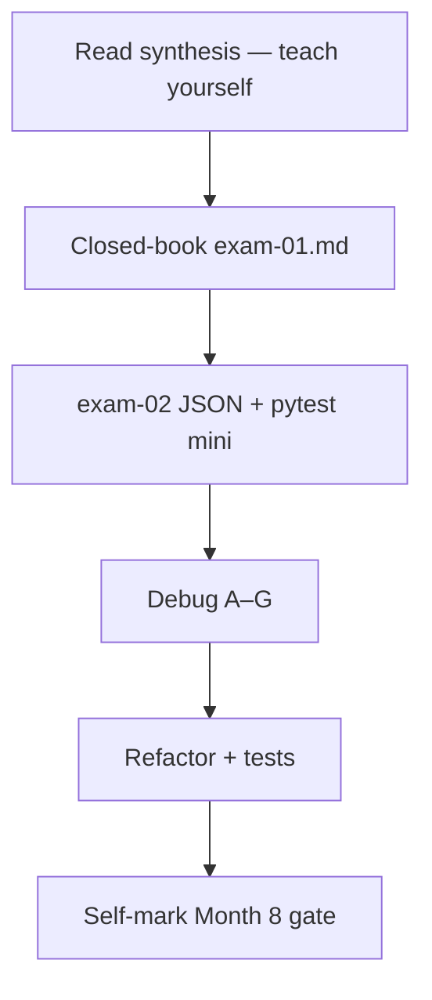
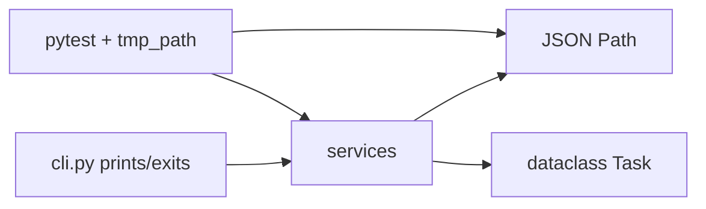

# Month 8 · Week 4 · Day 7
# Month 8 Exam + Gate Self-Mark

**Program:** Full-Stack Mastery · 18 months  
**Phase:** 3 — Python and backend  
**Month index:** [../../README.md](../../README.md)  
**Week 4:** [1](day-01.md) · [2](day-02.md) · [3](day-03.md) · [4](day-04.md) · [5](day-05.md) · [6](day-06.md) · Day 7 (today)  
**Week rhythm today:** Monthly exam  
**Study time:** 3–4 focused hours (Project 5 implementation may take further sessions — finish the **gate** before Month 9)

Textbook files stay **closed** except:

- **this file** (synthesis + exam blocks),
- the **self-mark** table at the end,
- `full_stack_project_requirements_2026/project_05_tested_python_cli.md` **only** for gate items about what the repo must contain — not a source to paste.

Repair forgotten facts from **this synthesis**, not from Week 1–4 day files and not from a CLI tutorial.

Work in `~\fullstack-lab\month-08-exam\` for exam evidence. The mini-build is **not** Project 5 and **not** inside `~/task-cli/`. Do **not** start Month 9 because the calendar moved.

---

## How to read this chapter

This file is the **exam and the teacher**. The synthesis is written so a student whose Weeks 1–4 notes are foggy can still re-learn the month from **today’s pages**, then prove it with the blocks and an honest gate table.



During blocks 2–5, Days 1–6 of every week stay closed. If you go blank, re-read **this synthesis**. AI may not write the mini-app, exam-01, or Project 5.

---

## Today's contract

By the end of this day you will be able to teach Month 8 aloud from this synthesis and show evidence for every gate row you claim.

**Today's gate** is the Month 8 Gate table below — not “I attended four weeks.” Project 5 may still be incomplete after the exam hour; then the month is **not** passed until the remaining rows are true.

---

## Time box

| Block | Minutes | Work |
|---|---|---|
| 0 | 25 | Read the complete explanation; speak it |
| 1 | 40 | Closed-book explanation |
| 2 | 45 | Independent mini-build (JSON + pytest) |
| 3 | 25 | Debug A–G |
| 4 | 20 | Refactor commit (lab or task-cli) |
| 5 | 20 | Run tests; break one; restore |
| 6 | 20 | Design: modules vs prints |
| 7 | 25 | Retro + self-mark |

---

## Month 8 synthesis (the lesson, in this book)

**Language:** indentation is syntax. `None`, `True`/`False`. `==` values; `is` identity (`None`). No `===`, no `{ }` blocks, no `else if`. `"3" + 1` TypeError. Strings immutable; `strip` / slice / `in` / f-strings. Falsy: `False`, `None`, `0`, `0.0`, `""`, empty containers. Blank text is `strip() == ""`. `elif`. `for x in`; `range`; `while`. `and`/`or` short-circuit and return operands. `for`/`else` rare.

**Collections:** list mutable (`append` → `None`); alias vs `[:]`; `sorted` vs `sort`; tuple unpack; dict `[]` KeyError vs `get`; set unique (`set()` not `{}`); comprehensions; iterable vs iterator; `enumerate`; `zip`. Avoid `range(len)` unless the index is the algorithm.

**Functions:** `def`; forgotten `return` is `None`; defaults evaluated once — **never `def f(x=[])`**; `None` sentinel; `*args`/`**kwargs` not a junk API.

**Modules:** files; `import` / `from`; no `import *`; `__name__ == "__main__"`; `__init__.py` marks a package.

**Exceptions:** `raise` specific; `try/except/else/finally`; custom subclass; **no bare `except`**. Catch at the edge.

**Classes:** `self`, `__init__`. Earn it. Composition over inheritance. `@staticmethod` rare. Dataclass for field bags (`default_factory=list`).

**Week 4 tools:** hints (`str | None`) not runtime-enforced; `@decorator` is `f = deco(f)` (FastAPI `@app.get` is a factory — Month 9); `yield` generators; `with` + `Path`; JSON load/dump; missing/malformed/wrong shape; **`uv`** + `pyproject.toml`; Ruff; pytest + fixtures (`tmp_path`); `async def` + `asyncio.sleep` peek.

**Project 5:** own repo, tested CLI, JSON, modules, hints, Ruff, pytest. This textbook never contains the complete CLI.



The rest of this file unpacks those sentences so the exam is not a vocabulary quiz against a ghost month.

---

# Complete explanation — Python you must still own

## 1. Syntax and values (Week 1)

Python is a process you start: `py -3` or `uv run`. REPL `>>>`. Indentation (4 spaces) builds blocks. `NameError` on `true`/`null`/`undefined` is a JS translation. `==` vs `is`: two lists with the same values are `==` True and `is` False. Use `is None`.

Strings: index IndexError; slice safe. `",".join(parts)` reversed from JS. `"3" * 2` is `"33"`. Convert with `int`/`str` on purpose. `int("ada")` ValueError.

`if` / `elif` / `else`. FizzBuzz `%` and `==`. `for title in titles`. Infinite loop: Ctrl+C. Truthiness is not blank. `"0"` is a real query. `count or 10` destroys `0`.

**Wrong belief:** “Python is JS with indentation.”  
**Correct:** strong typing, `None`, `elif`, `==`, different defaults.

## 2. Collections (Week 2)

`b = a; b.append(1)` changes `a`. Copy shallow. Dict required fields `row["id"]`; optional `row.get("due")`. Missing JS property is `undefined`; missing Python key is **KeyError** — a gift. Sets for unique and `in`. Comprehension `[x for x in xs if p]`. `zip` not `range(len)` to pair lists. `enumerate(..., start=1)` for labels.

Search: strip; blank → `[]`.

**Wrong belief:** “`.get` everything.”  
**Correct:** hide missing `id` and you ship ghosts.

## 3. Functions, modules, errors, classes (Week 3)

Default `[]` is **one list** for all omitted calls. `if xs is None: xs = []`. Tests that share that list flake.

`from models import Task`. Packages: directory + `__init__.py`. Raise `ValueError`/`TypeError`. `except ValueError`. Bare `except` catches Ctrl+C. Custom `class NotFoundError(LookupError): pass`.

`self` is explicit. A class earns it when state and invariants belong together. `is_blank` is a function. Store **has** a Path.

## 4. Types, files, tooling (Week 4)

Hints document; runtime still dynamic. Dataclass `__eq__` by fields. Decorator wraps callables. `yield` lazy. `with path.open(encoding="utf-8")`. JSON: `FileNotFoundError`, empty, `JSONDecodeError`, `isinstance` list. `uv run pytest` in the project. Ruff format/check. Fixture injects `tmp_path`. `async def` needs `await`/`asyncio.run`; not a web framework.

## 5. Product shape (Project 5)

Own repo (`~/task-cli/`). Eight verbs. Dataclass fields. JSON persistence with guards. pytest including persistence and invalid data and a fixture. Logic not only in `print`. Ruff + tests pass. README honest. Refactor later with tests green.

Worked month-in-one-picture: operator `create --title "Harbor"` → CLI parses → `services.create` validates title → repository load (missing → empty) → append Task → dump JSON → tests do the same with `tmp_path` without PowerShell. Malformed file → domain error → CLI prints one line, exit non-zero.

---

## Month 8 Gate

True **without a tutorial** and **without leaning on JavaScript habits**:

1. Run Python in a **virtual environment** you can explain (`uv` this course).
2. Use lists, dicts, sets, tuples, and a **comprehension** on purpose.
3. Write functions and **modules**; raise and catch **exceptions** intentionally (not `except:` everything).
4. Use **type hints** and a **dataclass** where a bag of fields is the model.
5. Read/write **JSON** with missing/malformed file handling (Month 3 `localStorage` lesson, now files).
6. **pytest** covers create/update/delete/search and invalid data; at least one **fixture**.
7. Project 5 CLI: commands exist, business logic is **not** all in `print` statements.
8. Ruff (and tests) pass.

If any item is false, do not start Month 9.

---

# 1. Closed-book explanation (40 min)

`~\fullstack-lab\month-08-exam\exam-01.md` — teach a beginner who knows JavaScript. Prose, not a keyword dump. Must cover:

Week 1: indentation, `None`/`True`, `==` vs `is`, `"3"+1`, `strip` vs `if s`, `elif`  
Week 2: alias vs copy, KeyError vs get, comprehensions, `zip`/`enumerate`  
Week 3: mutable default trap, bare except, `self`, class vs function  
Week 4: hints not enforced, dataclass `default_factory`, `@` decorator, `with`, JSON failures, `uv run`, fixture, async peek  

Include: why Project 5 is a CLI not FastAPI. If a paragraph is only a table of spellings, rewrite it.

---

# 2. Independent mini-build (45 min)

Textbook closed except this bullet list. **Not** Project 5. **Not** a paste of `task-cli`.

`~\fullstack-lab\month-08-exam\mini\` — prefer `uv init` + `uv add pytest`.

**Notes file (tiny):**

- Dataclass `Note` with `id: str`, `title: str`, `done: bool = False`.
- `normalize(s: str) -> str`
- `add(notes: list[Note], note: Note) -> list[Note]` — new list; duplicate id → `ValueError`; no mutable default
- `load(path: Path) -> list[Note]` — missing/empty → `[]`; malformed → `ValueError`; expect a JSON **list of objects**
- `save(path: Path, notes: list[Note]) -> None`
- Tests with `tmp_path` fixture: round-trip, missing file, `NOT JSON`, duplicate add, blank title if you validate

No argparse required. No eight commands. Functions + pytest + JSON file.

```powershell
cd ~\fullstack-lab\month-08-exam\mini
uv init
uv add pytest
uv run pytest
```

---

# 3. Debugging (25 min)

`exam-03-debug.md` — full sentences: what you would **see**, the **cause**, what to **write instead**.

**A.** `def add(item, items=[]): items.append(item); return items` — second test sees two items. Why?

**B.** `except:` around `json.loads` — user hits Ctrl+C during load. What happens?

**C.** `titles = titles.append("x")` then `for t in titles`. Exception?

**D.** `row["priority"]` on records where some omit priority. Fix?

**E.** `for i in range(len(ids)): print(ids[i], titles[i])` when `titles` is shorter.

**F.** `if query:` skips empty string but searches on `"  "`.

**G.** `@dataclass class T: tags: list[str] = []` — two instances share tags. Fix?

No exploit payloads. Language defects only.

---

# 4. Code review (20 min)

Review **Project 5** scaffold or Week 4 store lab. One defect you **fix** (mutable default, missing test, `except Exception` too wide, `print` in the core). Commit in **that** repo. Record the commit subject in `exam-04-review.md`.

---

# 5. Testing (20 min)

In mini or task-cli or day-04 store:

1. Run pytest — record pass.
2. Break a **behavior** the test asserts (e.g. blank search).
3. Show the failure (test **name**).
4. Restore.

Deleting the test is not a restore. Record in `exam-05-tests.md`.

---

# 6. Architecture / design (20 min)

`exam-06-design.md`

- For Project 5: what lives in `cli.py` vs `services` vs JSON repository.
- When a class earns it vs `make_task` + dict.
- Why tests use `tmp_path` not `~/tasks.json`.
- One sentence: `@app.get` in Month 9 is a decorator factory.

---

# 7. Retrospective (25 min)

`exam-07-retro.md` — hours this month, solid/weak, Project 5 repo path, honest Month 9 readiness. If commands are only README fiction and `cli.py` does not exist, gate 7 is **not** pass yet — keep building after the exam hour.

Self-mark the eight gate rows: true / false / evidence path.

```powershell
git add month-08-exam
git commit -m "Record Month 8 exam evidence."
```

Commit task-cli separately in its repo.

---

## Mini-build notes (so the spec is complete)

`asdict` from `dataclasses` for dump. Load: `Note(**d)` only if keys match — extra JSON keys TypeError; missing keys TypeError. Safer: explicit `Note(id=d["id"], title=d["title"], done=bool(d.get("done", False)))`. Wrong types: raise ValueError. Duplicate: `any(n.id == note.id for n in notes)`.

**Wrong belief:** “The mini is a smaller Project 5 so I can copy cli.py.”  
**Correct:** the mini has **no CLI**. If you copy argparse, you missed the exam.

---

# Self-mark table (copy into exam-07-retro.md)

| # | Gate item | T/F | Evidence (path or commit) |
|---|---|---|---|
| 1 | I can explain `uv` venv and `uv run pytest` |  |  |
| 2 | list/dict/set/tuple + a comprehension on purpose |  |  |
| 3 | modules; specific except; no bare `except` |  |  |
| 4 | type hints + dataclass |  |  |
| 5 | JSON missing/malformed/wrong shape |  |  |
| 6 | pytest: create/update/delete/search, invalid, fixture |  |  |
| 7 | Project 5 commands exist; logic not all in `print` |  |  |
| 8 | Ruff and tests pass |  |  |

False on 6–8 is normal **on exam afternoon** if Day 6 was scaffold-only. Then the month continues until true. False on 1–5 after this exam file means re-work Weeks 1–4 labs, not a FastAPI jump.

JS habits that still fail the month: `===`, `{ }` blocks, `true`, `for i in range(len)` as the only loop, `def f(xs=[])`, `except:`, classes for `is_blank`, `if query` for blank, hoping hints enforce types.

---

# Debug answers you must still produce yourself

The exam DEBUG file is **you** teaching. Below is the **kind** of completeness required (do not paste these sentences into exam-03; write your own).

**A (defaults):** Second call reuses the same list object created at `def` time. JS default `[]` is per-call. Python is not. Sentinel `None`.

**B (bare except):** `KeyboardInterrupt` is a `BaseException`, not always an `Exception` — actually KeyboardInterrupt subclasses BaseException, so `except Exception` does **not** catch it, but **bare `except:`** does. Bare except also catches `SystemExit`. The operator’s Ctrl+C appears ignored if you used bare except.

**C (append None):** `append` returns None; `titles` is None; iterating None is TypeError.

**D (KeyError):** Optional field → `.get`. Required id stays `[]`.

**E (range len):** IndexError when titles shorter. `zip`.

**F (truthy space):** `"  "` is truthy. `strip`.

**G (dataclass mutable default):** class-level `[]` shared. `field(default_factory=list)`.

If you mix up B (bare vs `except Exception` vs KeyboardInterrupt), re-read Week 3 in **this** synthesis until you can say BaseException vs Exception without looking.

---

# Exam mini: UTF-8 and Windows

`path.write_text(..., encoding="utf-8")`. A title with an em dash or `é` must round-trip. One test with a non-ASCII title is enough to catch default CP1252.

Do not `eval` the file. Do not pickle.

---

# What Month 9 will assume

You can read a traceback from the bottom. You can `uv run pytest`. You can write a dataclass and a function that raises ValueError. FastAPI will decorate your functions; if `@` is still magic, stay in Month 8 Day 1 Week 4 until it is not.

**Wrong belief:** “I’ll learn Python from FastAPI error messages.”  
**Correct:** Month 9 is HTTP. Month 8 is the language. Gate first.

---

## Definition of done

## Week 4 / Month definition of done (exam day)

- [ ] exam-01.md teaches JS→Python without a cheat sheet of tokens only
- [ ] mini pytest green with JSON guards
- [ ] DEBUG A–G written
- [ ] One refactor commit recorded
- [ ] Break/restore recorded
- [ ] Gate table honest — false rows mean more work, not Month 9

---

## Optional review links

Month 8 is explained in this chapter. These pages are for later checking, not for first learning.

- [Python tutorial](https://docs.python.org/3/tutorial/index.html)
- [uv](https://docs.astral.sh/uv/)
- [pytest](https://docs.pytest.org/en/stable/)
- [Ruff](https://docs.astral.sh/ruff/)

---

## After you pass

When every Month 8 gate row is true, continue with [Month 9 — FastAPI](../../month-09/README.md). Until then, stay on Project 5.

If gate rows 6–8 are false after exam hour, keep building `~/task-cli/` using Weeks 1–4 of **this month** as the teacher. Month 9 assumes you already raise `ValueError` on empty title and load JSON without crashing. Do not skip.

---

## Mini-build complete spec (no Project 5 paste)

Folder: `~\fullstack-lab\month-08-exam\mini\`

**`notes.py`** (names yours):

| Symbol | Contract |
|---|---|
| `@dataclass class Note` | `id: str`, `title: str`, `done: bool = False` |
| `normalize(s: str) -> str` | `" ".join(s.split())` |
| `require_title(s: str) -> str` | type check; blank → ValueError; else normalize |
| `add(notes: list[Note], note: Note) -> list[Note]` | new list; duplicate id → ValueError; **no** `notes=[]` default |
| `load(path: Path) -> list[Note]` | missing/empty `[]`; malformed ValueError; JSON **list** of objects; map fields explicitly |
| `save(path: Path, notes: list[Note]) -> None` | `json.dumps([asdict(n) for n in notes], indent=2)` UTF-8 |

**Tests** (`test_notes.py`) with `tmp_path`:

1. Missing file → `[]`.
2. Write `NOT JSON` → ValueError.
3. Round-trip one Note (`==`).
4. Duplicate `add` raises.
5. `require_title("  ")` raises (`pytest.raises` or flag).
6. Non-ASCII title round-trip (`"café"`).
7. `add` does not mutate input list (`out is not notes`).

No `argparse`. No eight verbs. No copy from `~/task-cli/`.

### Closed-book exam-01 rubric (self-check)

A passing `exam-01.md` uses **stories**: `"3"+1` TypeError; `"  "` truthy; `b = a` alias; KeyError vs undefined; two omitted `add_tag()` calls sharing a list; Ctrl+C and bare except; hints not enforcing; `default_factory`; `@` as a call; missing JSON file. A failing exam-01 is a two-column spelling table (`trim`/`strip`) with no story.

### Debug G vs A

**A** is a **function** default `[]`. **G** is a **dataclass field** `= []`. Same family (one list object, many users). Different syntax. Fixes: `None` sentinel vs `field(default_factory=list)`. If exam-03 treats them as one bullet, you will miss G on a real dataclass.

### Gate rows 6–8 honesty

Day 6 scaffold: row 7 is often **false** (commands not implemented). That is allowed **today** if you keep working. Starting Month 9 with row 7 false is not allowed. Row 6 false means pytest does not yet cover create/update/delete/search on **Project 5** — lab tests in fullstack-lab do not count as Project 5 tests.

### JS habits that still fail the oral

`===`, `{ }`, `true`/`null`, `else if`, `forEach`/`map` as the only transform, `for i in range(len)` for values, `def f(xs=[])`, `except:`, `class IsBlank`, `if query` for blank, “hints mean it is typed like Java.”

If exam-01 still says “Python is JavaScript with indentation,” rewrite it before you self-mark row 1–5 true.
