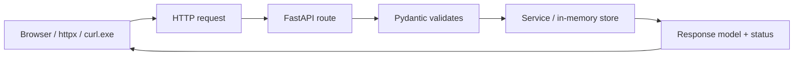

# Month 9 — FastAPI and API Engineering

**Program:** Full-Stack Mastery Textbook  
**Phase:** 3 — Python and backend engineering  
**Length:** 4 weeks · 7 days each · 3–4 focused hours/day  
**Prereq:** Month 8 gate passed (Project 5 exists; you can write Python without JS translation)  
**This month’s job:** Design an **HTTP API contract first**, then implement it with **FastAPI** and **Pydantic**. Persist **in memory** (Project **6A**). PostgreSQL is **Month 10**. Do not skip the in-memory stage — the ORM will hide sloppy HTTP if you rush it.

**Project 6 Stage A:** `full_stack_project_requirements_2026/project_06_production_style_backend_system.md` (section **Stage A — API Before Database**). This textbook will **not** give you the API source.

**This textbook is the lesson.** Routes, status codes, Pydantic, OpenAPI, routers, dependencies, and pytest API tests are explained in the day files. Optional review links are for later rechecking.

These files are written to render as **web pages**: relative links, tables, and **Mermaid** diagrams.

---

## How this textbook is organized

```
month-09/
  README.md     ← you are here
  week-01/      app lifecycle, routes, methods, path/query, bodies, status codes
  week-02/      Pydantic, request/response models, errors, OpenAPI
  week-03/      routers, Depends, config, services, repository-as-pattern, middleware
  week-04/      pagination, filter, search, sort, CORS, versioning, upload, background,
                pytest + httpx, mocking boundaries
                + Project 6A + Month 9 exam
```

Labs: `~\fullstack-lab\month-09\`.  
Project 6A: **its own Git repository** (e.g. `~/ops-api/`). Same domain family as Project 4 is welcome (inventory/issues) so Month 13 can connect them — **not** required this month.

---

## HTTP you already know, now as a program

Month 1: you inspected requests. Month 3: you `fetch`ed. Month 9: **you are the server**.



**Wrong belief:** “FastAPI is the database.”  
**Correct:** FastAPI is the **HTTP adapter**. Storage this month is a Python dict (or list) behind a small module. Next month the adapter stays; the storage becomes SQL.

---

## Month 9 Gate

True **without a tutorial**:

1. Write an **OpenAPI-shaped contract** (paths, methods, status codes, JSON shapes) **before** coding the happy path — `CONTRACT.md`.
2. Implement CRUD (+ list) with **correct statuses** (`201`, `204` or `200`, `404`, `422`, `409` where it fits).
3. Use **separate** create / update / response models when shapes differ.
4. Validation errors are **JSON**, not a stack trace in production settings.
5. Split **routers** and **dependencies**; config from environment (no secrets in git).
6. List endpoint: **pagination + filter or search + sort**.
7. **pytest** + httpx (or TestClient) covers happy path, 404, 422; mock an external boundary if you call one.
8. CORS explained; enabled only as much as a local React origin needs.

If any item is false, do not start Month 10.

---

## What this month must teach (complete list)

| Week | Must learn | Must practice |
|---|---|---|
| 1 | `FastAPI()`, path operations, methods, path/query params, body, status codes, `uvicorn` | Hello + a resource with GET/POST |
| 2 | Pydantic v2 models, `Field`, validation, `HTTPException`, exception handlers, `/docs` OpenAPI | Typed create/response; 422 you can explain |
| 3 | `APIRouter`, `Depends`, settings, service layer, in-memory repo **as a pattern**, middleware | Three modules, not one `main.py` blob |
| 4 | Pagination/filter/sort, CORS, versioning trade-off, `UploadFile`, `BackgroundTasks`, pytest | Project 6A |

**Avoid:** SQLAlchemy this month; copying a mega “FastAPI template”; returning ORM objects (you have none); `dict` responses with no model; swallowing errors.

Horizontal:

- **Debugging:** `/docs` try-it; `curl.exe` (Windows); read 422 body.
- **Security:** validate all input; do not log secrets; CORS is not auth; no real passwords stored.
- **Tests:** TestClient is HTTP, not internal function calls only.
- **Git:** Project 6A from commit one.

---

## Tools this month

| Tool | Why |
|---|---|
| FastAPI | HTTP framework on Starlette. |
| Pydantic v2 | Request/response contracts. |
| Uvicorn | ASGI server. |
| `uv` | Env + deps from Month 8. |
| pytest + httpx | API tests. |
| `curl.exe` | Manual HTTP (Month 1). |

---

## Weekly rhythm

Same as Month 1. Week 4 Day 7 is the Month 9 exam + gate.

---

## Start

Open [week-01/day-01.md](week-01/day-01.md).

When Month 9’s gate is true, Month 10 (SQL / PostgreSQL) is next — not written until this month is done.
