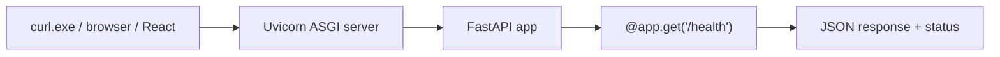

# Month 9 · Week 1 · Day 1
# FastAPI: An HTTP Server You Own

**Program:** Full-Stack Mastery · 18 months  
**Phase:** 3 — Python and backend  
**Month index:** [../../README.md](../../README.md)  
**Week 1:** Day 1 (today) · [2](day-02.md) · [3](day-03.md) · [4](day-04.md) · [5](day-05.md) · [6](day-06.md) · [7](day-07.md)  
**Week rhythm today:** Learn + type-along  
**Student state:** Month 8 gate passed. You can write Python modules and tests. You have **inspected** HTTP since Month 1. Today you **serve** it.  
**Study time:** 3–4 focused hours

**This week covers:** application lifecycle, routes, HTTP methods, path/query parameters, request bodies, status codes.

Today: what FastAPI **is**, how **Uvicorn** runs it, a first **path operation**, **GET** vs **POST**, and reading a response with **`curl.exe`**. Path/query/body deepen on Day 2. Do not skip them. Project 6A is **not** a paste today.

Labs: `~\fullstack-lab\month-09\`.

---

## How to use this textbook

1. Read a section. Close it. Say it.
2. Type every lab. Do not paste a generated `main.py` empire.
3. When Uvicorn errors, read the traceback from the bottom.
4. Optional review links are for later rechecking.

---

## How to read this chapter

A **web API** is a program that waits for HTTP requests and returns HTTP responses. FastAPI is a **framework** that maps **(method, path)** to a **Python function**.



If that is still abstract: Month 1’s “server” box is now **your** `uv run uvicorn`. The Network tab in the browser, pointed at `http://127.0.0.1:8000/docs`, is the same HTTP you already know.

**Wrong belief:** “FastAPI is Python’s React.”  
**Correct:** React draws UI. FastAPI answers **HTTP**. Different machines, different jobs.

---

## Today's contract

By the end of this day you will be able to:

1. Create a small **`uv`** project with `fastapi` and `uvicorn`.
2. Explain **ASGI** in one sentence (the interface Uvicorn speaks).
3. Write `@app.get("/health")` and return JSON.
4. Run Uvicorn with **reload** for development.
5. Hit the route with **`curl.exe`** and open **`/docs`**.
6. Name **path operation** = HTTP method + path + function.

**Today's gate.** Closed-book:

> FastAPI maps HTTP methods and paths to Python functions. Uvicorn runs the app. `/docs` is OpenAPI generated from those functions. I still think in status codes and JSON, not in “the framework did something.”

---

## Time box

| Block | Minutes | Work |
|---|---|---|
| A | 45 | Theory |
| B | 60 | uv project + /health + curl.exe |
| C | 70 | Independent: GET list stub |
| D | 20 | Git |
| E | 15 | Recall |

---

# Block A — Theory

## 1. The pieces

| Piece | Job |
|---|---|
| **FastAPI** | Declares routes, validates later (Pydantic, Week 2), builds OpenAPI |
| **Starlette** | Toolkit FastAPI sits on (requests, middleware) |
| **Uvicorn** | **ASGI server** — process that listens on a port and calls your app |
| **Pydantic** | Data shapes — Week 2. Today you may return `dict` |

**ASGI** (Asynchronous Server Gateway Interface) is a **contract**: how a server calls a Python app. You do not implement ASGI by hand. You write FastAPI; Uvicorn speaks ASGI.

**Lifecycle (honest, today):**

1. You start Uvicorn. It **imports** your module. `app = FastAPI()` runs.
2. Uvicorn **binds** `127.0.0.1:8000` (or what you pass).
3. A request arrives. FastAPI finds the matching **path operation**.
4. The function runs. Its return value becomes a **response** (JSON by default for dicts).
5. Ctrl+C stops the process. In-memory data **dies**. That is why Month 9 storage is temporary on purpose.

---

## 2. A path operation

```python
from fastapi import FastAPI

app = FastAPI(title="Lab API")

@app.get("/health")
def health() -> dict[str, str]:
    return {"status": "ok"}
```

- `app` is the application object.
- `@app.get("/health")` is a **decorator** (Month 8): “when GET `/health`, call this function.”
- Function name is for you and for OpenAPI `operationId`-ish defaults — pick clear names.
- Return a `dict` → FastAPI encodes JSON, status **200** by default.

**POST** is a different decorator:

```python
@app.post("/items")
def create_item(item: dict) -> dict:
    return item
```

Today, `item: dict` is a blunt body. Week 2: a Pydantic model. Without a model, you get little validation. That is a **temporary** sin, not a style.

**Wrong belief:** “The function name is the URL.”  
**Correct:** the **decorator path** is the URL. The function name is Python.

---

## 3. Methods and status codes (Month 1, now you emit them)

| Method | Typical meaning | Typical success |
|---|---|---|
| GET | Read | 200 |
| POST | Create | 201 + body |
| PUT | Replace | 200 |
| PATCH | Partial update | 200 |
| DELETE | Remove | 204 no body, or 200 |

Today: GET 200. You will set `status_code=201` this week when you POST for real.

**404** means you did not find a resource — you will `raise HTTPException` Day 2+. FastAPI’s own 404 is “no route matched.”

---

## 4. `/docs` and `/redoc`

FastAPI generates **OpenAPI** from your path operations. Uvicorn serves Swagger UI at **`/docs`**. That is not a toy. It is the **contract viewer**. Week 2 you will shape it with response models. Today: confirm `/health` appears.

**Wrong belief:** “I’ll write the API and document it later in Notion.”  
**Correct:** the code **is** the draft contract. Month 9 gate: write `CONTRACT.md` **before** a big resource — then make `/docs` match it.

---

## 5. Windows: `curl.exe`, not `curl`

PowerShell’s `curl` is often an alias for `Invoke-WebRequest`. Use **`curl.exe`** as in Month 1.

```powershell
curl.exe -s http://127.0.0.1:8000/health
```

---

## 6. Security start

- Bind **127.0.0.1** in dev so you are not serving the LAN by accident.
- No secrets in the repo. No real password store this month.
- Returning raw user strings in JSON is fine; putting them in HTML is a different app.

---

# Block B — Type-along

```powershell
cd ~\fullstack-lab
mkdir month-09\week-01\day-01 -Force
cd ~\fullstack-lab\month-09\week-01\day-01
uv init --name lab-health
uv add fastapi uvicorn
```

If `uv` is missing, install it (Month 8 Week 4). Do not `pip install --user` as the long-term path.

Create `main.py` (or put the app in `src/` if `uv init` did — **match the layout you actually got**; `uv init` may create `main.py` at root). Type the `health` example.

Run:

```powershell
uv run uvicorn main:app --reload --host 127.0.0.1 --port 8000
```

`main:app` means **module `main`**, **variable `app`**. If your file is `src/lab_health/main.py`, the string changes — read the error, fix the import path.

Another terminal:

```powershell
curl.exe -s http://127.0.0.1:8000/health
curl.exe -s -D - http://127.0.0.1:8000/health -o NUL
```

Write `HTTP.txt`: status line, `content-type`. Open `http://127.0.0.1:8000/docs` in the browser. Screenshot optional.

Stop the server with Ctrl+C. Restart. Note: no database, nothing to lose.

---

# Block C — Independent

Add **GET `/items`** that returns a **hard-coded** JSON list of three dicts (`id`, `title`). Still no Pydantic model required if you are stuck — but prefer `list[dict[str, int \| str]]` hints.

`curl.exe` the list. Write `ROUTES.txt`: method, path, status, what the body means.

Do **not** add PostgreSQL. Do **not** copy a cookiecutter.

```powershell
cd ~\fullstack-lab
git add month-09
git commit -m "Month 9 Day 1: FastAPI health route and uvicorn."
```

---

# Block E — Recall

1. What Uvicorn is.  
2. What `main:app` means.  
3. Who chooses the URL — decorator or function name?  
4. Why `/docs` exists.  
5. Why in-memory data dies on restart.

---

## Definition of done

- [ ] `uv run uvicorn` served `/health`
- [ ] `curl.exe` showed JSON and a 200
- [ ] `/docs` lists the route
- [ ] I can explain ASGI in one sentence
- [ ] Commit exists

---

## Optional review links

FastAPI’s boot path is explained in this chapter.

- [FastAPI: First steps](https://fastapi.tiangolo.com/tutorial/first-steps/)
- [Uvicorn](https://www.uvicorn.org/)

---

## Tomorrow

**Path parameters**, **query parameters**, **request bodies**, and **status codes** you set on purpose — still one file if you must, models on Week 2.
