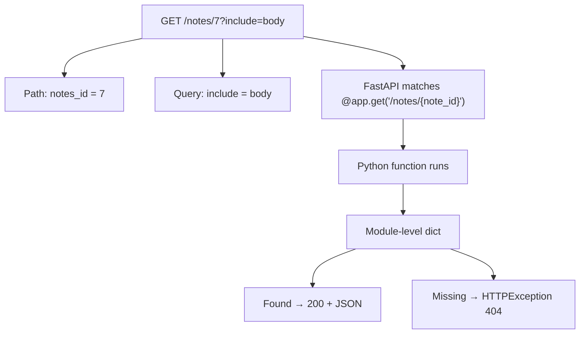
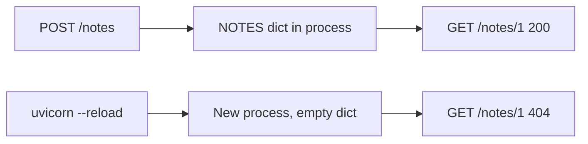

# Month 9 · Week 1 · Day 2
# Path, Query, Body, and Status Codes You Choose

**Program:** Full-Stack Mastery · 18 months  
**Phase:** 3 — Python and backend  
**Month index:** [../../README.md](../../README.md)  
**Week 1:** [1](day-01.md) · Day 2 (today) · [3](day-03.md) · [4](day-04.md) · [5](day-05.md) · [6](day-06.md) · [7](day-07.md)  
**Week rhythm today:** Learn + type-along  
**Student state:** Day 1 gate passed. You can start Uvicorn and return JSON from `@app.get`. Today you **parameterize** routes and **emit** statuses on purpose.  
**Study time:** 3–4 focused hours

**This week covers:** application lifecycle, routes, HTTP methods, path/query parameters, request bodies, status codes.

Today: `{item_id}` in the path, **query** strings, a JSON **body**, `status_code=` on the decorator, `Response` when the body must be empty, and **404** via `HTTPException`. You will **GET one** and **POST create** into a **module-level dict**. That dict **dies on reload**. That is the lesson, not a bug to paper over with PostgreSQL.

Labs: `~\fullstack-lab\month-09\`. Project 6A is **not** this week.

---

## How to use this textbook

1. Read a section. Close it. Say it.
2. Type every lab. Do not paste a generated CRUD empire.
3. When Uvicorn errors, read the traceback from the bottom.
4. Optional review links are for later rechecking.

---

## How to read this chapter

An HTTP request is **method + path + optional query + optional body**. FastAPI **unpacks** those pieces into **function arguments**. You choose types. FastAPI converts strings from the URL into `int` (or fails with **422**). You choose the **status** of the response. The framework does not “know” that a missing ticket is 404 unless **you** raise it.



If that is still abstract: Month 1’s URL bar is now **your** function signature. `{note_id}` is not a string you parse with `.split("/")`. It is a **parameter**.

**Wrong belief:** “The path is decoration; I will look things up in a global query string.”  
**Correct:** REST-shaped APIs put the **which one** in the path (`/notes/7`) and the **how to list/filter** in the query (`?q=urgent`). The body is for **payloads** you would not put in a URL.

---

## Today's contract

By the end of this day you will be able to:

1. Declare a **path parameter** `{item_id}` and receive it as `int` (or `str`).
2. Declare a **query parameter** (optional with a default; required without).
3. Accept a JSON **request body** (a `dict` is allowed **today**; Pydantic is Week 2).
4. Set **`status_code=201`** on create.
5. Raise **`HTTPException(status_code=404, detail=...)`** when the id is missing.
6. Store created items in a **module-level `dict`**, and explain why **reload wipes them**.
7. Use **`Response`** at least once so you know status and body are separate ideas.

**Today's gate.** Closed-book:

> Path parameters come from the URL template. Query parameters come from `?key=`. A JSON body is not a query string. FastAPI converts types; bad types are 422, missing resources are 404 that **I** raise. A module-level dict is RAM. Uvicorn `--reload` starts a new process. RAM is gone.

---

## Time box

| Block | Minutes | Work |
|---|---|---|
| A | 50 | Theory |
| B | 60 | Type-along: GET one + POST into a dict |
| C | 70 | Independent: a second resource, query filter |
| D | 20 | Git |
| E | 15 | Recall |

---

# Block A — Theory

## 1. Path parameters

The curly braces in the decorator are **named slots**:

```python
from fastapi import FastAPI, HTTPException

app = FastAPI(title="Notes lab")

@app.get("/notes/{note_id}")
def get_note(note_id: int) -> dict:
    ...
```

- The path is `/notes/{note_id}`.
- The **function argument** must be named `note_id` (same name).
- `note_id: int` means FastAPI **parses** the path segment as an integer.

`GET /notes/12` → `note_id == 12`.  
`GET /notes/abc` → **422** (validation), not 404. The route **matched**. The **type** failed.

`GET /notes/` (no id) does **not** match this route. FastAPI’s own 404 is “no path operation matched.” That is different from “the note id 12 is not in my dict.”

**Wrong belief:** “404 means the URL is wrong.”  
**Correct:** framework 404 = **no route**. Your 404 = **route ran**, resource **absent**. Clients and tests must be able to tell those apart later (Week 2 error bodies). For today, know they are two events.

Declare two path params when the URL really has two:

```python
@app.get("/shelves/{shelf_id}/notes/{note_id}")
def get_nested(shelf_id: int, note_id: int) -> dict:
    ...
```

Do not invent nesting you do not have. A flat `/notes/{note_id}` is enough today.

---

## 2. Query parameters

Anything in the function signature that is **not** in the path is a **query** parameter (for simple types: `str`, `int`, `bool`, `float`).

```python
@app.get("/notes")
def list_notes(q: str | None = None, limit: int = 10) -> dict:
    ...
```

- `GET /notes` → `q is None`, `limit == 10`.
- `GET /notes?q=todo&limit=2` → filtered, two items.
- `GET /notes?limit=nope` → **422**.

`bool` query values: FastAPI accepts `true`/`false`, `1`/`0`, `yes`/`no` (see docs if a value surprises you). Prefer explicit `true`/`false` in `curl.exe`.

**Required query:** no default.

```python
@app.get("/search")
def search(q: str) -> dict:
    ...
```

`GET /search` without `q` → **422**. That is validation, not “empty list.”

**Wrong belief:** “I’ll put the id in `?id=7` because it is easier.”  
**Correct:** **identify** with the path. **Filter, paginate, sort** with the query. Week 4 pagination sits on this rule. If you make `GET /notes?id=7` your “get one,” you will fight every OpenAPI client later.

---

## 3. Request body

A **body** is bytes after the headers. For APIs in this course, that is almost always **JSON**.

Today you may accept a `dict`. FastAPI treats a `dict` annotation as a **JSON object body** (not a query). Week 2 you will replace this with a Pydantic model. The dict is a **temporary** blunt instrument — same warning as Day 1.

```python
from fastapi import FastAPI

app = FastAPI()

@app.post("/notes")
def create_note(payload: dict) -> dict:
    title = payload.get("title")
    return {"title": title}
```

`curl.exe` must send `Content-Type: application/json` and a body:

```powershell
curl.exe -s -X POST http://127.0.0.1:8000/notes -H "Content-Type: application/json" -d "{\"title\":\"buy milk\"}"
```

PowerShell quoting is hostile. The `\"` form above is one pattern. Another: put JSON in a file and `--data-binary @note.json`. If the body never arrives, the first suspect is **quoting**, not FastAPI.

GET requests **should not** have JSON bodies you depend on. Some clients forbid it. List and get-one are query + path.

**Wrong belief:** “POST without a body is fine; I’ll read query params to create.”  
**Correct:** create with a **body**. Query strings are logged, cached, and length-limited. Titles and descriptions belong in JSON.

---

## 4. Status codes you set

Default for a successful path operation that returns a dict: **200**.

Create should be **201 Created** when a new resource now exists:

```python
@app.post("/notes", status_code=201)
def create_note(payload: dict) -> dict:
    ...
```

The decorator’s `status_code=` is the **success** status. Errors are separate (`HTTPException`).

| Situation | Status | Who sets it |
|---|---|---|
| GET list / GET one, found | 200 | default, or `status_code=200` |
| POST created | 201 | you, on the decorator |
| No matching route | 404 | FastAPI |
| Id not in your store | 404 | **you**, `HTTPException` |
| JSON / types invalid | 422 | FastAPI (Week 2 you will **read** the body) |
| Empty success (Week 1 Day 4 DELETE) | 204 | `Response` or `status_code=204` |

**`Response`** is the object when you need a status **without** a JSON body, or extra headers:

```python
from fastapi import Response

@app.get("/ping")
def ping(response: Response) -> dict[str, str]:
    response.headers["X-Lab"] = "month-09"
    return {"pong": "ok"}
```

Injecting `Response` still lets you return a dict. For a **body-less** status you will use Day 4:

```python
@app.delete("/notes/{note_id}", status_code=204)
def delete_note(note_id: int) -> None:
    ...
```

or `return Response(status_code=204)`. Returning `None` with `status_code=204` is the usual FastAPI pattern. Returning a dict with 204 is a contradiction — do not.

**Wrong belief:** “Status codes are decoration; the JSON `ok: false` is enough.”  
**Correct:** clients, caches, and tests branch on the **status**. `ok: false` with HTTP 200 is a lie Month 1 already rejected.

---

## 5. 404 via `HTTPException`

```python
from fastapi import FastAPI, HTTPException

app = FastAPI()

NOTES: dict[int, dict] = {}

@app.get("/notes/{note_id}")
def get_note(note_id: int) -> dict:
    note = NOTES.get(note_id)
    if note is None:
        raise HTTPException(status_code=404, detail="Note not found")
    return note
```

- `raise`, not `return {"error": ...}` with 200.
- `detail` may be a string or a JSON-able structure. A string is enough today.
- FastAPI turns this into a JSON body roughly `{"detail": "Note not found"}` and status 404.

Do not `return JSONResponse(status_code=404, ...)` unless you have a reason. `HTTPException` is the course default.

**Wrong belief:** “I’ll return `None` and FastAPI will send 404.”  
**Correct:** `None` with default 200 is an empty body, not 404. **You** raise.

---

## 6. A module-level dict is RAM

```python
NOTES: dict[int, dict] = {}
_next_id = 1
```

This lives in the **process**. Uvicorn `--reload` **re-imports** the module when a file changes. Re-import runs the assignment again. `NOTES` is `{}`. Every POST you celebrated is gone.

That is **Month 9 storage on purpose**:

- You will feel HTTP without blaming SQLAlchemy.
- You will not confuse “the API works” with “the database works.”
- Project **6A** stays in memory. PostgreSQL is **Month 10**.



Do not “fix” this with a JSON file on disk unless a lab says so. Do not open Redis. Do not open Postgres.

**Wrong belief:** “In-memory is fake; I should skip to SQL.”  
**Correct:** in-memory is how you prove **routes, statuses, and bodies**. SQL will hide sloppy HTTP if you rush.

---

## 7. GET list vs GET one vs POST

| Route | Job |
|---|---|
| `GET /notes` | Collection. Query params filter. 200 + array (or `{"items": [...]}` — pick one and stick). |
| `GET /notes/{note_id}` | One item. 200 or 404. |
| `POST /notes` | Create. 201 + the created representation (include the new `id`). |

Do not POST to `/notes/{note_id}` to create (that is a different convention). Do not GET `/notes/create`.

Ids: an incrementing integer in the module is fine today. Do not use list index as id if you will delete later (Day 4) — a **dict keyed by id** survives holes.

---

## 8. Security start

- Validate later (Week 2). Today, still do not `eval` a body.
- Do not put secrets in query strings.
- Bind `--host 127.0.0.1`.
- `detail` in 404 should **not** leak other users’ titles if you ever add auth. Today there is no auth. Still: “Note not found” is enough; do not echo the whole store.

---

# Block B — Type-along

```powershell
cd ~\fullstack-lab
mkdir month-09\week-01\day-02 -Force
cd ~\fullstack-lab\month-09\week-01\day-02
uv init --name lab-notes
uv add fastapi uvicorn
```

Create `main.py`. Type this shape — **do not** expand it into Project 6A:

1. `app = FastAPI(title="Day 2 notes")`.
2. `NOTES: dict[int, dict] = {}` and `_next_id = 1` at module level.
3. `GET /notes` — return a **list** of values. Optional query `q: str | None = None`: if `q` is set, keep notes whose `title` contains `q` (case-insensitive).
4. `GET /notes/{note_id}` — 200 or `HTTPException` 404.
5. `POST /notes` with `status_code=201`, body `dict`. Require a `title` key in your own `if` — if missing, `HTTPException` 422 or 400 with a clear `detail`. (Week 2: Pydantic does this.) Assign id, store, increment `_next_id`, return the stored dict.
6. Optional: inject `Response` on GET list and set header `X-Item-Count` to the length of the returned list.

Run:

```powershell
uv run uvicorn main:app --reload --host 127.0.0.1 --port 8000
```

Another terminal:

```powershell
curl.exe -s http://127.0.0.1:8000/notes
curl.exe -s -X POST http://127.0.0.1:8000/notes -H "Content-Type: application/json" -d "{\"title\":\"first note\"}"
curl.exe -s http://127.0.0.1:8000/notes/1
curl.exe -s -D - http://127.0.0.1:8000/notes/999 -o NUL
curl.exe -s "http://127.0.0.1:8000/notes?q=first"
```

Write `HTTP.txt`:

- POST status (must be **201**).
- GET missing id: status **404**, body contains `detail`.
- GET `/notes/abc`: status **422**.
- After you **save** `main.py` and reload finishes, GET `/notes/1` again. Record: **404 or empty**. That line is the RAM lesson.

Open `/docs`. Confirm path param `note_id`, query `q`, and POST body appear. Screenshot optional.

---

# Block C — Independent

Add **GET `/notes/{note_id}` already exists** — now add a **different** collection, **`GET /labels` and `POST /labels` and `GET /labels/{label_id}`**, same patterns, **separate** dict `LABELS`. Do **not** copy a tasks/projects/users API (that is Project 6A’s family). Labels are a name + id.

`curl.exe` create two labels, get one, 404 the other id, filter `?q=`.

Write `ROUTES.txt`: every method, path, success status, error statuses you actually observed.

Do **not** add PUT/PATCH/DELETE yet (Day 4). Do **not** add Pydantic models yet (Week 2). Do **not** add SQLAlchemy.

```powershell
cd ~\fullstack-lab
git add month-09
git commit -m "Month 9 Day 2: path, query, body, 404, in-memory dict."
```

---

# Block E — Recall

1. Path param vs query param — one sentence each.  
2. Why `/notes/abc` is 422 and `/notes/999` is 404 (when 999 was never created).  
3. Who sets 201.  
4. What `--reload` does to `NOTES`.  
5. Why GET-one is not `GET /notes?id=`.

---

## Definition of done

- [ ] `POST /notes` returns **201** and an `id`
- [ ] `GET /notes/{id}` returns **200** for that id
- [ ] Missing id returns **404** from `HTTPException`
- [ ] Bad path type returns **422**
- [ ] Query `q` filters the list
- [ ] I watched data **disappear** after reload and wrote it down
- [ ] `ROUTES.txt` exists
- [ ] Commit exists

---

## Optional review links

Path, query, body, and status codes are explained in this chapter.

- [FastAPI: Path parameters](https://fastapi.tiangolo.com/tutorial/path-params/)
- [FastAPI: Query parameters](https://fastapi.tiangolo.com/tutorial/query-params/)
- [FastAPI: Body](https://fastapi.tiangolo.com/tutorial/body/)
- [FastAPI: Response status code](https://fastapi.tiangolo.com/tutorial/response-status-code/)
- [FastAPI: Handling errors / HTTPException](https://fastapi.tiangolo.com/tutorial/handling-errors/)

---

## Tomorrow

**Implement from memory:** GET list, POST create, GET by id — recap in the Day 3 file, then a spec. Days 1–2 stay closed during the build.
