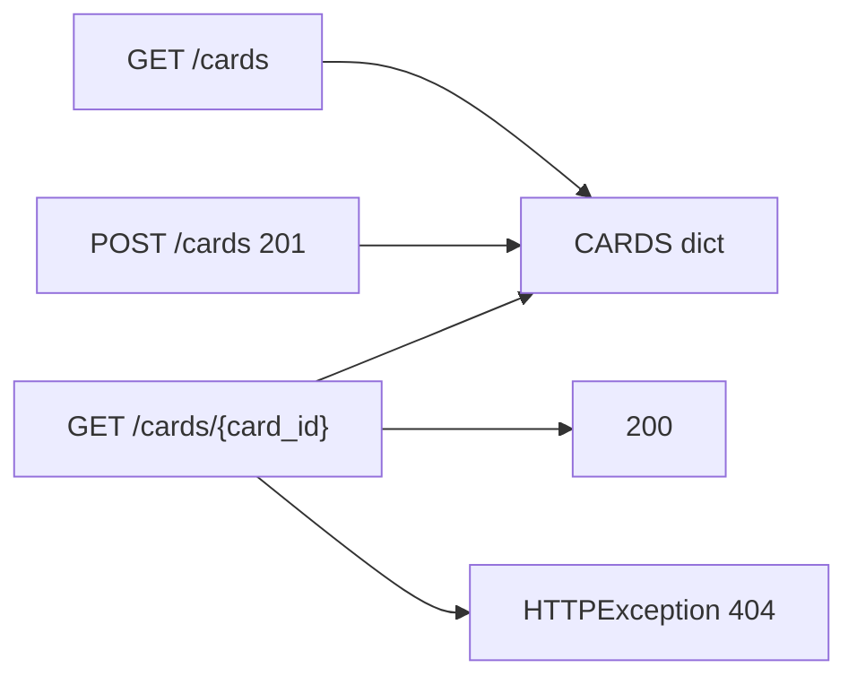

# Month 9 · Week 1 · Day 3
# Implement From Memory: GET List, POST Create, GET One

**Program:** Full-Stack Mastery · 18 months  
**Phase:** 3 — Python and backend  
**Month index:** [../../README.md](../../README.md)  
**Week 1:** [1](day-01.md) · [2](day-02.md) · Day 3 (today) · [4](day-04.md) · [5](day-05.md) · [6](day-06.md) · [7](day-07.md)  
**Week rhythm today:** Implement from memory  
**Student state:** Day 2 gate passed. You have typed path params, query params, a JSON body, `status_code=201`, and `HTTPException` 404. Today those ideas must still live in your head — from **this file**.  
**Study time:** 3–4 focused hours  
**Prereq:** Day 2 gate passed.

Labs: `~\fullstack-lab\month-09\week-01\day-03\`. Do **not** copy `day-02/main.py`. Do **not** start Project 6A. Do **not** paste an ops-api. Index cards are the noun.

---

## How Day 3 works

Day 1 and Day 2 had type-along code. During the drills they stay **closed**. This file contains a recap so you are not sent to another site to learn.

Allowed:

- The complete explanation in this file
- Your own notes in `fullstack-lab`
- The HTTP response in front of you (`curl.exe`, `/docs`)

Not allowed:

- Pasting a finished API from AI
- Copying Day 1 or Day 2 `main.py`
- Browsing FastAPI docs as the teacher during the build

If you are stuck **more than 25 minutes** on one task, open **only** the matching Day 1 or Day 2 section **in this textbook**, read it, close it, continue from memory. Record what you had to look up in `lookups.txt`. That list is tomorrow’s repair list.

There is **no complete API** in this file. The resource is specified. You write it.

---

## How to read this chapter

A tiny HTTP API is three path operations plus a store that is **honest about RAM**.



**Wrong belief:** “Memory day means I should reread Day 2 with the file open.”  
**Correct:** the recap below is the teacher. Days 1–2 are the backup after 25 minutes.

---

## Complete explanation (HTTP you must still own)

**FastAPI** maps **(method, path)** to a function. **Uvicorn** is the ASGI server: `uv run uvicorn main:app --reload --host 127.0.0.1 --port 8000`. `main:app` means module `main`, variable `app`. `--reload` **re-imports**. Module-level dicts **reset**.

That reset is not a FastAPI bug. Import runs `CARDS = {}` again. Persistence is Month 10. Today you write one sentence in `RAM.txt` after you prove it with `curl.exe`.

Bind **127.0.0.1** in development. Binding `0.0.0.0` advertises the lab to the LAN. You do not need that.

**Path parameter:** `{card_id}` in the decorator; same name in the function. `card_id: int` parses the segment. `GET /cards/abc` → **422** (type). That is **not** “card missing.”

**Query parameter:** simple types **not** in the path. `q: str | None = None` is optional. `limit: int = 10` has a default. Missing **required** query → 422.

Identify in the **path** (`GET /cards/3`). Filter in the **query** (`?q=`). Do not `GET /cards?id=3` as get-one. OpenAPI, caches, and later React `useParams` all prefer a path id.

**Body:** JSON object for POST. Today a `dict` is allowed. Send `Content-Type: application/json`. Windows: **`curl.exe`**, watch PowerShell quoting. Pydantic is Week 2. Dict bodies are a known sin with an expiry date.

**Statuses:** GET success **200**. POST create **201** (`status_code=201` on the decorator). Missing resource: **`raise HTTPException(status_code=404, detail="...")`**. No matching route: FastAPI’s own 404. Do not return `{"error": ...}` with 200.

Framework 404 (wrong path) and your 404 (right path, missing id) look similar in a browser and different in intent. Your 404 JSON has **your** `detail` string. If you see a generic not-found without that string, you missed the route.

**Store:** `CARDS: dict[int, dict] = {}` keyed by id, not a list index. `_next_id = 1`. POST assigns id, stores, increments, **returns the stored object including `id`**. A list plus `.index` will fight you on Day 4 delete.

**GET list vs GET one:** collection at `/cards`; one item at `/cards/{card_id}`.

**`Response`:** you may set a header (for example item count). Status and body are separate ideas.

**Security:** bind `127.0.0.1`. No secrets in query strings. No SQLAlchemy, no Redis, no PostgreSQL, no files pretending to be a database unless you are explicitly told — you are not.

**Wrong belief:** “If `/docs` shows the route, the 404 path is done.”  
**Correct:** `/docs` lists operations. 404 for a missing **id** only exists if **you** raise `HTTPException`.

**Wrong belief:** “I’ll write JSON to a file so reload does not annoy me.”  
**Correct:** annoyance is the point. Month 10 is persistence.

---

## Today's contract

Rebuild Day 2 skills as if this were a lab exam.

**Today's gate.** Closed-book:

> Using the editor, `curl.exe`, this recap, and my notes, I produced GET list, POST create (201), GET by id (200/404), a query filter, and an in-memory dict — and I can explain why reload empties it.

---

## Time box

| Block | Minutes | Work |
|---|---|---|
| A | 20 | Closed-book oral review (no typing yet) |
| B | 40 | Memory drills: signatures on paper |
| C | 90 | Build the spec in `main.py` |
| D | 35 | Defect hunt with `curl.exe` |
| E | 15 | Record lookups |

---

# Block A — Speak first

Out loud, no notes, no Day 1–2 files:

1. What is a path operation?  
2. Path param vs query param?  
3. Who turns `"12"` in the URL into `int` 12?  
4. 422 vs 404 — two sentences.  
5. How do you set 201?  
6. Why does `--reload` forget POSTs?  
7. What does `raise HTTPException` do that `return {"detail": ...}` does not?

If any answer is mush, re-read the recap. Do not open Day 2 yet.

---

# Block B — Paper drills

On paper or `DRILLS.txt` (no FastAPI running):

1. Write the decorator + signature for GET `/cards/{card_id}` with `card_id: int`.  
2. Write the decorator + signature for GET `/cards` with optional `q` and `limit` default 20.  
3. Write `HTTPException` for missing card.  
4. Sketch `CARDS` after POST twice: keys and a sample value.  
5. Predict status for `GET /cards/xyz`. Predict status for `GET /cards/7` when 7 was never created.

Do not look up answers. The recap is enough.

---

# Block C — Spec (you implement)

Work in a **new** uv project:

```powershell
cd ~\fullstack-lab
mkdir month-09\week-01\day-03 -Force
cd ~\fullstack-lab\month-09\week-01\day-03
uv init --name lab-cards
uv add fastapi uvicorn
```

**Resource: index cards** (a prompt on the front, optional answer on the back). This is **not** Project 6A (not users/projects/tasks, not inventory/issues).

**CONTRACT (implement this, do not invent extra verbs):**

| Method | Path | Success | Body / notes |
|---|---|---|---|
| GET | `/health` | 200 | `{"status": "ok"}` |
| GET | `/cards` | 200 | JSON **array** of cards. Query `q` optional: substring match on `front` (case-insensitive). Query `limit` default 50, max you clamp at 100. |
| GET | `/cards/{card_id}` | 200 | One object `{id, front, back}`. `back` may be `""`. Missing → **404** `HTTPException`. |
| POST | `/cards` | 201 | JSON body: `front` required (non-empty string after strip). `back` optional, default `""`. If `front` missing or blank → **400** or **422** you raise (say which in `ROUTES.txt`). Store in module dict. Return created object with `id`. |

Rules:

- Integer ids starting at 1.  
- In-memory only.  
- `uv run uvicorn main:app --reload --host 127.0.0.1 --port 8000`.  
- Prove with **`curl.exe`**. Write commands and statuses in `CURL.txt`.  
- Open `/docs` and list operation summaries in `DOCS.txt` (names only — not a screenshot essay).

Stretch if early: `X-Item-Count` header on GET list via `Response`.

Do **not** add PUT, PATCH, DELETE. Do **not** add Pydantic `BaseModel`. Do **not** persist to disk. Blank `front` after strip is a client mistake: raise 400 yourself or let a later Pydantic 422 handle it — today you choose and write the choice. Missing JSON Content-Type is a FastAPI/Starlette 422 (or 400 depending on body). Predict, then look.

---

# Block D — Defect hunt

On **your** server, without changing the spec:

1. POST without JSON Content-Type — what status?  
2. POST `{}` — what status and `detail`?  
3. POST valid, then GET that id — ids match?  
4. GET `/cards/0` or a huge id — 404, not a crash.  
5. Save a comment in `main.py` so reload fires. GET the id again. Confirm empty store. Write one sentence in `RAM.txt`.

If POST 201 is actually 200, you forgot `status_code=201`. Fix it. That is a **status** bug, not a “FastAPI quirk.”

## HTTP traces (predict, then curl.exe)

**Trace 1 — create then fetch**

1. `POST /cards` `{"front":"CPU vs RAM"}` → you want **201** and `"id": 1`.  
2. `GET /cards/1` → **200**, same `front`.  
3. `GET /cards/2` → **404**, JSON has `detail`.  
4. `GET /cards/not-a-number` → **422**.

If step 3 is FastAPI’s HTML-ish 404 with no `detail` from your string, you matched **no route** (wrong path) instead of raising `HTTPException`.

**Trace 2 — query**

Seed two cards. `GET /cards?q=cpu` returns only the matching `front`. `q` is **query**, not path.

**Trace 3 — RAM**

After reload, step 2 is 404. That is success for the lesson.

Windows quoting for POST is easier with a file:

```powershell
curl.exe -s -D - -X POST http://127.0.0.1:8000/cards -H "Content-Type: application/json" -d "{\"front\":\"CPU vs RAM\"}"
```

If PowerShell eats the quotes, write the JSON to `body.json` and use `--data-binary "@body.json"`. Record which quoting worked in `CURL.txt`.

---

# Block E — Lookups

`lookups.txt`: what you opened Day 1–2 for, if anything. If empty, write `none`.

```powershell
cd ~\fullstack-lab
git add month-09
git commit -m "Month 9 Day 3: cards API from memory (GET/POST/GET-id)."
```

---

# Lecture: 422 is a type; 404 is a miss; 201 is a choice

FastAPI parses `{card_id}` as `int` **before** your function runs. `GET /cards/abc` never looks in `CARDS`. Status **422**. You do not raise that. The framework does. `GET /cards/7` when 7 was never created **does** run your function. You raise `HTTPException(404, detail="...")`. Those two failures are different sentences. If you teach them as “not found,” Week 2’s 422 body will look like noise.

**201 is not the default.** Default success is 200. `status_code=201` on the decorator (or a `Response`) is you keeping the contract. Returning a body with `"id"` and status 200 is a **status** bug. Tests and `curl.exe -D -` both show it. Fix the decorator.

**Store shape.** `CARDS: dict[int, dict] = {}`. Keys are ids. Values are the objects you return. `_next_id` increments after assign. A list of cards plus `.index` will fight DELETE tomorrow. Do not “simplify” to a list.

**Reload.** Uvicorn re-imports `main`. `CARDS = {}` runs again. POSTs vanish. `GET /cards` is 200 `[]`. The route still exists. Write that in `RAM.txt`. Do not write a JSON file to dodge the lesson. Do not open PostgreSQL.

**Query vs path.** `q` filters `front`. `card_id` identifies one card. `GET /cards?id=3` as get-one makes OpenAPI and later React routers worse. Do not.

**curl.exe.** PowerShell quoting is hostile. `--data-binary "@body.json"` is legal. Record the command that actually worked. `curl` without `.exe` may be an alias. This course uses `curl.exe`.

**No Pydantic today.** Dict bodies expire next week. Blank `front` is 400 you raise or 422 you document. Pick one in `ROUTES.txt`. Do not return 200 with `"error"`.

Do not paste Project 6A. Index cards are the noun. Three operations plus health are the exam.

---

## Definition of done

- [ ] Spoke Block A without notes  
- [ ] Spec implemented; `CURL.txt` shows 200, 201, 404  
- [ ] Reload lesson written in `RAM.txt`  
- [ ] No Day 2 file copied  
- [ ] Commit exists  

---

# Worked session — cards, curl.exe, RAM

CONTRACT table first in `ROUTES.txt` or a tiny `CONTRACT.md`. Then `uv init`, `uv add fastapi uvicorn`, `main.py`. `CARDS` dict, `_next_id`. GET `/health` 200. GET `/cards` array + `q` + `limit`. GET `/cards/{card_id}` 200 or `HTTPException` 404. POST 201 with `front` required.

```powershell
uv run uvicorn main:app --reload --host 127.0.0.1 --port 8000
```

`curl.exe` create, get, missing, `not-a-number` (422). Reload: save a comment, GET the id, 404, write `RAM.txt`. `CURL.txt` statuses. `DOCS.txt` operation names. No PUT. No Pydantic. No disk. No `~/ops-api/`.

If POST is 200, set `status_code=201`. If missing id is a generic 404 without your `detail`, you missed the route. If `/cards/abc` is 404, you expected 422 — the `int` parse is the lesson.

PowerShell quoting: JSON file + `--data-binary "@body.json"` if needed. Bind 127.0.0.1.

---

## Optional review links

Repair from this recap first. These pages are for later checking, not for first learning.

- [FastAPI: First steps](https://fastapi.tiangolo.com/tutorial/first-steps/)
- [HTTPException](https://fastapi.tiangolo.com/tutorial/handling-errors/)

---

## Tomorrow

**PUT, PATCH, DELETE** — replace vs partial vs remove. **204** vs **200**. **409** conflict. Still in memory.

---

# Closing lecture — statuses you emit on purpose

201 is not FastAPI’s default. You set `status_code=201`.
404 for a missing **id** is `HTTPException` after the route ran.
422 for `/cards/abc` is parse failure. The function never ran.
Framework 404 is a wrong path. Your `detail` string is the tell.

`CARDS` is a dict keyed by int. Reload re-imports. RAM dies.
Write RAM.txt after you prove it with `curl.exe`. Do not write a JSON file to hide it.
Do not open PostgreSQL. Persistence is Month 10.

Query `q` filters. Path `card_id` identifies. Do not `GET /cards?id=3` as get-one.
Bind `127.0.0.1`. `curl.exe`, not a `curl` alias, unless you checked.
No Pydantic today. No PUT. No ops-api. Index cards only.

CURL.txt records commands and statuses. DOCS.txt lists operation names.
If POST is 200, fix the decorator before you call it a quirk.


## Recite-back checklist (close the editor, then tick)

Write `RECITE.txt` with one honest sentence per line.
If a line is mush, re-read the matching section in **this** file only.

- [ ] 201 is set on the decorator
- [ ] missing id → HTTPException 404
- [ ] `/cards/abc` → 422
- [ ] dict keyed by int id
- [ ] reload empties RAM
- [ ] `q` is query; id is path
- [ ] `curl.exe` + CURL.txt
- [ ] not ops-api; not SQL

Index cards. Three operations plus health. Bind 127.0.0.1.
