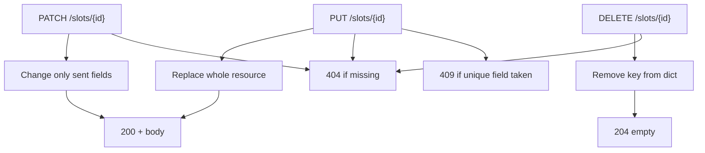
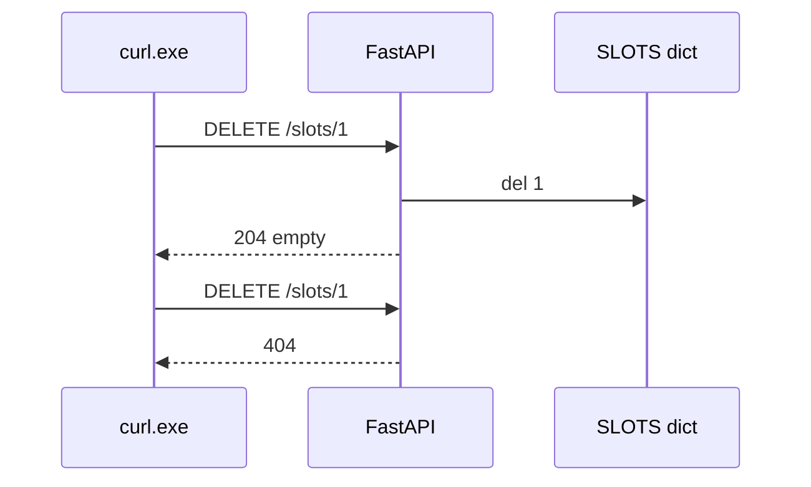

# Month 9 · Week 1 · Day 4
# PUT, PATCH, DELETE: Replace, Patch, Remove

**Program:** Full-Stack Mastery · 18 months  
**Phase:** 3 — Python and backend  
**Month index:** [../../README.md](../../README.md)  
**Week 1:** [1](day-01.md) · [2](day-02.md) · [3](day-03.md) · Day 4 (today) · [5](day-05.md) · [6](day-06.md) · [7](day-07.md)  
**Week rhythm today:** Learn + type-along  
**Student state:** You can GET list, POST create, GET one with 404. Today the collection **changes in place**.  
**Study time:** 3–4 focused hours

**This week covers:** application lifecycle, routes, methods, path/query, bodies, status codes.

Today: **PUT** (replace), **PATCH** (partial), **DELETE** (remove). **204** vs **200**. **409 Conflict** when a unique field collides. Still a module-level dict. Still no Pydantic models required (Week 2 will type the bodies). Still no SQL.

Labs: `~\fullstack-lab\month-09\week-01\day-04\`.

---

## How to use this textbook

1. Read a section. Close it. Say it.
2. Type the lab. Do not paste a “full REST template.”
3. Predict the status **before** `curl.exe`. Write the prediction in `PREDICT.txt`.
4. Optional review links are for later rechecking.

---

## How to read this chapter

Create is not the only write. After an id exists, clients will **replace** it, **change one field**, or **delete** it. Those are different HTTP methods because they are different **promises**.



Month 1 already used these words. Today **you** implement the promises.

**Wrong belief:** “PUT and PATCH are the same; I’ll only write PUT.”  
**Correct:** PUT’s contract is **the body is the new resource** (for the fields you allow). PATCH’s contract is **omitted fields stay**. If you treat them as identical, React forms and mobile clients will wipe titles by accident.

---

## Today's contract

By the end of this day you will be able to:

1. Implement **PUT** as replace: missing id → 404; success → **200** + full resource.  
2. Implement **PATCH** as partial: only keys present in the JSON change.  
3. Implement **DELETE**: missing → 404; success → **204** and **no JSON body**.  
4. Explain why **204** must not include a body.  
5. Detect a **unique** collision (e.g. duplicate `code`) and raise **409**.  
6. Keep GET/POST behavior from this week intact on the same store.

**Today's gate.** Closed-book:

> PUT replaces. PATCH patches. DELETE removes. 204 means success with no body. 409 means the request is understood but **conflicts** with current state (duplicate unique field), not “I cannot parse JSON” (that is 422).

---

## Time box

| Block | Minutes | Work |
|---|---|---|
| A | 50 | Theory |
| B | 60 | Type-along: slots with unique `code` |
| C | 70 | Independent: 409 cases + DELETE 204 |
| D | 20 | Git |
| E | 15 | Recall |

---

# Block A — Theory

## 1. Idempotency (the word you actually need)

A method is **idempotent** if doing it **N times** has the same effect as doing it once (for the resource, ignoring logs).

| Method | Typical idempotent? | Meaning here |
|---|---|---|
| GET | yes | Read |
| PUT | yes | Replace with this body; second PUT with same body → same store |
| DELETE | yes | First delete removes; second delete is **404** in **this** course (resource gone). Some APIs return 204 again. We choose **404 on second delete** so tests can tell “already gone.” |
| POST | **no** | Each POST **creates**. Two POSTs → two ids |
| PATCH | often yes if the same patch is applied twice | Still: define it |

**Wrong belief:** “Idempotent means safe.”  
**Correct:** **Safe** means no state change (GET). **Idempotent** means repeats converge. PUT is not safe. It is idempotent.

---

## 2. PUT — replace

```python
@app.put("/slots/{slot_id}")
def replace_slot(slot_id: int, payload: dict) -> dict:
    if slot_id not in SLOTS:
        raise HTTPException(status_code=404, detail="Slot not found")
    # build a complete new record from payload + existing id
    ...
```

Rules for this course:

- PUT **does not create** if missing (no upsert). Missing → **404**. Creating is POST. Upsert is a later debate; Project 6A: **no silent create on PUT** unless your CONTRACT.md says so (it should not, this month).
- The body must include the fields you consider the resource (today: `code`, `label`). If a required field is missing, **400/422**, not “keep the old label.” That would be PATCH.
- The **id in the path wins**. Ignore `id` in the body, or 400 if it disagrees. Do not let a client change primary keys.
- Success: **200** + the stored resource. (Some APIs use 204 for PUT; this course uses **200 + body** so you can see the result without a follow-up GET.)

**Wrong belief:** “PUT /slots without an id updates everything.”  
**Correct:** collection PUT is unusual. You PUT **one** resource.

---

## 3. PATCH — partial update

The body is a **sparse** object. Only keys the client sent are updated.

With a raw `dict`, “sent” vs “missing” is `key in payload`. Do not treat `None` and missing as the same unless you mean “clear this field.”

```python
@app.patch("/slots/{slot_id}")
def patch_slot(slot_id: int, payload: dict) -> dict:
    slot = SLOTS.get(slot_id)
    if slot is None:
        raise HTTPException(status_code=404, detail="Slot not found")
    if "label" in payload:
        slot["label"] = payload["label"]
    ...
    return slot
```

Week 2: Pydantic `model_dump(exclude_unset=True)` is the typed version of `if "label" in payload`. Today, `in` is the lesson.

Empty body `{}`: success, resource unchanged, **200**. That is valid PATCH.

PATCH to a missing id: **404**, not 201.

---

## 4. DELETE — 204 vs 200

**204 No Content** means: success, **stop looking for a body**. Clients should not parse JSON.

```python
from fastapi import Response

@app.delete("/slots/{slot_id}", status_code=204)
def delete_slot(slot_id: int) -> None:
    if slot_id not in SLOTS:
        raise HTTPException(status_code=404, detail="Slot not found")
    del SLOTS[slot_id]
```

Return **`None`**. Do not `return {}`. Do not `return {"deleted": true}` with 204.

**200 + body** is legal if you return the deleted representation. This course prefers **204** for DELETE so you practice empty success. If you choose 200, say so in CONTRACT.md and tests — do not mix.

`Response(status_code=204)` is equivalent. The decorator form above is enough.

After delete, `GET /slots/{id}` must be **404**. The dict key is gone.

**Wrong belief:** “I’ll return 200 with `null` so JavaScript is happier.”  
**Correct:** `204` is the signal. `TestClient` / `httpx` give you `.status_code`. Assert **204**, assert body empty.

---

## 5. 409 Conflict

**409** is not “bad JSON.” Bad JSON / wrong types → **422**.  
**409** is: the request is **well-formed**, but it **cannot proceed** given current state.

Classic case: unique `code`. Two slots cannot share `code`.

```python
def code_taken(code: str, *, ignore_id: int | None = None) -> bool:
    for sid, slot in SLOTS.items():
        if ignore_id is not None and sid == ignore_id:
            continue
        if slot["code"] == code:
            return True
    return False
```

- POST with an existing `code` → **409**.  
- PUT/PATCH that **changes** `code` to one another row has → **409**.  
- PUT/PATCH that sets `code` to **its own** current code → **200** (use `ignore_id`).

`detail` can be `"Code already exists"`. Do not leak the other row’s entire dict.

Other 409 examples (know them; do not all implement today): deleting a parent that still has children; booking an already-booked slot. Project 6A will need **invalid relationship** later — that may be 409 or 422 depending on your contract. **Duplicate unique field is 409.**

**Wrong belief:** “409 and 400 are both ‘no’.”  
**Correct:** 400/422 = **fix the request**. 409 = **the server’s current data refuses this**, even if the request is valid. The client may need to GET, pick a new code, retry.

---

## 6. Order of checks (so tests stay boring)

For PUT/PATCH/DELETE, a sane order:

1. Path type valid? (FastAPI — 422)  
2. Body type valid? (FastAPI / your missing-field checks)  
3. Resource exists? **404**  
4. Business conflict? **409**  
5. Mutate dict  
6. Return success status  

Do not 409 before 404 if the id is missing — there is no row to conflict with. Missing is 404.

---

## 7. What you do not do today

- Soft delete / archive flags: optional later in Project 6A. Today **hard delete** from the dict.  
- Cascading children: no second resource required.  
- SQL `UNIQUE` constraints: you **simulate** uniqueness in Python. Month 10 the database will also refuse — two layers, same idea.

---

## 8. Security start

- DELETE is dangerous once you have a network. Today localhost only.  
- Do not delete “all slots” with `DELETE /slots` unless the contract says so (it does not).  
- Unique codes: compare **normalized** values (`strip`, maybe `casefold`) so `"AB"` and `"ab"` are not two “unique” codes if you claim uniqueness. Pick a rule, write it in `ROUTES.txt`.

---

# Block B — Type-along

```powershell
cd ~\fullstack-lab
mkdir month-09\week-01\day-04 -Force
cd ~\fullstack-lab\month-09\week-01\day-04
uv init --name lab-slots
uv add fastapi uvicorn
```

**Resource: parking slots** — `{id, code, label}`. `code` unique among stored slots.

Type `main.py`:

1. Module dict `SLOTS`, `_next_id`.  
2. `GET /slots`, `GET /slots/{slot_id}`, `POST /slots` (`status_code=201`) as you already know. POST 409 if `code` taken.  
3. `PUT /slots/{slot_id}` — replace `code` and `label`. 404 / 409 / 200.  
4. `PATCH /slots/{slot_id}` — optional `code`, optional `label`.  
5. `DELETE /slots/{slot_id}` — 204 or 404.

Run:

```powershell
uv run uvicorn main:app --reload --host 127.0.0.1 --port 8000
```

```powershell
curl.exe -s -X POST http://127.0.0.1:8000/slots -H "Content-Type: application/json" -d "{\"code\":\"A1\",\"label\":\"near door\"}"
curl.exe -s -X POST http://127.0.0.1:8000/slots -H "Content-Type: application/json" -d "{\"code\":\"A1\",\"label\":\"dup\"}"
curl.exe -s -X PUT http://127.0.0.1:8000/slots/1 -H "Content-Type: application/json" -d "{\"code\":\"A1\",\"label\":\"moved\"}"
curl.exe -s -X PATCH http://127.0.0.1:8000/slots/1 -H "Content-Type: application/json" -d "{\"label\":\"only label\"}"
curl.exe -s -D - -X DELETE http://127.0.0.1:8000/slots/1 -o NUL
curl.exe -s -D - http://127.0.0.1:8000/slots/1 -o NUL
```

Write `PREDICT.txt` **before** you run the duplicate POST: you want **409**, not 201.

---

# Block C — Independent

1. Second DELETE of the same id: **404**. Document it.  
2. PATCH `{}` on an existing id: **200**, fields unchanged.  
3. PUT missing required `label`: error, **not** a half-updated row.  
4. Two slots `A1` and `B2`. PATCH the second to `code: A1` → **409**.  
5. Write `SEMANTICS.md`: PUT vs PATCH in **your** words, 204 vs 200, 409 vs 422.

Do not copy Project 6A resources.

```powershell
cd ~\fullstack-lab
git add month-09
git commit -m "Month 9 Day 4: PUT PATCH DELETE, 204, 409."
```

---

# Block E — Recall

1. Why PUT is not POST.  
2. How PATCH knows a field was omitted when the body is a `dict`.  
3. Why 204 has no body.  
4. 409 vs 422.  
5. Second DELETE: your course choice.

## Office hours — defects you will hit

**PUT created a row.** You implemented upsert. This course: missing id → 404. POST is create.

**PATCH `{"label": null}` vs `{}`.** Empty object is “change nothing.” Null might mean “clear.” Document it. If label is required in the domain, reject null with 400/422.

**409 on the same row’s own code.** PUT id 1 with `code` it already has must **200**. Your loop must `ignore_id`.

**DELETE 200 `{"deleted": true}`.** Legal HTTP, not this course’s default. Tests in Week 5 (TestClient) will expect 204. Align today.

**Unique without normalize.** `"A1"` and `" a1 "` both stored. Decide `strip` + `casefold` and write it in `SEMANTICS.md`.



`curl.exe -D -` shows the status line. For 204, `-o NUL` avoids expecting a body.

---

## Definition of done

- [ ] PUT replace works; missing id 404  
- [ ] PATCH changes only sent keys  
- [ ] DELETE 204; GET afterward 404  
- [ ] Duplicate `code` is 409  
- [ ] `SEMANTICS.md` written  
- [ ] Commit exists  

---

## Optional review links

Method semantics are explained in this chapter.

- [MDN: PUT](https://developer.mozilla.org/en-US/docs/Web/HTTP/Methods/PUT)
- [MDN: PATCH](https://developer.mozilla.org/en-US/docs/Web/HTTP/Methods/PATCH)
- [MDN: 409](https://developer.mozilla.org/en-US/docs/Web/HTTP/Status/409)
- [MDN: 204](https://developer.mozilla.org/en-US/docs/Web/HTTP/Status/204)
- [FastAPI: Response status code](https://fastapi.tiangolo.com/tutorial/response-status-code/)

---

## Tomorrow

**Tests** with `TestClient` (HTTP, not internal function calls only) and a **CONTRACT.md draft** — the Month 9 habit: write the promise before the happy path grows.
