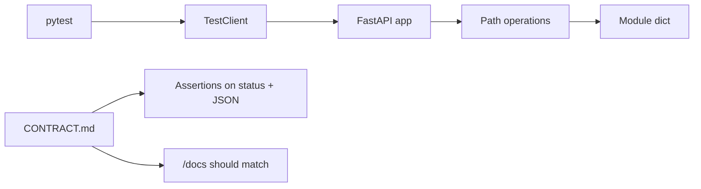

# Month 9 · Week 1 · Day 5
# TestClient and a CONTRACT.md Draft

**Program:** Full-Stack Mastery · 18 months  
**Phase:** 3 — Python and backend  
**Month index:** [../../README.md](../../README.md)  
**Week 1:** [1](day-01.md) · [2](day-02.md) · [3](day-03.md) · [4](day-04.md) · Day 5 (today) · [6](day-06.md) · [7](day-07.md)  
**Week rhythm today:** Learn + type-along  
**Student state:** You can mutate an in-memory resource over HTTP. Today you **prove** it with tests and **write the promise down** before adding more routes.  
**Study time:** 3–4 focused hours

Labs: `~\fullstack-lab\month-09\week-01\day-05\`.

---

## How to use this textbook

1. Read a section. Close it. Say it.  
2. Type tests. A test you did not run is a wish.  
3. CONTRACT.md is a **document you write**, not OpenAPI dumped into a file. `/docs` should **match** it.  
4. Optional review links are for later rechecking.

---

## How to read this chapter

`curl.exe` is manual. **pytest** is repeatable. `TestClient` speaks **HTTP** to your FastAPI app **in-process** (ASGI). That is closer to a real client than calling `get_note(1)` as a Python function — and that difference is the point.



**Wrong belief:** “I already clicked `/docs`; tests are extra.”  
**Correct:** `/docs` try-it is a demo. Tests are the **regression net** for 404, 409, 201, and 204. Project 6A’s gate requires them.

---

## Today's contract

By the end of this day you will be able to:

1. Add **pytest** with `uv add --dev pytest httpx`.  
2. Build `TestClient` from `fastapi.testclient` (or httpx ASGI — see below).  
3. Write tests for **happy path**, **404**, and **409** (or 422 if you validate missing fields).  
4. Explain why tests that share a module-level dict can **pollute** each other — and how you isolate (reset dict, or fresh app).  
5. Draft **CONTRACT.md**: paths, methods, statuses, JSON fields — **before** you add a new endpoint in Block C.

**Today's gate.** Closed-book:

> TestClient is HTTP. I assert `status_code` and body keys. CONTRACT.md is the human contract; OpenAPI is generated from code. They must agree. A dirty in-memory store is a flaky test, not a flaky framework.

---

## Time box

| Block | Minutes | Work |
|---|---|---|
| A | 45 | Theory |
| B | 65 | Type-along: client + three tests + CONTRACT.md |
| C | 70 | Independent: more tests; one new field only after contract |
| D | 20 | Git |
| E | 15 | Recall |

---

# Block A — Theory

## 1. Why HTTP tests, not only unit tests

Month 8 taught pytest on functions. That still matters (Week 3 services). An API’s public surface is **HTTP**:

- method and path  
- status  
- JSON shape  
- headers (`Content-Type`, later CORS)

A test that calls `create_slot({...})` can pass while the decorator still says 200 instead of 201. **TestClient** would fail. Prefer HTTP tests for path operations.

---

## 2. TestClient (Starlette / FastAPI)

```python
from fastapi.testclient import TestClient
from main import app

client = TestClient(app)

def test_health() -> None:
    r = client.get("/health")
    assert r.status_code == 200
    assert r.json() == {"status": "ok"}
```

- `client.get`, `.post`, `.put`, `.patch`, `.delete` — same idea as `curl.exe`.  
- JSON body: `client.post("/slots", json={"code": "A1", "label": "door"})`. The `json=` argument sets Content-Type. Prefer this over raw `data=`.  
- `r.json()` parses the body. For **204**, do **not** call `.json()`; assert `r.status_code == 204` and `r.content == b""` (or empty).  
- `r.headers` is available.

Run:

```powershell
uv run pytest -q
```

**Wrong belief:** “TestClient is a mock; it skips validation.”  
**Correct:** it runs the **same** app. Pydantic (Week 2) and `HTTPException` still fire.

---

## 3. httpx ASGI (the other allowed client)

FastAPI’s TestClient is the usual teaching tool. You may also use **httpx** with an ASGI transport (sync):

```python
import httpx
from main import app

def test_health_httpx() -> None:
    transport = httpx.ASGITransport(app=app)
    with httpx.Client(transport=transport, base_url="http://test") as client:
        r = client.get("/health")
        assert r.status_code == 200
```

Pick **one** style per lab so you are not mixing contexts. Course default: `from fastapi.testclient import TestClient`. Know that httpx exists — Week 4 will mock **outbound** httpx if you call an external URL.

Do not start a real Uvicorn port in pytest unless you have a reason. TestClient/ASGI is enough.

---

## 4. Isolation: the module dict is shared

```python
# main.py
SLOTS: dict[int, dict] = {}
```

Test A POSTs id 1. Test B expects empty list. Test B **fails** if it runs after A. `--reload` is not running inside pytest; the **same Python process** keeps `SLOTS`.

Fixes (choose and document in `TESTS.md`):

1. **Reset in a fixture** (Week 4 you will write this properly):

```python
import pytest
from fastapi.testclient import TestClient
import main
from main import app

@pytest.fixture
def client() -> TestClient:
    main.SLOTS.clear()
    main._next_id = 1
    return TestClient(app)
```

2. **Each test creates what it needs** and uses unique codes — still reset ids if you assert `id == 1`.

3. Do **not** rely on test file order. pytest order is not a contract.

**Wrong belief:** “I’ll use `autouse` sleep so the dict settles.”  
**Correct:** clear the dict. Time is not isolation.

---

## 5. What to assert (minimum)

| Case | Assert |
|---|---|
| POST create | 201, `id` in body, `code` echoed |
| GET one | 200, fields |
| GET missing | 404, `"detail"` in JSON |
| POST duplicate unique | 409 |
| DELETE | 204, then GET 404 |
| Bad path type | 422 |

Assert **one idea per test**. Names: `test_get_missing_slot_returns_404`.

Do not `assert True`. Do not snapshot the entire OpenAPI JSON this week.

---

## 6. CONTRACT.md (Month 9 habit)

OpenAPI is generated **from code**. If you only look at `/docs`, you will implement first and document accidents.

**CONTRACT.md** is written **in English + tables** **before** a resource grows:

```markdown
# Slots API (lab)

Base: http://127.0.0.1:8000

## Resource: Slot
JSON fields: id (int, response only), code (string, unique), label (string)

## Endpoints

| Method | Path | Success | Errors |
|---|---|---|---|
| GET | /slots | 200 array | |
| GET | /slots/{id} | 200 object | 404, 422 if id not int |
| POST | /slots | 201 object | 409 duplicate code, 400/422 missing fields |
| PUT | /slots/{id} | 200 object | 404, 409, 422 |
| PATCH | /slots/{id} | 200 object | 404, 409, 422 |
| DELETE | /slots/{id} | 204 empty | 404 |

## Rules
- PUT does not create.
- DELETE second time: 404.
- In-memory; process restart empties store.
```

That is a **draft**. Project 6A’s contract will be longer (three resources, pagination). Today you learn the **shape** of the document.

Order of work for Block C:

1. Add a line to CONTRACT.md (`archived: bool` or a `note` field — pick one).  
2. Write a test that expects the new field.  
3. Watch it **fail**.  
4. Implement.  
5. Watch it **pass**.

That is contract-first in miniature. The Month 9 gate is the same idea at project scale.

**Wrong belief:** “CONTRACT.md is the FastAPI `description=` string.”  
**Correct:** it is a **design** file in git. Code and `/docs` must be updated to match. When they drift, the contract wins until you **change the contract on purpose**.

---

## 7. Security and tests

- Do not log secrets in test output.  
- Do not test “the server is my production laptop.”  
- Tests that call the real internet: not today.

---

# Block B — Type-along

You may continue Day 4’s slots app **copied by typing** into day-05 (do not import across days). Or rebuild a smaller **locker** resource: `{id, code, floor}`.

```powershell
cd ~\fullstack-lab
mkdir month-09\week-01\day-05 -Force
cd ~\fullstack-lab\month-09\week-01\day-05
uv init --name lab-lockers
uv add fastapi uvicorn
uv add --dev pytest httpx
```

`main.py`: health + lockers CRUD-enough for tests (list, create, get, delete). Unique `code`. In-memory dict.

`test_lockers.py`: TestClient + fixture that clears the store.

Minimum tests:

1. `test_create_and_get`  
2. `test_get_missing_404`  
3. `test_duplicate_code_409`  
4. `test_delete_204_then_404`

`CONTRACT.md` drafted **before** you add extra fields — even if you write it in the first 15 minutes of this block from the table in this chapter, adapted to **lockers**.

```powershell
uv run pytest -q
```

Write `TESTS.md`: how isolation works in your fixture.

---

# Block C — Independent

1. Add **one** field to CONTRACT.md first (`size` as string `"sm"|"md"|"lg"` or a free `note` string).  
2. Test it (POST without it: your documented default or 422).  
3. Implement.  
4. Add `test_put_missing_404`.  
5. Run pytest. If a test is order-dependent, **fix isolation**, do not delete the test.

Do not paste Project 6A.

```powershell
cd ~\fullstack-lab
git add month-09
git commit -m "Month 9 Day 5: TestClient, locker tests, CONTRACT.md draft."
```

---

# Block E — Recall

1. Why HTTP tests catch decorator `status_code` bugs.  
2. `json=` vs a Python function call.  
3. Why 204 and `.json()` fight.  
4. Why `SLOTS` leaks across tests.  
5. CONTRACT.md vs `/docs`.

## Office hours — tests that lie

**Order-dependent green.** pytest reordering (or adding a test) fails CI. If you need `test_a` to run before `test_b`, your fixture is wrong. Reset the dict.

**Asserting the entire JSON blob.** A new field in Out breaks every test. Assert keys you care about (`id`, `code`) plus absences (`password_hash`).

**Calling `create_locker()` in tests.** You never notice `status_code=201` missing. TestClient `post` would.

**CONTRACT after the fact.** If Block C added a field before the markdown, rewrite the contract **then** confirm tests. The month gate is the habit, not the file existing.

**httpx vs TestClient mixed.** Pick one in this lab. Both are HTTP. Mixing in one file is noise.

`uv run pytest -q --tb=short` is enough. Do not add coverage tools today.

Windows: if pytest is not found, you forgot `uv add --dev pytest` or you ran `pytest` outside `uv run`.

## Minimum test file shape

```python
from fastapi.testclient import TestClient
import main

def test_duplicate_code_409() -> None:
    main.LOCKERS.clear()
    main._next_id = 1
    c = TestClient(main.app)
    c.post("/lockers", json={"code": "L1", "floor": 2})
    r = c.post("/lockers", json={"code": "L1", "floor": 3})
    assert r.status_code == 409
```

Prefer a fixture over repeating `clear()`. CONTRACT.md lists this 409 **before** you enjoy a green test.

---

## Definition of done

- [ ] `uv run pytest -q` is green  
- [ ] Tests cover 201, 404, 409, 204  
- [ ] Store reset between tests  
- [ ] CONTRACT.md exists and matches routes  
- [ ] New field was specified before coded  
- [ ] Commit exists  

---

## Optional review links

TestClient and contract-first are explained in this chapter.

- [FastAPI: Testing](https://fastapi.tiangolo.com/tutorial/testing/)
- [httpx](https://www.python-httpx.org/)
- [pytest fixtures](https://docs.pytest.org/en/stable/explanation/fixtures.html)

---

## Tomorrow

**Independent resource** — you choose the noun (not Project 6A’s three). Full GET/POST/GET-id/PUT/PATCH/DELETE, CONTRACT.md, tests. Still in memory.
