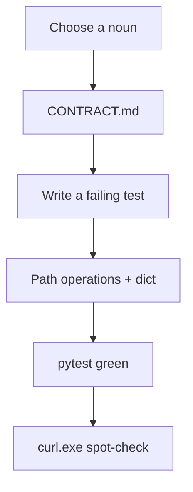
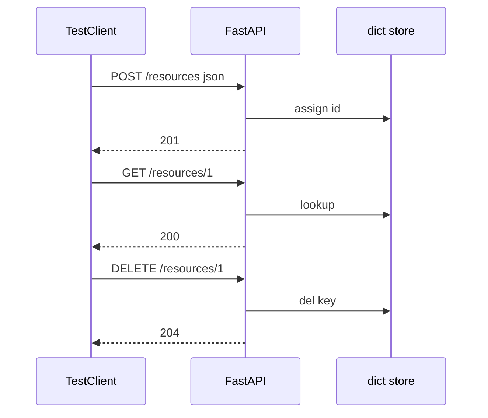
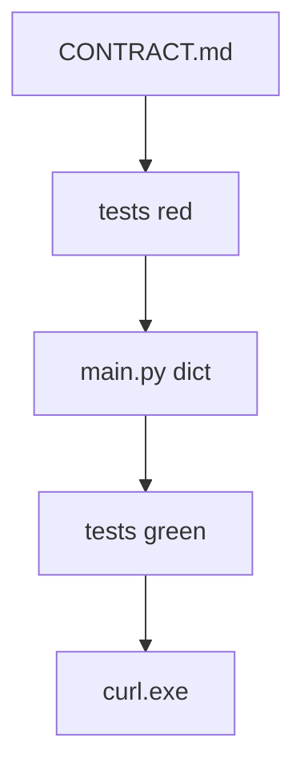

# Month 9 · Week 1 · Day 6
# Independent Resource: A Small HTTP API You Own

**Program:** Full-Stack Mastery · 18 months  
**Phase:** 3 — Python and backend  
**Month index:** [../../README.md](../../README.md)  
**Week 1:** [1](day-01.md) · [2](day-02.md) · [3](day-03.md) · [4](day-04.md) · [5](day-05.md) · Day 6 (today) · [7](day-07.md)  
**Week rhythm today:** Independent implementation  
**Student state:** You have path/query/body, PUT/PATCH/DELETE, TestClient, and a CONTRACT.md draft. Today you apply all of it to a **noun you choose**.  
**Study time:** 3–4 focused hours

Labs: `~\fullstack-lab\month-09\week-01\day-06\`.

This textbook will **not** give you the finished `main.py`. It will give you a **spec envelope** and a **forbidden list**.

---

## How to use this textbook

1. Write CONTRACT.md **first**. Empty `main.py` is allowed; empty contract is not.  
2. Type the app. AI may review; it may not ship the resource.  
3. Tests are part of the day, not homework after.  
4. Optional review links are for later rechecking.

---

## How to read this chapter

Week 1’s skill is not “I followed five labs.” It is “I can **specify** HTTP and **implement** it with FastAPI in memory.”



**Wrong belief:** “I’ll use users, projects, and tasks so I’m ahead on Project 6A.”  
**Correct:** Project 6A is **Week 4** in **its own repo**. Today a **different** domain so you cannot paste. If you implement 6A now, you skip the learning sequence (Pydantic, routers, pagination).

---

## Today's contract

By the end of this day you will be able to:

1. Pick **one** resource with a unique field and a couple of strings/ints.  
2. Write CONTRACT.md: methods, paths, statuses, JSON, uniqueness, 204/404/409 rules.  
3. Implement GET list (with a query filter), GET one, POST, PUT, PATCH, DELETE.  
4. Cover happy path, 404, 409, 204 with TestClient.  
5. Explain the store in one paragraph: module dict, reload, test fixture reset.

**Today's gate.** Closed-book:

> I specified an API, then made FastAPI and tests match the spec. I did not copy Project 6A. I still raise 404 myself. I still know RAM dies on reload.

---

## Time box

| Block | Minutes | Work |
|---|---|---|
| A | 25 | Choose noun + write CONTRACT.md |
| B | 40 | Failing tests from the contract |
| C | 90 | Implement until tests pass |
| D | 30 | curl.exe + `/docs` vs contract |
| E | 15 | Recall + README |

---

# Block A — Choose and specify

## Allowed nouns (pick one, or invent at the same size)

| Noun | Unique field | Other fields (suggestions) |
|---|---|---|
| **Sticky notes** | none required; `color` optional | `text`, `pinned` bool |
| **Bookmarks** | `url` unique | `title`, `tag` |
| **Coffee orders** | none; `queue_number` assigned | `drink`, `size`, `done` |
| **Lab seats** | `seat_code` unique | `room`, `occupied` |
| **Plant log** | none | `name`, `ml_watered`, `when` (string is fine) |

**Forbidden this day:** `users` + `projects` + `tasks`; inventory items + issues + comments as a **trio**. One resource only. No auth. No SQLAlchemy, Alembic, Redis, files-as-DB.

## CONTRACT.md must include

1. Title and one-sentence purpose.  
2. Field table: name, type, create vs response (id is response-only).  
3. Endpoint table: method, path, success status, error statuses.  
4. Rules: PUT does not upsert; DELETE 204 then GET 404; unique field → 409; query param name for list filter.  
5. Persistence: “in-memory dict; lost on process restart.”  
6. Example JSON for POST body and GET-one response (hand-written, two objects).

If you cannot fill the tables, you are not ready to code. Stay in Block A.

**Wrong belief:** “I’ll discover statuses while coding; the contract can wait.”  
**Correct:** statuses you discover are accidents. The Month 9 gate is **contract first**.

---

# Complete explanation (keep this open; Days 1–5 closed except this recap)

**Uvicorn:** `uv run uvicorn main:app --reload --host 127.0.0.1 --port 8000`.

**Path vs query vs body:** `{id}` in the path; filters in the query; JSON on POST/PUT/PATCH.

**HTTPException:** 404 missing; 409 unique collision; missing required fields 400 or 422 (document which).

**Statuses:** GET 200, POST 201, PUT/PATCH 200, DELETE 204 empty.

**PUT vs PATCH:** replace vs `key in payload`. Path id wins.

**TestClient:** `from fastapi.testclient import TestClient`. `json=`. Fixture **clears** the module dict and resets `_next_id`. Do not parse JSON on 204.

**Windows:** `curl.exe`. PowerShell `curl` is not the same.



---

# Block B — Tests first

```powershell
cd ~\fullstack-lab
mkdir month-09\week-01\day-06 -Force
cd ~\fullstack-lab\month-09\week-01\day-06
uv init --name lab-independent
uv add fastapi uvicorn
uv add --dev pytest httpx
```

Write `test_resource.py` **before** a complete `main.py` is allowed to exist. Stub `app = FastAPI()` and routes that `raise HTTPException(501)` if you need imports to collect — or write tests against the contract and accept red until Block C. Prefer **red tests**.

Minimum:

- create + get  
- list filter (at least one matching and one not)  
- get missing 404  
- duplicate unique 409 **if** your noun has a unique field; otherwise a documented 400 on blank text  
- patch one field  
- delete 204 then 404  

`uv run pytest -q` should **fail** until Block C. Paste the failure summary into `RED.txt`.

---

# Block C — Implement

`main.py` (and only extra modules if you already want them — Week 3 is routers). A dict behind the module is correct.

Health route optional but useful: `GET /health`.

Clamp list `limit` if you expose it.

When green, do not add a second resource “for fun.” Depth beats width.

---

# Block D — Manual check

```powershell
uv run uvicorn main:app --reload --host 127.0.0.1 --port 8000
```

`curl.exe` for POST, GET, PATCH, DELETE. Write `CURL.txt`.

Open `/docs`. Tick a paper checklist: every CONTRACT.md row appears. If `/docs` has extra routes, either document them or delete them.

README.md in the lab folder: how to run server, how to run tests, one paragraph on RAM.

---

# Block E — Recall

1. Why this noun is not Project 6A.  
2. Where 409 lives in **your** contract.  
3. How tests reset RAM.  
4. What `--reload` does to a demo with `curl.exe`.

## A day-6 quality bar (concrete)

Your CONTRACT.md is too thin if it says “CRUD for notes.” It is enough if a classmate could implement without asking you:

- exact path strings  
- 201 vs 200  
- 204 vs 200 on delete  
- unique field name and 409  
- query param for list  
- example JSON  

Your tests are too thin if they only POST and GET. Add 404, 204, and 409 (or 400 on blank) **today**. Week 2 will add 422 loc; you may already see 422 from path `int`.

**Isolation snippet:**

```python
@pytest.fixture
def client() -> TestClient:
    main.ITEMS.clear()
    main._next_id = 1
    return TestClient(main.app)
```

Use your actual module names.

**Forbidden rescue:** do not copy Day 4 `SLOTS` and rename. The independent day is a **new** dict and a **new** contract.

If pytest cannot import `main`, you are running from the wrong directory. `cd` into the uv project. `uv run pytest -q`.



## Predicted statuses (fill before curl.exe)

| Request | Expected |
|---|---|
| GET `/health` if you added it | 200 |
| GET collection empty | 200 `[]` or envelope you documented |
| POST valid | 201 + `id` |
| POST duplicate unique | 409 |
| POST `{}` or missing required | 400 or 422 (yours) |
| GET that id | 200 |
| GET missing int id | 404 + `detail` |
| GET `/nouns/abc` | 422 |
| PATCH one field | 200; other fields unchanged |
| DELETE | 204 empty |
| DELETE again | 404 |
| PUT missing id | 404 not 201 |

If any row surprises you, the contract is wrong or the code is. Fix one of them; do not “accept both.”

**curl.exe POST reminder (PowerShell):**

```powershell
curl.exe -s -D - -X POST http://127.0.0.1:8000/bookmarks -H "Content-Type: application/json" -d "{\"url\":\"https://example.com\",\"title\":\"ex\"}"
```

If you get 422 with empty body, quoting ate your JSON. Use a file:

```powershell
Set-Content -Path body.json -Value '{"url":"https://example.com","title":"ex"}' -Encoding utf8
curl.exe -s -X POST http://127.0.0.1:8000/bookmarks -H "Content-Type: application/json" --data-binary @body.json
```

**What “one resource” means:** one collection, one dict. A `tag` string field is not a second resource. A `/tags` router is a second resource — out of scope.

**Git:** commit CONTRACT.md in an earlier commit if you can; then code. If you already mixed them, say so in README. The habit matters more than the archaeology.

## Stretch (only if the bar is already green)

- Query `pinned=true` if your noun has a bool.  
- Header `X-Item-Count` on list via `Response`.  
- `ROUTES.txt` table matching CONTRACT.md row-for-row.

Do not add a second noun. Do not add SQL. Do not start `~/ops-api` today.

**Wrong belief:** “Independent day is optional if I did Day 4 slots.”  
**Correct:** Day 4 was guided. Today you **specified**. That is the Month 9 gate in miniature.

README must include the uvicorn command and `uv run pytest -q`. If a classmate cannot run it from those two lines, the README is not done.

---

```powershell
cd ~\fullstack-lab
git add month-09
git commit -m "Month 9 Day 6: independent in-memory resource with contract and tests."
```

---

## Definition of done

- [ ] CONTRACT.md written **before** the happy path  
- [ ] `RED.txt` shows tests failed first (or you honestly recorded why not)  
- [ ] pytest green: 200/201/204/404/409 as specified  
- [ ] One resource only; forbidden domains unused  
- [ ] README + CURL.txt  
- [ ] Commit exists  

---

## Check yourself before git

Closed-book: path vs query vs body; 201 vs 204 vs 404 vs 409 vs 422; PUT vs PATCH; why `--reload` empties the dict; why TestClient must reset the store.

If any sentence is mush, re-read Block A of this file. Do not “fix” RAM with Postgres.

Uvicorn you actually run:

```powershell
uv run uvicorn main:app --reload --host 127.0.0.1 --port 8000
```

`curl.exe`, not `curl`.

If CONTRACT.md and `/docs` disagree on 204 vs 200 for DELETE, pick one and fix the other before you call the day done.

pytest must be green on a **fresh** `client` fixture, not because you ran tests in an order that left data. Add a second test that POSTs the same unique value after the first test’s delete — or reset and POST twice in one test for 409.

---

## Optional review links

The Week 1 mechanics are in Days 1–5 of this textbook. Recheck only if the recap is not enough.

- [FastAPI: Testing](https://fastapi.tiangolo.com/tutorial/testing/)
- [RFC 9110: PUT](https://www.rfc-editor.org/rfc/rfc9110.html#name-put)

---

## If pytest fails (this day)

| Symptom | Likely cause |
|---|---|
| 201 is 200 | missing `status_code=201` |
| 404 is 200 null | no `HTTPException` |
| 409 never fires | unique check missing or not normalized |
| 204 then `.json()` error | asserting JSON on empty body |
| second test `id==1` fails | no fixture reset |

---

## Security reminder

Bind `127.0.0.1`. No passwords in this noun. Unique fields compared after `strip`. Query strings are not the place for titles you would POST.

---

## Tomorrow

**Week 1 review** — synthesis in the Day 7 file, mini-build, debug, retro. Days 1–6 closed during the mini-build.
