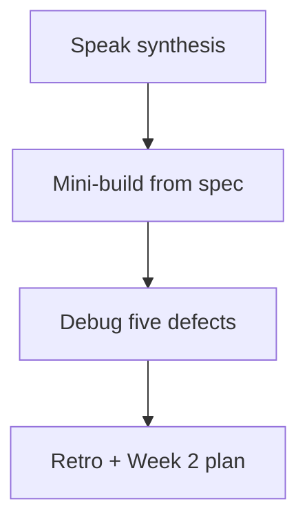
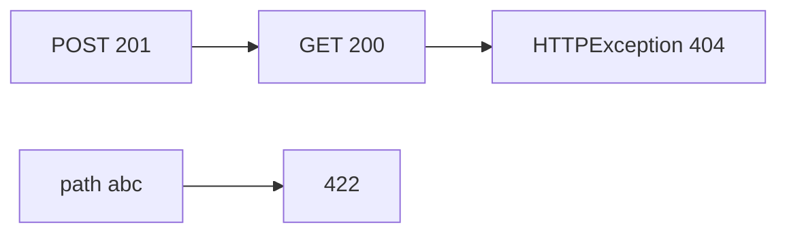

# Month 9 · Week 1 · Day 7
# Week Review — API Fundamentals

**Program:** Full-Stack Mastery · 18 months  
**Phase:** 3 — Python and backend  
**Month index:** [../../README.md](../../README.md)  
**Week 1:** [1](day-01.md) · [2](day-02.md) · [3](day-03.md) · [4](day-04.md) · [5](day-05.md) · [6](day-06.md) · Day 7 (today)  
**Week rhythm today:** Review, repair, plan Week 2  
**Student state:** You have served HTTP with FastAPI, parameterized routes, mutated an in-memory store, and tested with TestClient. Today those ideas must still live in your head — from **this file**.  
**Study time:** 3–4 focused hours

Do not start Week 2 because the calendar moved. Pydantic on a sloppy status map is two problems.

Work in `~\fullstack-lab\month-09\week-01\day-07\`. Do not implement the mini-build inside `~/ops-api/`.

---

## How to read this chapter

This is a **closed-book teaching day**. The synthesis **is** the Week 1 lesson.



Days 1–6 closed during mini-build. Repair from **this** recap.

---

## Week synthesis (the lesson, in this book)

**FastAPI** maps **HTTP method + path** to a Python function (**path operation**). **Uvicorn** is the ASGI server that imports your module and listens. `uv run uvicorn main:app --reload --host 127.0.0.1 --port 8000`. `main:app` = module `main`, variable `app`. Bind **127.0.0.1** in dev.

**Lifecycle:** import runs module-level code (`app = FastAPI()`, `STORE = {}`). `--reload` **re-imports**. **RAM dies**. That is Month 9 storage on purpose — not a reason to open PostgreSQL.

**Path params:** `{item_id}` in the decorator; same argument name; `int` parses or **422**. **Query params:** simple types not in the path; defaults optional; missing required → 422. **Body:** JSON for writes; `Content-Type: application/json`; `curl.exe` on Windows.

**Identify in the path** (`GET /items/3`). **Filter in the query** (`?q=`). Do not `GET /items?id=3` as get-one.

**Statuses you emit:** GET **200**, POST create **201** (`status_code=201`), PUT/PATCH **200**, DELETE **204** empty body (`None`, do not `.json()` in tests). Framework 404 = **no route**. Your 404 = **`HTTPException`** after the route ran. **409** = well-formed request, **state conflict** (unique field). **422** = validation/types. Do not send `ok: false` with HTTP 200.

**PUT** replaces (no upsert in this course). **PATCH** updates keys that are **present**. Path id wins over body id.

**Store:** `dict[int, dict]` keyed by id. Uniqueness is a Python loop until Month 10.

**Tests:** `from fastapi.testclient import TestClient` (or httpx ASGI). HTTP assertions. **Reset the dict** in a fixture. CONTRACT.md **before** growing the API. `/docs` is OpenAPI from code — it must **match** the contract.

TestClient speaks HTTP **in process**. It does not need port 8000. `client.post("/clips", json={...})` sets Content-Type for you. Shared module globals mean two tests will see each other’s POSTs unless a fixture `clear()`s the dict **and** resets `_next_id`. Asserting `body["id"] == 1` in two tests without a reset is the classic flake.

**Wrong belief:** “FastAPI is the database.”  
**Correct:** FastAPI is the **HTTP adapter**. The dict is storage. Next month the adapter stays.

**Wrong belief:** “DELETE 200 with `{"ok": true}` is clearer.”  
**Correct:** **204** means empty. A JSON body is 200 territory. Tests should assert 204 and empty content.

**Wrong belief:** “`GET /clips/abc` is not found.”  
**Correct:** the route matched; `int` failed → **422**. 404 is for a missing **int** id.

The sections below unpack that so you can mini-build without Days 1–6.

---

## Today's contract

**Today's gate.** Closed-book:

> I can explain path vs query vs body, 201/204/404/409/422, PUT vs PATCH, why reload empties the store, and I built a tiny API from this file’s spec with TestClient coverage.

---

## Time box

| Block | Minutes | Work |
|---|---|---|
| 1 | 40 | Speak the synthesis |
| 2 | 55 | Mini-build `clip` resource |
| 3 | 30 | Debug five defects (on paper + optional broken file) |
| 4 | 20 | Review Day 6 contract vs tests — one fix |
| 5 | 20 | Re-run pytest |
| 6 | 20 | Design: why get-one is not a query param |
| 7 | 20 | Retro + Week 2 plan |

---

# Complete explanation — HTTP you must still own

## 1. Pieces

FastAPI declares routes and (later) models. Starlette underneath: requests, middleware. Uvicorn: process + port. Pydantic: **Week 2**. Today dict bodies are a known sin with an expiry date.

## 2. Matching

FastAPI matches **method and path template**. `GET /clips/1` is not `POST /clips`. Extra trailing-slash behavior exists; pick one style and do not fight it in the mini-build.

## 3. Errors

| Status | Meaning this week |
|---|---|
| 200 | Found or replaced/patched |
| 201 | Created |
| 204 | Deleted (empty) |
| 400 | You rejected a body without Pydantic (optional) |
| 404 | No route **or** you raised not-found |
| 409 | Unique conflict |
| 422 | Path/query/body types (FastAPI) |

## 4. TestClient

In-process ASGI. `client.post("/clips", json={...})`. Shared module globals → fixture `clear()`.

`response.status_code` is the claim. `response.json()` on 204 raises or is empty — do not call it. For 404, `detail` is usually a string this week (HTTPException). For 422, `detail` is often a **list**. Do not treat them as the same shape.

---

# Block 1 — Speak

No notes. Cover: Uvicorn, path/query/body, five statuses, PUT vs PATCH, RAM, TestClient vs calling functions, CONTRACT.md vs `/docs`.

Write `exam-01.md` after speaking — same content, 15–25 lines, your words.

---

# Block 2 — Mini-build (Days 1–6 closed)

```powershell
cd ~\fullstack-lab
mkdir month-09\week-01\day-07\mini -Force
cd ~\fullstack-lab\month-09\week-01\day-07\mini
uv init --name lab-clips
uv add fastapi uvicorn
uv add --dev pytest httpx
```

**Spec: paper clips inventory of one object type** — not Project 6A.

| Method | Path | Rules |
|---|---|---|
| GET | `/health` | 200 `{"status":"ok"}` |
| GET | `/clips` | 200 array. Query `color` optional exact match. |
| GET | `/clips/{clip_id}` | 200 or 404 |
| POST | `/clips` | 201. Body `color` (str), `mm` (int). Unique pair **not** required; skip 409 unless you want it. |
| PATCH | `/clips/{clip_id}` | 200 partial `color` and/or `mm` |
| DELETE | `/clips/{clip_id}` | 204 or 404 |

PUT optional. Tests: create+get, missing 404, delete 204, list filter. Fixture clears store.

No Pydantic `BaseModel` required. No second resource. No SQLAlchemy. In-memory dict keyed by int id.

`uv run uvicorn main:app --reload --host 127.0.0.1 --port 8000` in one terminal if you want `curl.exe`. pytest does not need the port.

---

# Block 3 — Debug

Write `exam-03-debug.md`. For each, **name the status you should see** and **the fix in one sentence**. Do not need a running broken server.

**A.** `GET /clips/abc` — developer says “not found.”  
**B.** POST returns 200 and the body has no `id`.  
**C.** DELETE returns 200 `{"ok": true}`. TestClient `.json()` “works.”  
**D.** Two tests: both POST then `assert body["id"] == 1`. Second fails.  
**E.** After editing `main.py`, `curl.exe` GET created id is 404. Developer “FastAPI lost the route.”

---

# Block 4 — Review

Open **only** your Day 6 CONTRACT.md and tests (not Day 6 `main.py` unless you need to fix). One mismatch: fix and commit message mentions it. If they already match, write `MATCH.txt`.

---

# Block 5 — Tests

`uv run pytest -q` in the mini project. Break the 404 test (assert 200); show fail; restore.

---

# Block 6 — Design

`design.md`: why `GET /clips?id=1` is a worse get-one than `GET /clips/1` for OpenAPI, caching, and React routers (Month 6 `useParams`). Ten lines.

A path parameter is a resource identity. A query parameter is a filter or option. Mixing them makes `/docs` lie about “list vs one,” makes caches treat every id as a new list query, and makes a React route param unused. Write that in your own words.

---

# Block 7 — Retro

`retro.md`: weakest status code; whether you still want to skip to SQL (you must not); Week 2 question you will ask about validation.

Week 2 is **Pydantic v2** — request/response models, 422 **shape**, OpenAPI. Do not start it if Block 2 is incomplete.

## Debug keys (after you write A–E)

**A.** `/clips/abc` matched the route; `int` failed → **422**. 404 is for a missing **int** id.

**B.** Default success is 200. You must set `status_code=201` and put `id` on the stored dict.

**C.** 204 means empty. A JSON body is 200 territory. Tests should assert 204 and empty content.

**D.** Shared `CLIPS` dict. Fixture must `clear()` and reset `_next_id`.

**E.** Reload re-imported the module. RAM died. The route still exists (`GET /clips` 200 `[]`).

If you wrote “FastAPI bug” for any of these, rewrite from the synthesis.

---

```powershell
cd ~\fullstack-lab
git add month-09
git commit -m "Month 9 Week 1 review: clips mini-build and debug notes."
```

---

# Lecture: TestClient is HTTP, not a function call

`from fastapi.testclient import TestClient`. `client = TestClient(app)`. `client.post("/clips", json={...})` is an HTTP POST. Assert `status_code`, then body. Calling `create_clip(...)` directly skips the adapter — statuses, headers, and 422 never run. The week’s skill is the adapter.

**Fixture.** Module-level `CLIPS = {}` is shared. Test A POSTs id 1. Test B POSTs and asserts id 1 → fail. `clear()` the dict and reset `_next_id` in a fixture (or at the start of each test). Do not “fix” it by asserting `id >= 1` forever. Isolation is the claim.

**204.** Empty body. Do not `.json()`. `content == b""` (or equivalent) plus status 204. A JSON `{"ok": true}` is 200 wearing a delete verb.

**PUT vs PATCH.** PUT replaces the writable fields you documented — no upsert (missing id → 404, not create). PATCH applies keys that are **present**. Path id wins if the body also has `id`. Dict bodies make PATCH sloppy (missing vs null). Week 2’s `exclude_unset` is the typed version. Today, document how you treat a missing key.

**CONTRACT.md vs /docs.** The contract is the teacher. `/docs` is generated from code. If they disagree, the code or the contract is wrong — pick one and fix. Review Day 6 for one mismatch.

**SQL is not a reward.** In-memory is the point so HTTP stays visible. PostgreSQL next month. If retro says “I want SQL now,” write why that would hide a 201 bug, then do not open SQLAlchemy.

Mini-build is paper clips. Not ops-api. Not users/projects/tasks. `~\fullstack-lab\month-09\week-01\day-07\mini`.

---

## Definition of done

- [ ] `exam-01.md` written from memory  
- [ ] Mini-build pytest green  
- [ ] Debug A–E answered  
- [ ] Retro exists  
- [ ] I will not open SQLAlchemy this month  

---

# Worked session — clips mini + TestClient

`uv init` in `day-07/mini`. Add fastapi, uvicorn, pytest, httpx. One resource: clips. GET list with `color` query, GET one 200/404, POST 201, PATCH partial, DELETE 204. Fixture clears store and `_next_id`. Tests: create+get, 404, 204 empty, filter.

`exam-01.md` from memory. Debug A–E after you write them — then check keys in this file. Break 404 test, show fail, restore. `design.md` why get-one is a path param. `retro.md` no SQLAlchemy.

`from fastapi.testclient import TestClient`. HTTP assertions. Do not call internal functions as the only tests. Do not implement inside `~/ops-api/`.

If two tests both need `id == 1`, the fixture is missing. If DELETE `.json()` works, you sent a body. If `/clips/abc` is “not found” in your debug answer, rewrite to 422.

---

## Optional review links

Repair from this synthesis first. These pages are for later checking, not for first learning.

- [FastAPI: Path operations](https://fastapi.tiangolo.com/tutorial/first-steps/)
- [FastAPI: Testing](https://fastapi.tiangolo.com/tutorial/testing/)

---

## Next week

[Week 2 Day 1 — Pydantic BaseModel](../week-02/day-01.md). Models are the contract the framework can enforce. Dict bodies retire.

---

# Closing lecture — HTTP tests, not helper tests

`TestClient` speaks HTTP in process. It does not need port 8000.
Calling `create_clip()` directly skips statuses and 422.
The week’s skill is the adapter. Assert `status_code` first.

Fixture `clear()` plus `_next_id` reset. Two tests that need `id == 1`
without a reset are a shared-store bug. Do not loosen the assert.

204: empty body. Do not `.json()`. 200 plus `{"ok": true}` is the wrong delete.
`GET /clips/abc` → 422. Missing int id → 404. Learn both sentences.

CONTRACT.md vs `/docs`: one mismatch, one fix. Pydantic is Week 2.
SQLAlchemy is not a reward. Mini is clips in `fullstack-lab`, not `~/ops-api/`.
`uv run pytest -q`. Break the 404 test; show fail; restore.
Debug A–E in full sentences. Retro: no SQL this month.
PUT replaces documented writable fields. No upsert: missing id is 404, not create.
PATCH applies keys that are present. Path id wins over a body id.
Dict PATCH is sloppy about missing vs null; Week 2 `exclude_unset` is the typed fix.
design.md: path id is identity; query is filter. OpenAPI, caches, and `useParams` agree.
If retro wants SQL tonight, write why a 201 bug would hide behind an ORM, then do not open it.


## Recite-back checklist (close the editor, then tick)

Write `RECITE.txt` with one honest sentence per line.
If a line is mush, re-read the matching section in **this** file only.

- [ ] TestClient is HTTP
- [ ] fixture clears store and `_next_id`
- [ ] 204 empty; no `.json()`
- [ ] `/clips/abc` is 422, not 404
- [ ] PUT no upsert; PATCH partial
- [ ] CONTRACT.md matches tests
- [ ] no SQLAlchemy this month
- [ ] mini not inside `~/ops-api/`

`uv run pytest -q`. Debug A–E written. Retro names Week 2 Pydantic.

If any debug answer says "FastAPI bug," rewrite it from the synthesis in this file.
TestClient plus a fixture is the Week 1 proof. Port 8000 is optional theater.
Do not start Week 2 until the clips mini is green and A-E are sentences.



