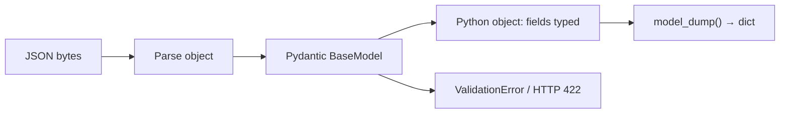
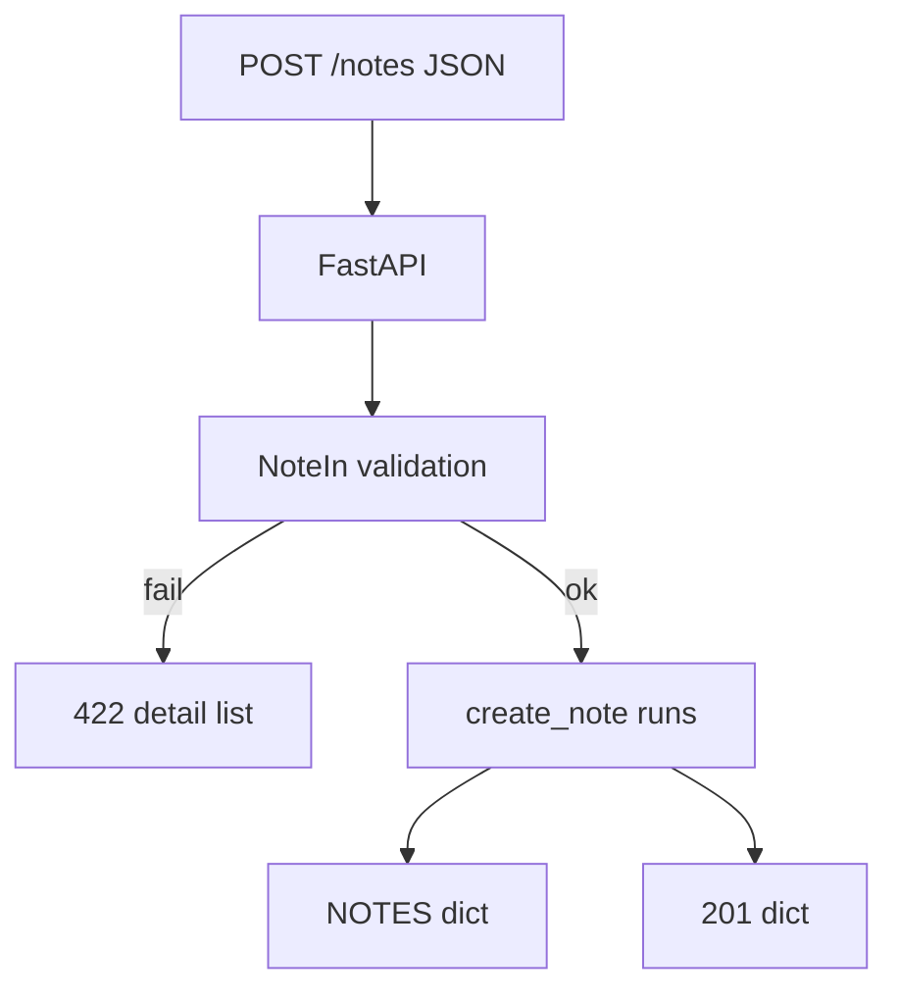

# Month 9 · Week 2 · Day 1
# Pydantic v2: BaseModel, Field, Validation, model_dump

**Program:** Full-Stack Mastery · 18 months  
**Phase:** 3 — Python and backend  
**Month index:** [../../README.md](../../README.md)  
**Week 2:** Day 1 (today) · [2](day-02.md) · [3](day-03.md) · [4](day-04.md) · [5](day-05.md) · [6](day-06.md) · [7](day-07.md)  
**Week 1 review:** [../week-01/day-07.md](../week-01/day-07.md)  
**Week rhythm today:** Learn + type-along  
**Student state:** Week 1 gate passed. You can route HTTP and store dicts. Those dicts were **untyped promises**. Today the promise becomes a **class**.  
**Study time:** 3–4 focused hours

**This week covers:** Pydantic, request models, response models, validation, error responses, OpenAPI.

Today: **`BaseModel`**, **`Field`**, **validation** that runs **before** your function body, and **`model_dump()`** (Pydantic **v2** — not `.dict()`). Create vs response models deepen on Day 2. Do not skip them. Still **no SQLAlchemy**.

Labs: `~\fullstack-lab\month-09\week-02\day-01\`.

---

## How to use this textbook

1. Read a section. Close it. Say it.  
2. Type models. A model you pasted and never broke is not yours.  
3. Read a **422** body with your eyes. Do not close it as “error.”  
4. Optional review links are for later rechecking.

---

## How to read this chapter

Pydantic is a **library** that turns JSON-shaped data into **Python objects** with **types and constraints**, or **refuses** with a structured error. FastAPI uses it at the HTTP boundary. You can also use it in scripts with no FastAPI at all — and you will, in Block B, so you do not think “validation is a decorator.”



**Wrong belief:** “Type hints on a `dict` already validate.”  
**Correct:** `payload: dict` accepts `{"title": 9}` and `{}`. A `BaseModel` with `title: str = Field(min_length=1)` does **not**.

---

## Today's contract

By the end of this day you will be able to:

1. Install / import Pydantic v2 (`from pydantic import BaseModel, Field, ValidationError`).  
2. Define a model with required and optional fields.  
3. Use **`Field`** for min/max length, numeric bounds, defaults.  
4. Construct from a dict; catch **`ValidationError`**.  
5. Export with **`model_dump()`** and **`model_dump(exclude_unset=True)`**.  
6. Wire one model as a FastAPI **request body** and watch **422** on bad input.  
7. State the v2 name: `model_dump`, not `dict()`.

**Today's gate.** Closed-book:

> A BaseModel is the schema. Field constraints run on parse. Invalid data never becomes a “mostly ok” object. `model_dump()` is the v2 export. FastAPI turns ValidationError at the boundary into HTTP 422. I still store in a dict this month — I just validate **before** I store.

---

## Time box

| Block | Minutes | Work |
|---|---|---|
| A | 50 | Theory |
| B | 55 | Script: models without a server |
| C | 70 | FastAPI: POST with a model + curl.exe 422 |
| D | 20 | Git |
| E | 15 | Recall |

---

# Block A — Theory

## 1. Why a model, not a dict

Week 1 you wrote `if "title" not in payload`. That does not:

- coerce `"12"` vs 12 where you want `int`  
- reject extra fields unless you remember  
- show up in `/docs` as a schema  
- compose (nested objects, lists of models)

Pydantic **is** that layer. FastAPI did not invent it.

**Pydantic v2** (this course): `model_dump`, `model_validate`, `ConfigDict`, `field_validator`. If a blog says `.dict()` and `.parse_obj()`, it is **v1**. Do not copy v1 into Month 9.

Check:

```powershell
uv run python -c "import pydantic; print(pydantic.VERSION)"
```

You want **2.x**. FastAPI’s current releases pull v2. If you somehow have v1, fix the environment — do not learn two APIs.

---

## 2. BaseModel

```python
from pydantic import BaseModel, Field

class NoteIn(BaseModel):
    title: str = Field(min_length=1, max_length=120)
    body: str = ""
    pinned: bool = False
```

- Every field has a **type**.  
- `body: str = ""` is optional at the JSON layer because it has a **default**.  
- `title` has no default → **required**.  
- `Field(...)` attaches **constraints** and OpenAPI metadata.

Construct:

```python
n = NoteIn(title="Buy milk")
# n.title == "Buy milk"
# n.body == ""
# n.pinned is False
```

From a dict (JSON after parse):

```python
n = NoteIn.model_validate({"title": "Buy milk", "pinned": True})
```

`NoteIn(**data)` also works. Prefer `model_validate` when the input is a dict you did not keyword-expand on purpose.

**Wrong belief:** “The class is a TypeScript `interface`; it disappears at runtime.”  
**Correct:** Pydantic models **exist at runtime**. They validate. TypeScript interfaces were erased (Month 5). This is the opposite job.

---

## 3. Field

Useful arguments this week:

| Argument | Job |
|---|---|
| `min_length` / `max_length` | strings (and some collections) |
| `ge` / `gt` / `le` / `lt` | numbers (greater/less, equal or not) |
| `default` | default value (`Field(default=0)` or `= 0` on the annotation) |
| `default_factory` | callable for mutable defaults (`list`, `dict`) — **never** `items: list = []` |
| `description` | OpenAPI text |
| `examples` | OpenAPI example list (v2) |

```python
class TankIn(BaseModel):
    liters: int = Field(ge=0, le=10_000, description="Current volume")
    tags: list[str] = Field(default_factory=list)
```

`ge=0` means **greater than or equal**. Negative liters → validation error.

**Mutable defaults:** Python’s `def f(x=[])` bug exists on models too. Use `Field(default_factory=list)`, not `tags: list[str] = []`.

---

## 4. What validation does (and does not)

Does:

- missing required field → error  
- wrong type (string where `int` required) → error, unless a coercion is allowed  
- constraint fail (`min_length`) → error  
- extra fields: **ignored by default** in v2 FastAPI/Pydantic config you will meet; you can **forbid** extras (Day 2 / `model_config`)

Does not:

- check that `title` is unique in your dict — that is **your** 409  
- check that `note_id` exists — that is **your** 404  
- replace `HTTPException`

Coercion: Pydantic may coerce `"42"` to `int` 42 in some modes. FastAPI’s request parsing has strictness settings. **Do not rely on silent coercion in tests.** Send JSON numbers as numbers: `{"liters": 3}` not `"3"` unless you documented string mode.

**Wrong belief:** “If it validates, the business rule passed.”  
**Correct:** validation is **shape**. Uniqueness and “parent exists” are **state**. 422 vs 409 stays.

---

## 5. ValidationError (outside FastAPI)

```python
from pydantic import ValidationError

try:
    NoteIn.model_validate({"title": ""})
except ValidationError as exc:
    print(exc.errors())
```

`exc.errors()` is a **list of dicts**: `type`, `loc`, `msg`, `input`, sometimes `ctx`. FastAPI’s 422 **`detail`** is this family of structure. Day 5 you will **test** it. Today you **look** at it.

---

## 6. model_dump (v2 export)

```python
n = NoteIn(title="Hi", pinned=True)
d = n.model_dump()
# {'title': 'Hi', 'body': '', 'pinned': True}

partial = NoteIn.model_validate({"title": "Hi"})
# user omitted pinned and body — they still have defaults in the object

patch_in = {"title": "Hi"}  # imagine a PATCH model
# exclude_unset: only fields the caller actually provided
```

For PATCH (Day 4 this week):

```python
class NotePatch(BaseModel):
    title: str | None = None
    body: str | None = None

# Better pattern: optional fields with no default using a typed PATCH
# model_dump(exclude_unset=True) omits fields that were never set.
```

```python
p = NotePatch.model_validate({"title": "New"})
p.model_dump(exclude_unset=True)
# {'title': 'New'}   # body omitted because it was not set
```

If you `model_dump()` without `exclude_unset`, defaults appear and PATCH would **wipe** omitted fields. That is the classic bug.

v1 name `.dict()` **must not** appear in your code. If Ruff or you see it, you copied the wrong blog.

Other v2 names: `model_dump_json()`, `model_copy()`, `model_validate_json()`.

**Wrong belief:** “I’ll `dict(model)` or `model.__dict__`.”  
**Correct:** `model_dump()`. `__dict__` can include internals. `dict(model)` is not the API.

---

## 7. FastAPI request body

```python
from fastapi import FastAPI
from pydantic import BaseModel, Field

app = FastAPI()

class NoteIn(BaseModel):
    title: str = Field(min_length=1, max_length=120)
    body: str = ""

NOTES: dict[int, dict] = {}
_next_id = 1

@app.post("/notes", status_code=201)
def create_note(payload: NoteIn) -> dict:
    global _next_id
    item = {"id": _next_id, **payload.model_dump()}
    NOTES[_next_id] = item
    _next_id += 1
    return item
```

- `payload: NoteIn` → JSON body must match.  
- Your function **does not run** if validation fails. 422 happens first.  
- Returning `dict` is still allowed today. Day 2: `response_model=` and a separate out model.



---

## 8. Nested models (know; small use today)

```python
class Author(BaseModel):
    name: str = Field(min_length=1)

class BookIn(BaseModel):
    title: str
    author: Author
```

JSON: `{"title": "X", "author": {"name": "Ada"}}`. Missing `author` → 422. You do not need nesting in the lab if time is short; you must **recognize** it in `/docs`.

---

## 9. Security start

- Constraints are a **first** filter, not auth.  
- `max_length` on strings is a courtesy to your RAM. Use it.  
- Do not put secrets on models you will dump into logs. `model_dump()` will include them unless you exclude. Day 2: **response models** that omit internals.

---

# Block B — Type-along (no server)

```powershell
cd ~\fullstack-lab
mkdir month-09\week-02\day-01 -Force
cd ~\fullstack-lab\month-09\week-02\day-01
uv init --name lab-pydantic
uv add pydantic
```

Create `shapes.py` (not `main.py` yet):

1. `NoteIn` as above.  
2. `main` block or a `run_checks()` that:  
   - builds a valid note, prints `model_dump()`  
   - `model_validate` empty title, catches `ValidationError`, prints `exc.errors()` to a file `ERRORS.txt`  
   - demonstrates `NotePatch` + `exclude_unset=True`

```powershell
uv run python shapes.py
```

Write `V2.txt`: one line — “I used `model_dump`, not `dict`.”

---

# Block C — FastAPI

```powershell
uv add fastapi uvicorn
```

`main.py`: `POST /notes` with `NoteIn`, in-memory dict, `GET /notes/{id}` with `HTTPException` 404. Return dicts today.

```powershell
uv run uvicorn main:app --reload --host 127.0.0.1 --port 8000
```

```powershell
curl.exe -s -D - -X POST http://127.0.0.1:8000/notes -H "Content-Type: application/json" -d "{\"title\":\"ok\"}" -o body.json
curl.exe -s -D - -X POST http://127.0.0.1:8000/notes -H "Content-Type: application/json" -d "{\"title\":\"\"}" -o err.json
```

Open `err.json`. Confirm **422** and a **list** under `detail`. Copy a shortened `loc` / `type` into `HTTP.txt`.

Open `/docs`. Confirm schema for `NoteIn`.

Do **not** add SQLAlchemy. Do **not** build Project 6A.

---

# Block D — Git

```powershell
cd ~\fullstack-lab
git add month-09
git commit -m "Month 9 Week 2 Day 1: Pydantic v2 BaseModel, Field, model_dump."
```

---

# Block E — Recall

1. Required vs optional field.  
2. Why `tags: list[str] = []` is wrong.  
3. `model_dump` vs v1 `dict`.  
4. Why `exclude_unset` matters for PATCH.  
5. Does a valid model mean 409 cannot happen?

---

## Definition of done

- [ ] Pydantic 2.x printed  
- [ ] `ERRORS.txt` from `ValidationError`  
- [ ] POST valid → 201; empty title → 422  
- [ ] I read `detail` as a list of objects  
- [ ] No `.dict()` in my code  
- [ ] Commit exists  

---

## Optional review links

BaseModel, Field, and `model_dump` are explained in this chapter.

- [Pydantic v2 models](https://docs.pydantic.dev/latest/concepts/models/)
- [Pydantic Field](https://docs.pydantic.dev/latest/concepts/fields/)
- [FastAPI: Request body](https://fastapi.tiangolo.com/tutorial/body/)

---

## Tomorrow

**Create vs response models** — never leak internal fields. `response_model`. OpenAPI examples. The dict you store may have more keys than the JSON you return.
