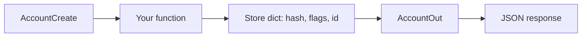

# Month 9 · Week 2 · Day 2
# Create Models vs Response Models (Do Not Leak)

**Program:** Full-Stack Mastery · 18 months  
**Phase:** 3 — Python and backend  
**Month index:** [../../README.md](../../README.md)  
**Week 2:** [1](day-01.md) · Day 2 (today) · [3](day-03.md) · [4](day-04.md) · [5](day-05.md) · [6](day-06.md) · [7](day-07.md)  
**Week rhythm today:** Learn + type-along  
**Student state:** You can validate a request with `BaseModel`. Today you stop **returning the store row**.  
**Study time:** 3–4 focused hours

**This week covers:** Pydantic, request/response models, validation, errors, OpenAPI.

Today: **separate create and response models**, `response_model=` on the path operation, OpenAPI **example**, and the rule **never leak internal fields**. Exception-handler cosmetics wait until Day 5. Typed CRUD is Day 4.

Labs: `~\fullstack-lab\month-09\week-02\day-02\`.

---

## How to use this textbook

1. Read a section. Close it. Say it.  
2. Type two classes even when they look similar. The difference is the lesson.  
3. If `/docs` shows `password_hash` on a 200, you failed the day — even on a toy.  
4. Optional review links are for later rechecking.

---

## How to read this chapter

The JSON a client **sends** is not the JSON a client **should receive**. The dict you **store** may have fields that are nobody’s HTTP business: `password_hash`, `is_deleted`, `internal_score`, `created_by_ip`.



FastAPI’s `response_model=` **filters** the return value through the out model. That is a **seatbelt**. You still should not `return row` as a habit without a model.

**Wrong belief:** “I’ll use one `Account` model for input, storage, and output; DRY.”  
**Correct:** **three jobs, three shapes** when they differ. DRY that copies a password hash into `/docs` is a vulnerability with extra steps. Project 6 Stage A: *separate create/update/response models when their shapes differ. Do not blindly expose database models* — you have no ORM yet; the **dict** is the same temptation.

---

## Today's contract

By the end of this day you will be able to:

1. Write **`Create`** (no `id`, no secrets) and **`Out`** (`id`, public fields only).  
2. Set **`response_model=AccountOut`** (and `status_code=201` where needed).  
3. Store extra keys in the dict that **do not** appear in `AccountOut`.  
4. Prove with TestClient or `curl.exe` that an internal field is **absent**.  
5. Add an **example** so `/docs` shows a realistic body.  
6. Explain `response_model` vs “I returned a dict that happened to look right.”

**Today's gate.** Closed-book:

> Request models are what we accept. Response models are what we admit to. Storage may have more. `response_model` is the filter FastAPI applies. Leaking hashes or flags in JSON is a contract bug, not a formatting bug.

---

## Time box

| Block | Minutes | Work |
|---|---|---|
| A | 50 | Theory |
| B | 60 | Type-along: accounts with a fake hash |
| C | 70 | Independent: second resource + example |
| D | 20 | Git |
| E | 15 | Recall |

---

# Block A — Theory

## 1. Three shapes (even without a database)

| Model | Contains | Does not contain |
|---|---|---|
| **Create** | Fields the client may set on POST | `id`, hashes, computed timestamps you assign |
| **Update / Patch** | Optional subset | `id` as writable primary key |
| **Out / Public** | `id` + safe fields | secrets, internal flags, other users’ PII you did not mean to ship |

Week 1 one dict played all three roles. That week is over.

Naming: `NoteCreate`, `NoteUpdate`, `NoteOut` is a clear convention. `NoteIn` / `Note` is how blogs confuse storage with HTTP.

---

## 2. response_model

```python
from fastapi import FastAPI, HTTPException
from pydantic import BaseModel, Field, ConfigDict

app = FastAPI(title="Accounts lab")

class AccountCreate(BaseModel):
    email: str = Field(min_length=3, max_length=200)
    password: str = Field(min_length=8, max_length=200)

class AccountOut(BaseModel):
    id: int
    email: str

ACCOUNTS: dict[int, dict] = {}
_next_id = 1

def fake_hash(password: str) -> str:
    return "hashed:" + password  # LAB ONLY — never this in production

@app.post("/accounts", status_code=201, response_model=AccountOut)
def create_account(payload: AccountCreate) -> dict:
    global _next_id
    row = {
        "id": _next_id,
        "email": payload.email,
        "password_hash": fake_hash(payload.password),
        "internal_flag": True,
    }
    ACCOUNTS[_next_id] = row
    _next_id += 1
    return row
```

You **return the row** (it has `password_hash`). FastAPI **dumps** it through `AccountOut`. The JSON has `id` and `email` only — **if** `AccountOut` does not declare the secrets.

**Do not** add `password_hash: str` to `AccountOut` “for debugging.” Debug with tests and logs you control. `/docs` is public-shaped.

Return type hint `-> dict` vs `-> AccountOut`: either works with `response_model`. Returning `AccountOut.model_validate(row)` is even clearer. Returning `row` + `response_model` is the **filter** demo you must see once.

**Wrong belief:** “I’ll remember not to print the hash.”  
**Correct:** a model that cannot represent the hash **cannot leak it** in OpenAPI or in a 200.

---

## 3. What FastAPI does with extra keys

Pydantic v2 default on many models: **ignore extra** input fields on create (they never get stored unless you copy `model_dump()` blindly from a dict you parsed yourself). For **output**, `response_model` **includes only declared fields**.

If you **omit** `response_model` and `return row`, JSON includes **everything**. That is the leak. Confirm once by commenting `response_model` out, `curl.exe`, putting it back. Write the two bodies in `LEAK.txt`.

---

## 4. from_attributes / model_validate

When Month 10 gives you ORM objects, you will use `model_config = ConfigDict(from_attributes=True)` so `AccountOut.model_validate(orm_obj)` works. **Today** you have dicts:

```python
AccountOut.model_validate({"id": 1, "email": "a@b.c"})
```

`from_attributes` is not required for dicts. Do not add SQLAlchemy “to be ready.”

---

## 5. OpenAPI: response_model is the schema

`/docs` **Response body** schema is `AccountOut`, not `AccountCreate`. POST request schema is `AccountCreate` (includes `password` — that is **input**, still sensitive; HTTPS later; never log it).

You can set `response_model` per status with `responses=` later. Today one success model is enough. Error bodies stay FastAPI default (`detail`) until Day 5.

---

## 6. Examples in the schema

So “Try it out” is not `string`, give **examples**:

```python
from pydantic import BaseModel, Field

class AccountCreate(BaseModel):
    email: str = Field(
        min_length=3,
        max_length=200,
        examples=["ada@lab.local"],
    )
    password: str = Field(min_length=8, examples=["correct-horse"])
```

Or model-level:

```python
class AccountCreate(BaseModel):
    model_config = ConfigDict(
        json_schema_extra={
            "examples": [
                {"email": "ada@lab.local", "password": "correct-horse"},
            ]
        }
    )
    email: str
    password: str
```

Pick **one** style. Open `/docs` and confirm the example appears. Fake passwords in examples should look fake.

`Field(examples=[...])` is v2-friendly. Blogs using `schema_extra` on `class Config` are v1.

---

## 7. GET one uses the same Out model

```python
@app.get("/accounts/{account_id}", response_model=AccountOut)
def get_account(account_id: int) -> dict:
    row = ACCOUNTS.get(account_id)
    if row is None:
        raise HTTPException(status_code=404, detail="Account not found")
    return row
```

List:

```python
@app.get("/accounts", response_model=list[AccountOut])
def list_accounts() -> list[dict]:
    return list(ACCOUNTS.values())
```

`response_model=list[AccountOut]` filters **each** element. A leaked hash on one row would still be stripped — **if** the model is set. Do not skip it on list because “it’s an array.”

---

## 8. Password in create: still a lab

This is **not** real auth. No JWT, no bcrypt requirement today. The hash function is a **stand-in** so you have something to **omit**. Project 6A may simplify auth (Stage A says it may). Do not store real user passwords. Use throwaway lab strings.

---

## 9. Security start

- Response models are an **allowlist**.  
- `email` in Out may still be PII; this lab is local.  
- Never `return payload.model_dump()` for AccountCreate (that includes `password`). Store hash; return Out.  
- CORS is not this week. Do not `allow_origins=["*"]` “while debugging docs.”

---

# Block B — Type-along (type every file)

```powershell
cd ~\fullstack-lab
mkdir month-09\week-02\day-02 -Force
cd ~\fullstack-lab\month-09\week-02\day-02
uv init --name lab-accounts
uv add fastapi uvicorn pydantic
uv add --dev pytest httpx
```

If `uv init` created a `main.py` already, **replace** it with what you type below. Match the module path Uvicorn actually uses (`main:app` at repo root is the usual lab).

### `main.py` — type this; do not paste from a blog

```python
from fastapi import FastAPI, HTTPException
from pydantic import BaseModel, Field

app = FastAPI(title="Accounts lab")


class AccountCreate(BaseModel):
    email: str = Field(
        min_length=3,
        max_length=200,
        examples=["ada@lab.local"],
    )
    password: str = Field(min_length=8, examples=["correct-horse"])


class AccountOut(BaseModel):
    id: int
    email: str


ACCOUNTS: dict[int, dict] = {}
_next_id = 1


def fake_hash(password: str) -> str:
    return "hashed:" + password  # LAB ONLY


def reset_store() -> None:
    global _next_id
    ACCOUNTS.clear()
    _next_id = 1


@app.post("/accounts", status_code=201, response_model=AccountOut)
def create_account(payload: AccountCreate) -> dict:
    global _next_id
    row = {
        "id": _next_id,
        "email": payload.email,
        "password_hash": fake_hash(payload.password),
        "internal_flag": True,
    }
    ACCOUNTS[_next_id] = row
    _next_id += 1
    return row


@app.get("/accounts/{account_id}", response_model=AccountOut)
def get_account(account_id: int) -> dict:
    row = ACCOUNTS.get(account_id)
    if row is None:
        raise HTTPException(status_code=404, detail="Account not found")
    return row


@app.get("/accounts", response_model=list[AccountOut])
def list_accounts() -> list[dict]:
    return list(ACCOUNTS.values())
```

Read that return: you **hand FastAPI the whole row**. The **filter** is `response_model`. That is the experiment.

### `test_accounts.py`

```python
from fastapi.testclient import TestClient

from main import app, reset_store


def test_create_does_not_leak_hash() -> None:
    reset_store()
    client = TestClient(app)
    r = client.post(
        "/accounts",
        json={"email": "ada@lab.local", "password": "correct-horse"},
    )
    assert r.status_code == 201
    body = r.json()
    assert "password" not in body
    assert "password_hash" not in body
    assert "internal_flag" not in body
    assert body["email"] == "ada@lab.local"
    assert "id" in body


def test_list_does_not_leak_hash() -> None:
    reset_store()
    client = TestClient(app)
    client.post(
        "/accounts",
        json={"email": "ada@lab.local", "password": "correct-horse"},
    )
    r = client.get("/accounts")
    assert r.status_code == 200
    assert "password_hash" not in r.json()[0]
```

```powershell
uv run pytest -q
uv run uvicorn main:app --reload --host 127.0.0.1 --port 8000
```

Another terminal:

```powershell
curl.exe -s -X POST http://127.0.0.1:8000/accounts -H "Content-Type: application/json" -d "{\"email\":\"ada@lab.local\",\"password\":\"correct-horse\"}"
```

Write `LEAK.txt`:

1. JSON **with** `response_model` (no hash).  
2. Temporarily **comment out** `response_model=AccountOut` on POST, restart, POST again, paste the body **with** `password_hash`.  
3. Restore `response_model`. Tests green again.

Open `http://127.0.0.1:8000/docs`. Confirm: request example has `password`; **response** schema does **not** list `password_hash`.

**Wrong belief:** “The test passed so I don’t need the comment-out experiment.”  
**Correct:** seeing the leak once is how you will remember to keep `response_model` on list endpoints too.

---

# Block C — Independent

Add **`GET /accounts/{id}` already there** — add a **`Note`** resource (`NoteCreate` / `NoteOut`) with an internal `edit_count: int` on the store that **must not** appear in JSON. Example on `NoteCreate`. Tests for leak. Not Project 6A resources.

# Block D — Git

```powershell
cd ~\fullstack-lab
git add month-09
git commit -m "Month 9 Week 2 Day 2: create vs out models, no leak, examples."
```

Do not commit `.venv`.

---

# Block E — Recall

1. Why one model for all three jobs is a leak.  
2. What `response_model=list[AccountOut]` does.  
3. Why returning `AccountCreate.model_dump()` on 201 is wrong.  
4. Where examples show up.  
5. `from_attributes` — needed today?

## Office hours — leaks that survive “I returned Out”

**You constructed Out by hand and forgot a field, so you `return row` “for now.”** `/docs` still has `response_model`, but a future intern removes it. Keep `response_model` **and** prefer `return AccountOut.model_validate(row)` so a missing Out field fails in tests.

**List without `list[AccountOut]`.** One leaked hash in an array is still a leak. Set `response_model=list[AccountOut]`.

**Create includes `id`.** Clients send `"id": 999` and you honor it, colliding keys. Id is server-assigned. Do not put `id` on Create.

**Example password looks real.** Use obviously fake strings. Examples are copied.

**LEAK.txt not written.** The experiment of commenting `response_model` is the day’s proof. Do it, restore, commit the restored code.

`curl.exe -s` POST then pipe to a file. Search the file for `hashed:` — should be absent.

## AccountOut is not AccountCreate with id added in your head

If you inherit:

```python
class AccountOut(AccountCreate):
    id: int
```

then Out **includes `password`**. That is a leak. Do **not** inherit Create into Out when Create has secrets. Duplicate the public fields. Inheritance is for shared **public** shapes, not for “DRY the password.”

List endpoint: `response_model=list[AccountOut]`. A single leaked hash in an array still fails the leak test if you assert on `[0]`.

---

## Definition of done

- [ ] Create and Out are different classes  
- [ ] Internal keys exist in the dict and **not** in JSON  
- [ ] Test asserts absence of `password_hash`  
- [ ] `/docs` example present  
- [ ] `LEAK.txt` records the unfiltered vs filtered body  
- [ ] Commit exists  

---

## Optional review links

Create vs response and `response_model` are explained in this chapter.

- [FastAPI: Response model](https://fastapi.tiangolo.com/tutorial/response-model/)
- [FastAPI: Schema extra / examples](https://fastapi.tiangolo.com/tutorial/schema-extra-example/)
- [Pydantic: Models](https://docs.pydantic.dev/latest/concepts/models/)

---

## Tomorrow

**Memory day:** recap + spec. Separate create/out models, 422 on bad create, 404 on get, no leak. Days 1–2 closed during the build.
