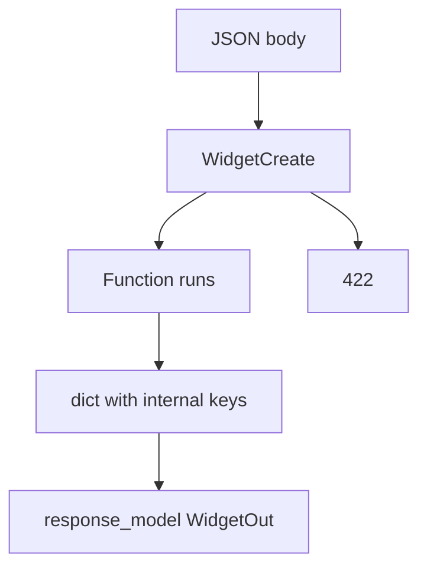
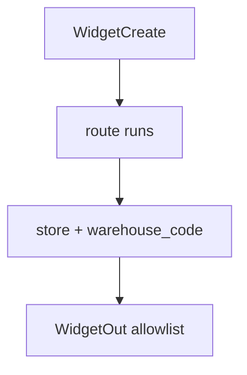

# Month 9 · Week 2 · Day 3
# Implement From Memory: Validated Create and Public Out

**Program:** Full-Stack Mastery · 18 months  
**Phase:** 3 — Python and backend  
**Month index:** [../../README.md](../../README.md)  
**Week 2:** [1](day-01.md) · [2](day-02.md) · Day 3 (today) · [4](day-04.md) · [5](day-05.md) · [6](day-06.md) · [7](day-07.md)  
**Week rhythm today:** Implement from memory  
**Student state:** Day 2 gate passed. You have `BaseModel`, `Field`, `model_dump`, create vs out, `response_model`. Today those ideas must still live in your head — from **this file**.  
**Study time:** 3–4 focused hours  
**Prereq:** Day 2 gate passed.

Labs: `~\fullstack-lab\month-09\week-02\day-03\`. Do **not** copy Day 1–2 projects. Do **not** start Project 6A. Do **not** paste `~/ops-api/`. Warehouse widgets are the noun.

---

## How Day 3 works

Days 1–2 stay **closed** during the build. This recap is the teacher.

Allowed: this file, your notes, HTTP in front of you.  
Not allowed: pasting AI APIs, copying yesterday’s `main.py`, using FastAPI docs as teacher during Block C.

Stuck **> 25 minutes**: open **only** the matching Day 1 or Day 2 section, close it, continue. Record `lookups.txt`.

No complete API in this file.

---

## How to read this chapter

Validation is **shape**. Response models are **allowlists**. Storage is still a **dict**.



**Wrong belief:** “Memory day means I return `dict` again to go faster.”  
**Correct:** the skill is **two models** and a 422 you can point at.

---

## Complete explanation (Pydantic you must still own)

**v2:** `model_dump()`, `model_validate()`, `Field`, `ValidationError`. Not `.dict()`, not `class Config` v1 unless a migration guide says so — you are not migrating.

If you type `.dict()` and it “works,” you are on the wrong Pydantic or on a compatibility shim. Grep for `.dict(` and replace with `model_dump`. PATCH later uses `model_dump(exclude_unset=True)`. Full dump of a Patch model with omitted fields set to `None` will wipe `code`. That is tomorrow’s trap; say the sentence today so it is not a surprise.

**BaseModel:** typed fields. No default → required. `Field(min_length=, max_length=, ge=)` constraints. Mutable defaults: `default_factory=list`. Never `tags: list[str] = []` on a model. That is Week 3’s shared list at class scope.

**FastAPI body:** `payload: WidgetCreate` validates **before** the function. Failure → **422**, `detail` is a **list** of error objects (`loc`, `type`, `msg`, …). Function never stores partial junk from that request.

`loc` often starts with `body`, then the field name. Tests assert status 422, that `detail` is a list, and that a `loc` mentions `name`. Do not assert a copied English `msg` string — those change across Pydantic versions.

**Create vs Out:** Create has client-settable fields (and secrets if any). Out has `id` + public fields. Store may have `internal_*` or a fake hash. `response_model=WidgetOut` and `response_model=list[WidgetOut]` **filter**. Prove with a test: internal key **not** in JSON.

Omitting `response_model` **leaks**. Putting `warehouse_code` on Out with a hope of `exclude=True` magic from v1 is the wrong fix. Do not put it on Out. Allowlist.

**Examples:** `Field(examples=[...])` or `ConfigDict(json_schema_extra=...)` so `/docs` is not blank strings.

**HTTP still true:** POST **201**, GET **200**, missing **`HTTPException` 404**. Unique → **409** you raise **after** validation. 422 is not 409. Empty name never reaches your uniqueness loop.

**PATCH preview:** `model_dump(exclude_unset=True)` so omitted fields do not become `None` overwrites. Full typed CRUD is **tomorrow**. Today GET/POST/GET-id is enough if time is tight; PATCH is stretch.

**Uvicorn:** `uv run uvicorn main:app --reload --host 127.0.0.1 --port 8000`. Reload still wipes RAM. No SQLAlchemy. No Redis. No PostgreSQL.

**Tests:** `from fastapi.testclient import TestClient`. Reset the dict. Assert 422 on `title: ""`. Assert no leak.

**Wrong belief:** “422 means not found.”  
**Correct:** 422 means **the document failed the schema**. 404 means **no widget with that id**.

**Wrong belief:** “I’ll put `warehouse_code` on Out with `exclude=True` magic I remember from v1.”  
**Correct:** do not put it on Out. Allowlist.

---

## Today's contract

**Today's gate.** Closed-book:

> I implemented WidgetCreate and WidgetOut, stored an internal field, returned only Out, proved 422 and 404, and used `model_dump` — without copying Day 2.

---

## Time box

| Block | Minutes | Work |
|---|---|---|
| A | 20 | Oral review |
| B | 35 | Paper: two models + 422 vs 404 |
| C | 95 | Spec implementation |
| D | 30 | Defect hunt |
| E | 15 | lookups.txt |

---

# Block A — Speak first

1. Why `.dict()` is the wrong name.  
2. Required field vs optional.  
3. What `response_model` does to extra keys.  
4. 422 vs 404 vs 409.  
5. Why Create must not include `id`.  
6. Why Out must not include `password`.

If (1) is “they are the same,” re-read the v2 paragraph. Do not start Block C yet.

---

# Block B — Paper

Write `DRILLS.txt`:

1. `WidgetCreate` with `name` min_length 1 max 80, `qty` int `ge=0`.  
2. `WidgetOut` with `id`, `name`, `qty` — nothing else.  
3. Store row keys including `warehouse_code` internal.  
4. Predict JSON for GET after POST.  
5. Predict status for POST `{"name":"", "qty":1}`.

---

# Block C — Spec

```powershell
cd ~\fullstack-lab
mkdir month-09\week-02\day-03 -Force
cd ~\fullstack-lab\month-09\week-02\day-03
uv init --name lab-widgets
uv add fastapi uvicorn
uv add --dev pytest httpx
```

**Resource: warehouse widgets** (not Project 6A).

| Item | Rule |
|---|---|
| POST `/widgets` | 201, body `WidgetCreate`, `response_model=WidgetOut`. Store `warehouse_code="A"` (constant) internally. |
| GET `/widgets` | 200, `list[WidgetOut]` |
| GET `/widgets/{widget_id}` | 200 or 404 |
| Unique `name` | 409 if duplicate (casefold + strip) |
| Example | on `WidgetCreate.name` |
| Tests | create, leak (`warehouse_code` absent), 422 empty name, 404, 409 |

Health optional. No SQL. No PUT required (Day 4).

`CONTRACT.md` five-row table before coding.

```powershell
uv run uvicorn main:app --reload --host 127.0.0.1 --port 8000
```

`curl.exe` valid POST, empty name, GET missing.

## Models you type (not a paste of Day 2)

```python
class WidgetCreate(BaseModel):
    name: str = Field(min_length=1, max_length=80, examples=["bracket"])
    qty: int = Field(ge=0)

class WidgetOut(BaseModel):
    id: int
    name: str
    qty: int
```

Store: `{"id", "name", "qty", "warehouse_code": "A"}`.

POST unique: `if any(w["name"].casefold() == payload.name.casefold() for w in WIDGETS.values()): raise HTTPException(409, ...)`.

GET one: `response_model=WidgetOut`. Missing: `HTTPException(404, detail="Widget not found")`.

Test leak: `assert "warehouse_code" not in r.json()`.

Test 422: POST `{"name": "", "qty": 1}`; `detail` is a **list**.

If `model_dump` is missing and you used `.dict()`, grep and replace. That is a v2 fail.

Client sending extra key `warehouse_code` must **not** win. Ignore extra input (Pydantic v2 default) and store your constant `"A"`. Write that answer in Block D.

---

# Block D — Defect hunt

1. Comment out `response_model` — leak? Restore.  
2. POST extra JSON key `warehouse_code` from the client — stored from client or ignored? Write the answer. Prefer **ignore**; your constant wins.  
3. `qty: -1` → 422.  
4. Reload → empty; still 404. `RAM.txt`.

---

# Block E

`lookups.txt`. Commit:

```powershell
cd ~\fullstack-lab
git add month-09
git commit -m "Month 9 Week 2 Day 3: widgets create/out from memory."
```

---

# Lecture: two models are the leak test

`WidgetCreate` is what the client may send: `name`, `qty`. No `id`. No `warehouse_code`. Constraints: `min_length=1`, `ge=0`. Empty name never reaches your uniqueness loop. Negative qty never reaches the dict. That is 422 **before** the function.

`WidgetOut` is the allowlist: `id`, `name`, `qty`. Nothing else. `response_model=WidgetOut` on POST and GET-one. `response_model=list[WidgetOut]` on list. Comment it out in Block D and watch `warehouse_code` appear. Restore. That experiment is the lecture.

Store row: those public fields plus `warehouse_code="A"` you set. Client extra key `warehouse_code` must not win. Pydantic v2 ignores extras by default unless you configured otherwise. Your constant wins. Write that.

**409 vs 422.** Duplicate **normalized** name is state conflict after a valid document. Empty name is schema. Tests: 422 has `detail` as a **list**; 409 `detail` is often a string from `HTTPException`. Do not assert them as the same shape.

**model_dump.** v2 name. Not `.dict()`. Grep. PATCH tomorrow: `exclude_unset=True`. Full dump of omitted fields as `None` wipes data. Say it today.

**CONTRACT.md first.** Five rows: method, path, success status, error statuses, body shape. Then code. Then tests. If you code first, `/docs` becomes the contract and you will not notice a leak.

No SQL. In-memory dict. Reload wipes. Widgets, not ops-api.

---

## Definition of done

- [ ] Two models; internal field stored not returned  
- [ ] 422 and 404 tests  
- [ ] 409 on duplicate name  
- [ ] CONTRACT.md first  
- [ ] Commit exists  

---

# Worked session — widgets Create/Out

CONTRACT.md five rows. `WidgetCreate` + `WidgetOut`. Store `warehouse_code="A"`. POST 201 `response_model=WidgetOut`. GET list `list[WidgetOut]`. GET one 200/404. Duplicate name 409 after strip/casefold. Empty name 422, `detail` is a list. Leak test: no `warehouse_code` in JSON.

`model_dump` not `.dict()`. Comment out `response_model`, see leak, restore. Client extra `warehouse_code` ignored; constant wins. `qty: -1` → 422. Reload → empty; `RAM.txt`. `curl.exe` valid POST, empty name, missing GET.

No SQL. No PUT required. Widgets, not ops-api. `uv run pytest -q`. `uv run uvicorn main:app --reload --host 127.0.0.1 --port 8000`.

If 201 includes `warehouse_code`, `response_model` is missing. If empty name is 409, you ran uniqueness without a model. If `.dict()` appears, grep and replace.

---

## Optional review links

Repair from this recap first. These pages are for later checking, not for first learning.

- [FastAPI: Response model](https://fastapi.tiangolo.com/tutorial/response-model/)
- [Pydantic models](https://docs.pydantic.dev/latest/concepts/models/)

---

## Tomorrow

**Typed CRUD** — PUT/PATCH/DELETE with models, `exclude_unset`, still in memory.

---

# Closing lecture — two models or it leaks

`WidgetCreate` has `name` and `qty`. No `id`. No warehouse code.
`WidgetOut` has `id`, `name`, `qty`. Nothing else.
Store adds `warehouse_code="A"`. `response_model` strips it.
Comment the parameter out once. See the leak. Restore. That is the lecture.

Empty name → 422, `detail` is a list. Duplicate name → 409 after the function starts.
Those shapes differ. Tests must not treat them as the same JSON.
`qty: -1` → 422 (`ge=0`). Missing widget → 404 `HTTPException`.

`model_dump` is the v2 name. Grep `.dict(`. CONTRACT.md first.
Client extra keys must not overwrite your constant warehouse code.
No SQL. No PUT required. Widgets, not ops-api. Reload still wipes RAM.

`uv run pytest -q`. `uv run uvicorn main:app --reload --host 127.0.0.1 --port 8000`.
`curl.exe` for a valid POST, an empty name, and a missing GET.
Examples on `Field` make `/docs` Try-it less blank. Put one on `name`.
Unique compare uses casefold after strip so `Bracket` and `bracket` conflict.
Health is optional. PUT is Day 4. SQL is Month 10. Widgets are the noun.
If 201 includes `warehouse_code`, `response_model` is missing — not a FastAPI bug.
If empty name is 409, validation never ran — you accepted a `dict` body.
lookups.txt after 25 minutes only. Days 1–2 stay closed during Block C.


## Recite-back checklist (close the editor, then tick)

Write `RECITE.txt` with one honest sentence per line.
If a line is mush, re-read the matching section in **this** file only.

- [ ] WidgetCreate vs WidgetOut
- [ ] `response_model` allowlist
- [ ] leak test: no `warehouse_code`
- [ ] 422 list `detail`; 409 string `detail`
- [ ] `model_dump` not `.dict()`
- [ ] CONTRACT.md first
- [ ] unique name 409 after validation
- [ ] no SQL; widgets not ops-api

Comment out `response_model` once. See the leak. Restore. That is the day.

If you used `.dict()`, replace it before you commit. v2 is `model_dump`.
Two models. One leak test. CONTRACT.md dated before the first green POST.
Empty name is 422. Duplicate name is 409. Missing id is 404. Recite those three.




Commit the lab under `fullstack-lab`, not `~/ops-api/`. Widgets are the noun. In-memory dict only.

`uv run pytest -q` is the claim. `curl.exe` is the spot-check. Reload still wipes RAM.

