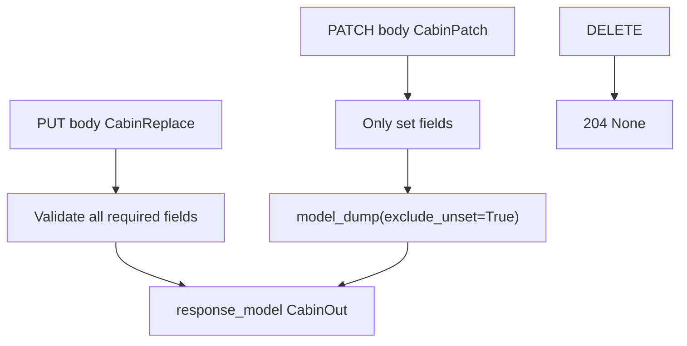

# Month 9 · Week 2 · Day 4
# Typed CRUD: PUT, PATCH, DELETE with Models

**Program:** Full-Stack Mastery · 18 months  
**Phase:** 3 — Python and backend  
**Month index:** [../../README.md](../../README.md)  
**Week 2:** [1](day-01.md) · [2](day-02.md) · [3](day-03.md) · Day 4 (today) · [5](day-05.md) · [6](day-06.md) · [7](day-07.md)  
**Week rhythm today:** Learn + type-along  
**Student state:** You can POST/GET with Create/Out models. Today **replace, patch, and delete** use models too — including PATCH **without wiping omitted fields**.  
**Study time:** 3–4 focused hours

Labs: `~\fullstack-lab\month-09\week-02\day-04\`.

---

## How to use this textbook

1. Read a section. Close it. Say it.  
2. Type PATCH with `exclude_unset`. If you skip it, you will invent a bug that looks like “Pydantic set everything to None.”  
3. Optional review links are for later rechecking.

---

## How to read this chapter

Week 1 PUT/PATCH/DELETE still apply. The new work is **typed bodies** and **Out on every success that has a JSON body**.



**Wrong belief:** “PATCH model is the same as Create with every field optional, then I `model_dump()` into the row.”  
**Correct:** optional + **defaults** + full `model_dump()` **overwrites** with `None` or empty strings. **`exclude_unset=True`** is the difference between PATCH and a broken PUT.

---

## Today's contract

By the end of this day you will be able to:

1. Define **Replace** (all writable fields required) for PUT.  
2. Define **Patch** (all writable fields optional, **no** forced defaults that look like user input) for PATCH.  
3. Apply patch via `model_dump(exclude_unset=True)`.  
4. DELETE **204** with `response_model` omitted (no body).  
5. Keep 404 / 409 / 422 distinct.  
6. Return **Out** on PUT/PATCH 200.

**Today's gate.** Closed-book:

> PUT validates a complete replacement body. PATCH validates a partial body and updates only fields the client set. DELETE is 204. Out models still hide internals. 422 is schema; 409 is unique state.

---

## Time box

| Block | Minutes | Work |
|---|---|---|
| A | 50 | Theory |
| B | 60 | Type-along: cabins |
| C | 70 | Independent tests for unset vs None |
| D | 20 | Git |
| E | 15 | Recall |

---

# Block A — Theory

## 1. Model roster for one resource

```python
class CabinCreate(BaseModel):
    name: str = Field(min_length=1, max_length=80)
    beds: int = Field(ge=1, le=12)

class CabinReplace(BaseModel):
    name: str = Field(min_length=1, max_length=80)
    beds: int = Field(ge=1, le=12)

class CabinPatch(BaseModel):
    name: str | None = None
    beds: int | None = None

class CabinOut(BaseModel):
    id: int
    name: str
    beds: int
```

Create and Replace often look identical **today**. Keep two names when you expect them to diverge (create might require `owner_email`; replace might not allow changing owner). If they are identical, you **may** alias `CabinReplace = CabinCreate` — but **not** `CabinPatch = CabinCreate`.

**Wrong belief:** “I’ll use one `Cabin` with all optional fields for every verb.”  
**Correct:** then POST `{}` becomes valid and you store garbage. POST needs required fields.

---

## 2. PUT

```python
@app.put("/cabins/{cabin_id}", response_model=CabinOut)
def replace_cabin(cabin_id: int, payload: CabinReplace) -> dict:
    row = CABINS.get(cabin_id)
    if row is None:
        raise HTTPException(status_code=404, detail="Cabin not found")
    data = payload.model_dump()
    # 409 if name taken by another id
    row["name"] = data["name"]
    row["beds"] = data["beds"]
    return row
```

All replace fields are required → omitting `beds` is **422**, not “keep old beds.” That is PUT.

Path id wins. If `CabinReplace` included `id`, ignore it or forbid it — **do not** put `id` on Replace.

---

## 3. PATCH and exclude_unset

```python
@app.patch("/cabins/{cabin_id}", response_model=CabinOut)
def patch_cabin(cabin_id: int, payload: CabinPatch) -> dict:
    row = CABINS.get(cabin_id)
    if row is None:
        raise HTTPException(status_code=404, detail="Cabin not found")
    changes = payload.model_dump(exclude_unset=True)
    if "name" in changes:
        # 409 check
        row["name"] = changes["name"]
    if "beds" in changes:
        row["beds"] = changes["beds"]
    return row
```

`CabinPatch(name="x")` → `exclude_unset` → `{"name": "x"}` only.

`CabinPatch()` empty `{}` → `{}` → no writes → 200 same resource.

**The None trap:** `name: str | None = None` means JSON `{"name": null}` **does** set the field. `exclude_unset` will **include** `name: None`. Decide: reject null with a validator, or treat null as “clear.” This course: **reject clearing name**; if `name` in changes and value is None → 422 via `Field` or a `field_validator`. Simplest: use `str | None = None` and if `"name" in changes and changes["name"] is None: raise HTTPException(422, ...)`. Cleaner: do not allow `None` — use a patch model where omitted is unset and sent values must pass `min_length`. In v2, a field defaulting to `None` still accepts null. Document your choice in CONTRACT.md.

Recommended for this lab: if key present, value must be valid `str` / `int` (not null). You can use:

```python
class CabinPatch(BaseModel):
    name: str | None = Field(default=None, min_length=1)
    beds: int | None = Field(default=None, ge=1)
```

Null may still fail min_length depending on version — **write a test** `{"name": null}`.

---

## 4. DELETE

```python
@app.delete("/cabins/{cabin_id}", status_code=204)
def delete_cabin(cabin_id: int) -> None:
    if cabin_id not in CABINS:
        raise HTTPException(status_code=404, detail="Cabin not found")
    del CABINS[cabin_id]
```

Do **not** set `response_model=CabinOut` on 204. No body.

---

## 5. 409 after 422

Order: FastAPI validates model → your function → exists? 404 → unique name? 409 → mutate.

You cannot 409 a request that never entered the function.

---

## 6. Copying into the store

Do not `row.update(payload.model_dump())` on PATCH without `exclude_unset`. Do not `row = payload.model_dump()` on PUT in a way that **drops** `id` and internal keys.

```python
row["name"] = data["name"]
row["beds"] = data["beds"]
# id and internal keys remain
```

Or:

```python
internal = {k: row[k] for k in ("id", "hidden_score")}
row.clear()
row.update(internal)
row.update(data)
```

Keep it obvious.

---

## 7. OpenAPI

Four models appear as schemas. That is success, not clutter. `response_model` on GET/PUT/PATCH/POST. DELETE: 204.

---

## 8. Security start

- Replace/Patch must not accept `hidden_score` on the model — then clients cannot set it.  
- If you `model_dump()` into the row from a **dict** you did not validate, you reopened Week 1.  
- DELETE still localhost-only.

---

# Block B — Type-along

```powershell
cd ~\fullstack-lab
mkdir month-09\week-02\day-04 -Force
cd ~\fullstack-lab\month-09\week-02\day-04
uv init --name lab-cabins
uv add fastapi uvicorn
uv add --dev pytest httpx
```

Resource: **cabins** `{id, name, beds}` + internal `hidden_score: int` (default 0). Unique `name` (casefold).

CRUD + list. Tests:

- PUT missing field 422  
- PATCH only `beds` does not change `name`  
- PATCH `{}` 200  
- duplicate name 409  
- DELETE 204  
- Out never includes `hidden_score`

```powershell
uv run uvicorn main:app --reload --host 127.0.0.1 --port 8000
```

```powershell
curl.exe -s -X PATCH http://127.0.0.1:8000/cabins/1 -H "Content-Type: application/json" -d "{\"beds\":3}"
```

---

# Block C — Independent

Write `UNSET.md`: experiment — PATCH with `model_dump()` **without** `exclude_unset` in a **throwaway** branch of the function (commented), predict `name` becoming `null`. Restore the correct line. One TestClient test named `test_patch_omits_name`.

CONTRACT.md updated with PUT/PATCH/DELETE.

Not Project 6A.

```powershell
cd ~\fullstack-lab
git add month-09
git commit -m "Month 9 Week 2 Day 4: typed CRUD, exclude_unset PATCH."
```

---

# Block E — Recall

1. Why Create cannot be Patch.  
2. `exclude_unset`.  
3. PUT missing field → status.  
4. Internal field survival across PUT.  
5. 204 and `response_model`.

## Office hours — typed CRUD

**Create used as Patch.** POST `{}` becomes valid. Keep required fields on Create/Replace.

**PUT dropped `hidden_score`.** You did `row.clear(); row.update(payload.model_dump())` and lost internals and maybe `id`. Copy field-by-field or preserve a small internal dict.

**409 vs 422 on extra JSON keys.** Extra keys are usually **ignored**, not 409. 409 is unique `name`. If you `extra="forbid"` on the model, extra keys are **422**. Document which.

**DELETE with `response_model=CabinOut` and 204.** OpenAPI and clients disagree. Omit response_model on DELETE.

**Null name on PATCH.** Write a test. If it 200s and clears the name, either forbid null or document clear. This course prefers reject.

`UNSET.md` is not optional if you never saw the wipe. Comment the wrong dump, run the omit test, watch it fail, restore.

## PUT / PATCH / DELETE — predicted table

| Call | Status |
|---|---|
| PUT missing `beds` | 422 |
| PUT unknown id | 404 |
| PUT duplicate name of another row | 409 |
| PUT same name as self | 200 |
| PATCH `{"beds": 4}` | 200; name unchanged |
| PATCH `{}` | 200 |
| DELETE | 204 |
| GET after delete | 404 |

Implement uniqueness with `ignore_id` on replace/patch. Store `hidden_score` through PUT. Out never shows it.

```python
@app.put("/cabins/{cabin_id}", response_model=CabinOut)
def replace_cabin(cabin_id: int, payload: CabinReplace) -> dict:
    row = CABINS.get(cabin_id)
    if row is None:
        raise HTTPException(status_code=404, detail="Cabin not found")
    if name_taken(payload.name, ignore_id=cabin_id):
        raise HTTPException(status_code=409, detail="Name taken")
    row["name"] = payload.name
    row["beds"] = payload.beds
    return row
```

That snippet is a **shape**, not your whole file. Type the rest. `name_taken` is your function.

Tie-break: after PATCH, GET the cabin and assert `hidden_score` still 0 if you never changed it through HTTP — it must not appear in JSON, but it must still be in the dict (inspect in a test via `CABINS[1]["hidden_score"]` or a repo method). That is the internal-field survival test.

---

## Definition of done

- [ ] Four model names (or Create aliased as Replace, plus Patch and Out)  
- [ ] PATCH omit test green  
- [ ] 422 / 404 / 409 / 204 covered  
- [ ] No leak  
- [ ] Commit exists  

---

## Check yourself before git

You can explain `exclude_unset`, why Create ≠ Patch, why PUT missing a field is 422, and why `hidden_score` survives PUT but not JSON. `UNSET.md` exists. No `.dict()`.

```powershell
uv run uvicorn main:app --reload --host 127.0.0.1 --port 8000
uv run pytest -q
```

---

## Optional review links

Typed CRUD and `exclude_unset` are explained in this chapter.

- [Pydantic: Serialization / model_dump](https://docs.pydantic.dev/latest/concepts/serialization/)
- [FastAPI: Extra models](https://fastapi.tiangolo.com/tutorial/extra-models/)
- [FastAPI: Body updates](https://fastapi.tiangolo.com/tutorial/body-updates/)

---

## Tomorrow

**422 shape**, tests that read `detail`, and **exception handlers** — still JSON, still no stack traces as the client API.
