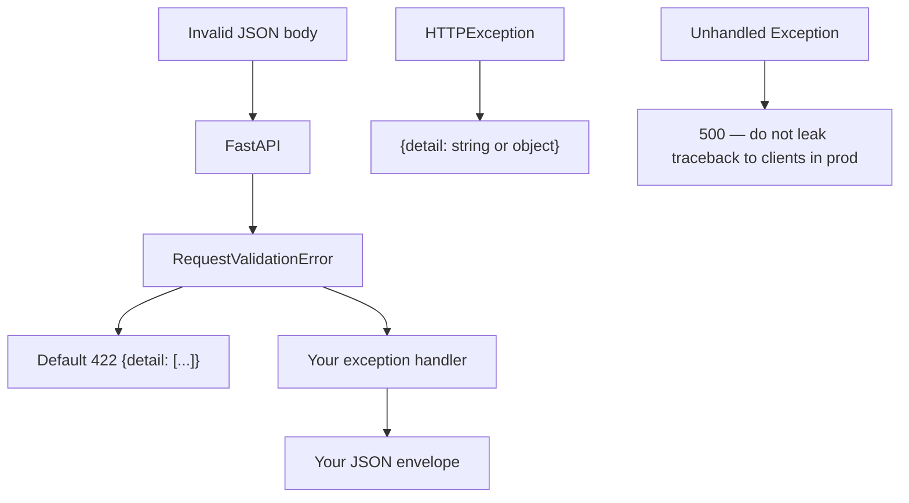

# Month 9 · Week 2 · Day 5
# 422 Shape, Tests, and Exception Handlers

**Program:** Full-Stack Mastery · 18 months  
**Phase:** 3 — Python and backend  
**Month index:** [../../README.md](../../README.md)  
**Week 2:** [1](day-01.md) · [2](day-02.md) · [3](day-03.md) · [4](day-04.md) · Day 5 (today) · [6](day-06.md) · [7](day-07.md)  
**Week rhythm today:** Learn + type-along  
**Student state:** Typed CRUD works. Today you **treat 422 as a contract**, not as “red text in `/docs`.”  
**Study time:** 3–4 focused hours

Labs: `~\fullstack-lab\month-09\week-02\day-05\`.

---

## How to use this textbook

1. Read a 422 body aloud: `loc`, `type`, `msg`.  
2. Write tests that fail if FastAPI changes **your** documented wrapper — then do not change FastAPI’s default unless you mean to.  
3. Optional review links are for later rechecking.

---

## How to read this chapter

Clients (React, mobile, other students) need a **stable error JSON**. FastAPI’s default validation error is already JSON. Your job: **know the shape**, **test it**, and if you wrap it, **do it on purpose** with an **exception handler**.



**Wrong belief:** “I’ll return 200 with `{success:false, errors:...}` so the frontend never checks status.”  
**Correct:** status is part of the contract. 422 stays 422. The frontend (Month 13) will branch on status.

---

## Today's contract

By the end of this day you will be able to:

1. Draw the **default** 422 JSON (`detail` as a **list** of objects).  
2. Write pytest that POSTs invalid data and asserts `status_code == 422` and `loc` contains `"body"`.  
3. Distinguish **HTTPException** bodies from validation bodies.  
4. Register an **`exception_handler`** for `RequestValidationError` **or** for a custom `AppError` — and explain the trade-off.  
5. Not swallow 404 into 422.

**Today's gate.** Closed-book:

> 422 `detail` is a list of validation errors with `loc`, `type`, `msg`. HTTPException 404 is a different body. Handlers let me unify envelopes. I test 422. I do not ship stack traces as the API.

---

## Time box

| Block | Minutes | Work |
|---|---|---|
| A | 50 | Theory |
| B | 60 | Type-along: test 422 + optional handler |
| C | 70 | Independent: 404 vs 422 tests; one handler |
| D | 20 | Git |
| E | 15 | Recall |

---

# Block A — Theory

## 1. Default 422 shape

A typical body (fields can vary slightly by Pydantic/FastAPI version — **read yours**):

```json
{
  "detail": [
    {
      "type": "string_too_short",
      "loc": ["body", "name"],
      "msg": "String should have at least 1 character",
      "input": "",
      "ctx": { "min_length": 1 }
    }
  ]
}
```

- `detail` is a **list** (many fields can fail at once).  
- `loc` is a path: `"body"` then field name; query errors use `"query"`; path uses `"path"`.  
- `type` is a machine code.  
- `msg` is human.  
- `input` may echo the bad value — **do not put secrets** in fields you validate if they will be echoed (passwords: still a reason to keep auth later careful).

**Wrong belief:** “`detail` is always a string.”  
**Correct:** `HTTPException(detail="Cabin not found")` → `{"detail": "Cabin not found"}`. Validation → **`detail` is a list**. Clients must handle **both** or you **unify** with a handler.

---

## 2. Testing 422 (required today)

```python
def test_create_blank_name_422(client: TestClient) -> None:
    r = client.post("/cabins", json={"name": "", "beds": 2})
    assert r.status_code == 422
    body = r.json()
    assert isinstance(body["detail"], list)
    locs = [err["loc"] for err in body["detail"]]
    assert any("name" in loc for loc in locs)
```

Also test **wrong type**: `"beds": "lots"`. Also test **missing field**: `{}`.

Do not assert the full `msg` string unless you want brittle tests when Pydantic wording changes. Assert **status**, **list**, **loc** membership, maybe `type`.

Path 422: `client.get("/cabins/not-an-int")`.

---

## 3. HTTPException is not RequestValidationError

```python
raise HTTPException(status_code=404, detail="Cabin not found")
```

Default JSON: `{"detail": "Cabin not found"}`.

```python
raise HTTPException(status_code=409, detail={"code": "duplicate_name"})
```

`detail` may be an object. Pick a style in CONTRACT.md. This course is fine with **strings** for 404/409 and **list** for 422 until you wrap.

---

## 4. Exception handlers

```python
from fastapi import FastAPI, Request
from fastapi.exceptions import RequestValidationError
from fastapi.responses import JSONResponse

app = FastAPI()

@app.exception_handler(RequestValidationError)
async def on_validation(request: Request, exc: RequestValidationError) -> JSONResponse:
    return JSONResponse(
        status_code=422,
        content={
            "error": "validation",
            "detail": exc.errors(),
        },
    )
```

Now 422 JSON has an **`error` key**. Tests that only expected `detail` still work if you keep `detail`. Tests that expected **exactly** `{"detail": ...}` **fail** — that is the trade-off.

**When to wrap:** Project 6A may want one envelope `{error, detail}` for all client errors. **When not to:** Week 2 lab can keep the default and only **document** it. Implement **one** handler today so you know the hook exists.

Also:

```python
@app.exception_handler(HTTPException)
async def on_http(request: Request, exc: HTTPException) -> JSONResponse:
    return JSONResponse(
        status_code=exc.status_code,
        content={"error": "http", "detail": exc.detail},
    )
```

If you do this, **re-raise** or include headers FastAPI would have set. Keep it small. Do not catch `Exception` and return 200.

Unhandled `ValueError` → **500**. In development you may see a traceback in the terminal (good). The **client** should get JSON 500, not a HTML debug page, when you are in API mode. Do not invent a handler that returns `str(exc)` to the internet — that leaks paths.

**Wrong belief:** “I’ll `except Exception` in every route.”  
**Correct:** handlers are **central**. Routes raise `HTTPException` or let validation fail.

---

## 5. CONTRACT.md error section

Add:

| Status | When | Body |
|---|---|---|
| 422 | schema | `detail` list (default) or your envelope |
| 404 | missing id | `{"detail": "..."}` |
| 409 | unique | `{"detail": "..."}` |
| 500 | bug | do not document stack traces as features |

---

## 6. Security start

- Validation `input` echoing passwords: avoid putting raw passwords in models you will log.  
- Handlers must not attach `repr(request.headers)` with cookies.  
- 500 messages: generic `"Internal server error"` to clients.

---

# Block B — Type-along

Copy **by typing** a small cabins (or **mugs**) API with Create/Out. Or continue a trimmed Day 4.

```powershell
cd ~\fullstack-lab
mkdir month-09\week-02\day-05 -Force
cd ~\fullstack-lab\month-09\week-02\day-05
uv init --name lab-422
uv add fastapi uvicorn
uv add --dev pytest httpx
```

`test_errors.py`:

1. 422 blank field — `detail` is list, `loc` has field name  
2. 422 missing field  
3. 404 string `detail`  
4. 409 if you have unique  

Then add **one** `RequestValidationError` handler that wraps `{"error": "validation", "detail": exc.errors()}`. Update tests. Write `HANDLER.md`: default vs wrapped, two example JSON blobs.

```powershell
uv run pytest -q
uv run uvicorn main:app --reload --host 127.0.0.1 --port 8000
```

```powershell
curl.exe -s -X POST http://127.0.0.1:8000/mugs -H "Content-Type: application/json" -d "{}"
```

Save output to `422.json`.

---

# Block C — Independent

1. Test GET `/mugs/abc` 422 loc includes `path`.  
2. Do **not** convert 404 into 422 in a handler.  
3. Optional: handler for a custom `class DuplicateName(Exception)` raised from a function, mapped to 409 JSON — **or** keep `HTTPException` 409. If you add custom, one class is enough.  
4. CONTRACT.md error table.

Not Project 6A. No SQL.

```powershell
cd ~\fullstack-lab
git add month-09
git commit -m "Month 9 Week 2 Day 5: 422 tests and exception handler."
```

---

# Block E — Recall

1. `detail` list vs `detail` string.  
2. What `loc` `["body","name"]` means.  
3. Why not assert full `msg`.  
4. What a handler is for.  
5. Why not `except Exception` in the route.

## Office hours — error JSON

**Handler returns 200.** Then tests that looked at status still pass if they only check keys. Always set `status_code=422` on the JSONResponse.

**Handler forgets `exc.errors()`.** You send `{"error": "validation"}` with no loc. Clients cannot highlight the field. Keep `detail`.

**404 swallowed.** A handler for `Exception` that returns 422 “to be consistent” is a bug. Missing id is 404.

**Brittle msg.** Pydantic v2 wording changes. Assert `type` or `loc`.

**Password in `input`.** Validation errors may echo the bad value. Another reason not to treat this lab as real auth.

Read `422.json` with your eyes. Circle `loc`. If you cannot explain each key, you are not done.

```python
def test_path_param_not_int(client: TestClient) -> None:
    r = client.get("/mugs/abc")
    assert r.status_code == 422
    assert any("path" in err["loc"] for err in r.json()["detail"])
```

## Default vs wrapped — write both blobs in HANDLER.md

Default:

```json
{"detail": [{"type": "missing", "loc": ["body", "name"], "msg": "...", "input": {}}]}
```

Wrapped example:

```json
{"error": "validation", "detail": [{"type": "missing", "loc": ["body", "name"], "msg": "..."}]}
```

If you wrap, **every** 422 test uses the wrapped keys. `/docs` may still show the default schema unless you declare `responses=`. That drift is why wrapping is a contract change, not a debug print.

404 stays:

```json
{"detail": "Mug not found"}
```

unless you also wrap HTTPException. If you wrap both, 404 might be `{"error": "http", "detail": "Mug not found"}`. Tests must match. Do not wrap 500 with `str(exc)`.

A 422 test that only `assert r.status_code == 422` is weak. Add `loc`. Path vs body vs query is the skill.

---

## Definition of done

- [ ] pytest covers 422 with `loc`  
- [ ] 404 still 404  
- [ ] `422.json` saved  
- [ ] `HANDLER.md` explains wrap vs default  
- [ ] CONTRACT error table  
- [ ] Commit exists  

---

## Check yourself before git

`422.json` shows a **list**. 404 `detail` is a **string** unless you wrapped it. HANDLER.md matches tests. You did not map 404 to 422.

```powershell
uv run pytest -q
curl.exe -s -X POST http://127.0.0.1:8000/mugs -H "Content-Type: application/json" -d "{}"
```

If `detail` is a string on that POST, you did not use a Pydantic body (or you raised HTTPException 422 yourself). Prefer FastAPI’s list.

`loc` for a missing JSON field starts with `"body"`. For `/mugs/abc` it starts with `"path"`. Write both tests.

---

## Optional review links

422 shape and handlers are explained in this chapter.

- [FastAPI: Handling errors](https://fastapi.tiangolo.com/tutorial/handling-errors/)
- [FastAPI: RequestValidationError](https://fastapi.tiangolo.com/tutorial/handling-errors/#override-request-validation-exceptions)
- [Pydantic: Errors](https://docs.pydantic.dev/latest/errors/errors/)

---

## Tomorrow

**Independent** typed resource — your noun, full models, 422 tests, no leak. Still not Project 6A.
