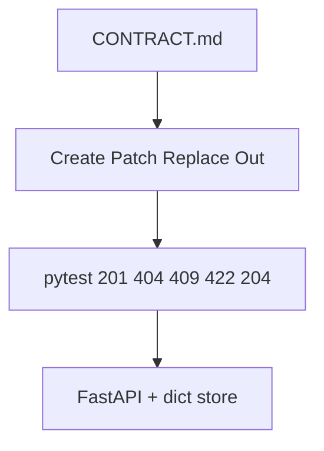
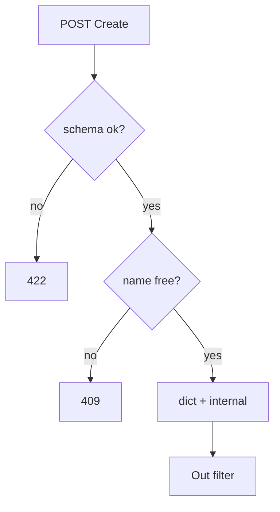

# Month 9 · Week 2 · Day 6
# Independent: A Validated Resource with Public Responses

**Program:** Full-Stack Mastery · 18 months  
**Phase:** 3 — Python and backend  
**Month index:** [../../README.md](../../README.md)  
**Week 2:** [1](day-01.md) · [2](day-02.md) · [3](day-03.md) · [4](day-04.md) · [5](day-05.md) · Day 6 (today) · [7](day-07.md)  
**Week rhythm today:** Independent implementation  
**Student state:** You can write Create/Patch/Out models, typed CRUD, and 422 tests. Today you do it on a **new noun** without a type-along `main.py`.  
**Study time:** 3–4 focused hours

Labs: `~\fullstack-lab\month-09\week-02\day-06\`.

This file does **not** contain the API. It contains the **bar**.

---

## How to use this textbook

1. CONTRACT.md first — including error shapes.  
2. Models before routes if you can; tests red then green.  
3. AI may not write the models “because they are boilerplate.” Boilerplate is where leaks live.  
4. Optional review links are for later rechecking.

---

## How to read this chapter

Week 2’s independent day is Week 1 Day 6 **plus** Pydantic allowlists and 422.



**Wrong belief:** “I’ll reuse Week 1 Day 6 dict bodies and add models later.”  
**Correct:** replacing dict bodies **is** the day.

---

## Today's contract

1. One resource, new noun (not Day 4 cabins, not Day 3 widgets, **not** Project 6A trio).  
2. Create / Replace / Patch / Out. Internal store field that must not leak.  
3. Unique field → 409.  
4. Tests: leak, 422 `loc`, 404, 409, PATCH `exclude_unset`, DELETE 204.  
5. `/docs` examples on Create.  
6. Error section in the contract (422 list vs 404 string — or your handler envelope).

**Today's gate.** Closed-book:

> I specified models and statuses, implemented them, and proved 422 and no leak with TestClient.

---

## Time box

| Block | Minutes | Work |
|---|---|---|
| A | 25 | Noun + CONTRACT.md + model field table |
| B | 40 | Red tests |
| C | 95 | Implement |
| D | 25 | curl.exe + docs vs contract |
| E | 15 | README + recall |

---

# Allowed nouns (pick one)

Library **holds**, cafeteria **trays**, museum **loans**, radio **playlists**, garden **beds** — one collection. Unique `code` or unique `name`.

**Forbidden:** users/projects/tasks; copying Week 2 Day 4 cabins; SQLAlchemy.

---

# Complete explanation (keep open; other days closed)

**Pydantic v2:** `BaseModel`, `Field`, `model_dump()`, `model_dump(exclude_unset=True)`, `model_validate`.

**Create** required fields, no `id`. **Replace** complete writable set. **Patch** optional + exclude_unset. **Out** public + `id`.

**response_model** on GET/POST/PUT/PATCH; list on collection GET. DELETE 204 `None`.

**422** default `detail` list; test `loc`. **404** `HTTPException`. **409** after validation.

**Handler** optional; if used, tests match the envelope.

**Store:** module dict; fixture clear; reload dies.

**Windows:** `curl.exe`; `uv run uvicorn main:app --reload --host 127.0.0.1 --port 8000`.

**Wrong belief:** “OpenAPI examples are decoration.”  
**Correct:** they are part of the contract viewers will copy. Make them valid.

---

# Block A — Contract

Field table: create / patch / out / stored-only.

Endpoint table with statuses.

Example POST JSON (valid and one invalid).

Persistence sentence.

---

# Block B — Tests first

```powershell
cd ~\fullstack-lab
mkdir month-09\week-02\day-06 -Force
cd ~\fullstack-lab\month-09\week-02\day-06
uv init --name lab-w2-independent
uv add fastapi uvicorn
uv add --dev pytest httpx
```

`RED.txt` from failing pytest.

---

# Block C — Implement

Internal field: e.g. `touch_count` or `secret_slot`. Never on Out.

Unique: casefold strip.

`GET /health` optional.

## Implementation notes (you still type the code)

**Models file vs router file.** One module is fine. Two modules are fine. A models module that imports the router is not. Pydantic classes should not know about `HTTPException`.

**POST:**

1. Validate `Create` (FastAPI does this).  
2. Unique check → 409.  
3. `row = {"id": n, **payload.model_dump(), "touch_count": 0}`.  
4. Return `row` with `response_model=Out` (or `Out.model_validate(row)`).

**PUT:** `Replace` required fields. Copy onto existing row **without** dropping `id` or `touch_count`.

**PATCH:**

```python
changes = payload.model_dump(exclude_unset=True)
for key, value in changes.items():
    row[key] = value
```

If `name` in changes, run unique check with `ignore_id`.

**DELETE:** `del store[id]`; return `None`; `status_code=204`.

**Incrementing `touch_count`:** you may bump it on every PATCH. Still omit from Out. A test that GETs after PATCH must **not** see it — that is the leak test.

**422 tests:** POST `{"name": ""}` if `min_length=1`. Assert `isinstance(body["detail"], list)` and any `loc` contains `"name"`. Do not assert the full English `msg`.

**OpenAPI example:** `Field(examples=["K-14"])` on the unique code. Open `/docs`, Try it out, confirm the example is valid against your constraints.

**Wrong belief:** “I’ll share one `Item` model with every field optional and required=False in my head.”  
**Correct:** POST `{}` would 201. That is how independent days fail silently.

---

# Block D — Manual

`curl.exe` 422 and 201. Compare `/docs` schemas to CONTRACT.md. Tick or fix.

---

# Block E

README: run, test, RAM.

```powershell
cd ~\fullstack-lab
git add month-09
git commit -m "Month 9 Week 2 Day 6: independent validated resource."
```

---

## Worked mistakes (read, then hunt on your API)

### Mistake 1 — Out includes the internal field “for debugging”

`/docs` now documents `secret_slot` to every classmate. Remove it from Out. Keep it in the dict. Add a test `assert "secret_slot" not in r.json()`.

### Mistake 2 — PATCH dumps all defaults

`CabinPatch` with `name: str | None = None` and `model_dump()` without `exclude_unset` writes `name: None` into the row. GET returns `"name": null`. The omit test fails. Fix: `exclude_unset=True`.

### Mistake 3 — 409 before 404

PUT `/x/999` with a duplicate name of id 1. If you 409 because the name exists, you never told the client the **target** is missing. Order: exists? 404. Then unique? 409.

### Mistake 4 — 422 vs 409 on unique

Pydantic cannot know the name is taken. Unique is **state**. Empty string is **schema**. Do not raise 409 for `name=""`.

### Mistake 5 — TestClient `.json()` on 204

JSON decode error. Assert `r.status_code == 204` and empty content.



---

## Security and honesty

- Unique codes compared with `casefold` and `strip` if you claim uniqueness.  
- `max_length` on every string Field. RAM is still RAM.  
- Do not log Create models that contain a password (this noun should not have one).  
- Bind 127.0.0.1.  

If you finish early, add **one** `field_validator` (e.g. reject names that are only punctuation) and a 422 test. That is still Pydantic, not a second resource.

## Test names you should have

```text
test_create_201_has_id
test_create_does_not_leak_internal
test_create_empty_name_422
test_create_duplicate_409
test_get_missing_404
test_patch_omits_other_fields
test_delete_204_then_404
```

Each test is one idea. The leak test POSTs then asserts the internal key **not in** `r.json()`. It may also GET list and assert the same.

**CONTRACT error table** (copy into your file and fill):

| Status | When | Body |
|---|---|---|
| 422 | Field constraints | `detail` list with `loc` |
| 404 | Unknown id | `{"detail": "..."}` |
| 409 | Unique taken | `{"detail": "..."}` |
| 204 | Delete ok | empty |

**PUT vs PATCH in one paragraph in the contract.** If you skip PUT for time, say so — do not leave a PUT route that is secretly PATCH.

`uv run uvicorn main:app --reload --host 127.0.0.1 --port 8000` still wipes RAM. A 201 then reload then GET is 404. That remains true with Pydantic.

**Wrong belief:** “Week 2 independent is Week 1 independent plus Field on the same dict return.”  
**Correct:** Out is a class. `response_model` is set. 422 is tested.

## curl.exe 422 (read the body)

```powershell
curl.exe -s -D - -X POST http://127.0.0.1:8000/holds -H "Content-Type: application/json" -d "{\"code\":\"\"}" -o 422.json
```

Open `422.json`. `detail` is a list. `loc` includes `code` or `name`. Copy one `type` into `HTTP.txt`.

PATCH omit:

```powershell
curl.exe -s -X PATCH http://127.0.0.1:8000/holds/1 -H "Content-Type: application/json" -d "{\"label\":\"only\"}"
```

GET after: unique code unchanged. If it is `null`, `exclude_unset` is missing.

If `/docs` Try-it example fails validation, your example violates `min_length`. Fix the example — that is part of the contract.

---

## Definition of done

- [ ] CONTRACT first  
- [ ] Four model roles  
- [ ] pytest: leak, 422 loc, 404, 409, patch omit, 204  
- [ ] Example in OpenAPI  
- [ ] Commit exists  

---

## Check yourself before git

Four model roles exist. Leak test green. 422 loc test green. PATCH omit green. Example in `/docs`. Noun is not Project 6A.

```powershell
uv run uvicorn main:app --reload --host 127.0.0.1 --port 8000
uv run pytest -q
```

If `print_count` (or your internal name) appears in GET JSON, Out is wrong. If PATCH `{"label":"x"}` nulls the unique field, `exclude_unset` is missing.

CONTRACT.md must mention 422 list vs 404 string. If you wrapped errors, the contract matches the wrapper.

Do not add SQLAlchemy “just in the models file.” There are no tables.

---

## Optional review links

Repair from Week 2 Days 1–5 recap above first.

- [FastAPI extra models](https://fastapi.tiangolo.com/tutorial/extra-models/)
- [FastAPI testing](https://fastapi.tiangolo.com/tutorial/testing/)

---

## If pytest fails (this day)

| Symptom | Likely cause |
|---|---|
| leak test fails | `response_model` missing or Out includes internal |
| PATCH wipes fields | no `exclude_unset` |
| 422 `detail` is str | body is still `dict` |
| 409 on empty name | you mixed schema with uniqueness |
| `.dict()` AttributeError | Pydantic v2 — use `model_dump` |

---

## Security reminder

Out is an allowlist. `max_length` on strings. Do not log Create bodies if they ever contain secrets. 422 `input` may echo values — keep this noun free of passwords.

`model_dump` only. No `.dict()`.

Week 3 is routers. Do not skip this day’s leak test to “get to routers.”

README: uvicorn command, pytest command, RAM dies on reload. Same as Week 1 independent, plus models.

`uv run pytest -q` from the uv project directory, not from `month-09` root, unless you configured testpaths.

One noun. Depth beats a second collection.

Commit the lab. Week 2 review is tomorrow. Do not open Day 7 until this gate is true. The review file recaps models; it does not replace today’s tests.

---

## Tomorrow

**Week 2 review** — synthesis in Day 7, mini-build, debug (including a leak and a PATCH wipe).

