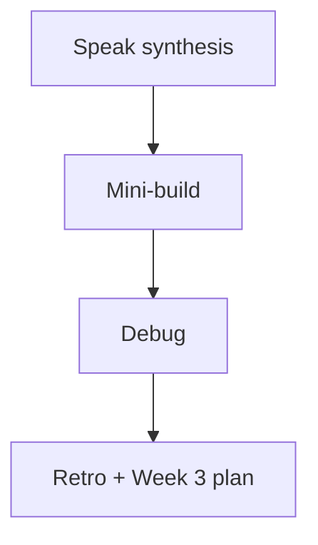
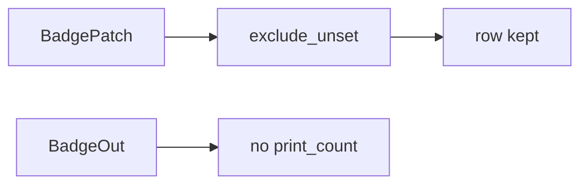

# Month 9 · Week 2 · Day 7
# Week Review — Validation and Contracts

**Program:** Full-Stack Mastery · 18 months  
**Phase:** 3 — Python and backend  
**Month index:** [../../README.md](../../README.md)  
**Week 2:** [1](day-01.md) · [2](day-02.md) · [3](day-03.md) · [4](day-04.md) · [5](day-05.md) · [6](day-06.md) · Day 7 (today)  
**Week rhythm today:** Review, repair, plan Week 3  
**Student state:** You have Pydantic v2 models, create vs out, typed CRUD, 422 tests. Today those ideas must still live in your head — from **this file**.  
**Study time:** 3–4 focused hours

Do not start Week 3 because the calendar moved. Routers on an API that still leaks hashes is two problems.

Work in `~\fullstack-lab\month-09\week-02\day-07\`. Do not implement the mini-build inside `~/ops-api/`.

---

## How to read this chapter

This is a **closed-book teaching day**. The synthesis **is** the Week 2 lesson.



Days 1–6 closed during mini-build. Repair from **this** recap.

---

## Week synthesis (the lesson, in this book)

**Pydantic v2** turns dict/JSON into objects with types and constraints, or refuses. FastAPI uses models as **request bodies** and **`response_model`**. v2 export is **`model_dump()`**, not `.dict()`. **`model_dump(exclude_unset=True)`** is PATCH. **`Field`**: `min_length`, `max_length`, `ge`, `default_factory=list` (never `= []`).

**Create vs Out:** Create is what clients may send (no `id`, no secrets). Out is the allowlist (`id` + public). Storage dict may have `password_hash`, flags, counters. **`response_model` filters**. Omitting it **leaks**. `list[Out]` on list endpoints. Examples belong on Create for `/docs`.

**CRUD:** POST 201 Create; GET 200 Out; PUT Replace (all required writable fields); PATCH Patch + exclude_unset; DELETE 204 no `response_model`. Path id wins. Unique → **409** after the function starts. Missing → **404 HTTPException**. Schema fail → **422** before the function.

**422 shape:** `{"detail": [ { "loc", "type", "msg", ... } ]}`. `loc` starts with `body` / `query` / `path`. **HTTPException** `detail` is often a **string**. Tests assert status + list + loc, not brittle full `msg`. Exception handlers wrap on purpose; CONTRACT.md must match. Do not `except Exception` in every route. Do not 200 `success: false`.

**Still true from Week 1:** in-memory dict, reload wipes, TestClient HTTP tests, fixture reset, `curl.exe`, `uv run uvicorn main:app --reload --host 127.0.0.1 --port 8000`. No SQLAlchemy. No Redis. No PostgreSQL.

**Wrong belief:** “One model is DRY.”  
**Correct:** one model is how hashes hit OpenAPI.

**Wrong belief:** “I’ll assert the full English `msg` from a copied 422.”  
**Correct:** assert `loc` and status. Messages change across Pydantic versions.

**Wrong belief:** “Empty PATCH `{}` should 422 because nothing changed.”  
**Correct:** empty `{}` is valid PATCH. `exclude_unset=True` applies nothing. The row stays. 200 with the same Out is honest.

The sections below unpack that for the mini-build.

---

## Today's contract

**Today's gate.** Closed-book:

> I can explain model_dump, exclude_unset, create vs out, 422 loc, and I built a tiny typed API from this spec with leak and 422 tests.

---

## Time box

| Block | Minutes | Work |
|---|---|---|
| 1 | 40 | Speak + `exam-01.md` |
| 2 | 55 | Mini-build badges |
| 3 | 30 | Debug A–E |
| 4 | 20 | Review Day 6 — one fix |
| 5 | 20 | pytest break/restore |
| 6 | 20 | Design: why Out is an allowlist |
| 7 | 20 | Retro |

---

# Complete explanation — models you must still own

## 1. Boundary vs store

The store is a dict. The internet sees Out. Create never includes server-assigned `id`.

A denylist (“strip `print_count` if present”) fails the day you add `internal_notes`. An allowlist (`BadgeOut` fields only) fails closed. `/docs` then matches what clients may see. That is the contract.

## 2. PATCH

Unset ≠ None default dump. `exclude_unset=True`. Empty `{}` is valid PATCH.

If you `model_dump()` a Patch model whose omitted `code` defaulted to `None`, you will write `code: null` into the store. GET then returns a broken badge. The test “PATCH only `label`, `code` still `B1`” exists to catch that.

## 3. Errors

422 schema, 404 missing, 409 state. Handlers optional; if present, tests follow the envelope.

Do not catch `Exception` and return 200 `{"error": str(e)}`. That hides 500s, can leak paths, and teaches clients to ignore HTTP. Map known domain errors to 409/404. Let bugs be 500 without traceback in the JSON body.

## 4. OpenAPI

`response_model` is the documented 200/201 schema. Examples reduce Try-it garbage.

`/docs` is generated from your models. If `/docs` shows `print_count`, you put it on Out or omitted `response_model`. The UI is not a separate document. CONTRACT.md must still be written first so you notice when `/docs` drifts.

---

# Block 1 — Speak

Cover v2 names, Field, three model jobs, leak, 422 vs 404 vs 409, exclude_unset, TestClient. Write `exam-01.md`.

---

# Block 2 — Mini-build

```powershell
cd ~\fullstack-lab
mkdir month-09\week-02\day-07\mini -Force
cd ~\fullstack-lab\month-09\week-02\day-07\mini
uv init --name lab-badges
uv add fastapi uvicorn
uv add --dev pytest httpx
```

**Badges** (not Project 6A): `code` unique, `label`, internal `print_count`.

| Method | Path | Models / status |
|---|---|---|
| POST | `/badges` | BadgeCreate → 201 BadgeOut |
| GET | `/badges` | list[BadgeOut] |
| GET | `/badges/{id}` | 200/404 |
| PATCH | `/badges/{id}` | BadgePatch exclude_unset |
| DELETE | `/badges/{id}` | 204 |

PUT optional. Tests: leak `print_count`, 422 empty `code`, 409, 404, patch only `label`.

Grep the mini for `.dict(` — it must not appear. Use `model_dump`. Fixture resets the dict. `uv run pytest -q`.

---

# Block 3 — Debug

`exam-03-debug.md`:

**A.** Returned store dict; `/docs` shows `print_count`.  
**B.** PATCH `{"label": "x"}` set `code` to `null`.  
**C.** POST `{"code": ""}` stored and 201.  
**D.** Test asserted `r.json()["detail"][0]["msg"] ==` a copied English sentence; Pydantic upgrade failed CI.  
**E.** Handler caught `Exception`, returned 200 `{"error": str(e)}` including a path.

---

# Block 4

Day 6 contract vs tests — one fix or `MATCH.txt`.

---

# Block 5

Break leak test; show fail; restore.

---

# Block 6

`design.md`: allowlist vs denylist for JSON responses (ten lines).

---

# Block 7

`retro.md`. Week 3: **routers, Depends, config, services, in-memory repo as a pattern, middleware**. Simplest architecture that stays clear. Still no SQL.

## Debug keys (after you write A–E)

**A.** `response_model` missing or Out declared `print_count`. Add Out without it; test absence.

**B.** Full `model_dump()` on PATCH applied `code: None`. Use `exclude_unset=True`.

**C.** Empty `code` failed `min_length` only if Create has `Field(min_length=1)` and POST uses the model — not `dict`.

**D.** Assert `loc` and status, not a copied `msg` string.

**E.** Never catch bare `Exception` to 200. Handlers map known errors; bugs are 500 without traceback in the JSON body.

Mini: `BadgeCreate` / `BadgePatch` / `BadgeOut`. Internal `print_count` starts 0. Unique `code` 409.

## Mini predicted table

| Call | Status |
|---|---|
| POST `{"code":"B1","label":"gold"}` | 201, no `print_count` |
| POST `{"code":""}` | 422, `detail` list |
| POST duplicate `B1` | 409 |
| GET `/badges/9` | 404 |
| PATCH `{"label":"x"}` | 200, `code` still `B1` |
| DELETE | 204 |

If PATCH wipes `code`, you forgot `exclude_unset`. If 201 includes `print_count`, you forgot `response_model`.

Week 3 will split files. Do not add SQL tonight.

---

```powershell
cd ~\fullstack-lab
git add month-09
git commit -m "Month 9 Week 2 review: badges mini-build and debug notes."
```

---

# Lecture: allowlist, PATCH, and 422 loc

**Allowlist.** Out fields are what the internet may see. A denylist (“strip `print_count`”) fails when you add `internal_notes`. `/docs` documents Out. Omitting `response_model` documents the store dict by accident. The leak test is `assert "print_count" not in r.json()`. Break it in Block 5; watch fail; restore.

**PATCH.** `BadgePatch` fields optional. `model_dump(exclude_unset=True)` applies only keys the client sent. Empty `{}` is valid: 200, same row. Full `model_dump()` without exclude_unset writes `None` onto omitted `code`. Debug B is that story.

**422 loc.** `detail` is a list. `loc` mentions `body` and `code`. Assert status and loc. Do not freeze an English `msg`. HTTPException 404 `detail` is usually a string. Different shapes. CONTRACT.md says so.

**409.** Unique `code` after strip/casefold — your rule, documented. Happens **after** the function starts. Empty `code` never gets there.

**Handlers.** Optional. If you wrap errors, tests follow the envelope. Catching `Exception` to 200 `{"error": str(e)}` leaks paths and teaches clients to ignore HTTP. Map known errors. Let bugs be 500 without traceback in JSON.

**Grep `.dict(`.** If it exists, fail the day. `model_dump` only.

Week 3 splits files. A leaking Out in one `main.py` becomes a leaking Out in a router. Repair the model today. Mini is badges, not ops-api.

---

## Definition of done

- [ ] exam-01.md  
- [ ] mini pytest green  
- [ ] debug A–E  
- [ ] retro  
- [ ] No `.dict()` in mini code  

---

# Worked session — badges allowlist + PATCH

`BadgeCreate` / `BadgePatch` / `BadgeOut`. Internal `print_count` starts 0. Unique `code` 409. POST 201 no `print_count`. Empty `code` 422 list `detail`. PATCH `{"label":"x"}` keeps `code`. DELETE 204. GET missing 404.

Grep `.dict(` — forbidden. `model_dump(exclude_unset=True)` on PATCH. Fixture reset. Break leak test; restore. `design.md` allowlist vs denylist. `exam-01.md` and `exam-03-debug.md` A–E. Retro: Week 3 routers, still no SQL.

If PATCH nulls `code`, you dumped unset fields. If `/docs` shows `print_count`, Out declared it or `response_model` is missing. If CI asserts a copied `msg`, switch to `loc`.

Mini lives under `week-02/day-07/mini`, not `~/ops-api/`.

---

## Optional review links

Repair from this synthesis first. These pages are for later checking, not for first learning.

- [Pydantic models](https://docs.pydantic.dev/latest/concepts/models/)
- [FastAPI response model](https://fastapi.tiangolo.com/tutorial/response-model/)
- [FastAPI handling errors](https://fastapi.tiangolo.com/tutorial/handling-errors/)

---

## Next week

[Week 3 Day 1 — APIRouter](../week-03/day-01.md). `main.py` stops being the whole application.

---

# Closing lecture — allowlist and exclude_unset

Out is an allowlist. A denylist fails the day you add another internal field.
`print_count` starts at 0 in the store and never appears in JSON.
If `/docs` shows it, Out declared it or `response_model` is missing.

PATCH uses `model_dump(exclude_unset=True)`.
Omitted `code` must not become `null`. Empty `{}` is valid PATCH.
Assert 422 `loc`, not a copied English `msg`.
Catching `Exception` to 200 leaks paths. Map known errors only.

Grep `.dict(`. Mini is badges under `day-07/mini`, not `~/ops-api/`.
Week 3 splits files. Repair the model before you split a leak.
No SQLAlchemy. No Redis. No PostgreSQL.

`exam-01.md`. Debug A–E. Break the leak test; restore. Retro names routers.
BadgeCreate has `code` and `label` with `min_length=1`. Out has `id`, `code`, `label`.
Internal `print_count` is not on Out. Unique `code` after strip/casefold is 409.
DELETE 204 still has no `response_model` body. GET missing is 404 HTTPException.
Handlers are optional. If present, tests follow the envelope you documented.
Do not 200 `success: false`. HTTP is the success channel.


## Recite-back checklist (close the editor, then tick)

Write `RECITE.txt` with one honest sentence per line.
If a line is mush, re-read the matching section in **this** file only.

- [ ] Out is allowlist not denylist
- [ ] PATCH `exclude_unset=True`
- [ ] empty PATCH `{}` is 200
- [ ] assert 422 `loc` not `msg`
- [ ] no `.dict()`
- [ ] leak test for `print_count`
- [ ] 409 unique `code`
- [ ] badges mini, not ops-api

Week 3 splits files. Do not split a leak. Grep `.dict(`. Green pytest.

If PATCH wipes `code`, you dumped unset fields. `exclude_unset=True` is the PATCH lesson.
Allowlist Out. Grep `.dict(`. Then Week 3 routers — still no SQL.
Empty `{}` PATCH is 200 with the same row. That is not a validation failure.




Commit the badges mini under `fullstack-lab`. Do not implement this review inside `~/ops-api/`.
