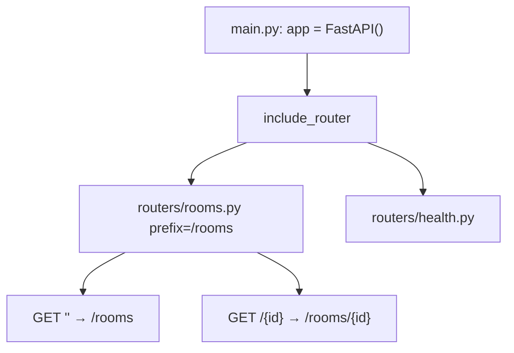

# Month 9 · Week 3 · Day 1
# APIRouter: Prefix, Tags, include_router

**Program:** Full-Stack Mastery · 18 months  
**Phase:** 3 — Python and backend  
**Month index:** [../../README.md](../../README.md)  
**Week 3:** Day 1 (today) · [2](day-02.md) · [3](day-03.md) · [4](day-04.md) · [5](day-05.md) · [6](day-06.md) · [7](day-07.md)  
**Week 2 review:** [../week-02/day-07.md](../week-02/day-07.md)  
**Week rhythm today:** Learn + type-along  
**Student state:** Week 2 gate passed. `main.py` can hold one resource. Today **the app is a composition of routers**.  
**Study time:** 3–4 focused hours

**This week covers:** routers, dependencies, configuration, services, repositories as a pattern (not a mandatory layer), middleware, DI concepts.

Today: **`APIRouter`**, **`prefix`**, **`tags`**, **`include_router`**. `Depends` is Day 2. Splitting a blob into services/repos is Day 4. Still **in memory**. Still **no SQLAlchemy**.

Labs: `~\fullstack-lab\month-09\week-03\day-01\`.

---

## How to use this textbook

1. Read a section. Close it. Say it.  
2. Type two modules. Do not keep everything in `main.py` “until it hurts.” It already hurts in `/docs` when tags are missing.  
3. Optional review links are for later rechecking.

---

## How to read this chapter

A **router** is a bag of path operations you can **mount** on the app (or on another router). The **prefix** is prepended to every path. **Tags** group operations in `/docs`. `main.py` becomes: create `app`, include routers, maybe health.



**Wrong belief:** “Routers are microservices.”  
**Correct:** they are **modules**. One process, one app, several files. Microservices are a deployment choice you have not earned.

---

## Today's contract

By the end of this day you will be able to:

1. Create `APIRouter(prefix="...", tags=[...])`.  
2. Declare routes with `@router.get("")` or `@router.get("/")` **knowing the slash trap**.  
3. `app.include_router(rooms_router)`.  
4. Include a second router so `/docs` shows **two tags**.  
5. Keep Pydantic Create/Out and an in-memory dict.  
6. Run tests against the **app**, not against a router in isolation (unless you mount it).

**Today's gate.** Closed-book:

> Path operations can live on APIRouter. include_router mounts them. prefix + decorator path = public URL. tags are for OpenAPI grouping. main.py should not grow every resource as more decorators on app.

---

## Time box

| Block | Minutes | Work |
|---|---|---|
| A | 45 | Theory |
| B | 60 | Type-along: rooms router |
| C | 70 | Independent: second router |
| D | 20 | Git |
| E | 15 | Recall |

---

# Block A — Theory

## 1. From @app.get to @router.get

```python
from fastapi import APIRouter, FastAPI

router = APIRouter(prefix="/rooms", tags=["rooms"])

@router.get("")
def list_rooms() -> list[dict]:
    return []

app = FastAPI(title="Campus lab")
app.include_router(router)
```

Public URL: **`GET /rooms`**. The decorator path is `""` (empty) on a prefix `/rooms`.

**Slash trap:** `prefix="/rooms"` + `@router.get("/")` may be `/rooms/` (trailing slash). FastAPI/Starlette can redirect or 404 depending on settings. Pick **one**:

- `prefix="/rooms"` and `@router.get("")` plus `@router.get("/{room_id}")`  
- or `prefix="/rooms"` and `@router.get("/")` and **test what Uvicorn actually does**

Write the observed URLs in `SLASH.txt`. Clients (and TestClient) must use the path you chose. Redirects surprise tests.

**Wrong belief:** “I’ll put prefix `/rooms` and also `@router.get("/rooms")`.”  
**Correct:** that becomes `/rooms/rooms`. Prefix is not a comment.

---

## 2. tags

```python
APIRouter(prefix="/rooms", tags=["rooms"])
```

`/docs` groups under **rooms**. You can override per operation: `@router.get("", tags=["campus"])`. Prefer router-level tags for CRUD.

Tags do not affect routing. They are documentation.

---

## 3. include_router options

```python
app.include_router(rooms_router)
app.include_router(rooms_router, prefix="/api")  # extra prefix → /api/rooms
```

Double prefixes stack. Week 4 versioning might use `include_router(..., prefix="/v1")`. Today one prefix on the router is enough.

You can `include_router` the same router twice with different prefixes — rarely wise this month.

---

## 4. Where files live (simple)

```text
lab/
  main.py          # app, include_router, maybe GET /health
  routers/
    __init__.py    # can be empty
    rooms.py       # router + models + dict for today
    desks.py       # tomorrow you will inject the store instead
```

**Today** it is OK for `rooms.py` to hold models + dict + router. That is already better than a 400-line `main.py`. Day 4 splits **further** only when a layer has a job.

`from routers.rooms import router as rooms_router` — package imports depend on **where you run uvicorn**. From the project root:

```powershell
uv run uvicorn main:app --reload --host 127.0.0.1 --port 8000
```

If `main` cannot import `routers`, you are in the wrong cwd or missing `__init__.py`. Read the traceback. Do not invent `sys.path` hacks as the first fix.

---

## 5. Health stays on the app (or a tiny router)

```python
@app.get("/health")
def health() -> dict[str, str]:
    return {"status": "ok"}
```

Health is not `/rooms/health`. Load balancers later expect a stable path. A `routers/health.py` with prefix `""` and `tags=["health"]` is also fine.

---

## 6. Tests

```python
from fastapi.testclient import TestClient
from main import app

client = TestClient(app)
client.get("/rooms")
```

Testing a bare `router` without mounting skips `include_router` mistakes. **Mount then test public URLs.**

---

## 7. Models live next to the router — for now

Circular imports appear when `main` imports routers that import `main`. **Do not** import `app` inside `rooms.py`. The router is a **plain object**. `main` owns `app`.

**Wrong belief:** “I’ll import app in the router to read settings.”  
**Correct:** Day 2 `Depends`, Day 5 settings object. Today: no circular import.

---

## 8. Security start

- Prefixes are not permission. `/admin` is still public until you add auth (later months).  
- Tags might reveal “internal” names in `/docs`. You can disable docs in production later. Today docs stay on.

---

# Block B — Type-along

```powershell
cd ~\fullstack-lab
mkdir month-09\week-03\day-01 -Force
cd ~\fullstack-lab\month-09\week-03\day-01
uv init --name lab-routers
uv add fastapi uvicorn
uv add --dev pytest httpx
```

Create package `routers/`. `RoomCreate` / `RoomOut`. In-memory dict in `rooms.py`. Router prefix `/rooms`. `main.py` includes it + `/health`.

Tests: list empty, create 201, get 404. Paths are `/rooms` not `/rooms/rooms`.

```powershell
uv run uvicorn main:app --reload --host 127.0.0.1 --port 8000
```

Open `/docs`. Screenshot optional; write `TAGS.txt`: tag names you see.

`SLASH.txt`: GET `/rooms` vs `/rooms/` statuses.

---

# Block C — Independent

Add **`desks`** router: prefix `/desks`, tag `desks`, own dict, Create/Out. Include it. Tests for `/desks`. **Do not** relate desks to rooms with foreign keys yet (Day 4/Project 6A). Two **independent** collections is the point of two routers.

Not users/projects/tasks.

```powershell
cd ~\fullstack-lab
git add month-09
git commit -m "Month 9 Week 3 Day 1: APIRouter prefix tags include_router."
```

---

# Block E — Recall

1. prefix + path = URL.  
2. What tags change and what they do not.  
3. Why tests use `app`.  
4. Circular import pattern to avoid.  
5. `/rooms/rooms` — how it happens.

## Office hours — routers

**Uvicorn `Could not import module`.** You ran from `routers/` or from home. Run from the project root where `main.py` lives.

**`GET /rooms/` 307 redirect to `/rooms`.** TestClient follows redirects by default in some versions — then you think both work. `SLASH.txt` should record **first** status with `-D -` and `curl.exe --path-as-is` if needed. Pick one canonical path; use it in tests (`follow_redirects=False` if you must see 307).

**Tags `["Rooms"]` vs `["rooms"]`.** Two tags in docs. Be consistent, lowercase is fine.

**Health on the rooms router as `GET /health` with prefix `/rooms`.** You shipped `/rooms/health`. Put health on `app` or a router with prefix `""`.

**Testing `rooms.router` with TestClient(router).** That is not a FastAPI app. Always `TestClient(app)`.

Two independent collections today: rooms and desks. Do not add `room_id` on desks yet unless you want to fight 404-on-parent without a service — Day 4.

## File tree to type

```text
main.py
routers/__init__.py
routers/rooms.py
routers/desks.py
```

`main.py` should look like: imports, `app = FastAPI(title=...)`, `app.include_router(rooms_router)`, `app.include_router(desks_router)`, `@app.get("/health")`.

`rooms.py` owns `ROOMS` dict **today**. Tomorrow you will inject it. Duplication of `_next_id` in two modules is OK for this lab — do not make a premature “generic CRUD class.”

**OpenAPI:** two tags. If you see one tag `default`, you forgot `tags=[...]`.

**Test:**

```python
def test_rooms_and_desks_are_not_the_same_store(client: TestClient) -> None:
    client.post("/rooms", json={"name": "A"})
    r = client.get("/desks")
    assert r.json() == []  # or {"items": []} if you used an envelope — you should not, yet
```

If desks list shows the room, you shared one dict by accident.

## Prefix arithmetic

| prefix | decorator | public URL |
|---|---|---|
| `/rooms` | `""` | `/rooms` |
| `/rooms` | `"/"` | `/rooms/` (slash trap) |
| `/rooms` | `"/{room_id}"` | `/rooms/12` |
| `/rooms` | `"/rooms"` | `/rooms/rooms` (mistake) |
| plus `include_router(..., prefix="/v1")` | `""` | `/v1/rooms` |

Write the table in `SLASH.txt` with **observed** statuses from curl.exe.

---

## Definition of done

- [ ] Two routers included  
- [ ] `/docs` shows two tags  
- [ ] Tests hit prefixed URLs  
- [ ] `SLASH.txt` written  
- [ ] `main.py` is small  
- [ ] Commit exists  

---

## Check yourself before git

Public URLs are `/rooms` and `/desks`, not `/rooms/rooms`. `/docs` has two tags. `main.py` does not contain the CRUD bodies. Tests use `TestClient(app)`. `SLASH.txt` recorded `/rooms` vs `/rooms/`.

```powershell
uv run uvicorn main:app --reload --host 127.0.0.1 --port 8000
```

If `GET /rooms` 404, you used `@router.get("/rooms")` under prefix `/rooms`. Fix the decorator path, not the test.

`uv run python -c "from main import app"` must work from the project root. Missing `routers/__init__.py` is a common Windows import fail.

---

## Optional review links

Routers are explained in this chapter.

- [FastAPI: Bigger applications](https://fastapi.tiangolo.com/tutorial/bigger-applications/)
- [FastAPI: Path operation configuration / tags](https://fastapi.tiangolo.com/tutorial/path-operation-configuration/)

---

## If pytest fails (this day)

| Symptom | Likely cause |
|---|---|
| `/rooms/rooms` | decorator repeated the prefix |
| import error `routers` | wrong cwd or missing `__init__.py` |
| one tag `default` | forgot `tags=[...]` |
| desks list shows rooms | shared one dict |
| TestClient 404 on `/rooms` | you tested the router unmounted |

---

## Security reminder

Prefixes are not auth. `/docs` is enabled in lab. Two routers still share one process and one RAM. Bind `127.0.0.1`.

---

## Tomorrow

**Depends** — `get_store` injects the dict (or a repo object). Routes stop importing a global because they “have to.”
