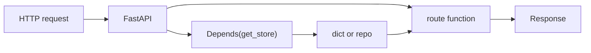

# Month 9 · Week 3 · Day 2
# Depends: Inject the Store (get_store)

**Program:** Full-Stack Mastery · 18 months  
**Phase:** 3 — Python and backend  
**Month index:** [../../README.md](../../README.md)  
**Week 3:** [1](day-01.md) · Day 2 (today) · [3](day-03.md) · [4](day-04.md) · [5](day-05.md) · [6](day-06.md) · [7](day-07.md)  
**Week rhythm today:** Learn + type-along  
**Student state:** You can split routers. Today the **dict is not a secret global** the route file must import — it is **injected**.  
**Study time:** 3–4 focused hours

Labs: `~\fullstack-lab\month-09\week-03\day-02\`.

---

## How to use this textbook

1. Read a section. Close it. Say it.  
2. Type `Depends(get_store)`. The value is that **tests can override** it.  
3. Optional review links are for later rechecking.

---

## How to read this chapter

**Dependency injection (DI)** here means: the route function **declares** what it needs; FastAPI **calls** a provider and **passes** the result. You already used a kind of DI: `payload: RoomCreate` is provided by the framework. `get_store` is **your** provider.



**Wrong belief:** “Depends is for databases only.”  
**Correct:** Depends is for **anything** a request needs: store, settings, a user (later), a request id. Today: the in-memory store.

---

## Today's contract

By the end of this day you will be able to:

1. Write `def get_store() -> dict: return ROOMS`.  
2. Use `store: dict = Depends(get_store)` in path operations.  
3. Explain **call per request** (unless cached — see `lru` / `yield` below).  
4. Override `app.dependency_overrides[get_store]` in a test with a **fresh** dict.  
5. Keep routers importable without importing `app`.

**Today's gate.** Closed-book:

> Depends calls a function and injects the return value into the route. Tests can override the provider. That is how the store is swapped without editing routes. I still do not need a class hierarchy.

---

## Time box

| Block | Minutes | Work |
|---|---|---|
| A | 50 | Theory |
| B | 60 | Type-along: get_store + override |
| C | 70 | Independent: two routers, one pattern |
| D | 20 | Git |
| E | 15 | Recall |

---

# Block A — Theory

## 1. The smallest useful dependency

```python
# store.py
ROOMS: dict[int, dict] = {}
_next_id = 1

def get_store() -> dict[int, dict]:
    return ROOMS

def next_id() -> int:
    global _next_id
    n = _next_id
    _next_id += 1
    return n

def reset() -> None:
    global _next_id
    ROOMS.clear()
    _next_id = 1
```

```python
# routers/rooms.py
from fastapi import APIRouter, Depends, HTTPException
from store import get_store, next_id

router = APIRouter(prefix="/rooms", tags=["rooms"])

@router.get("")
def list_rooms(store: dict = Depends(get_store)) -> list:
    return list(store.values())
```

The route **does not** write `from store import ROOMS` if it can avoid it — it asks for `store`. `next_id` can stay a function on the same module for today. Day 4 may wrap both in a **class**.

**Wrong belief:** “If I still have a global dict, Depends is fake.”  
**Correct:** the global is the **default provider’s guts**. The route is decoupled. Tests replace `get_store`.

---

## 2. What FastAPI does

For each request that hits that route:

1. Resolve dependencies (nested Depends allowed).  
2. Call `get_store()`.  
3. Call `list_rooms(store=...)`.  
4. Validate response if `response_model` set.

`get_store` can itself take `Depends`. You will nest settings later (Day 5).

---

## 3. yield (cleanup) — know it; optional today

```python
def get_store():
    yield ROOMS
    # code after yield runs after the response — like a finally
```

For a dict, cleanup is usually **nothing**. For Month 10 sessions, `yield` closes the session. Do not add fake cleanup.

---

## 4. dependency_overrides (tests)

```python
import pytest
from fastapi.testclient import TestClient
from main import app
from store import get_store, reset

@pytest.fixture
def client() -> TestClient:
    reset()
    return TestClient(app)

def test_override_empty_store() -> None:
    fake: dict[int, dict] = {}

    def fake_store() -> dict:
        return fake

    app.dependency_overrides[get_store] = fake_store
    try:
        c = TestClient(app)
        r = c.get("/rooms")
        assert r.status_code == 200
        assert r.json() == []
        fake[1] = {"id": 1, "name": "injected"}
        r2 = c.get("/rooms")
        assert r2.json()[0]["name"] == "injected"
    finally:
        app.dependency_overrides.clear()
```

**Always clear overrides.** They live on `app` and leak between tests like the module dict did in Week 1.

`reset()` without override is enough when there is one dict. Override proves you **can** swap. Project 6A tests may only `reset()` — still know overrides.

---

## 5. Type hints

`store: dict = Depends(get_store)` works. Better: `dict[int, dict]` or a `TypedDict` / a small **Protocol**. Day 4 class: `store: RoomRepo = Depends(get_repo)`.

If you forget `Depends` and write `store: dict = get_store`, FastAPI may treat it as a **query param** or fail oddly. **Must** be `Depends(get_store)`.

**Wrong belief:** “I’ll call `get_store()` inside the route; Depends is syntax sugar.”  
**Correct:** calling yourself **breaks overrides** and hides the dependency graph in `/docs` (dependencies can appear in OpenAPI).

---

## 6. Annotated style (optional, modern)

```python
from typing import Annotated
from fastapi import Depends

StoreDep = Annotated[dict[int, dict], Depends(get_store)]

@router.get("")
def list_rooms(store: StoreDep) -> list:
    ...
```

You may use this. Do not mix three styles in one file.

---

## 7. What not to inject today

- Do not inject `Request` unless you need it (middleware Day 5).  
- Do not invent `get_db` that returns SQLAlchemy.  
- Do not Depends a new dict **every** request as the **production** store (`return {}` would forget POSTs). The provider returns the **same** module dict. Tests pass a **different** object via override.

---

## 8. Security start

- `get_store` is not auth.  
- Overriding in tests is not a production feature.  
- Do not Depends user input without validation — body still uses Pydantic.

---

# Block B — Type-along

```powershell
cd ~\fullstack-lab
mkdir month-09\week-03\day-02 -Force
cd ~\fullstack-lab\month-09\week-03\day-02
uv init --name lab-depends
uv add fastapi uvicorn
uv add --dev pytest httpx
```

Files: `store.py`, `routers/rooms.py`, `main.py`. Create/Out models. GET/POST/GET-id.

Tests: fixture `reset()`; one test with `dependency_overrides`.

```powershell
uv run pytest -q
uv run uvicorn main:app --reload --host 127.0.0.1 --port 8000
```

Write `DI.txt`: what you override and why the route file did not change.

---

# Block C — Independent

Add **lockers** router with `get_lockers()` in `store.py` (second dict) **or** one `get_stores()` returning a small namespace object. Prefer **two functions** over a mega dict today so Depends stays readable.

Not Project 6A. No SQL.

```powershell
cd ~\fullstack-lab
git add month-09
git commit -m "Month 9 Week 3 Day 2: Depends get_store and test override."
```

---

# Block E — Recall

1. What FastAPI calls before the route.  
2. Why `Depends` must wrap `get_store`.  
3. Why clear `dependency_overrides`.  
4. yield — what it is for later.  
5. Global dict vs injected dict — same object or not in production provider?

## Office hours — Depends

**`store: dict = get_store` without Depends.** OpenAPI shows a query param. Tests pass `?store=` nonsense. Always `Depends(get_store)`.

**Override does not stick.** You overrode `store.get_store` but the router did `from store import get_store` — that is the same function object if imported as function. If the router did `import store` and `Depends(store.get_store)`, override `store.get_store`. The **object identity** must match.

**`get_store` returns `{}` new dict every call.** POSTs vanish between requests. Return the module-level dict (or repo instance).

**`reset()` forgotten in override test.** The fake dict is enough; still `clear()` overrides after.

**Nested Depends too early.** You do not need `get_store` depending on `get_settings` today. Day 5.

`DI.txt` should say: production `get_store` returns `ROOMS`; tests may return `fake`.

## Two providers, two dicts

```python
# store.py
ROOMS: dict[int, dict] = {}
LOCKERS: dict[int, dict] = {}

def get_rooms() -> dict[int, dict]:
    return ROOMS

def get_lockers() -> dict[int, dict]:
    return LOCKERS

def reset() -> None:
    ROOMS.clear()
    LOCKERS.clear()
```

Rooms router Depends `get_rooms`. Lockers router Depends `get_lockers`. A test that POSTs a room must not appear in `GET /lockers`.

Override **one** provider without touching the other — that is the DI lesson.

**Docs:** FastAPI can show dependencies on the operation. You do not need to configure that. You do need the route signature to include `Depends`.

Do not inject `Request` to read the body. Pydantic still does bodies.

`reset()` must reset **both** `_next_id` counters if you have two. A rooms POST after lockers POST should still be allowed to use id 1 **in the rooms dict** — ids are per store, not global unless you chose a global. Document which.

---

## Definition of done

- [ ] Routes use `Depends(get_store)`  
- [ ] `reset()` fixture tests pass  
- [ ] One override test  
- [ ] No circular import  
- [ ] Commit exists  

---

## Check yourself before git

Every mutating route takes `Depends(get_rooms)` or `Depends(get_lockers)`, not a bare global in the function body. One override test. `finally: clear()`. `reset()` fixture. No circular import.

```powershell
uv run pytest -q
```

If the override test 404s, you overrode a different function object than the route captured. Import `get_store` from the same module the router used.

`get_store` returning a **new** `{}` each call looks like “Depends works” until POST then GET is empty. Return the module dict.

---

## Optional review links

Depends is explained in this chapter.

- [FastAPI: Dependencies](https://fastapi.tiangolo.com/tutorial/dependencies/)
- [FastAPI: Testing dependencies with overrides](https://fastapi.tiangolo.com/advanced/testing-dependencies/)

---

## If pytest fails (this day)

| Symptom | Likely cause |
|---|---|
| POST then GET empty | `get_store` returns a new `{}` |
| override ignored | wrong function object |
| `store` in query params | forgot `Depends` |
| tests pollute | no `reset()` / no `clear()` on overrides |
| circular import | router imported `app` |

---

## Tomorrow

**Memory day:** routers + Depends + Pydantic GET/POST/GET-id from spec. Then Day 4 splits the blob into service/repo **only as needed**.
