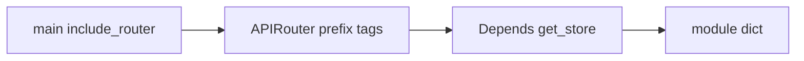
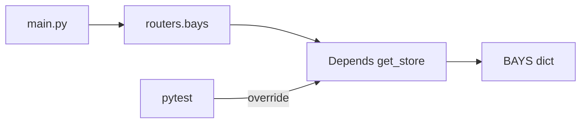
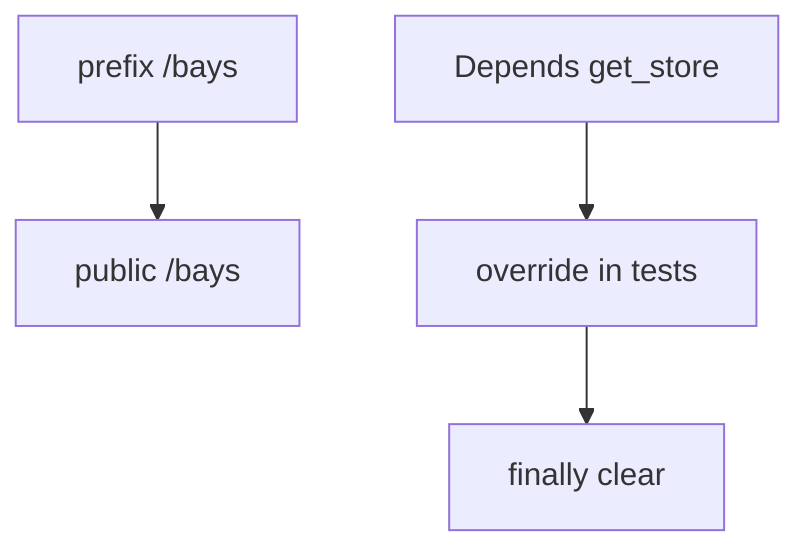

# Month 9 · Week 3 · Day 3
# Implement From Memory: Router + Depends

**Program:** Full-Stack Mastery · 18 months  
**Phase:** 3 — Python and backend  
**Month index:** [../../README.md](../../README.md)  
**Week 3:** [1](day-01.md) · [2](day-02.md) · Day 3 (today) · [4](day-04.md) · [5](day-05.md) · [6](day-06.md) · [7](day-07.md)  
**Week rhythm today:** Implement from memory  
**Student state:** Day 2 gate passed. Today routers and `get_store` must still live in your head — from **this file**.  
**Study time:** 3–4 focused hours

Labs: `~\fullstack-lab\month-09\week-03\day-03\`. Do not copy Day 1–2 trees. Do not start Project 6A. Do not paste `~/ops-api/`. Loading bays are the noun.

---

## How Day 3 works

Days 1–2 **closed** during the build. This recap is the teacher. Stuck > 25 minutes: open only the matching section, close, continue. `lookups.txt`.

No complete app in this file.

---

## How to read this chapter



**Wrong belief:** “Memory day I cram into main.py.”  
**Correct:** the skill **is** the split.

---

## Complete explanation (architecture you must still own)

**APIRouter(prefix="/bays", tags=["bays"])**. Decorator paths join the prefix. `app.include_router`. Avoid `/bays/bays`. Trailing slash: test it.

`@router.get("")` under `prefix="/bays"` is public `GET /bays`. `@router.get("/bays")` under the same prefix is `GET /bays/bays`, which 404s and looks like FastAPI is broken. Write the public URL in `URLS.txt` **before** you argue with pytest.

**tags** group `/docs`. They do not secure anything.

**main.py** creates `FastAPI`, includes routers, `/health`. Routers must **not** import `app`. If they do, you get a circular import or a router that cannot be tested without the whole application object. `main` imports the router. The router imports `get_store` from `store.py`. That arrow is one way.

**Depends(get_store):** provider returns the **same** dict each request. Route parameter `store: dict = Depends(get_store)`. Forgetting `Depends` is a bug: `/docs` then shows a query parameter named `store`. Tests: `reset()` and optionally `app.dependency_overrides[get_store] = ...` with `finally: clear()`.

Calling `get_store()` inside the route **skips** overrides. The route must take the injected parameter. The override test is how you prove the injection is real, not a comment.

**Still Week 2:** Create/Out, `response_model`, 201/404/422, `model_dump` not `.dict()`, in-memory, `HTTPException`, TestClient, `curl.exe`, `uv run uvicorn main:app --reload --host 127.0.0.1 --port 8000`.

**Not yet required:** service class, repository class (Day 4), settings, middleware (Day 5). If you add them early, you must still **explain** them — empty layers are a fail.

No SQLAlchemy. No Redis. No PostgreSQL. The store is a module dict. Reload still wipes it.

**Wrong belief:** “Overrides replace FastAPI.”  
**Correct:** they replace **your** provider for tests.

**Wrong belief:** “I’ll `from store import BAYS` in the router and Depends is documentation.”  
**Correct:** then the override test proves nothing. The route must take `store: dict = Depends(get_store)`.

---

## Today's contract

**Today's gate.** Closed-book:

> I built `/bays` on a router with prefix/tags, injected the store with Depends, validated with Pydantic, and tested public URLs including an override or reset.

---

## Time box

| Block | Minutes | Work |
|---|---|---|
| A | 20 | Speak |
| B | 35 | Paper: file tree + URLs |
| C | 95 | Spec |
| D | 30 | Defect hunt |
| E | 15 | lookups |

---

# Block A — Speak

1. prefix + `get("")` public path.  
2. Why router does not import app.  
3. `Depends(get_store)` vs calling `get_store()`.  
4. Why clear overrides.  
5. 422 vs 404.

If (1) is “I always write `/bays` on the decorator,” re-read the prefix paragraph. Do not start Block C yet.

---

# Block B — Paper

`TREE.txt`: `main.py`, `store.py`, `routers/bays.py`. List public URLs for list/create/get-one.

---

# Block C — Spec

```powershell
cd ~\fullstack-lab
mkdir month-09\week-03\day-03 -Force
cd ~\fullstack-lab\month-09\week-03\day-03
uv init --name lab-bays
uv add fastapi uvicorn
uv add --dev pytest httpx
```

**Bays** (loading bays — not Project 6A): `code` unique, `label`. Internal `hidden`. Out hides it.

| Method | Path |
|---|---|
| GET | `/health` |
| GET | `/bays` |
| POST | `/bays` 201 |
| GET | `/bays/{bay_id}` |

PUT/PATCH/DELETE stretch. CONTRACT.md first. pytest: 201, leak, 422, 404, 409, reset isolation. One override test **or** a written reason in `OVERRIDE.txt` if you only reset (override is preferred).

## Spec details you must not skip

**Files:**

```text
main.py           # FastAPI(), include_router, GET /health
store.py          # BAYS dict, _next_id, get_store(), reset()
routers/__init__.py
routers/bays.py   # APIRouter, models, path operations
tests/test_bays.py
```

**Router:**

```python
router = APIRouter(prefix="/bays", tags=["bays"])

@router.get("")
def list_bays(store: dict = Depends(get_store)) -> list:
    ...
```

If `GET /bays` 404s, you probably used `@router.get("/bays")`. Write the public URL in `URLS.txt` before you argue with pytest.

**Models (in the router file is OK today):**

- `BayCreate`: `code` min_length 1, `label` min_length 1  
- `BayOut`: `id`, `code`, `label` only  

Store `hidden: True` on every row. `response_model=BayOut` / `list[BayOut]`. Test: `"hidden" not in r.json()`.

**Override test (preferred):**

```python
def test_override_sees_injected_row() -> None:
    fake = {1: {"id": 1, "code": "X", "label": "y", "hidden": True}}

    def _fake() -> dict:
        return fake

    app.dependency_overrides[get_store] = _fake
    try:
        r = TestClient(app).get("/bays/1")
        assert r.status_code == 200
        assert r.json()["code"] == "X"
        assert "hidden" not in r.json()
    finally:
        app.dependency_overrides.clear()
```

If this test 404s, you overrode the wrong function (the router imported a different `get_store`). Patch/override the **same object** the route used.

Unique `code` → 409 after validation. Empty `code` → 422 before the function. Missing id → 404 `HTTPException`. Fixture calls `reset()` so two tests do not share ids.

---

# Block D

1. Import cycle? Fix. `routers/bays.py` must not import `app` from `main`. `main` imports the router. If Python complains about circular import, you inverted that.  
2. `/bays/bays` 404? Fix prefix.  
3. `/docs` tag `bays`.  
4. Reload empties RAM — `RAM.txt`.  
5. Forget `Depends` — what does `/docs` show as a query parameter named `store`? If you see it, you did not inject.  
6. Two tests without `reset()`: second create `id==1` fails. Fix the fixture, not the assertion by using `id >= 1`.

Write `DEFECTS.txt`: which of these you actually hit.



`curl.exe` still works against Uvicorn for a spot-check. pytest does not need the port. Bind `127.0.0.1`.

---

# Block E

```powershell
cd ~\fullstack-lab
git add month-09
git commit -m "Month 9 Week 3 Day 3: bays router and Depends from memory."
```

---

# Lecture: prefix, Depends, and the same object

**Public URL.** Write it before coding. `prefix="/bays"` + `@router.get("")` = `GET /bays`. `prefix="/bays"` + `@router.get("/bays")` = `GET /bays/bays`. TestClient uses the public path. If pytest 404s, print `router.prefix` and the decorator path; do not add a second router.

**Depends is a parameter.** `store: dict = Depends(get_store)`. FastAPI calls `get_store` and injects. `store = get_store()` inside the body skips overrides. Forgetting `Depends` makes `/docs` show query param `store`. Look at `/docs`. That is the test.

**Same object.** Override `get_store` that the **router imported**. If `store.py` defines it and the router imported a copy under another name, you overrode the wrong function. The override test 404s. Patch the object identity the route uses. `finally: app.dependency_overrides.clear()`.

**Reset.** `reset()` clears `BAYS` and `_next_id`. Two tests without reset: second `id==1` fails. Fix the fixture. Do not loosen the assertion.

**HTTP still Week 2.** Create/Out, leak `hidden`, 422 empty code, 404 missing, 409 duplicate. `model_dump` not `.dict()`. In-memory. No SQL. Reload wipes — `RAM.txt`.

**main vs router.** `main` imports router. Router does not import `app`. Cycle means you inverted the arrow. `/health` on `app`. Resource routes on the router.

Bays, not ops-api. Override test preferred. `OVERRIDE.txt` only if you can explain why reset-only still proves injection (it proves less).

---

## Definition of done

- [ ] Router + Depends  
- [ ] Tests on public URLs  
- [ ] No leak / 422 / 404  
- [ ] lookups.txt  
- [ ] Commit exists  

---

# Worked session — bays split + override

Files: `main.py`, `store.py`, `routers/bays.py`, `tests/test_bays.py`. `APIRouter(prefix="/bays", tags=["bays"])`. `@router.get("")` public `/bays`. `store: dict = Depends(get_store)`. `BayCreate` / `BayOut`. Store `hidden: True`. Tests: 201, leak, 422, 404, 409, reset, override with `finally: clear()`.

`URLS.txt` before pytest. `TREE.txt` on paper. If `/docs` shows query `store`, you forgot `Depends`. If `/bays/bays` 404, prefix doubled. If override 404s, wrong `get_store` object. Router must not import `app`.

`uv run uvicorn main:app --reload --host 127.0.0.1 --port 8000`. `curl.exe` optional. No SQL. No ops-api. `model_dump` if you dump. CONTRACT.md first.

Two tests without `reset()` sharing id 1 is a fixture bug. Do not loosen `id == 1` to hide it.

---

## Optional review links

Repair from this recap first. These pages are for later checking, not for first learning.

- [Bigger applications](https://fastapi.tiangolo.com/tutorial/bigger-applications/)
- [Dependencies](https://fastapi.tiangolo.com/tutorial/dependencies/)

---

## Tomorrow

**Split the blob:** route functions vs **service** functions vs an in-memory **repository class**. Pattern, not ceremony. Empty layers forbidden.

---

# Closing lecture — Depends is a parameter

`store: dict = Depends(get_store)` is injection.
`store = get_store()` inside the function skips overrides.
Forgetting `Depends` makes `/docs` show a query named `store`.
Look at `/docs`. That is cheaper than arguing with pytest.

`prefix="/bays"` + `@router.get("")` = `GET /bays`.
`@router.get("/bays")` doubles the path. URLS.txt before tests.
Override the same `get_store` object the router imported.
`finally: app.dependency_overrides.clear()`. Fixture `reset()` too.

Create/Out still hide `hidden`. 422/404/409 still true.
`model_dump` not `.dict()`. No SQL. Bays, not ops-api.
Router does not import `app`. main includes the router.
If the override test 404s, you overrode a different function.
CONTRACT.md first. pytest on public URLs, not on internal function calls only.
Two tests without reset sharing `id==1` is a fixture bug. Fix reset, not the number.
Reload still empties the module dict. RAM.txt one sentence. Bind 127.0.0.1.
`uv run uvicorn main:app --reload --host 127.0.0.1 --port 8000`.
PUT/PATCH/DELETE are stretch. GET/POST/GET-one plus leak tests are the gate.


## Recite-back checklist (close the editor, then tick)

Write `RECITE.txt` with one honest sentence per line.
If a line is mush, re-read the matching section in **this** file only.

- [ ] public URL = prefix + decorator
- [ ] `Depends(get_store)` parameter
- [ ] override + `finally: clear()`
- [ ] router does not import `app`
- [ ] Out hides `hidden`
- [ ] 422 / 404 / 409 tests
- [ ] fixture `reset()`
- [ ] not ops-api; not SQL

If `/docs` shows query `store`, you forgot `Depends`. Look. Fix.

Write the public URLs in URLS.txt before you change pytest. Prefix math is cheaper on paper.
Depends is a parameter. Overrides prove it. Reset proves isolation. You want both.
If `/docs` shows `store` as a query, you did not inject. Look at `/docs` before guessing.




Commit the bays lab under `fullstack-lab`. Do not paste Project 6A. Prefix math first, then pytest.
