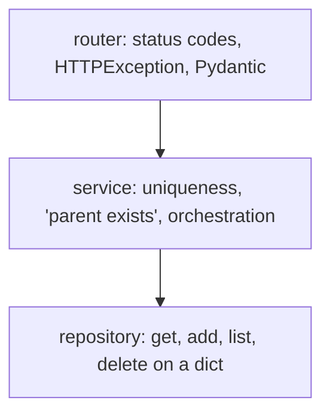

# Month 9 · Week 3 · Day 4
# Split the Blob: Routes, Services, In-Memory Repository

**Program:** Full-Stack Mastery · 18 months  
**Phase:** 3 — Python and backend  
**Month index:** [../../README.md](../../README.md)  
**Week 3:** [1](day-01.md) · [2](day-02.md) · [3](day-03.md) · Day 4 (today) · [5](day-05.md) · [6](day-06.md) · [7](day-07.md)  
**Week rhythm today:** Learn + type-along  
**Student state:** You can mount routers and inject a dict. Today you **split** a fat module **only where a job exists**.  
**Study time:** 3–4 focused hours

Project 6 Stage A: *router → service → repository/data access* is **reasonable**. *Do not create empty layers just to follow a pattern. Explain why each layer exists.* That sentence is today’s law.

Labs: `~\fullstack-lab\month-09\week-03\day-04\`.

---

## How to use this textbook

1. Read a section. Close it. Say **why** a file exists.  
2. Type a repository **class** with methods. That is a **pattern**, not a second database.  
3. If a “service” only calls one repo method and returns, **delete the service** and say so in `LAYERS.md`.  
4. Optional review links are for later rechecking.

---

## How to read this chapter

`main.py` as a thousand-line script mixes HTTP, rules, and storage. Tests become slow to read. Month 10 will replace storage; **HTTP should not care**.



**Simplest architecture that stays clear:**

- Always: **router** + **store access**.  
- Add a **repository class** when you do not want routers to know dict keys.  
- Add a **service** when a rule spans more than one repo call (unique check + insert, “cannot delete last admin”) **or** you want to unit-test rules without ASGI.

**Wrong belief:** “Clean architecture means I, Service, Repository, DTO, Mapper, UnitOfWork folders on day one.”  
**Correct:** empty folders are a costume. Project 6A will have **three resources** — enough to justify routers + a small repo. Not enough to justify enterprise Java.

---

## Today's contract

By the end of this day you will be able to:

1. Move dict operations into a **`ShelfRepo`** (or similar) with `get`, `add`, `list`, `delete`, `exists_name`.  
2. Inject `get_repo()` via Depends.  
3. Keep **HTTPException** in the **router** (or map service errors there) so the repo does not import FastAPI.  
4. Write a **service function** only if it does real work; otherwise skip it and document why.  
5. Split `main.py` so it mostly **includes routers**.  
6. Explain each file in `LAYERS.md` in one sentence.

**Today's gate.** Closed-book:

> A repository is an object with storage methods — today a class wrapping a dict. Routes own HTTP. Services own rules when rules exist. I can justify every module. I still have no SQLAlchemy.

---

## Time box

| Block | Minutes | Work |
|---|---|---|
| A | 50 | Theory |
| B | 65 | Type-along: split shelves |
| C | 65 | Independent: LAYERS.md + tests still HTTP |
| D | 20 | Git |
| E | 15 | Recall |

---

# Block A — Theory

## 1. What belongs where

| Layer | Allowed to know | Must not |
|---|---|---|
| **Router** | HTTP methods, status codes, Pydantic models, `HTTPException`, Depends | How the dict is keyed internally if a repo exists |
| **Service** | Rules: unique names, “qty cannot go negative,” calling two repos | `Request`, status codes (prefer raising **domain** errors) |
| **Repository** | `self._items: dict[int, dict]`, ids | FastAPI, Pydantic models **if** you can store plain dicts/dataclasses |

The repo **may** store dicts that look like your Out model. It should not `raise HTTPException`. `None` from `get` is enough; the router raises 404.

**Wrong belief:** “The repo should raise HTTPException so the router is one line.”  
**Correct:** then the repo **is** HTTP. Month 10 the repo talks SQL; 404 still belongs at the adapter.

---

## 2. In-memory repository class

```python
class ShelfRepo:
    def __init__(self) -> None:
        self._items: dict[int, dict] = {}
        self._next_id = 1

    def list(self) -> list[dict]:
        return list(self._items.values())

    def get(self, shelf_id: int) -> dict | None:
        return self._items.get(shelf_id)

    def add(self, data: dict) -> dict:
        row = {"id": self._next_id, **data}
        self._items[self._next_id] = row
        self._next_id += 1
        return row

    def delete(self, shelf_id: int) -> bool:
        if shelf_id not in self._items:
            return False
        del self._items[shelf_id]
        return True

    def name_taken(self, name: str, *, ignore_id: int | None = None) -> bool:
        key = name.casefold().strip()
        for sid, row in self._items.items():
            if ignore_id is not None and sid == ignore_id:
                continue
            if str(row["name"]).casefold().strip() == key:
                return True
        return False

    def clear(self) -> None:
        self._items.clear()
        self._next_id = 1
```

One **instance** lives in `store.py`:

```python
repo = ShelfRepo()

def get_repo() -> ShelfRepo:
    return repo
```

Tests call `repo.clear()` or override `get_repo` with `ShelfRepo()` fresh instance.

This is **not** the Repository Pattern as a religion. It is a **class with methods** so Day 4 of Month 10 can keep the same method names.

---

## 3. Service functions (when they earn their keep)

```python
class DuplicateNameError(Exception):
    pass

class NotFoundError(Exception):
    pass

def create_shelf(repo: ShelfRepo, data: dict) -> dict:
    if repo.name_taken(data["name"]):
        raise DuplicateNameError
    return repo.add(data)
```

Router:

```python
@router.post("", status_code=201, response_model=ShelfOut)
def post_shelf(payload: ShelfCreate, repo: ShelfRepo = Depends(get_repo)) -> dict:
    try:
        return create_shelf(repo, payload.model_dump())
    except DuplicateNameError:
        raise HTTPException(status_code=409, detail="Name taken") from None
```

If `create_shelf` is **only** `return repo.add(...)`, skip it:

```python
@router.post("", status_code=201, response_model=ShelfOut)
def post_shelf(payload: ShelfCreate, repo: ShelfRepo = Depends(get_repo)) -> dict:
    if repo.name_taken(payload.name):
        raise HTTPException(status_code=409, detail="Name taken")
    return repo.add(payload.model_dump())
```

That second form is **honest**. Uniqueness is a two-line rule. A `services/shelves.py` with one function is optional. **Three** resources with shared “ensure parent exists” is when services start to pay rent.

**Wrong belief:** “I must have services.py to pass Month 9.”  
**Correct:** you must **explain** the flow. Empty `return repo.add` files fail the spirit of Stage A.

---

## 4. Domain errors vs HTTPException

Either:

- Router raises `HTTPException` after `if repo.get is None`, or  
- Service raises `NotFoundError`, router maps to 404.

Do not mix at random. Pick one per project. Mapping in the router keeps FastAPI imports out of services.

---

## 5. Splitting main.py — a target tree

```text
main.py              # FastAPI(), include_router, health
deps.py              # get_repo (or store.py)
repos/shelves.py     # ShelfRepo
routers/shelves.py   # path operations
models/shelves.py    # Pydantic (optional split)
services/shelves.py  # only if needed
```

You do **not** need all of these today. Minimum split: `main.py` + `routers/shelves.py` + `repos.py` (or `store.py` with the class).

Circular imports: models should not import routers. Repos should not import routers. `main` imports routers; routers import deps and models.

---

## 6. Tests

HTTP tests still win for statuses. You **may** unit-test `ShelfRepo.name_taken` without TestClient — that is a good extra, not a replacement for 409 HTTP tests.

---

## 7. Security start

- Repo `clear()` must not be a public `POST /debug/wipe` unless you like empty production data later.  
- Services must not log passwords from Create models.

---

# Block B — Type-along

```powershell
cd ~\fullstack-lab
mkdir month-09\week-03\day-04 -Force
cd ~\fullstack-lab\month-09\week-03\day-04
uv init --name lab-shelves
uv add fastapi uvicorn
uv add --dev pytest httpx
```

**Shelves** resource. Split blob. `ShelfRepo`. Unique name 409. Create/Out. GET list/one, POST, DELETE 204.

`LAYERS.md`: table of files and **why**. If no `services/` folder, the sentence is: “Uniqueness is one `name_taken` check in the router; a service would be a pass-through.”

```powershell
uv run pytest -q
uv run uvicorn main:app --reload --host 127.0.0.1 --port 8000
```

---

# Block C — Independent

Add **bins** as a **second** repo class (second dict). Optional rule: creating a bin requires `shelf_id` that **exists** — that **is** a service-worthy rule (`InvalidParentError` → 409 or 422; pick one, document). If you skip the relationship, say why in `LAYERS.md` (time) and still have two routers.

Not Project 6A’s full trio. No SQL.

```powershell
cd ~\fullstack-lab
git add month-09
git commit -m "Month 9 Week 3 Day 4: split blob, in-memory repo class."
```

---

# Block E — Recall

1. Why the repo does not import FastAPI.  
2. When to skip a service.  
3. `get_repo` vs `get_store` dict.  
4. Who raises 404.  
5. Empty layer smell.

## Office hours — layers

**`repos/__init__.py` imports every repo which imports services which import repos.** Cycle. Keep repos ignorant of services.

**Service raises HTTPException.** Then a CLI script cannot use `create_shelf`. Raise `DuplicateNameError`.

**Two repo classes sharing one dict by accident.** Each class has `self._items`. Two instances: two dicts. `get_repo` must return the **same** instance you `clear()` in tests.

**LAYERS.md lists `utils.py` with `def get(id):`.** That is a repo. Name it.

**Bins with `shelf_id` not checked.** POST bin 999 succeeds. 6A will require invalid relationship handling. Practice today if you have time: `if repo.get_shelf(shelf_id) is None: raise InvalidParentError`.

The simplest clear architecture for one resource: `main` + `router` + `ShelfRepo` + `get_repo`. That **passes** Day 4. Extra folders need sentences.

## Parent exists — the service that earns its file

```python
class InvalidParentError(Exception):
    pass

def create_bin(shelves: ShelfRepo, bins: BinRepo, data: dict) -> dict:
    if shelves.get(data["shelf_id"]) is None:
        raise InvalidParentError
    return bins.add(data)
```

Router:

```python
except InvalidParentError:
    raise HTTPException(status_code=409, detail="Shelf not found") from None
```

409 vs 422: 409 says “the id is well-typed but does not exist in **this** store.” 422 says “schema.” Either is defensible. Write it in LAYERS.md. Test POST bin with `shelf_id=999`.

If you skip bins, you still need `ShelfRepo` methods and HTTP tests for shelves. Do not skip the class and only use a dict in the router — that was Day 2.

`LAYERS.md` is graded by honesty. A missing service folder with a sentence is a pass. A `services/shelves.py` that only `return repo.add` is a fail.

---

## Definition of done

- [ ] `main.py` is not the blob  
- [ ] Repository class with methods  
- [ ] `LAYERS.md` justifies each file  
- [ ] HTTP tests green  
- [ ] No SQLAlchemy  
- [ ] Commit exists  

---

## Check yourself before git

`LAYERS.md` has a why-sentence per file. Repo has no `HTTPException`. `main.py` is not the blob. HTTP tests still 201/404/409. No empty `services/` pass-through unless you deleted it.

```powershell
uv run pytest -q
uv run uvicorn main:app --reload --host 127.0.0.1 --port 8000
```

---

## Optional review links

The split is explained in this chapter. FastAPI’s “bigger applications” page is files, not DDD.

- [FastAPI: Bigger applications](https://fastapi.tiangolo.com/tutorial/bigger-applications/)
- [FastAPI: Dependencies](https://fastapi.tiangolo.com/tutorial/dependencies/)

---

## Tomorrow

**Settings** from the environment (`pydantic-settings` or `os.environ`), **middleware** that sets a timing header, and a **CORSMiddleware preview** (full CORS policy is Week 4).
