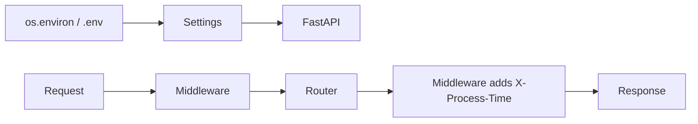

# Month 9 · Week 3 · Day 5
# Settings, Timing Middleware, CORS Preview

**Program:** Full-Stack Mastery · 18 months  
**Phase:** 3 — Python and backend  
**Month index:** [../../README.md](../../README.md)  
**Week 3:** [1](day-01.md) · [2](day-02.md) · [3](day-03.md) · [4](day-04.md) · Day 5 (today) · [6](day-06.md) · [7](day-07.md)  
**Week rhythm today:** Learn + type-along  
**Student state:** The app is split. Today it **reads the environment** and you **see a request pass through middleware**.  
**Study time:** 3–4 focused hours

Labs: `~\fullstack-lab\month-09\week-03\day-05\`.

---

## How to use this textbook

1. Read a section. Close it. Say it.  
2. Type settings. Put a **name** in env, not a secret.  
3. CORS today is a **preview**: what it is, why `*` is a trap. Week 4 enables `http://127.0.0.1:5173` on purpose.  
4. Optional review links are for later rechecking.

---

## How to read this chapter

**Configuration** is data about **this process**: app title, debug flag, allowed origin. It is not a row in `SHELVES`. **Middleware** is a wrapper: every request (or most) passes through before/after the route.



**Wrong belief:** “I’ll hardcode `title='my app'` and CORS `*` so it works with React later.”  
**Correct:** titles are harmless; **origins** are a policy. `*` plus credentials is a browser refusal or a security hole. Config belongs in the environment. No secrets in git.

---

## Today's contract

By the end of this day you will be able to:

1. Load **settings** with `pydantic-settings` **or** `os.environ.get` — you pick, you document.  
2. Use settings for `FastAPI(title=...)` and maybe a `debug` flag.  
3. Write **HTTP middleware** that sets **`X-Process-Time`**.  
4. Explain **CORS** in five sentences and add **CORSMiddleware** in a **commented** or **narrow** form — not `allow_origins=["*"]` as your final lab policy.  
5. Depend on settings via `get_settings` if useful.

**Today's gate.** Closed-book:

> Settings come from the environment. Middleware wraps requests; I can add a timing header. CORS is a browser rule about who may read responses from JS. `*` is not a local React strategy. Secrets never go in the repo.

---

## Time box

| Block | Minutes | Work |
|---|---|---|
| A | 50 | Theory |
| B | 60 | Type-along: settings + timing header |
| C | 70 | Independent: get_settings Depends; CORS write-up |
| D | 20 | Git |
| E | 15 | Recall |

---

# Block A — Theory

## 1. os.environ

```python
import os

title = os.environ.get("APP_TITLE", "Lab API")
```

Windows PowerShell (session):

```powershell
$env:APP_TITLE = "Day 5 API"
uv run uvicorn main:app --reload --host 127.0.0.1 --port 8000
```

The variable must exist in the **process** that starts Uvicorn. Setting it in another terminal does nothing.

`.env` files: convenient; **gitignore** them if they can hold secrets. `.env.example` lists **names**. `pydantic-settings` can read `.env` automatically.

---

## 2. pydantic-settings (v2 ecosystem)

```powershell
uv add pydantic-settings
```

```python
from pydantic_settings import BaseSettings, SettingsConfigDict

class Settings(BaseSettings):
    model_config = SettingsConfigDict(env_file=".env", extra="ignore")

    app_title: str = "Lab API"
    debug: bool = False

def get_settings() -> Settings:
    return Settings()
```

Field `app_title` reads **`APP_TITLE`** by default (case-insensitive). `debug` reads `DEBUG=true`.

**Do not** put database URLs this month. You have no database.

`get_settings` as Depends: you can `@lru_cache` so you do not re-parse every request:

```python
from functools import lru_cache

@lru_cache
def get_settings() -> Settings:
    return Settings()
```

Tests that change env must `get_settings.cache_clear()`.

**Wrong belief:** “Settings is a global; Depends is extra.”  
**Correct:** `lru_cache` + Depends gives one object **and** a test hook (`dependency_overrides`).

If you skip pydantic-settings, `os.environ.get` is **valid** for this day. Write `SETTINGS.md` saying which you used.

---

## 3. Middleware (timing header)

```python
import time
from fastapi import FastAPI, Request

app = FastAPI()

@app.middleware("http")
async def add_timing(request: Request, call_next):
    start = time.perf_counter()
    response = await call_next(request)
    elapsed = time.perf_counter() - start
    response.headers["X-Process-Time"] = f"{elapsed:.6f}"
    return response
```

- `call_next` runs the rest of the stack (other middleware, route).  
- You **must** `await call_next`.  
- Add headers on the **response**.  
- Do not put secrets in headers.

`curl.exe -s -D - http://127.0.0.1:8000/health -o NUL` shows `X-Process-Time`.

Starlette also has `BaseHTTPMiddleware`. The decorator form is enough today.

**Wrong belief:** “Middleware is where I validate Pydantic.”  
**Correct:** middleware is **cross-cutting** (timing, request ids, later auth). Body validation stays in FastAPI’s model layer.

---

## 4. CORS preview (not the full Week 4 lab)

Browsers enforce the **same-origin policy**. A page at `http://127.0.0.1:5173` (Vite) calling `http://127.0.0.1:8000` is **cross-origin** (different **ports**). The browser sends a **preflight** `OPTIONS` for some requests and checks `Access-Control-Allow-Origin`.

`curl.exe` does **not** enforce CORS. **TestClient** does not act like a browser. You can “think CORS works” until React fails. That is why Week 4 uses origin `http://127.0.0.1:5173` explicitly.

```python
from fastapi.middleware.cors import CORSMiddleware

# Preview — Week 4 will set this for Vite. Do not leave * as policy.
app.add_middleware(
    CORSMiddleware,
    allow_origins=["http://127.0.0.1:5173"],
    allow_credentials=False,
    allow_methods=["GET", "POST", "PUT", "PATCH", "DELETE", "OPTIONS"],
    allow_headers=["*"],
)
```

**`allow_origins=["*"]`:** easy, sloppy. With **`allow_credentials=True`**, browsers **forbid** `*`. People then “fix” it by reflecting any Origin — that is **worse**.

Today: you may add CORSMiddleware with the Vite origin **or** write `CORS.md` without enabling `*`. If you enable it, use the **specific** origin above. Exam debug will include “CORS *”.

**Wrong belief:** “CORS is authentication.”  
**Correct:** CORS is a **browser** permission to **read** the response from JS. A custom script or `curl.exe` still hits your API. Auth is later.

---

## 5. Order of middleware

Last `add_middleware` is **outermost** (Starlette). Timing wrapping CORS vs the reverse can change what you measure. Do not obsess; know that **order exists**. Document yours in `MIDDLEWARE.md`.

---

## 6. Security start

- `.env` in `.gitignore` when it can hold secrets.  
- `debug=True` must not be production default.  
- Timing header is fine; do not add `X-Internal-User-Email`.  
- No Redis “for config.”

---

# Block B — Type-along

```powershell
cd ~\fullstack-lab
mkdir month-09\week-03\day-05 -Force
cd ~\fullstack-lab\month-09\week-03\day-05
uv init --name lab-settings
uv add fastapi uvicorn pydantic-settings
uv add --dev pytest httpx
```

Tiny app: `/health` returns `{"status":"ok","title": settings.app_title}`. Timing middleware. Settings from env.

```powershell
$env:APP_TITLE = "Timing Lab"
uv run uvicorn main:app --reload --host 127.0.0.1 --port 8000
```

```powershell
curl.exe -s -D - http://127.0.0.1:8000/health -o NUL
```

Write `HEADER.txt`: copy `X-Process-Time` line.

Test: `TestClient` get health 200; assert `"X-Process-Time"` in response.headers (header names may be lowercase in Starlette — assert case-insensitively).

---

# Block C — Independent

1. `get_settings` Depends on a second route `GET /meta`.  
2. `CORS.md`: origin, preflight, why `curl.exe` lies, why not `*`.  
3. Optional: CORSMiddleware with `http://127.0.0.1:5173` only.  
4. `.env.example` with `APP_TITLE=` and `DEBUG=false`.  
5. Keep a trivial in-memory list route so this stays a FastAPI week, not only health.

```powershell
cd ~\fullstack-lab
git add month-09
git commit -m "Month 9 Week 3 Day 5: settings, timing middleware, CORS notes."
```

---

# Block E — Recall

1. Where `APP_TITLE` must be set.  
2. `lru_cache` + tests.  
3. What `call_next` is.  
4. CORS vs auth.  
5. Why TestClient does not prove CORS.

## Office hours — config and middleware

**`$env:APP_TITLE` in terminal A, Uvicorn in terminal B.** B never saw the variable. Set it in the **same** session that runs uvicorn, or use `.env` loaded by pydantic-settings.

**`lru_cache` and a test that changes env.** `get_settings.cache_clear()` in a fixture. Otherwise the first test’s settings freeze.

**Timing header missing in TestClient.** Middleware not registered on the `app` you imported. Factory: `create_app()` must add middleware before returning.

**CORS.md says `*` “for development.”** The exam will mark that false. Write the 5173 origin even if you do not enable the middleware until Week 4.

**`.env` committed with `DEBUG=true` only.** Still gitignore if you might later add secrets. `.env.example` is the committed names file.

`HEADER.txt` from `curl.exe -D -` is the lab proof. If the header is absent, the middleware did not run.

## Settings object (pydantic-settings)

```python
from pydantic_settings import BaseSettings, SettingsConfigDict

class Settings(BaseSettings):
    model_config = SettingsConfigDict(env_file=".env", extra="ignore")
    app_title: str = "Lab API"
    debug: bool = False
```

`.env.example`:

```text
APP_TITLE=Lab API
DEBUG=false
```

Do not put a database URL. Do not add Redis URL “for later.”

**CORS.md minimum headings:** What origin means; why 5173 ≠ 8000; why curl lies; why `*` fails the exam; what you will enable in Week 4.

If you enable CORSMiddleware today, copy the 5173 list from this chapter. `allow_credentials=False`.

Health may return the title so you can see env without a debugger:

```python
{"status": "ok", "title": "Timing Lab"}
```

TestClient: `assert r.json()["title"] == "Lab API"` for the default, or set env in the fixture **before** `cache_clear` and constructing Settings.

---

## Definition of done

- [ ] Settings from env or pydantic-settings  
- [ ] `X-Process-Time` visible  
- [ ] `CORS.md` written; no `*` policy as the intended design  
- [ ] `.env.example` names only  
- [ ] Commit exists  

---

## Check yourself before git

`X-Process-Time` visible in `HEADER.txt`. Settings come from env or pydantic-settings. `.env.example` has names only. CORS.md does not recommend `*` as the policy. `APP_TITLE` was set in the **same** terminal as Uvicorn when you demoed.

```powershell
uv run uvicorn main:app --reload --host 127.0.0.1 --port 8000
```

If `X-Process-Time` is absent, the middleware is not on the `app` instance TestClient imported. Put it in `create_app()`.

`get_settings.cache_clear()` belongs in the test fixture if tests change env. Otherwise the first test wins forever.

---

## Optional review links

Settings, middleware, and CORS preview are explained in this chapter.

- [pydantic-settings](https://docs.pydantic.dev/latest/concepts/pydantic_settings/)
- [FastAPI: Middleware](https://fastapi.tiangolo.com/tutorial/middleware/)
- [FastAPI: CORS](https://fastapi.tiangolo.com/tutorial/cors/)
- [MDN: CORS](https://developer.mozilla.org/en-US/docs/Web/HTTP/CORS)

---

## If pytest fails (this day)

| Symptom | Likely cause |
|---|---|
| no timing header | middleware not on this `app` |
| title never changes | `lru_cache` not cleared |
| env ignored | set in a different terminal |
| CORS “works” in curl only | expected — assert Allow-Origin |
| `.env` secrets in git | gitignore it; keep `.env.example` |

---

## Tomorrow

**Independent architecture:** two modules that are not a blob — router + repo + settings + timing — a noun that is still not Project 6A.
