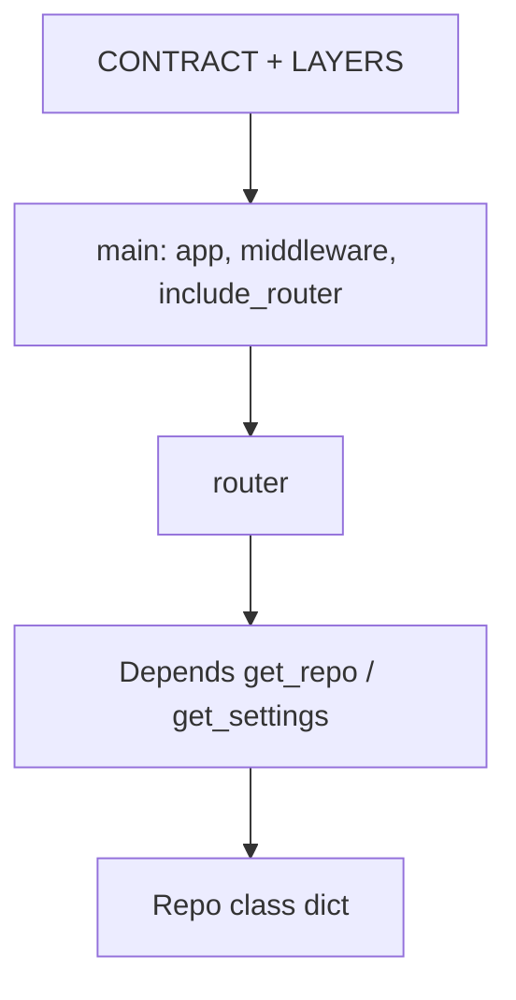
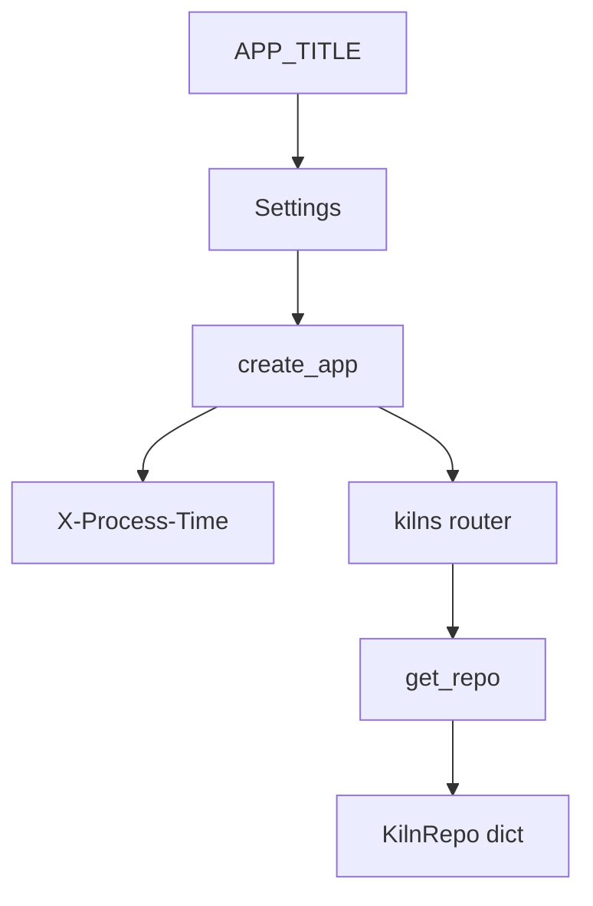

# Month 9 · Week 3 · Day 6
# Independent: Smallest Clear Architecture

**Program:** Full-Stack Mastery · 18 months  
**Phase:** 3 — Python and backend  
**Month index:** [../../README.md](../../README.md)  
**Week 3:** [1](day-01.md) · [2](day-02.md) · [3](day-03.md) · [4](day-04.md) · [5](day-05.md) · Day 6 (today) · [7](day-07.md)  
**Week rhythm today:** Independent implementation  
**Student state:** You have routers, Depends, an in-memory repo class, settings, timing middleware, CORS notes. Today you **assemble** them on a new noun.  
**Study time:** 3–4 focused hours

Labs: `~\fullstack-lab\month-09\week-03\day-06\`.

No complete Project 6A. No complete paste of this API in the textbook.

---

## How to use this textbook

1. `LAYERS.md` and `CONTRACT.md` before a fat `main.py`.  
2. Every file you add gets a one-line why. If you cannot write the line, delete the file.  
3. Optional review links are for later rechecking.

---

## How to read this chapter

Week 3’s bar is **clarity**, not folder count.



**Wrong belief:** “Independent day means I download a FastAPI template.”  
**Correct:** templates hide the split. You type it.

---

## Today's contract

1. New noun (not shelves/bays/rooms of this week, not Project 6A trio).  
2. `APIRouter` prefix + tags.  
3. `Depends` for repo.  
4. In-memory **class** with methods.  
5. Pydantic Create/Out (Patch if time).  
6. Settings for title; timing header.  
7. `LAYERS.md` + tests (201, 404, 422, leak if you have internal field).  
8. CORS: notes or specific origin — **not** `*` as the design.

**Today's gate.** Closed-book:

> I can draw router → (service?) → repo, justify each box, inject the repo, and still emit correct HTTP.

---

## Time box

| Block | Minutes | Work |
|---|---|---|
| A | 25 | CONTRACT + LAYERS (files you will create) |
| B | 40 | Red tests |
| C | 95 | Implement |
| D | 25 | curl.exe headers + /docs tags |
| E | 15 | Recall |

---

# Allowed nouns

**Kilns**, **ferry sailings**, **choir pieces**, **greenhouse zones** — one primary resource. Optional second only if a parent-exists rule earns a service.

**Forbidden:** cookiecutter; SQLAlchemy; Redis; users/projects/tasks.

---

# Complete explanation (keep open)

**Router:** HTTP, Pydantic, `HTTPException`.  
**Repo:** dict methods, no FastAPI.  
**Service:** only if a rule is more than one if.  
**Depends:** `get_repo`, maybe `get_settings`.  
**Settings:** env / pydantic-settings; `.env.example`.  
**Middleware:** `X-Process-Time`.  
**CORS:** browser vs curl; Week 4 Vite origin.  
**Week 2 still true:** models, 422 loc, no leak, `model_dump`.  
**Week 1 still true:** 201/204/404/409, RAM, TestClient reset/`clear()`, `curl.exe`, uvicorn command.

**Wrong belief:** “Middleware replaces Depends.”  
**Correct:** middleware is every request; Depends is per-route needs.

---

# Block A

Write `LAYERS.md` **first** with a table: path → job. Then CONTRACT.md endpoints.

Suggested table (adapt nouns):

| File | Job | Delete if… |
|---|---|---|
| `main.py` | `FastAPI()`, middleware, `include_router`, `/health` | it also contains CRUD |
| `settings.py` | `BaseSettings` or `os.environ` | it hardcodes secrets |
| `repo.py` | class + dict methods | it imports FastAPI |
| `deps.py` | `get_repo`, `get_settings` | it duplicates repo logic |
| `routers/kilns.py` | HTTP + Pydantic + HTTPException | it writes `self._items[id] =` |
| `services/kilns.py` | **only** if a real rule | it is `return repo.add(...)` |

CONTRACT.md: one resource is enough; two only if parent-exists earns a service. Unique field, 409, Create/Out, list GET, GET one 404, POST 201. Timing header. `APP_TITLE` on health or `/meta`.

**Wrong belief:** “I’ll write LAYERS.md after it works, from the files I happened to create.”  
**Correct:** the table is a **design**. Extra files you add in Block C must get a new row the same hour.

---

# Block B

```powershell
cd ~\fullstack-lab
mkdir month-09\week-03\day-06 -Force
cd ~\fullstack-lab\month-09\week-03\day-06
uv init --name lab-arch
uv add fastapi uvicorn pydantic-settings
uv add --dev pytest httpx
```

`RED.txt`.

---

# Block C

Implement until green. `main.py` stays short.

## Shape of `main.py` (illustrative — type your noun)

```python
from fastapi import FastAPI, Request
import time
from routers.kilns import router as kilns_router
from settings import get_settings

def create_app() -> FastAPI:
    settings = get_settings()
    app = FastAPI(title=settings.app_title)

    @app.middleware("http")
    async def add_timing(request: Request, call_next):
        start = time.perf_counter()
        response = await call_next(request)
        response.headers["X-Process-Time"] = f"{time.perf_counter() - start:.6f}"
        return response

    @app.get("/health")
    def health() -> dict:
        return {"status": "ok", "title": settings.app_title}

    app.include_router(kilns_router)
    return app

app = create_app()
```

Do not paste CORS `*`. If you add CORSMiddleware, origin is `http://127.0.0.1:5173`.

Repo methods: `list`, `get`, `add`, `delete`, `code_taken`, `clear`. Router raises 404 when `get` returns `None`.

Tests use `create_app()` or the module `app` plus `repo.clear()`. Prefer a fixture that clears.

If you add a second resource **zones** with `kiln_id`, a `create_zone` service that checks `repo.get_kiln` is justified. If you do not add it, do not create `services/empty.py`.

---

# Block D

```powershell
uv run uvicorn main:app --reload --host 127.0.0.1 --port 8000
curl.exe -s -D - http://127.0.0.1:8000/health -o NUL
```

`HEADER.txt` includes `X-Process-Time`. `/docs` tag list in `TAGS.txt`.

## Assembly checklist (type through it)

1. `settings.py` reads `APP_TITLE` (default `"Kiln lab"`).  
2. `repo.py` class, one instance, `get_repo()`.  
3. Pydantic Create/Out in `routers/kilns.py` or `models.py`.  
4. Router prefix `/kilns`, tags `["kilns"]`. Depends `get_repo`.  
5. `create_app()` adds timing middleware, includes router, health.  
6. Tests: `repo.clear()`; 201; 404; 422; header `X-Process-Time`; health contains title.  
7. `.env.example`: `APP_TITLE=` `DEBUG=false`.  
8. CORS: either middleware with 5173 or `CORS.md` explaining why you wait until Week 4 — **not** `*`.

**Import test:** `uv run python -c "from main import app"` from the project root. If it fails, fix packages (`__init__.py`) before pytest.

**Who owns 409:** router after `repo.code_taken`. Repo returns bool. Repo does not import FastAPI.

**Who owns 404:** router when `repo.get` is `None`.

If `LAYERS.md` says you have a service and the folder is missing, either write the service (real rule) or fix the markdown.

**Wrong belief:** “Independent architecture means I need `core/`, `domain/`, `infra/`.”  
**Correct:** three to six files with jobs. 6A will grow; today must stay explainable in one minute.



## Tests you type

```python
def test_timing_header(client: TestClient) -> None:
    r = client.get("/health")
    assert r.status_code == 200
    assert "x-process-time" in {k.lower() for k in r.headers}

def test_create_and_404(client: TestClient) -> None:
    r = client.post("/kilns", json={"code": "K1", "label": "north"})
    assert r.status_code == 201
    assert "id" in r.json()
    missing = client.get("/kilns/999")
    assert missing.status_code == 404
```

`client` fixture calls `repo.clear()`. If 201 leaks an internal field, add Out + `response_model`.

PowerShell env for the demo:

```powershell
$env:APP_TITLE = "Independent kilns"
uv run uvicorn main:app --reload --host 127.0.0.1 --port 8000
```

Health JSON should show that title if you wired settings.

If `create_app` is not used and tests import a half-initialized `app`, middleware may be missing. Prefer the factory.

Repo `clear()` must run even when a test 422s — otherwise the next test inherits a row.

Closed-book: prefix arithmetic, Depends, why repo ≠ HTTPException, CORS vs curl.

---

# Block E

```powershell
cd ~\fullstack-lab
git add month-09
git commit -m "Month 9 Week 3 Day 6: independent router-repo-settings app."
```

---

## Definition of done

- [ ] LAYERS.md first  
- [ ] Router + repo class + Depends  
- [ ] Timing header  
- [ ] Settings from env  
- [ ] pytest green  
- [ ] No empty service file  
- [ ] Commit exists  

---

## Check yourself before git

LAYERS.md was written first. Router + repo class + Depends. Timing header. Settings title. No empty service. pytest green. CORS is 5173 or a written postpone — not `*`.

Closed-book: who raises 404, who owns uniqueness, why `get_repo` returns one instance.

```powershell
uv run pytest -q
uv run uvicorn main:app --reload --host 127.0.0.1 --port 8000
curl.exe -s -D - http://127.0.0.1:8000/health -o NUL
```

If health has no title, settings never loaded. If `/kilns/kilns` 404s, prefix doubled. If tests leak an internal field, Out is incomplete.

LAYERS.md must still match the files you committed. If you added `deps.py` in a hurry, add the row.

Do not enable CORS `*`. If you add middleware, origin is `http://127.0.0.1:5173`.

Repo methods: `list`, `get`, `add`, `clear` at minimum. `code_taken` if unique.

```powershell
$env:APP_TITLE = "Independent kilns"
uv run uvicorn main:app --reload --host 127.0.0.1 --port 8000
```

---

## Optional review links

Repair from Days 1–5 recap above first.

- [Bigger applications](https://fastapi.tiangolo.com/tutorial/bigger-applications/)
- [Dependencies](https://fastapi.tiangolo.com/tutorial/dependencies/)
- [Middleware](https://fastapi.tiangolo.com/tutorial/middleware/)

---

## If pytest fails (this day)

| Symptom | Likely cause |
|---|---|
| `/kilns/kilns` | doubled prefix |
| no `X-Process-Time` | middleware not in `create_app` |
| empty service file | delete it or give it a real rule |
| 404 from repo | move `HTTPException` to the router |
| title missing | settings not wired to health |

Do not add SQLAlchemy. Do not copy Project 6A.

---

## Security reminder

Do not expose `repo.clear()` as a public route. Settings have no secrets this day. Timing headers are fine; do not add user emails to headers. CORS is not `*`.

`LAYERS.md` is part of the grade. Empty folders are not.

If you cannot explain a file in one sentence, delete the file. That is the architecture lesson.

Health + one resource is enough. A second resource is only for a parent-exists rule.

`create_app()` is the testable factory. Module-level `app = create_app()` is what Uvicorn imports.

Do not add `get_db`. There is no database.

Week 4 pagination sits on this split. Keep the files honest.

Commit. Week 3 review is tomorrow. Still no SQL. Do not start Week 4 with a blob `main.py`. Pagination will not hide a 400-line module. Split first.

---

## Tomorrow

**Week 3 review** — synthesis, mini-build (split files), debug (empty layer, `/items/items`, uncleared overrides).

Labs stay in `~\fullstack-lab\month-09\`. Project 6A is still Week 4 Day 6, own repo.
