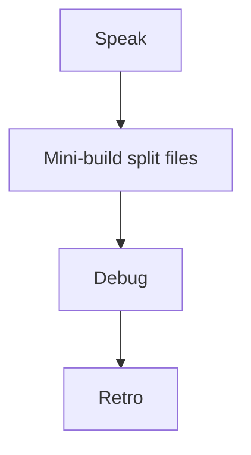
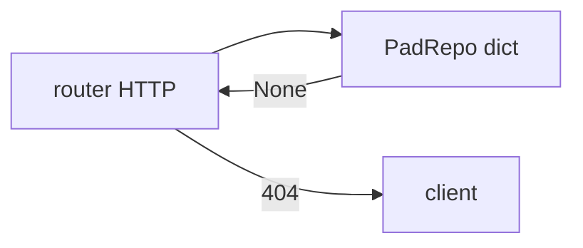

# Month 9 · Week 3 · Day 7
# Week Review — Application Architecture

**Program:** Full-Stack Mastery · 18 months  
**Phase:** 3 — Python and backend  
**Month index:** [../../README.md](../../README.md)  
**Week 3:** [1](day-01.md) · [2](day-02.md) · [3](day-03.md) · [4](day-04.md) · [5](day-05.md) · [6](day-06.md) · Day 7 (today)  
**Week rhythm today:** Review, repair, plan Week 4  
**Student state:** You have routers, Depends, a repo class, settings, timing middleware. Today those ideas must still live in your head — from **this file**.  
**Study time:** 3–4 focused hours

Do not start Week 4 because the calendar moved. Pagination on a single `main.py` blob is legal HTTP and a messy project.

Work in `~\fullstack-lab\month-09\week-03\day-07\`. Do not implement the mini-build inside `~/ops-api/`.

---

## How to read this chapter

This is a **closed-book teaching day**. The synthesis **is** the Week 3 lesson.



Days 1–6 closed during mini-build. Repair from **this** recap.

---

## Week synthesis (the lesson, in this book)

**APIRouter** holds path operations. **`prefix`** + decorator path = public URL (`/pads` + `""` → `/pads`, not `/pads/pads`). **`tags`** group `/docs` only. **`app.include_router`**. `main.py` creates the app and includes routers. Routers **do not import `app`**. Trailing slashes: test them.

**Depends:** FastAPI calls `get_store` / `get_repo` and injects the result. Production provider returns the **same** dict or repo instance. `Depends(get_repo)` is required — calling `get_repo()` inside the route skips overrides. Tests: `repo.clear()` / `reset()` and `app.dependency_overrides[...]` with **`finally: clear()`**. `yield` is for later cleanup (DB sessions). `Annotated` is optional style.

**Repository pattern (this month):** a **class** with `get`, `add`, `list`, `delete`, uniqueness helpers wrapping a **dict**. Not SQLAlchemy. Repo does **not** `raise HTTPException`. Router (or a thin mapper) turns `None` into 404.

**Services:** functions/classes for **rules** that are more than a pass-through. Empty `services/` that only `return repo.add` **fail** Stage A’s “explain why each layer exists.” Skip them when unneeded. Domain errors (`DuplicateNameError`) mapped to 409 in the router is a clean option.

**Settings:** `os.environ.get` or **pydantic-settings** `BaseSettings`. `.env.example` names; no secrets in git. `APP_TITLE` must be in the Uvicorn process. `lru_cache` on `get_settings` needs `cache_clear` in tests.

**Middleware:** `@app.middleware("http")` + `await call_next`; set **`X-Process-Time`**. Not for Pydantic. Order exists.

**CORS preview:** browsers, not curl. Different port = different origin. Week 4: `http://127.0.0.1:5173`. `*` is a trap; not auth.

**Still true:** Pydantic create/out, `model_dump` not `.dict()`, 422/404/409, in-memory RAM, TestClient, `curl.exe`, `uv run uvicorn main:app --reload --host 127.0.0.1 --port 8000`. No Redis, no Postgres.

**Wrong belief:** “More folders is more professional.”  
**Correct:** **justified** folders are professional.

**Wrong belief:** “The repo should raise HTTPException so the router stays thin.”  
**Correct:** then the repo is coupled to FastAPI. Return `None`; the router raises 404.

**Wrong belief:** “CORS `*` is fine for a lab.”  
**Correct:** Week 4’s policy is `http://127.0.0.1:5173`. `*` is not auth and breaks credentials. Do not ship it in the mini-build.

The unpacking below is enough to mini-build.

---

## Today's contract

**Today's gate.** Closed-book:

> I can split an app into main + router + repo, inject with Depends, add a timing header, and explain when a service would be extra.

---

## Time box

| Block | Minutes | Work |
|---|---|---|
| 1 | 40 | Speak + exam-01.md |
| 2 | 55 | Mini-build pads |
| 3 | 30 | Debug A–F |
| 4 | 20 | Review Day 6 LAYERS — one fix |
| 5 | 20 | pytest |
| 6 | 20 | Design: skip vs keep service |
| 7 | 20 | Retro |

---

# Complete explanation — split you must still own

## 1. URLs

Write prefix and decorator on paper before coding. TestClient uses the **public** path.

`include_router(pads_router)` with `prefix="/pads"` on the router and `@router.get("")` is `GET /pads`. Adding another `prefix="/v1"` is Week 4. Do not invent it today unless you already understand it.

## 2. HTTP stays in the router

`status_code=201`, `HTTPException`, `response_model`.

The repo returns data or `None`. The router chooses 201 vs 404 vs 409. If uniqueness is a domain error class, the router maps it. That mapping is HTTP. Storage does not speak HTTP.

## 3. One repo instance

`repo = PadRepo()` at module level; `get_repo()` returns it. Tests clear that instance.

Two `PadRepo()` objects are two stores. Overrides that inject a third must still be cleared. Isolation is a fixture job, not `id >= 1` in every test.

## 4. Settings + middleware on app

Include routers **after** creating `app`. Middleware on `app`, not on the router (unless you know router middleware — skip).

If you never `await call_next`, the route does not run. Always call_next and return its response after adding a header.

---

# Block 1 — Speak

Routers, Depends, overrides, repo vs dict, empty services, settings env, timing, CORS vs curl. `exam-01.md`.

---

# Block 2 — Mini-build

```powershell
cd ~\fullstack-lab
mkdir month-09\week-03\day-07\mini -Force
cd ~\fullstack-lab\month-09\week-03\day-07\mini
uv init --name lab-pads
uv add fastapi uvicorn pydantic-settings
uv add --dev pytest httpx
```

**Helipads** (not Project 6A): `code` unique, `label`. Files: `main.py`, `repos.py` or `repo.py`, `routers/pads.py`. GET/POST/GET-id. Timing header. Settings title on `/health`. Tests: 201, 404, 422, 409, header present, isolation.

`LAYERS.md` four lines. Every file on disk must match a line. If you added `services/pads.py` that only `return repo.add`, delete it or justify a real rule.

No SQL. In-memory dict inside the repo class. `model_dump` if you dump a model. TestClient. `curl.exe` optional spot-check.

---

# Block 3 — Debug

**A.** `@router.get("/pads")` with `prefix="/pads"` → mystery 404.  
**B.** `services/pads.py` is `return repo.add(data)` only; author says “clean architecture.”  
**C.** Tests pass alone, fail as a file: overrides not cleared.  
**D.** Repo raises `HTTPException`.  
**E.** CORS `allow_origins=["*"]` with credentials true — what breaks?  
**F.** Timing middleware never `await call_next` — what does the client see?

---

# Block 4

Day 6 LAYERS vs files — fix or MATCH.txt.

---

# Block 5

Break 404 test; restore.

---

# Block 6

`design.md`: a **parent-child create** rule — would you add a service? Why? (No code required.)

A rule like “cannot create a pad whose `code` prefix does not match an existing campus code” is more than `repo.add`. That might earn a service. “Insert dict” does not.

---

# Block 7

`retro.md`. Week 4: pagination, filter, sort, search, CORS for Vite, versioning, UploadFile, BackgroundTasks, pytest fixtures, mock outbound HTTP, **Project 6A start**, Month 9 exam.

## Debug keys (after you write A–F)

**A.** Public path became `/pads/pads`. Decorator path should be `""` or `"/{pad_id}"` under `prefix="/pads"`.

**B.** Empty service is costume. Uniqueness can live in the router or a one-liner; a pass-through file has no job.

**C.** `dependency_overrides.clear()` in `finally` or fixture teardown.

**D.** Repo returns `None`; router raises 404. HTTPException in the repo couples storage to FastAPI.

**E.** `*` + credentials is invalid in browsers. Even without credentials, `*` is not the 5173 policy.

**F.** If you never `await call_next`, the route does not run; the client hangs or errors. Always call_next and return its response (after adding a header).

Mini `LAYERS.md` four lines must match files on disk. `get_repo` returns the **same** `PadRepo` instance. Tests call `repo.clear()`.

## Mini predicted table

| Call | Status / header |
|---|---|
| GET `/health` | 200, JSON includes settings title |
| GET `/pads` | 200 array (or your envelope) |
| POST valid | 201 |
| GET missing | 404 from router, not repo |
| GET `/health` | response has `X-Process-Time` |

If `/pads/pads` 404, prefix doubled. If title missing, env/settings not wired.

Week 4 adds list query params and CORS 5173. Do not add SQL tonight.

---

```powershell
cd ~\fullstack-lab
git add month-09
git commit -m "Month 9 Week 3 review: pads mini-build and debug notes."
```

---

# Lecture: layers that earn a file

**Router.** HTTP: paths, statuses, `HTTPException`, `response_model`. Prefix math. Tags for `/docs` only.

**Repo.** A class wrapping a **dict**: `add`, `get`, `list`, `delete`. Returns data or `None`. Does not import FastAPI. Does not raise `HTTPException`. Tests can construct `PadRepo()` without an app. That is the point of the pattern this month — not SQLAlchemy, not Alembic, not PostgreSQL.

**Service.** Only if a rule is more than pass-through. Parent-child create, multi-step uniqueness, “cannot close if children open.” `return repo.add(data)` is a costume. Delete the file or justify the rule in `LAYERS.md`.

**Settings.** Env names in `.env.example`. No secrets in git. `APP_TITLE` in the Uvicorn process. `lru_cache` on `get_settings` needs `cache_clear` in tests or titles stick across cases.

**Middleware.** `await call_next`. Then set `X-Process-Time`. If you skip call_next, the route never runs. Timing is not validation. Pydantic still belongs on models.

**CORS vs curl.** curl does not send Origin unless you add the header. Browsers do. Week 4 allows `http://127.0.0.1:5173`, not `*`. Today’s mini need not enable CORS; debug E still asks what `*` + credentials breaks.

**Depends.** `get_repo` returns the **same** instance. Tests `clear()` that instance. Overrides in `finally`. Calling `get_repo()` inside the route skips overrides.

Pads, not ops-api. Split files. Timing header. Settings title on `/health`. No SQL tonight.

---

## Definition of done

- [ ] exam-01.md  
- [ ] mini split + pytest green + timing header  
- [ ] debug A–F  
- [ ] retro  
- [ ] I will not add SQL this month  

---

# Worked session — pads: main, router, repo

`PadRepo` wraps a dict. `get_repo()` returns the same instance. Router raises 404 when repo returns `None`. POST 201, GET list, GET one. Timing middleware `await call_next` then `X-Process-Time`. Settings title on `/health`. Tests: 201, 404, 422, 409, header present, isolation `repo.clear()`.

`LAYERS.md` four lines matching files. Empty `services/` deleted or justified. Debug A–F written then checked. No `HTTPException` in the repo. No CORS `*`. No SQL. No ops-api.

If `/pads/pads` 404, decorator repeated the prefix. If title missing, env not in the Uvicorn process or cache not cleared. If tests pollute each other, overrides not cleared.

`uv run pytest -q`. Week 4 is list queries and CORS 5173. Do not start Project 6A tonight unless Week 4 Day 6 says so — today is the review mini.

---

## Optional review links

Repair from this synthesis first. These pages are for later checking, not for first learning.

- [Bigger applications](https://fastapi.tiangolo.com/tutorial/bigger-applications/)
- [Dependencies](https://fastapi.tiangolo.com/tutorial/dependencies/)
- [CORS](https://fastapi.tiangolo.com/tutorial/cors/)

---

## Next week

[Week 4 Day 1 — Pagination, filter, sort, search](../week-04/day-01.md).

---

# Closing lecture — a repo does not speak HTTP

`PadRepo` wraps a dict. It returns data or `None`.
The router raises `HTTPException` 404. That split is the pattern.
Next month the repo can talk to SQL without rewriting statuses.
SQLAlchemy this month would hide sloppy HTTP. Do not open it.

Empty `services/` that only `return repo.add` is costume. Delete it.
Settings from env. `cache_clear` in tests if you used `lru_cache`.
Middleware: `await call_next`, then `X-Process-Time`. Always call_next.
CORS `*` is not `http://127.0.0.1:5173`. Week 4 will require the latter.

LAYERS.md four lines matching files on disk.
Pads mini in `fullstack-lab`, not `~/ops-api/`.
`uv run pytest -q`. Header present. Isolation via `repo.clear()`.
Debug A–F. Retro. Then pagination and CORS — not SQL.
A parent-child create rule might earn a service. `repo.add` does not.
design.md can be ten lines with no code. Justify skip vs keep.
`pydantic-settings` `APP_TITLE` must exist in the Uvicorn process.
Tests that pass alone and fail as a file forgot `dependency_overrides.clear()`.
Repo raising HTTPException couples storage to FastAPI. Return `None` instead.


## Recite-back checklist (close the editor, then tick)

Write `RECITE.txt` with one honest sentence per line.
If a line is mush, re-read the matching section in **this** file only.

- [ ] repo returns `None`; router raises 404
- [ ] no empty service pass-through
- [ ] same repo instance; tests `clear()`
- [ ] timing header after `await call_next`
- [ ] settings title on `/health`
- [ ] CORS `*` is not 5173
- [ ] LAYERS.md matches disk
- [ ] no SQL this month

Pads mini in `fullstack-lab`. Week 4 is list queries and CORS 5173.

If LAYERS.md lists a file that is only `return repo.add`, delete the file or give it a rule.
HTTP stays in the router. The dict stays in the repo. SQL stays in Month 10.
Timing middleware always awaits `call_next`. CORS `*` is not the 5173 policy.



