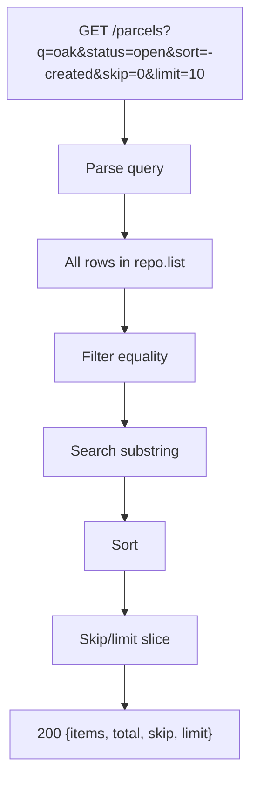
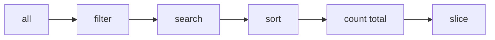

# Month 9 · Week 4 · Day 1
# Pagination, Filter, Sort, and Search

**Program:** Full-Stack Mastery · 18 months  
**Phase:** 3 — Python and backend  
**Month index:** [../../README.md](../../README.md)  
**Week 4:** Day 1 (today) · [2](day-02.md) · [3](day-03.md) · [4](day-04.md) · [5](day-05.md) · [6](day-06.md) · [7](day-07.md)  
**Week 3 review:** [../week-03/day-07.md](../week-03/day-07.md)  
**Week rhythm today:** Learn + type-along  
**Student state:** Week 3 gate passed. `GET /items` returning the whole dict is no longer enough. Project 6A **requires** pagination, filtering, sorting, and search.  
**Study time:** 3–4 focused hours

Labs: `~\fullstack-lab\month-09\week-04\day-01\`. Still in memory. Still not Project 6A’s domain (that is Day 6).

---

## How to use this textbook

1. Read a section. Close it. Say the **query parameter names** you will use.  
2. Type list logic in one place (service or router). Do not copy-paste four slightly different filters.  
3. Optional review links are for later rechecking.

---

## How to read this chapter

A **list endpoint** is a **query language** with a tiny vocabulary: which page, which fields match, which substring, which order. HTTP GET must stay **safe** (no writes) and **cacheable in theory** (query string is the cache key).



**Wrong belief:** “I’ll return everything and let React paginate.”  
**Correct:** that trains you to ship unbounded payloads. Even in-memory, **practice the contract**. Month 10 the same query params will become SQL `LIMIT`/`OFFSET` or keyset — names should already exist.

---

## Today's contract

By the end of this day you will be able to:

1. Choose **`skip`/`limit`** **or** **`page`/`size`**, document it, reject invalid values with **422**.  
2. **Filter** on at least one field (exact match).  
3. **Search** `q` as case-insensitive substring on a text field.  
4. **Sort** by a whitelist of fields, with `-field` or `sort=field&order=desc`.  
5. Return **total** (before slice) so a UI can render pages.  
6. Clamp `limit` (e.g. max 100). Never `limit=-1` meaning “all.”

**Today's gate.** Closed-book:

> List endpoints take query params for page, filter, search, and sort. I slice **after** filter/search. I return total. I whitelist sort fields. I cap limit. This is still GET.

---

## Time box

| Block | Minutes | Work |
|---|---|---|
| A | 50 | Theory |
| B | 60 | Type-along: parcels |
| C | 70 | Independent: tests for each axis |
| D | 20 | Git |
| E | 15 | Recall |

---

# Block A — Theory

## 1. skip/limit vs page/size

**skip/limit** (offset + count):

- `skip=0&limit=10` → first 10  
- `skip=10&limit=10` → next 10  

**page/size**:

- `page=1&size=10` → first 10 (decide whether page is 1-based — **this course: 1-based page**)  
- `skip = (page - 1) * size`

Pick **one** pair as the public contract. You may compute the other internally. Project 6A CONTRACT.md must name them.

Invalid: `limit=0`, `limit=999999`, `page=0`, `skip=-1` → **422** (query validation). FastAPI:

```python
from fastapi import Query

@router.get("")
def list_parcels(
    skip: int = Query(0, ge=0),
    limit: int = Query(10, ge=1, le=100),
) -> dict:
    ...
```

`Query(ge=0)` is Pydantic constraints on **query** params. 422 loc will include `"query"`.

**Wrong belief:** “If skip is past the end, 404.”  
**Correct:** empty `items` and the real `total` is **200**. 404 is for a missing **id**.

---

## 2. Response envelope

Returning a bare array cannot carry `total` without a header. Prefer:

```python
class ParcelListOut(BaseModel):
    items: list[ParcelOut]
    total: int
    skip: int
    limit: int
```

Headers `X-Total-Count` are an alternative. This course prefers **JSON total** so TestClient is obvious. If you use both, they must agree.

---

## 3. Filter

Equality on a known field: `?status=open`. Missing param → do not filter. Unknown `status` value: either **422** (enum) or **200 empty** — **enum on a Literal/Enum model is cleaner**.

```python
from typing import Literal

Status = Literal["open", "closed"]

def list_parcels(status: Status | None = None, ...):
    rows = repo.list()
    if status is not None:
        rows = [r for r in rows if r["status"] == status]
```

Multiple filters: AND them. OR-search is `q`’s job unless you document otherwise.

---

## 4. Search

`q` is a **substring**, usually case-insensitive, on **whitelist** fields (`title`, `code`) — not on internal hashes.

```python
if q:
    needle = q.casefold().strip()
    rows = [r for r in rows if needle in str(r["title"]).casefold()]
```

Empty `q` after strip: treat as omitted.

Do not interpret `q` as SQL. There is no SQL. `%` is a character.

**Wrong belief:** “Search is Google.”  
**Correct:** it is `in` on a string this month. Full-text search is a later database topic.

---

## 5. Sort

**Whitelist:** `id`, `title`, `status` — not `password_hash`, not arbitrary `?sort=__class__`.

Two common styles:

| Style | Example |
|---|---|
| Prefix minus | `sort=title` asc, `sort=-title` desc |
| Two params | `sort=title&order=desc` |

Implement **one**. Unknown sort field → **422**.

```python
allowed = {"id": "id", "title": "title", "status": "status"}

def apply_sort(rows: list[dict], sort: str) -> list[dict]:
    descending = sort.startswith("-")
    key = sort[1:] if descending else sort
    if key not in allowed:
        raise HTTPException(status_code=422, detail="Invalid sort field")
    # or let Query/pattern handle it
    return sorted(rows, key=lambda r: r[key], reverse=descending)
```

Stable sort: Python’s sort is stable. Tie-break with `id` so pagination does not shuffle.

**Default sort:** document it (`id` ascending is fine).

---

## 6. Order of operations (must not scramble)

1. Start from all items (copy the list).  
2. Filter equality.  
3. Search `q`.  
4. Sort.  
5. `total = len(rows)`.  
6. Slice `[skip : skip + limit]`.  
7. Map to Out models.

If you slice first, `total` is wrong and page 2 is nonsense.



---

## 7. In-memory cost

`repo.list()` copying a large dict every request is O(n). This month **n is small**. Do not invent indexes. Do not open Redis. Month 10: indexes and `EXPLAIN`.

---

## 8. Security start

- Whitelist sort fields.  
- Cap `limit`.  
- Do not search secret fields.  
- Filter values that are enums cannot inject code; they can still **enumerate** statuses — that is OK.

---

# Block B — Type-along

```powershell
cd ~\fullstack-lab
mkdir month-09\week-04\day-01 -Force
cd ~\fullstack-lab\month-09\week-04\day-01
uv init --name lab-parcels
uv add fastapi uvicorn
uv add --dev pytest httpx
```

**Parcels:** `{id, title, status}` status `open|closed`. Seed **25** items in `reset()` or a `seed()` called from a fixture (loop). List envelope with skip/limit, `q` on title, `status` filter, `sort`.

```powershell
uv run uvicorn main:app --reload --host 127.0.0.1 --port 8000
```

```powershell
curl.exe -s "http://127.0.0.1:8000/parcels?skip=0&limit=5&status=open&sort=-id"
```

Write `QUERY.txt`: one example URL for each axis.

---

# Block C — Independent

Tests (TestClient):

1. `total` unchanged when `limit=5`  
2. page2/skip does not overlap page1 ids  
3. `q` matches a known title substring  
4. `status=open` excludes closed  
5. invalid `sort=nope` 422  
6. `limit=1000` 422  
7. skip past end → 200 empty items, total still full  

CONTRACT.md list section.

Not Project 6A resources.

```powershell
cd ~\fullstack-lab
git add month-09
git commit -m "Month 9 Week 4 Day 1: list pagination filter sort search."
```

---

# Block E — Recall

1. Why total is counted **before** slice.  
2. skip/limit vs page/size.  
3. Why sort is allowlisted.  
4. Empty page vs 404.  
5. Why React-only pagination is the wrong lesson.

## Office hours — lists

**`sort=title` 500.** A row missing `title` because Week 1 dicts were sloppy. Out models should guarantee the key; seed data must include it.

**`q=` with spaces.** Strip. Empty after strip = no search.

**Page 0.** If you chose page/size, `Query(1, ge=1)`. Page 0 is 422, not “the last page.”

**Filter `status=OPEN` vs `open`.** Literal is case-sensitive unless you casefold. Document.

**Returning a raw list because envelope felt extra.** Then `total` lives nowhere. Use the envelope in 6A.

Seed 25 in tests with a loop: `for i in range(25): client.post(..., json={...})`. Then `skip=20&limit=10` has a known remainder. Do not hand-write 25 JSON files.

PowerShell: quote the URL: `curl.exe -s "http://127.0.0.1:8000/parcels?skip=0&limit=5"`. Unquoted `?` is a glob.

## Envelope model (type this)

```python
class ParcelListOut(BaseModel):
    items: list[ParcelOut]
    total: int
    skip: int
    limit: int
```

`response_model=ParcelListOut` on GET list. Seed in a fixture:

```python
@pytest.fixture
def seeded(client: TestClient) -> TestClient:
    for i in range(25):
        client.post("/parcels", json={"title": f"p{i:02d}", "status": "open" if i % 2 == 0 else "closed"})
    return client
```

Then `r = seeded.get("/parcels", params={"skip": 0, "limit": 5, "status": "open"})`. Assert `r.json()["total"]` is 13 (0,2,...,24) not 5.

Sort test: `params={"sort": "-id", "limit": 1}` → highest id. `sort=nope` → 422.

---

## Definition of done

- [ ] Envelope with items + total  
- [ ] Filter, search, sort, skip/limit (or page/size)  
- [ ] 422 on bad query  
- [ ] Tests for each axis  
- [ ] CONTRACT.md list section  
- [ ] Commit exists  

---

## Optional review links

List query design is explained in this chapter.

- [FastAPI: Query parameters](https://fastapi.tiangolo.com/tutorial/query-params/)
- [FastAPI: Query validations](https://fastapi.tiangolo.com/tutorial/query-params-str-validations/)

---

## Tomorrow

**CORS** for `http://127.0.0.1:5173` and **versioning** (`/v1` vs headers) — trade-offs, not both as a mess.
